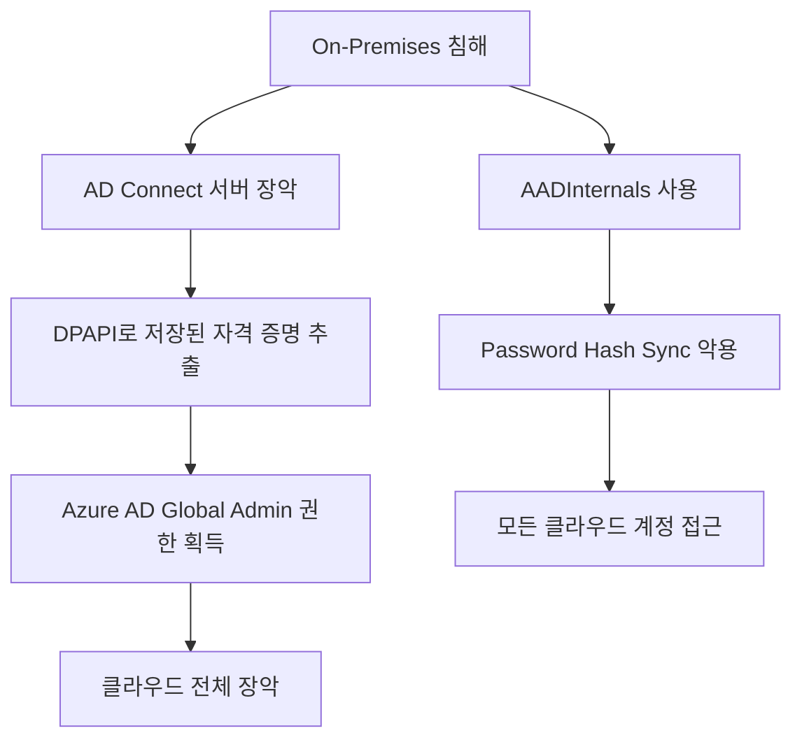

# 블로그 보안 콘텐츠 보강 계획 (Phase 3) - 강화판

## 1. 개요
이 계획은 기존에 작성된 포스트들에 **보안 공격/방어** 및 **실무 활용법**을 추가하여 콘텐츠를 강화하기 위한 로드맵입니다.

> [!IMPORTANT]
> ✅ = 파일 존재 확인됨 | 🆕 = 신규 작성 필요 | ⚠️ = 부분 존재

---

## 2. 보강 대상 및 수정 방향

### A. Windows AD & LDAP (핵심 강화 대상) ⭐⭐⭐

#### 📂 기존 파일 현황
| 파일 | 상태 | 현재 내용 |
|------|------|----------|
| ✅ `2025-10-29-AD_study.md` | 존재 (150줄) | 개요, GUI/PS 설치, 기본 사용법, 트러블슈팅 |
| ✅ `2025-08-06-LDAP_AD_study.md` | 존재 (194줄) | LDAP 개요, AD 쿼리, OpenLDAP, 기본 보안 |

---

#### 파일 1: `2025-10-29-AD_study.md` 보강

##### 🛠️ Part A: 사용법/운영 강화 (신규 추가)

**신설 섹션**: `## 6. 고급 AD 관리 기법`

| 주제 | 내용 | PowerShell 예제 |
|------|------|-----------------|
| **대량 사용자 관리** | CSV Import로 수백 명 계정 일괄 생성 | `Import-Csv`, `New-ADUser` |
| **위임 관리** | OU 단위 권한 위임 (Help Desk에 비밀번호 리셋 권한) | `Delegate Control` 마법사 |
| **Fine-Grained Password Policy** | 그룹별 차별화된 암호 정책 적용 | `New-ADFineGrainedPasswordPolicy` |
| **AD 복원** | 삭제된 객체 복구 (휴지통 기능) | `Restore-ADObject` |
| **사이트 및 복제** | 다중 사이트 환경에서 복제 토폴로지 구성 | `New-ADReplicationSite` |
| **Schema 확장** | 커스텀 속성 추가 (예: 사번 필드) | `Get-ADObject -SearchBase` |

**신설 섹션**: `## 7. GPO 실전 활용`

| GPO 시나리오 | 설정 경로 | 효과 |
|--------------|-----------|------|
| USB 차단 | 컴퓨터 구성 → 정책 → 관리 템플릿 → 시스템 → 이동식 저장소 | 이동식 디스크 읽기/쓰기 차단 |
| 화면보호기 강제 | 사용자 구성 → 정책 → 관리 템플릿 → 제어판 → 개인 설정 | 10분 후 잠금 + 암호 필수 |
| 소프트웨어 배포 | 컴퓨터 구성 → 정책 → 소프트웨어 설정 → 소프트웨어 설치 | MSI 자동 설치 |
| 방화벽 규칙 배포 | 컴퓨터 구성 → Windows 설정 → 보안 설정 → 고급 보안 | 인바운드/아웃바운드 규칙 중앙 관리 |
| AppLocker | 컴퓨터 구성 → 정책 → Windows 설정 → 보안 설정 → AppLocker | 실행 가능한 앱 화이트리스트 |

**신설 섹션**: `## 8. AD 모니터링 및 감사`

```powershell
# 최근 생성된 사용자 조회
Get-ADUser -Filter * -Properties whenCreated | 
    Where-Object { $_.whenCreated -gt (Get-Date).AddDays(-7) } |
    Select Name, whenCreated

# 비활성 계정 찾기 (90일 이상 미접속)
Search-ADAccount -AccountInactive -TimeSpan 90.00:00:00 |
    Select Name, LastLogonDate

# 그룹 멤버십 변경 추적 (Event ID 4728, 4729)
Get-EventLog -LogName Security -InstanceId 4728, 4729 -Newest 50
```

---

##### 🛡️ Part B: 보안 공격/방어 (신규 추가)

**신설 섹션**: `## 9. 보안 고려사항 (공격 시연 및 방어)`

| 공격 기법 | 설명 | MITRE ID | 관련 도구 |
|-----------|------|----------|-----------|
| **Kerberoasting** | 서비스 계정(SPN) 티켓 추출 및 오프라인 크랙 | T1558.003 | `Rubeus`, `Impacket` |
| **AS-REP Roasting** | 사전 인증 비활성화 계정 공격 | T1558.004 | `Rubeus`, `hashcat` |
| **Pass-the-Hash** | 해시를 이용한 인증 우회 | T1550.002 | `Mimikatz` |
| **Pass-the-Ticket** | Kerberos 티켓 재사용 공격 | T1550.003 | `Mimikatz` |
| **Golden Ticket** | KRBTGT 해시로 영구 접근권 생성 | T1558.001 | `Mimikatz` |
| **Silver Ticket** | 서비스 계정 해시로 특정 서비스 접근 | T1558.002 | `Mimikatz` |
| **DCSync** | 도메인 컨트롤러 복제 권한 악용 | T1003.006 | `Mimikatz`, `Impacket` |
| **SMB Relay** | NTLM 인증 중계 공격 | T1557.001 | `ntlmrelayx` |
| **Zerologon (CVE-2020-1472)** | DC 컴퓨터 계정 비밀번호 리셋 | - | `zerologon_tester` |
| **PrintNightmare** | Print Spooler 원격 코드 실행 | T1547.012 | `CVE-2021-34527 PoC` |

**방어 대책 매트릭스**:

| 방어 통제 | 대응 공격 | 구현 방법 |
|-----------|-----------|-----------|
| MSA/gMSA 사용 | Kerberoasting | 서비스 계정에 관리형 서비스 계정 적용 |
| 사전 인증 강제화 | AS-REP Roasting | AD 사용자 속성에서 "사전 인증 필요 안 함" 비활성화 |
| Credential Guard | PtH, PtT | Windows LSASS 격리 활성화 |
| SMB Signing 강제화 | SMB Relay | GPO에서 디지털 서명 필수 설정 |
| Tier 모델 | 전체 | 관리 계정 분리 (0/1/2 Tier) |
| LAPS 구현 | 로컬 관리자 공유 | 로컬 관리자 비밀번호 자동 관리 |
| KRBTGT 비밀번호 주기적 변경 | Golden Ticket | 최소 180일마다 2회 변경 |

---

#### 파일 2: `2025-08-06-LDAP_AD_study.md` 보강

##### 🛠️ Part A: 사용법 강화

**보강할 섹션**: `AD 쿼리` 확장

```powershell
# 고급 AD PowerShell 활용

# 1. 특정 부서 모든 사용자 이메일 추출
Get-ADUser -Filter {Department -eq "영업부"} -Properties mail | 
    Select Name, mail | Export-Csv -Path "sales_emails.csv" -NoTypeInformation

# 2. 비활성화된 계정 찾기
Search-ADAccount -AccountDisabled | Select Name, DistinguishedName

# 3. 만료 예정 계정 찾기 (30일 이내)
Search-ADAccount -AccountExpiring -TimeSpan 30.00:00:00

# 4. 특정 그룹의 중첩 멤버까지 모두 조회
Get-ADGroupMember -Identity "Domain Admins" -Recursive | Select Name

# 5. OU 간 사용자 이동
Get-ADUser -Identity "john.doe" | Move-ADObject -TargetPath "OU=Managers,DC=company,DC=com"
```

##### 🛡️ Part B: 보안 위협 확장

**보강 섹션**: `5. 보안 고려사항` 대폭 확장

| 위협 | 설명 | 탐지 방법 |
|------|------|-----------|
| **LDAP Injection** | 쿼리 조작을 통한 인증 우회 | WAF/IDS 시그니처 적용 |
| **Anonymous Binding** | 익명 접근을 통한 정보 유출 | DS Access 이벤트 모니터링 |
| **LDAP Pass-back Attack** | LDAP 설정 변경으로 자격 증명 캡처 | 프린터/MFP 설정 감사 |
| **LDAP Reconnaissance** | AD 정보 열거 (BloodHound) | 비정상 LDAP 쿼리 탐지 |
| **LDAP Credential Stuffing** | 대량 인증 시도 공격 | 계정 잠금 정책 설정 |

**방어 대책**:
- LDAPS (636/TCP) 강제화 및 LDAP (389/TCP) 비활성화
- 바인딩 계정 권한 최소화 (읽기 전용)
- Channel Binding Token 활성화
- LDAP 쿼리 로깅 (Event ID 2889 모니터링)

---

### B. Security Architecture (Azure Hybrid) ⭐⭐⭐

#### 📂 기존 파일 현황
| 파일 | 상태 | 현재 내용 |
|------|------|----------|
| ✅ `2025-09-26-AzureCLIHybridCloud.md` | security-architecture 폴더 확인 필요 | - |
| ✅ `2025-09-18-AzureCLI_Attack_study.md` | cloud-azure 폴더 존재 | Azure CLI 공격 |
| ✅ `2025-09-22-Azure_Firewall_study.md` | cloud-azure 폴더 존재 | Azure Firewall |

#### 보강 내용

**공격 시나리오 확장**:



| 공격 경로 | 설명 | 대응책 |
|-----------|------|--------|
| **Lateral Movement via AD Connect** | 온프레미스 → 클라우드 이동 | Tier 0로 AD Connect 격리 |
| **Password Hash Sync 악용** | 로컬 해시 동기화 데이터 탈취 | PIM 즉시 활성화 |
| **IMDS 토큰 탈취** | Managed Identity 토큰 메타데이터 서비스 악용 | IMDS 접근 제한 |
| **Service Principal 남용** | 과도한 권한의 앱 등록 악용 | 최소 권한 원칙 적용 |
| **Consent Phishing** | OAuth 동의 공격 | 관리자 동의 워크플로우 강제 |

---

### C. Container Security (Docker & Kubernetes) ⭐⭐

#### 📂 기존 파일 현황
| 파일 | 상태 | 현재 내용 |
|------|------|----------|
| ✅ `2025-11-24-Docker_study.md` | 존재 | Docker 기초 |
| ✅ `2025-12-05-Kubernetes_study.md` | 존재 | K8s 기초 |

#### Docker 보강 내용

| 공격 기법 | 설명 | MITRE ID |
|-----------|------|----------|
| **Container Escape** | 호스트로 탈출 | T1611 |
| **Privileged Container 악용** | `--privileged` 플래그 남용 | T1610 |
| **Docker Socket 노출** | `/var/run/docker.sock` 마운트 악용 | T1612 |
| **이미지 변조** | 악성 레이어 삽입 | T1525 |

**방어 대책**:
- Rootless 모드 활성화
- Seccomp/AppArmor 프로파일 적용
- 이미지 스캔 (Trivy, Clair)

#### Kubernetes 보강 내용
- RBAC 미설정 클러스터 공격
- etcd 직접 접근 위험성
- Service Account 토큰 탈취
- Pod Security Standards 적용

---

### D. Network Security (BlueMax NGF) ⭐⭐

#### 📂 기존 파일 현황
- `bluemax-ngf/` 폴더 내 다수 파일 존재 ✅

#### 보강 내용

| 항목 | 설명 | 확인 방법 |
|------|------|-----------|
| **Any-Any Deny 원칙** | 정책 최하단 차단 규칙 필수화 | 정책 리스트 최하단 확인 |
| **IPS/Anti-Virus** | 패턴 업데이트 및 적용 확인 | 업데이트 상태 대시보드 |
| **SSL Inspection** | 암호화된 트래픽 가시성 확보 | 복호화 정책 설정 확인 |
| **로그 분석** | Port Scan, C2 통신 등 이상 징후 탐지 | SIEM 연동 |

---

### E. Hacking Tools ATT&CK 매핑 ⭐⭐

#### 📂 기존 파일 현황 (19개 파일 존재 ✅)
| 도구 | 파일 | ATT&CK 기법 | 단계 |
|------|------|-------------|------|
| ✅ `Nmap` | `2025-08-23-Nmap_study.md` | T1046 Network Service Discovery | Reconnaissance |
| ✅ `Nikto` | `2025-08-24-Nikto_study.md` | T1595.002 Active Scanning | Reconnaissance |
| ✅ `Burp Suite` | `2025-08-27-BurpSuite_study.md` | T1190 Exploit Public-Facing App | Initial Access |
| ✅ `sqlmap` | `2025-08-27-Sqlmap_study.md` | T1190 / T1505.001 | Initial Access |
| ✅ `Hydra` | `2025-08-28-Hydra_study.md` | T1110 Brute Force | Credential Access |
| ✅ `Mimikatz` | `2025-09-24-Mimikatz_study.md` | T1003 OS Credential Dumping | Credential Access |
| ✅ `Metasploit` | `2025-09-07-Metasploit_study.md` | 다수 | 전체 Kill Chain |
| ✅ `BeEF` | `2025-11-12-BeEF_study.md` | T1189 Drive-by Compromise | Initial Access |
| ✅ `John the Ripper` | `2025-08-26-JohnTheRipper_study.md` | T1110.002 Password Cracking | Credential Access |
| ✅ `Wireshark` | `2025-08-26-Wireshark_study.md` | T1040 Network Sniffing | Collection |

---

### F. Web Hacking & OWASP 연동 ⭐⭐

#### 📂 기존 파일 현황
**web-hacking (4개 파일 ✅)**:
- `2025-08-25-IDOR_study.md`
- `2025-08-28-FileUpload_study.md`
- `2025-09-03-CommandInjection_study.md`
- `2025-09-28-XSS_study.md`

**owasp-top-10 (11개 파일 ✅)**: A01~A10 전체

#### 크로스 레퍼런스 테이블

| Web Hacking 포스트 | OWASP 연동 |
|--------------------|------------|
| `XSS_study.md` | A03 Injection, A07 Authentication Failures |
| `CommandInjection_study.md` | A03 Injection |
| `FileUpload_study.md` | A01 Broken Access Control |
| `IDOR_study.md` | A01 Broken Access Control |

---

### G. Cyber Kill Chain 확장 ⭐⭐

#### 📂 기존 파일 현황 (4개 파일 ✅)
- `CKC-Project-Overview.md`
- `CKC-External-RCE-Chain.md`
- `CKC-Credential-Abuse.md`
- `CKC-Legacy-Service-Pivot.md`

#### 보강 방향
- 각 CKC 시나리오와 관련 도구 포스트 상호 링크 추가
- MITRE ATT&CK 기법 매핑 테이블 추가

---

### H. Security Solutions 고도화 ⭐

#### 📂 기존 파일 현황 (5개 파일 ✅)
- `2025-08-29-Snort_study.md`
- `2025-09-01-Wazuh_study.md`
- `2025-09-02-OpenSSL_PKI_study.md`
- `2025-09-02-StrongSwan_study.md`
- `2025-11-14-HAProxy_study.md`

#### 보강 내용
- Snort: 실제 탐지 규칙 예시 10개, APT 시그니처 작성 방법
- Wazuh: AD 공격 탐지 룰셋, 클라우드 보안 이벤트 통합

---

### I. Certificates (정보보안기사 등) ⭐

#### 📂 기존 파일 현황
- `certificates/` 폴더 내 다수 파일 존재 ✅

#### 보강 접근
- 대대적인 구조 변경 없음
- 각 이론 챕터 끝에 `[시험 대비 Check]` 형태로 빈출 공격 유형 요약

---

## 3. 진행 우선순위 (중요도순)

```
┌─────────────────────────────────────────────────────────────────┐
│  ⭐⭐⭐ HIGH PRIORITY                                            │
├─────────────────────────────────────────────────────────────────┤
│  1. Windows AD/LDAP (사용법 + 보안 둘 다 강화)                   │
│  2. Azure Hybrid Cloud                                          │
├─────────────────────────────────────────────────────────────────┤
│  ⭐⭐ MEDIUM PRIORITY                                            │
├─────────────────────────────────────────────────────────────────┤
│  3. Container Security (Docker/K8s)                              │
│  4. BlueMax NGF                                                  │
│  5. Hacking Tools ATT&CK 매핑                                    │
│  6. Web Hacking & OWASP 연동                                     │
│  7. Cyber Kill Chain 확장                                        │
│  8. Security Solutions 고도화                                    │
├─────────────────────────────────────────────────────────────────┤
│  ⭐ LOW PRIORITY                                                 │
├─────────────────────────────────────────────────────────────────┤
│  9. Certificates                                                 │
└─────────────────────────────────────────────────────────────────┘
```

---

## 4. 예상 작업량

| 섹션 | 파일 상태 | 작업 내용 | 예상 시간 |
|------|-----------|-----------|-----------|
| A. Windows AD/LDAP | ✅ 2개 존재 | 사용법 3개 섹션 + 보안 1개 섹션 추가 | 3-4시간 |
| B. Azure Hybrid | ✅ 3개 존재 | 보안 시나리오 확장 | 2-3시간 |
| C. Container | ✅ 2개 존재 | 보안 섹션 신설 | 1-2시간 |
| D. BlueMax NGF | ✅ 다수 존재 | 베스트 프랙티스 추가 | 1-2시간 |
| E. Hacking Tools | ✅ 19개 존재 | ATT&CK 매핑 테이블 추가 | 2시간 |
| F. Web/OWASP | ✅ 15개 존재 | 크로스 레퍼런스 링크 | 1시간 |
| G. CKC | ✅ 4개 존재 | 도구 연동 링크 | 1시간 |
| H. Security Solutions | ✅ 5개 존재 | 탐지 룰셋 추가 | 1시간 |
| I. Certificates | ✅ 다수 존재 | 팁 추가 | 0.5시간 |
| **총합** | **~50개 파일** | **수정 위주** | **~12-16시간** |

---

## 5. 참고 자료

### 공식 문서
- [MITRE ATT&CK Enterprise Matrix](https://attack.mitre.org/matrices/enterprise/)
- [2025 KISA 주요정보통신기반시설 기술적 취약점 분석 가이드](https://www.kisa.or.kr)
- [CIS Benchmarks](https://www.cisecurity.org/cis-benchmarks/)
- [Microsoft AD Security Best Practices](https://docs.microsoft.com/en-us/windows-server/identity/ad-ds)

### 공격 연구
- [SpecterOps - Active Directory Security](https://specterops.io)
- [Azure AD Attack and Defense Playbook](https://github.com/Azure/Azure-Security-Center)
- [HackTricks - AD Attacks](https://book.hacktricks.xyz/)

### 도구 문서
- [Impacket Documentation](https://github.com/fortra/impacket)
- [BloodHound Documentation](https://bloodhound.readthedocs.io/)
- [Rubeus Wiki](https://github.com/GhostPack/Rubeus)

---

## 6. 체크리스트

### Windows AD 종합 보강
- [ ] 고급 AD 관리 기법 섹션 추가 (대량 관리, 위임, FGPP 등)
- [ ] GPO 실전 활용 시나리오 추가
- [ ] AD 모니터링 및 감사 스크립트 추가
- [ ] 보안 공격 시나리오 및 방어 대책 추가

### LDAP 보강
- [ ] 고급 PowerShell 쿼리 예제 추가
- [ ] 보안 위협 확장 (5개 위협 추가)

### 기타
- [ ] Azure Hybrid 위협 시나리오 작성
- [ ] Container 보안 섹션 신설
- [ ] BlueMax 베스트 프랙티스 추가
- [ ] Hacking Tools ATT&CK 매핑
- [ ] Web/OWASP 크로스 레퍼런스
- [ ] CKC 도구 연동 추가
- [ ] Security Solutions 룰셋 추가
