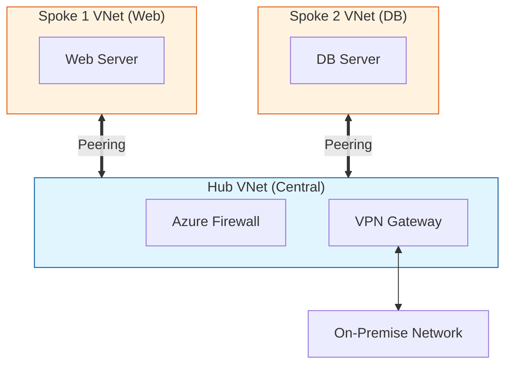

## 1. 개요

**VNet Peering (가상 네트워크 피어링)**은 서로 다른 Azure 가상 네트워크(VNet)를 마이크로소프트의 프라이빗 백본망을 통해 연결하는 네트워킹 기술이다. 
두 개의 네트워크를 논리적으로 결합하여, 마치 하나의 네트워크에 있는 것처럼 VM 간에 사설 IP로 통신할 수 있게 해준다.

### 핵심 개념
1.  **프라이빗 연결**: 공용 인터넷을 거치지 않고 Azure 백본망을 이용하므로 보안성이 높고 대역폭 제한이 적다.
2.  **낮은 지연 시간**: 동일 리전 내 피어링의 경우 VM 간 통신 속도가 로컬 네트워크 수준으로 빠르다.
3.  **교차 구독/리전**: 서로 다른 구독(Subscription)이나 서로 다른 리전(Region)에 있는 VNet 간에도 연결이 가능하다.

### 피어링 유형 비교 (Peering Types)
| 유형 | 설명 | 특징 |
|---|---|---|
| **Regional Peering** | 같은 리전 내 VNet 연결 | 대역폭 제한 없음, 지연 시간 매우 낮음 (<1ms) |
| **Global Peering** | 다른 리전 간 VNet 연결 | 리전 간 데이터 전송 비용 발생, 지연 시간은 거리 비례 |

### Hub-Spoke 아키텍처 다이어그램


---

## 2. 설정 방법

### Azure Portal 설정
1.  **VNet 선택**: 연결하고자 하는 VNet(예: Hub-VNet)으로 이동한다.
2.  **Peerings 메뉴**: 설정(Settings) > Peerings > +Add 클릭.
3.  **Config 입력**:
    *   **This virtual network**: 현재 VNet에서의 설정 (이름 등).
    *   **Remote virtual network**: 상대방 VNet 선택.
    *   **Allow** 옵션 체크 확인.
4.  **자동 양방향**: 포털에서는 한 번에 양쪽 방향의 피어링을 모두 생성해 준다.

### Azure CLI 설정
CLI를 사용할 때는 양쪽 VNet에서 각각 피어링을 생성해야 한다.

```bash
# 1. Hub VNet -> Spoke VNet 방향 생성
az network vnet peering create \
  --name Hub-to-Spoke1 \
  --resource-group MyRG \
  --vnet-name Hub-VNet \
  --remote-vnet /subscriptions/{SubID}/resourceGroups/MyRG/providers/Microsoft.Network/virtualNetworks/Spoke1-VNet \
  --allow-vnet-access

# 2. Spoke VNet -> Hub VNet 방향 생성 (반대)
az network vnet peering create \
  --name Spoke1-to-Hub \
  --resource-group MyRG \
  --vnet-name Spoke1-VNet \
  --remote-vnet /subscriptions/{SubID}/resourceGroups/MyRG/providers/Microsoft.Network/virtualNetworks/Hub-VNet \
  --allow-vnet-access
```

### 주요 옵션 설명
| 옵션 | 설명 | 권장 설정 |
|---|---|---|
| **allow-vnet-access** | 피어링된 VNet 간 통신 허용 여부 | Enabled (기본값) |
| **allow-forwarded-traffic** | VNet이 아닌 곳(VPN 등)에서 온 트래픽을 전달받을지 여부 | Hub에서는 보통 Enabled |
| **allow-gateway-transit** | 내 게이트웨이를 상대방이 쓰게 할지 여부 | Hub VNet에서 Enabled |
| **use-remote-gateways** | 상대방의 게이트웨이를 내가 쓸지 여부 | Spoke VNet에서 Enabled |

---

## 3. 게이트웨이 전송 (Gateway Transit)

Hub VNet에만 VPN Gateway를 만들고, Spoke VNet들이 이를 공유해서 온프레미스와 통신하게 만드는 구성이다. 비용을 절감하는 핵심 기능이다.

```bash
# 1. Hub 측 설정 (내 게이트웨이 공유 허용)
az network vnet peering update \
  --name Hub-to-Spoke1 \
  --resource-group MyRG \
  --vnet-name Hub-VNet \
  --set allowGatewayTransit=true

# 2. Spoke 측 설정 (남의 게이트웨이 사용)
az network vnet peering update \
  --name Spoke1-to-Hub \
  --resource-group MyRG \
  --vnet-name Spoke1-VNet \
  --set useRemoteGateways=true
```

---

## 4. 실습 예시

### Hub-Spoke 전체 구성 스크립트
```bash
# 1. VNet 생성
az network vnet create -g MyRG -n Hub-VNet --address-prefix 10.0.0.0/16
az network vnet create -g MyRG -n Spoke1-VNet --address-prefix 10.1.0.0/16
az network vnet create -g MyRG -n Spoke2-VNet --address-prefix 10.2.0.0/16

# 2. Hub-Spoke1 피어링 연결
az network vnet peering create -g MyRG -n Hub-Spoke1 \
  --vnet-name Hub-VNet --remote-vnet Spoke1-VNet \
  --allow-vnet-access --allow-forwarded-traffic

az network vnet peering create -g MyRG -n Spoke1-Hub \
  --vnet-name Spoke1-VNet --remote-vnet Hub-VNet \
  --allow-vnet-access --allow-forwarded-traffic

# 3. Hub-Spoke2 피어링 연결 (동일 절차)
az network vnet peering create -g MyRG -n Hub-Spoke2 --vnet-name Hub-VNet --remote-vnet Spoke2-VNet --allow-vnet-access --allow-forwarded-traffic
az network vnet peering create -g MyRG -n Spoke2-Hub --vnet-name Spoke2-VNet --remote-vnet Hub-VNet --allow-vnet-access --allow-forwarded-traffic
```

### 상태 확인
```bash
az network vnet peering list -g MyRG --vnet-name Hub-VNet -o table
```
*   **Connected**: 정상 연결됨
*   **Initiated**: 한쪽에만 설정됨 (반대쪽도 설정해야 함)
*   **Disconnected**: 끊어짐


---

## 5. 트러블슈팅

### Spoke 간 통신 불가
*   VNet Peering은 **비전이성(Non-transitive)**을 가진다. 즉, `A <-> B`이고 `B <-> C`라고 해서 `A <-> C`가 자동으로 연결되지 않는다.
*   해결책: Hub VNet에 Azure Firewall(NVA)을 두고, **UDR(User Defined Route)**을 사용하여 트래픽을 허브로 보낸 후 라우팅해야 한다.

### 주소 충돌 (Overlapping Address Space)
*   피어링하려는 두 VNet의 IP 주소 공간(CIDR)이 겹치면 피어링을 생설할 수 없다.
*   설계 단계에서부터 IP 주소 계획(IP Planning)이 필수적이다.

### NSG 차단
*   피어링 상태가 `Connected`여도 통신이 안 된다면 NSG 규칙을 확인해야 한다.
*   Subnet 레벨이나 NIC 레벨에 적용된 NSG가 트래픽을 차단하고 있을 수 있다.

---

## 6. 보안 고려사항

*   **NSG 적용**: 피어링된 VNet 간에도 NSG 규칙이 적용되므로, 필요한 트래픽만 허용하도록 최소 권한 원칙을 적용한다.
*   **IP 주소 계획**: 피어링은 주소 공간 충돌 시 불가능하므로, 설계 단계부터 체계적인 IP 주소 관리(IPAM)를 수행한다.
*   **Hub에 보안 장비 집중**: Hub-Spoke 구조에서는 Hub VNet에 Azure Firewall이나 NVA를 배치하여 모든 Spoke 간 트래픽을 검사한다.
*   **게이트웨이 전송 주의**: `useRemoteGateways` 옵션 활성화 시 Spoke의 모든 트래픽이 Hub 게이트웨이를 경유하므로, 의도치 않은 경로 노출에 주의한다.

<hr class="short-rule">
