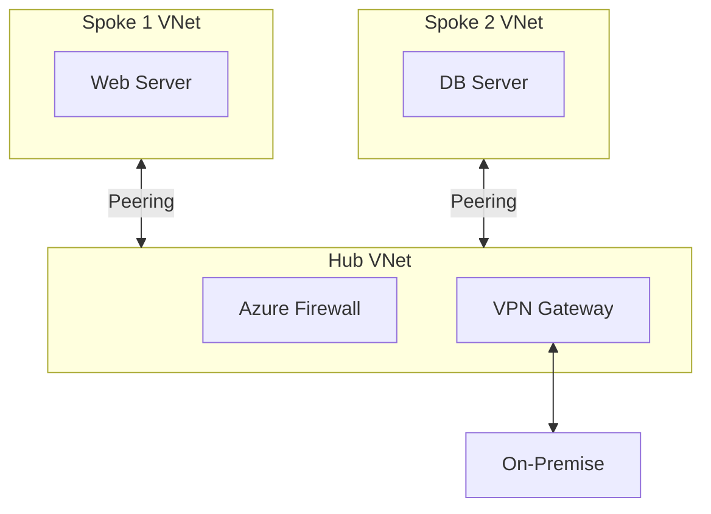

## 1. 개념

**VNet Peering**은 서로 다른 Azure 가상 네트워크(VNet)를 마이크로소프트 백본망을 통해 연결하는 기술입니다.
두 네트워크를 논리적으로 결합하여, 마치 하나의 네트워크처럼 사설 IP로 통신할 수 있게 합니다.

### 기본 정보

| 항목 | 설명 |
|------|------|
| 목적 | VNet 간 프라이빗 연결 |
| 트래픽 | Azure 백본 네트워크 (인터넷 X) |
| 지연 | 동일 리전 < 1ms |

### Peering 유형

| 유형 | 설명 |
|------|------|
| Regional Peering | 같은 리전 내 VNet 연결 |
| Global Peering | 다른 리전 간 VNet 연결 |

### Hub-Spoke 아키텍처



---

## 2. 설정 방법

### Azure Portal
1. VNet → Peerings → Add
2. Peering link name 설정
3. 원격 VNet 선택
4. 양쪽 피어링 생성 필요 (양방향)

### Azure CLI
```bash
# Hub VNet → Spoke VNet 피어링
az network vnet peering create \
  --name Hub-to-Spoke1 \
  --resource-group MyRG \
  --vnet-name Hub-VNet \
  --remote-vnet /subscriptions/.../Spoke1-VNet \
  --allow-vnet-access

# Spoke VNet → Hub VNet 피어링 (반대 방향)
az network vnet peering create \
  --name Spoke1-to-Hub \
  --resource-group MyRG \
  --vnet-name Spoke1-VNet \
  --remote-vnet /subscriptions/.../Hub-VNet \
  --allow-vnet-access
```

### 주요 옵션

| 옵션 | 설명 |
|------|------|
| allow-vnet-access | VNet 간 통신 허용 |
| allow-forwarded-traffic | 전달된 트래픽 허용 |
| allow-gateway-transit | 게이트웨이 전송 허용 |
| use-remote-gateways | 원격 게이트웨이 사용 |

---

## 3. 게이트웨이 전송

Hub의 VPN Gateway를 Spoke에서 공유:

```bash
# Hub 측 (Gateway Transit 허용)
az network vnet peering update \
  --name Hub-to-Spoke1 \
  --resource-group MyRG \
  --vnet-name Hub-VNet \
  --set allowGatewayTransit=true

# Spoke 측 (Remote Gateway 사용)
az network vnet peering update \
  --name Spoke1-to-Hub \
  --resource-group MyRG \
  --vnet-name Spoke1-VNet \
  --set useRemoteGateways=true
```

---

## 4. 실습 예시

### Hub-Spoke 구성

```bash
# 1. VNet 생성
az network vnet create -g MyRG -n Hub-VNet --address-prefix 10.0.0.0/16
az network vnet create -g MyRG -n Spoke1-VNet --address-prefix 10.1.0.0/16
az network vnet create -g MyRG -n Spoke2-VNet --address-prefix 10.2.0.0/16

# 2. Hub-Spoke1 피어링
az network vnet peering create -g MyRG -n Hub-Spoke1 \
  --vnet-name Hub-VNet --remote-vnet Spoke1-VNet \
  --allow-vnet-access --allow-forwarded-traffic

az network vnet peering create -g MyRG -n Spoke1-Hub \
  --vnet-name Spoke1-VNet --remote-vnet Hub-VNet \
  --allow-vnet-access --allow-forwarded-traffic

# 3. Hub-Spoke2 피어링 (동일하게)
```

### 피어링 상태 확인
```bash
az network vnet peering list -g MyRG --vnet-name Hub-VNet -o table
```

| 상태 | 설명 |
|------|------|
| Connected | 정상 연결 |
| Initiated | 한쪽만 설정됨 |
| Disconnected | 원격 VNet 삭제 등 |


---

## 5. 트러블슈팅

### Spoke 간 통신 불가
- 기본적으로 Spoke ↔ Spoke 직접 통신 안됨
- 해결: Hub에서 UDR + NVA/Azure Firewall로 라우팅

### 주소 충돌
- VNet 주소 공간이 겹치면 피어링 불가
- 사전에 IP 주소 계획 필수

### NSG 확인
- 피어링은 연결만 제공, NSG 규칙은 별도

<hr class="short-rule">
