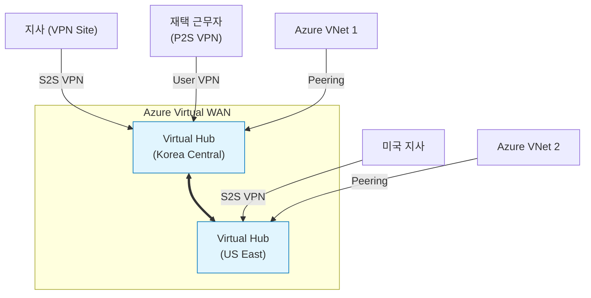

## 1. 개요

**Azure Virtual WAN**은 지사, VPN, ExpressRoute, 원격 사용자 연결 등을 단일 운영 인터페이스로 통합하여 관리하는 네트워킹 서비스이다.
Azure의 글로벌 백본 네트워크를 기반으로 **Hub-and-Spoke** 아키텍처를 자동화하여 구축하며, 대규모 글로벌 네트워크 연결을 단순화하고 최적화한다.

### 핵심 이점
1.  **통합 연결성**: Site-to-Site VPN, User VPN, ExpressRoute를 하나의 허브에서 통합 처리한다.
2.  **자동화된 라우팅**: 허브와 스포크, 지사 간의 라우팅 테이블을 자동으로 관리한다.
3.  **최적화된 성능**: 가장 가까운 Azure POP으로 진입하여 글로벌 백본을 타고 목적지로 이동하므로 인터넷 지연을 최소화한다.

### Virtual WAN 아키텍처


### 연결 유형 비교
| 유형 | 설명 | 용도 |
|---|---|---|
| **Site-to-Site VPN** | 온프레미스 네트워크와 Azure Hub 간의 IPsec 연결 | 본사/지사 사무실 연결 |
| **Point-to-Site VPN** | 개별 클라이언트 PC에서 Azure Hub로 연결 | 재택 근무자, 모바일 사용자 |
| **ExpressRoute** | 전용선을 통한 프라이빗 통신 | 대용량 데이터, 높은 보안성 요구 시 |
| **VNet Connection** | VNet을 Virtual Hub에 피어링 연결 | 워크로드 연결 |

---

## 2. 설정 방법

### 1) Virtual WAN 리소스 생성
Virtual WAN의 컨테이너를 먼저 생성한다.
```bash
# Virtual WAN 생성 (Standard 타입 권장)
az network vwan create \
  --resource-group MyRG \
  --name MyVWAN \
  --type Standard \
  --location koreacentral
```

### 2) Virtual Hub 생성
실제 네트워크 연결의 중심점이 되는 Hub를 각 리전에 생성한다. 이 과정에서 주소 공간을 할당한다.
```bash
az network vhub create \
  --resource-group MyRG \
  --name KoreaHub \
  --vwan MyVWAN \
  --address-prefix 10.0.0.0/24 \
  --location koreacentral
```

### 3) VNet 연결
워크로드가 있는 VNet을 허브에 연결한다.
```bash
az network vhub connection create \
  --resource-group MyRG \
  --name VNetConn1 \
  --vhub-name KoreaHub \
  --remote-vnet /subscriptions/.../MyWorkloadVNet
```

### 4) VPN Gateway 생성
Hub 내부에 VPN Gateway를 배포한다. (시간이 30분 정도 소요됨)
```bash
# VPN Gateway 생성 (Scale Unit 1 = 500Mbps)
az network vpn-gateway create \
  --resource-group MyRG \
  --name KoreaHub-VPNGw \
  --vhub KoreaHub \
  --scale-unit 1
```

### 5) VPN Site 생성 및 연결
온프레미스 장비 정보를 담은 'VPN Site'를 만들고 게이트웨이와 연결한다.
```bash
# VPN Site (온프레미스 정보) 생성
az network vpn-site create \
  --resource-group MyRG \
  --name SeoulBranch-Site \
  --virtual-wan MyVWAN \
  --ip-address 203.0.113.10 \
  --address-prefixes 192.168.10.0/24 \
  --device-vendor Cisco --device-model ISR

# Site를 Hub Gateway에 연결
az network vpn-gateway connection create \
  --resource-group MyRG \
  --name Connect-SeoulBranch \
  --gateway-name KoreaHub-VPNGw \
  --remote-vpn-site SeoulBranch-Site \
  --shared-key "MySecretKey123"
```

---

## 3. SKU 비교

| 기능 | Basic | Standard |
|---|---|---|
| **Site-to-Site VPN** | 지원 | 지원 |
| **Point-to-Site VPN** | 미지원 | **지원** |
| **ExpressRoute** | 미지원 | **지원** |
| **Hub-to-Hub 연결** | 미지원 | **지원** (허브 간 풀메시 연결) |
| **VNet-to-VNet** | 미지원 | **지원** |
| **Azure Firewall 통합** | 미지원 | **지원** |

> **권장사항**: 대부분의 엔터프라이즈 시나리오에서는 **Standard** SKU를 사용해야 한다.

---

## 4. 실습: 멀티 리전 Hub 구성

한국(Korea)과 미국(US)에 각각 허브를 만들고 연결하는 시나리오이다. Standard SKU를 사용하면 허브 간 라우팅이 자동으로 이루어진다.

```bash
# 1. Korea Hub 생성
az network vhub create -g MyRG -n KoreaHub \
  --vwan MyVWAN --address-prefix 10.1.0.0/24 \
  --location koreacentral

# 2. US Hub 생성
az network vhub create -g MyRG -n USHub \
  --vwan MyVWAN --address-prefix 10.2.0.0/24 \
  --location eastus

# 별도의 Peering 설정 없이, Standard Virtual WAN 내부에서 두 허브는 이미 연결되어 있음.
# Korea Hub에 연결된 VNet과 US Hub에 연결된 VNet은 즉시 통신 가능.
```


---

## 5. 트러블슈팅

### 배포 시간 주의
*   Virtual Hub에 VPN Gateway나 ExpressRoute Gateway를 생성하는 작업은 **최소 30분 이상** 소요된다. 배포가 멈춘 것 같아도 기다려야 한다.
*   `ProvisioningState`가 'Succeeded'가 될 때까지 다음 작업을 진행하지 않는 것이 좋다.

### 라우팅 경로 확인
Virtual Hub가 학습한 경로를 확인하여 라우팅 문제를 해결한다.
```bash
az network vhub effective-routes show \
  --resource-group MyRG \
  --name KoreaHub \
  --resource-type RouteTable \
  --resource-id /subscriptions/.../defaultRouteTable
```

### 비용 관리
*   **Scale Unit**: 필요 이상으로 크게 잡으면 비용이 많이 나온다. (1 Scale Unit = 500Mbps)
*   **Connection Unit**: VNet 연결 당 비용이 발생한다.
*   **Hub 비용**: 허브가 배포되어 있는 시간만큼 시간당 과금된다.

<hr class="short-rule">
