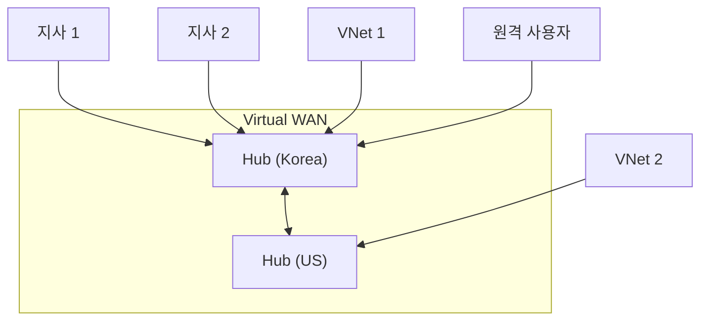

## 1. 개념

**Azure Virtual WAN**은 지사, VPN, ExpressRoute 등 다양한 연결을 단일 인터페이스로 통합 관리하는 네트워킹 서비스입니다.
Hub-and-Spoke 아키텍처를 기반으로 글로벌 수준의 자동화된 트랜짓(Transit) 네트워크 연결을 제공합니다.

### 기본 정보

| 항목 | 설명 |
|------|------|
| 목적 | 브랜치, VNet, 사용자를 글로벌 연결 |
| 구성요소 | Hub, VPN, ExpressRoute, P2S |
| 관리 | 중앙 집중식 |

### Virtual WAN 구성


### 연결 유형

| 유형 | 설명 |
|------|------|
| S2S VPN | Site-to-Site (지사 연결) |
| P2S VPN | Point-to-Site (원격 사용자) |
| ExpressRoute | 전용선 연결 |
| VNet Connection | Azure VNet 연결 |

---

## 2. 설정 방법

### Virtual WAN 생성
```bash
# Virtual WAN 생성
az network vwan create \
  -g MyRG -n MyVWAN \
  --type Standard

# Virtual Hub 생성
az network vhub create \
  -g MyRG -n KoreaHub \
  --vwan MyVWAN \
  --address-prefix 10.0.0.0/24 \
  --location koreacentral
```

### VNet 연결
```bash
# VNet을 Hub에 연결
az network vhub connection create \
  -g MyRG -n VNetConn1 \
  --vhub-name KoreaHub \
  --remote-vnet MyVNet
```

### S2S VPN 설정
```bash
# VPN Gateway 생성 (Hub 내)
az network vpn-gateway create \
  -g MyRG -n MyVPNGateway \
  --vhub KoreaHub \
  --scale-unit 1

# VPN Site (온프레미스 정보)
az network vpn-site create \
  -g MyRG -n Branch1-Site \
  --virtual-wan MyVWAN \
  --ip-address 1.2.3.4 \
  --address-prefixes 192.168.0.0/24 \
  --device-vendor Cisco --device-model ASR
```

---

## 3. SKU 비교

| 기능 | Basic | Standard |
|------|-------|----------|
| VNet 연결 | 10 | 500 |
| S2S VPN | ✅ | ✅ |
| P2S VPN | ❌ | ✅ |
| ExpressRoute | ❌ | ✅ |
| Hub간 연결 | ❌ | ✅ |
| Azure Firewall | ❌ | ✅ |

---

## 4. 실습 예시

### 멀티 리전 Hub 구성

```bash
# Korea Hub
az network vhub create -g MyRG -n KoreaHub \
  --vwan MyVWAN --address-prefix 10.1.0.0/24 \
  --location koreacentral

# US Hub
az network vhub create -g MyRG -n USHub \
  --vwan MyVWAN --address-prefix 10.2.0.0/24 \
  --location eastus

# Hub간 라우팅은 자동!
```


---

## 5. 트러블슈팅

### Hub 배포 시간
- VPN Gateway: 약 30분
- 프로비저닝 상태 확인 필수

### 라우팅 확인
```bash
az network vhub effective-routes show \
  -g MyRG -n KoreaHub \
  --resource-type RouteTable \
  --resource-id /subscriptions/.../defaultRouteTable
```

### 비용 최적화
- Scale Unit 최소화
- 필요 시에만 Standard SKU

<hr class="short-rule">
