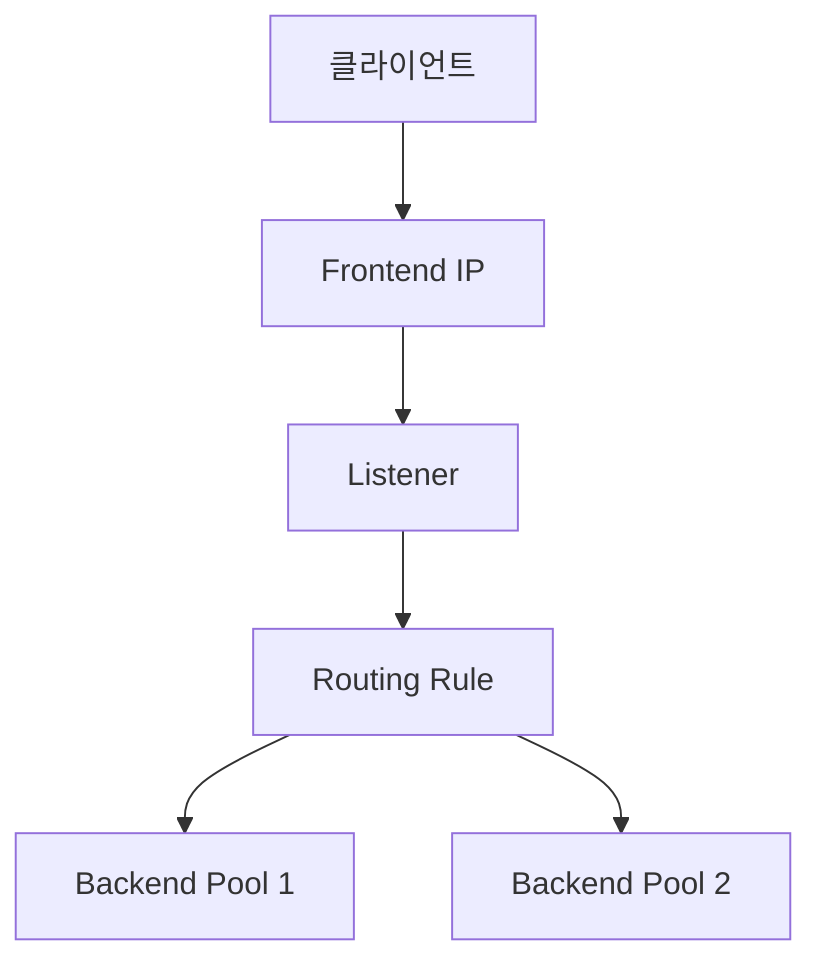

## 1. 개념

**Azure Application Gateway**는 HTTP/HTTPS 트래픽 관리에 최적화된 L7(애플리케이션 계층) 로드 밸런서입니다.
URL 경로 기반 라우팅, SSL 오프로딩, 그리고 웹 애플리케이션 방화벽(WAF) 기능을 통합 제공합니다.

### 기본 정보

| 항목 | 설명 |
|------|------|
| 계층 | L7 (HTTP/HTTPS) |
| WAF | 웹 방화벽 기능 내장 |
| 라우팅 | URL 경로, 호스트 기반 |

### Azure 로드밸런서 비교

| 서비스 | 계층 | 범위 | 용도 |
|--------|------|------|------|
| Azure LB | L4 | Regional | TCP/UDP 분산 |
| Application Gateway | L7 | Regional | 웹 앱 분산 |
| Front Door | L7 | Global | 글로벌 웹 앱 |
| Traffic Manager | DNS | Global | DNS 기반 분산 |

### 구성 요소



---

## 2. 주요 기능

### URL 경로 기반 라우팅
```
/images/*  → Image Server Pool
/api/*     → API Server Pool
/*         → Web Server Pool
```

### 다중 사이트 호스팅
```
www.contoso.com → Pool A
www.fabrikam.com → Pool B
```

### SSL 종료 (Offloading)
- Application Gateway에서 SSL 처리
- 백엔드 서버 부하 감소

### WAF (Web Application Firewall)
- OWASP Top 10 보호
- SQL Injection, XSS 차단
- 사용자 정의 규칙

---

## 3. 설정 방법

### Azure CLI로 생성
```bash
# 1. Application Gateway 서브넷 (전용 필요)
az network vnet subnet create \
  -g MyRG --vnet-name MyVNet \
  -n AppGW-Subnet --address-prefixes 10.0.1.0/24

# 2. Public IP
az network public-ip create \
  -g MyRG -n AppGW-PIP --sku Standard

# 3. Application Gateway 생성
az network application-gateway create \
  -g MyRG -n MyAppGW \
  --vnet-name MyVNet --subnet AppGW-Subnet \
  --public-ip-address AppGW-PIP \
  --sku WAF_v2 \
  --capacity 2 \
  --http-settings-port 80 \
  --http-settings-protocol Http \
  --frontend-port 80
```

### 백엔드 풀 추가
```bash
# 백엔드 풀에 VM 추가
az network application-gateway address-pool create \
  -g MyRG --gateway-name MyAppGW \
  -n WebPool \
  --servers 10.0.0.4 10.0.0.5

# Health Probe 설정
az network application-gateway probe create \
  -g MyRG --gateway-name MyAppGW \
  -n HealthProbe \
  --protocol Http --path /health \
  --interval 30 --timeout 30 --threshold 3
```

### URL 경로 라우팅
```bash
# URL Path Map 생성
az network application-gateway url-path-map create \
  -g MyRG --gateway-name MyAppGW \
  -n PathMap \
  --paths '/api/*' \
  --address-pool ApiPool \
  --http-settings ApiSettings \
  --default-address-pool WebPool \
  --default-http-settings WebSettings
```

---

## 4. WAF 설정

### WAF 정책 생성
```bash
az network application-gateway waf-policy create \
  -g MyRG -n MyWAFPolicy

# OWASP 규칙 세트 적용
az network application-gateway waf-policy managed-rule rule-set add \
  -g MyRG --policy-name MyWAFPolicy \
  --type OWASP --version 3.2
```

### WAF 모드

| 모드 | 동작 |
|------|------|
| Detection | 탐지만 (로깅) |
| Prevention | 탐지 + 차단 |

---

## 5. 실습 예시

### VMSS와 연동

```bash
# VMSS 생성 시 Application Gateway 연결
az vmss create \
  -g MyRG -n MyVMSS \
  --image Ubuntu2204 \
  --app-gateway MyAppGW \
  --backend-pool-name WebPool
```


---

## 6. 트러블슈팅

### 502 Bad Gateway
- 백엔드 서버 다운
- Health Probe 실패
- NSG가 AppGW → Backend 차단

### Health Probe 확인
```bash
az network application-gateway show-backend-health \
  -g MyRG -n MyAppGW
```

### AppGW 서브넷 요구사항
- 전용 서브넷 필요 (다른 리소스 X)
- 최소 /27 권장

<hr class="short-rule">
