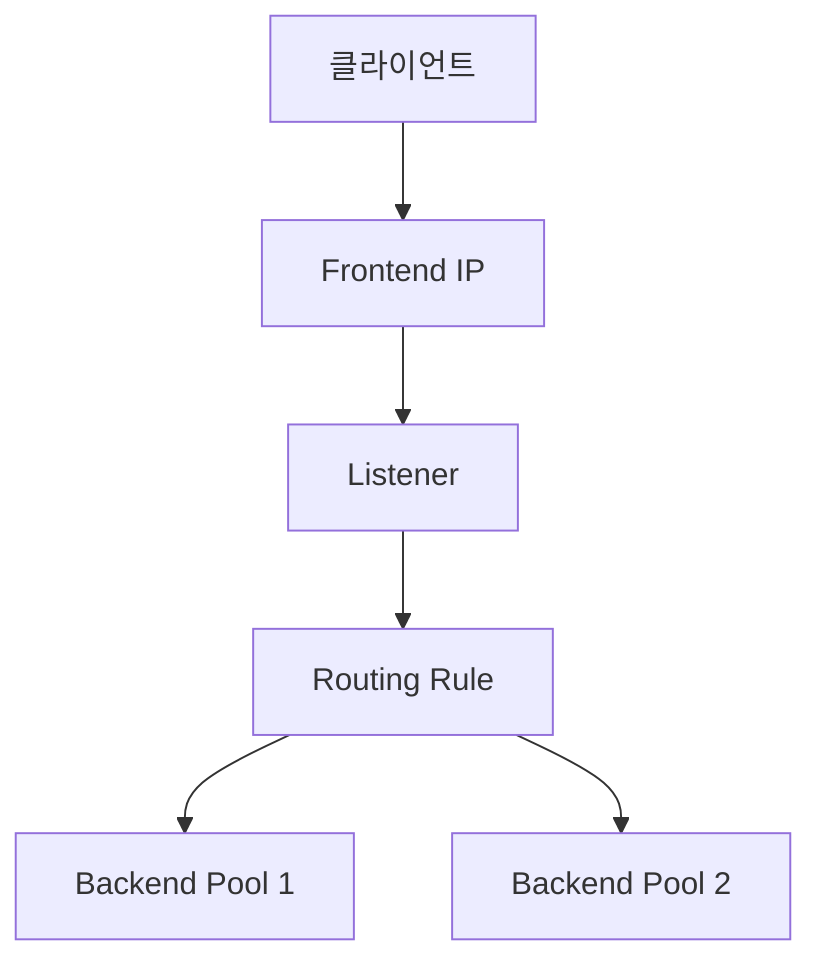

## 1. 개요

**Azure Application Gateway**는 HTTP/HTTPS 트래픽 관리에 최적화된 **L7 (애플리케이션 계층) 로드 밸런서**이다.
단순한 패킷 분산이 아니라 URL 경로, 호스트 헤더 등 애플리케이션 데이터를 기반으로 지능적인 라우팅을 수행하며, 웹 애플리케이션 방화벽(WAF)을 통해 보안성을 강화한다.

### 핵심 기능
1.  **애플리케이션 레벨 라우팅**: `/images/*`는 이미지 서버로, `/video/*`는 비디오 서버로 보내는 등 URL 경로 기반 라우팅이 가능하다.
2.  **보안 강화 (WAF)**: SQL Injection, XSS 등 일반적인 웹 공격으로부터 백엔드 서버를 보호한다.
3.  **SSL 오프로딩**: 암호화/복호화 부하를 게이트웨이에서 처리하여 백엔드 웹 서버의 성능을 확보한다.

### Azure 로드밸런서 비교
| 서비스 | 계층 | 범위 | 용도 |
|--------|------|------|------|
| **Azure LB** | L4 | Regional | TCP/UDP 트래픽 분산 |
| **Application Gateway** | L7 | Regional | 웹 애플리케이션 최적화 및 보안 |
| **Front Door** | L7 | Global | 글로벌 웹 서비스 가속 및 라우팅 |
| **Traffic Manager** | DNS | Global | DNS 기반 지역 분산 |

### 구성 요소


---

## 2. 주요 기능

### URL 경로 기반 라우팅
```
/images/*  → Image Server Pool
/api/*     → API Server Pool
/*         → Web Server Pool
```

### 다중 사이트 호스팅
```
www.contoso.com → Pool A
www.fabrikam.com → Pool B
```

### SSL 종료 (SSL Offloading)
*   Application Gateway에서 SSL 연결을 종료하고 평문으로 백엔드에 전달하거나, 백엔드까지 다시 암호화(E2E SSL)할 수 있다.
*   백엔드 서버의 CPU 부하를 감소시키는 효과가 있다.

### WAF (Web Application Firewall)
*   OWASP Top 10 취약점에 대한 사전 정의된 방어 규칙 세트를 제공한다.
*   SQL Injection, Cross-Site Scripting (XSS) 등을 자동으로 차단한다.
*   사용자 정의 규칙을 통해 특정 IP 차단이나 지역 차단이 가능하다.

---

## 3. 설정 방법

### Azure CLI로 생성
```bash
# 1. Application Gateway 서브넷 (전용 서브넷 필수)
az network vnet subnet create \
  -g MyRG --vnet-name MyVNet \
  -n AppGW-Subnet --address-prefixes 10.0.1.0/24

# 2. Public IP 생성
az network public-ip create \
  -g MyRG -n AppGW-PIP --sku Standard

# 3. Application Gateway 생성
az network application-gateway create \
  -g MyRG -n MyAppGW \
  --vnet-name MyVNet --subnet AppGW-Subnet \
  --public-ip-address AppGW-PIP \
  --sku WAF_v2 \
  --capacity 2 \
  --http-settings-port 80 \
  --http-settings-protocol Http \
  --frontend-port 80
```

### 백엔드 풀 추가
```bash
# 백엔드 풀에 VM 추가
az network application-gateway address-pool create \
  -g MyRG --gateway-name MyAppGW \
  -n WebPool \
  --servers 10.0.0.4 10.0.0.5

# Health Probe 설정
az network application-gateway probe create \
  -g MyRG --gateway-name MyAppGW \
  -n HealthProbe \
  --protocol Http --path /health \
  --interval 30 --timeout 30 --threshold 3
```

### URL 경로 라우팅
```bash
# URL Path Map 생성
az network application-gateway url-path-map create \
  -g MyRG --gateway-name MyAppGW \
  -n PathMap \
  --paths '/api/*' \
  --address-pool ApiPool \
  --http-settings ApiSettings \
  --default-address-pool WebPool \
  --default-http-settings WebSettings
```

---

## 4. WAF 설정

### WAF 정책 생성
```bash
az network application-gateway waf-policy create \
  -g MyRG -n MyWAFPolicy

# OWASP 규칙 세트 적용
az network application-gateway waf-policy managed-rule rule-set add \
  -g MyRG --policy-name MyWAFPolicy \
  --type OWASP --version 3.2
```

### WAF 모드
| 모드 | 동작 |
|------|------|
| **Detection** | 공격을 탐지하고 로그만 남김 (차단 안 함) |
| **Prevention** | 공격 탐지 시 트래픽을 즉시 차단 (운영 환경 권장) |

---

## 5. 실습 예시

### VMSS와 연동
```bash
# VMSS 생성 시 Application Gateway 연결
az vmss create \
  -g MyRG -n MyVMSS \
  --image Ubuntu2204 \
  --app-gateway MyAppGW \
  --backend-pool-name WebPool
```


---

## 6. 트러블슈팅

### 502 Bad Gateway 에러
*   **원인**: 백엔드 서버가 다운되었거나 응답하지 않음.
*   **해결**: Health Probe 상태를 확인하고 백엔드 서버의 포트(80/443)가 열려 있는지 확인한다.
*   **NSG**: Application Gateway 서브넷이나 백엔드 서브넷의 NSG가 트래픽을 차단하는지 점검한다.

### Health Probe 확인
```bash
az network application-gateway show-backend-health \
  -g MyRG -n MyAppGW
```

### AppGW 서브넷 요구사항
*   Application Gateway는 반드시 **전용 서브넷**에 배포되어야 한다. 다른 리소스(VM 등)와 함께 쓸 수 없다.
*   규모 확장을 고려하여 최소 `/27` 이상의 서브넷 크기를 권장한다.

---

## 7. 보안 고려사항

*   **WAF Prevention 모드**: 운영 환경에서는 Detection이 아닌 **Prevention** 모드를 활성화하여 공격을 실시간 차단한다.
*   **SSL 정책**: 오래된 TLS 버전(1.0, 1.1)을 비활성화하고, TLS 1.2 이상만 허용하는 SSL 정책을 적용한다.
*   **백엔드 보안**: 백엔드 풀은 Private IP로만 접근 가능하게 하고, NSG로 Application Gateway 서브넷에서 오는 트래픽만 허용한다.
*   **사용자 정의 규칙**: 특정 국가 IP 차단, 특정 URI 패턴 보호 등 비즈니스 로직에 맞는 커스텀 WAF 규칙을 설정한다.

<hr class="short-rule">
