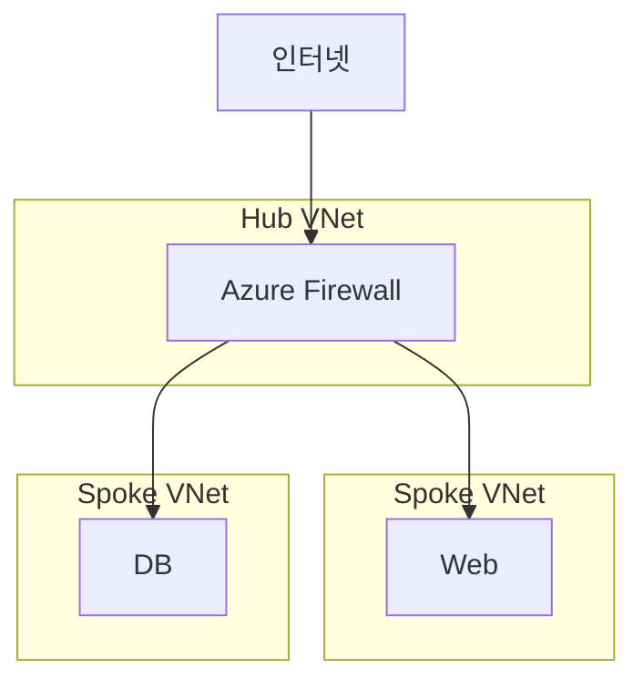

## 1. 개념

**Azure Firewall**은 Azure Virtual Network 리소스를 보호하기 위한 완전 관리형(SaaS) 네트워크 보안 서비스입니다.
고가용성과 무제한 클라우드 확장성을 갖춘 Stateful 방화벽으로, L3-L7 계층의 트래픽을 제어합니다.

### 기본 정보
| 항목 | 설명 |
|------|------|
| 유형 | Stateful Firewall |
| 가용성 | 내장 고가용성 |
| 확장성 | 자동 스케일링 |

### Azure Firewall vs NSG
| 항목 | Azure Firewall | NSG |
|------|----------------|-----|
| 계층 | L3-L7 | L4 |
| 관리 | 중앙 집중 | 리소스별 |
| FQDN 필터링 | ✅ | ❌ |
| Threat Intelligence | ✅ | ❌ |
| 비용 | 유료 | 무료 |

### SKU 비교
| SKU | 기능 | 처리량 |
|-----|------|--------|
| Standard | 기본 기능 | ~30 Gbps |
| Premium | TLS 검사, IDS/IPS | ~100 Gbps |
| Basic | 소규모용 | ~250 Mbps |

---

## 2. 아키텍처



---

## 3. 설정 방법

### Azure Firewall 생성
```bash
# Firewall 서브넷 생성 (이름 고정: AzureFirewallSubnet)
az network vnet subnet create \
  -g MyRG --vnet-name HubVNet \
  -n AzureFirewallSubnet \
  --address-prefixes 10.0.1.0/26

# Public IP 생성
az network public-ip create \
  -g MyRG -n FW-PIP --sku Standard

# Azure Firewall 생성
az network firewall create \
  -g MyRG -n MyFirewall \
  --vnet-name HubVNet
```

### Firewall Policy 설정
```bash
# Policy 생성
az network firewall policy create \
  -g MyRG -n MyFWPolicy

# Application Rule Collection 추가
az network firewall policy rule-collection-group create \
  -g MyRG --policy-name MyFWPolicy \
  -n DefaultRuleGroup --priority 100

# 웹 트래픽 허용 규칙
az network firewall policy rule-collection-group collection add-filter-collection \
  -g MyRG --policy-name MyFWPolicy \
  --rule-collection-group-name DefaultRuleGroup \
  -n AllowWeb --collection-priority 100 --action Allow \
  --rule-type ApplicationRule \
  --rule-name AllowHTTPS \
  --source-addresses 10.0.0.0/8 \
  --target-fqdns "*.microsoft.com" \
  --protocols Https=443
```

---

## 4. 라우팅 설정 (UDR)

```bash
# Spoke에서 Firewall로 라우팅
az network route-table create -g MyRG -n Spoke-RT

az network route-table route create \
  -g MyRG --route-table-name Spoke-RT \
  -n ToInternet \
  --address-prefix 0.0.0.0/0 \
  --next-hop-type VirtualAppliance \
  --next-hop-ip-address 10.0.1.4  # Firewall Private IP

# Spoke Subnet에 Route Table 연결
az network vnet subnet update \
  -g MyRG --vnet-name SpokeVNet -n default \
  --route-table Spoke-RT
```

---

## 5. 규칙 유형

### Application Rules (L7)
- FQDN 기반 필터링
- HTTP/HTTPS 태그 지원

```bash
# Microsoft Update 허용
--target-fqdns "WindowsUpdate" --fqdn-tags
```

### Network Rules (L4)
- IP, Port, Protocol 기반

```bash
az network firewall policy rule-collection-group collection add-filter-collection \
  --rule-type NetworkRule \
  --rule-name AllowDNS \
  --source-addresses '*' \
  --destination-addresses 8.8.8.8 \
  --destination-ports 53 \
  --ip-protocols UDP
```

### DNAT Rules
- 외부 → 내부 포트 포워딩


---

## 6. 트러블슈팅

### 연결 실패 시
```bash
# Firewall 로그 확인
az monitor diagnostic-settings create \
  -n FWLogs --resource /subscriptions/.../firewalls/MyFirewall \
  --logs '[{"category":"AzureFirewallNetworkRule","enabled":true}]' \
  --workspace /subscriptions/.../workspaces/MyLA
```

### AzureFirewallSubnet 요구사항
- 이름: **AzureFirewallSubnet** (고정)
- 크기: 최소 /26 (64 IP)

<hr class="short-rule">
