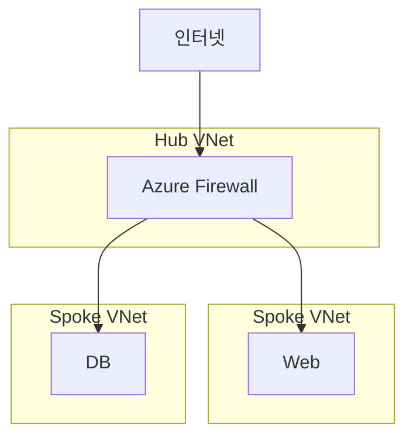

## 1. 개요

**Azure Firewall**은 Azure Virtual Network 리소스를 보호하기 위한 완전 관리형 네트워크 보안 서비스이다.
고가용성과 무제한 클라우드 확장성을 갖춘 Stateful 방화벽으로, L3-L7 계층의 트래픽을 제어하고 로그를 중앙에서 통합 관리한다.

### 핵심 기능
1.  **중앙 집중식 관리**: 여러 VNet과 구독에 걸친 네트워크 보안 정책을 중앙에서 생성, 적용, 기록한다.
2.  **위협 인텔리전스**: 마이크로소프트의 글로벌 위협 인텔리전스(Threat Intelligence)를 기반으로 악성 IP 및 도메인을 실시간으로 차단한다.
3.  **애플리케이션 제어**: FQDN(정규화된 도메인 이름) 기반으로 아웃바운드 HTTP/S 트래픽을 필터링한다.

### Azure Firewall vs NSG
| 항목 | Azure Firewall | NSG (Network Security Group) |
|------|----------------|-----|
| **계층** | L3-L7 (네트워크 + 애플리케이션) | L4 (전송 계층) |
| **관리** | 중앙 집중식 (구독 전역) | 서브넷 또는 NIC 단위 |
| **필터링** | FQDN 기반, URL 기반 | IP 주소, 포트 기반 |
| **위협 차단** | 지원 (Threat Intelligence) | 미지원 |
| **비용** | 유료 (시간당 + 데이터 처리량) | 무료 |

### SKU 비교
| SKU | 기능 | 처리량 |
|-----|------|--------|
| **Standard** | L3-L7 필터링, 위협 인텔리전스 | ~30 Gbps |
| **Premium** | TLS 검사, IDPS, URL 필터링 | ~100 Gbps |
| **Basic** | SMB(중소기업)용 필수 기능 | ~250 Mbps |

---

## 2. 아키텍처

Hub-and-Spoke 네트워크 토폴로지에서 허브 VNet에 방화벽을 배치하여 모든 트래픽을 중앙에서 검사하는 구조가 일반적이다.



---

## 3. 설정 방법

### Azure Firewall 생성

반드시 `AzureFirewallSubnet`이라는 이름의 전용 서브넷이 필요하다.

```bash
# 1. Firewall 서브넷 생성 (이름 고정: AzureFirewallSubnet)
az network vnet subnet create \
  -g MyRG --vnet-name HubVNet \
  -n AzureFirewallSubnet \
  --address-prefixes 10.0.1.0/26

# 2. Public IP 생성
az network public-ip create \
  -g MyRG -n FW-PIP --sku Standard

# 3. Azure Firewall 생성
az network firewall create \
  -g MyRG -n MyFirewall \
  --vnet-name HubVNet
```

### Firewall Policy 설정
최신 Azure Firewall 관리 방식인 'Firewall Policy'를 사용하여 규칙을 정의한다.

```bash
# 1. Policy 생성
az network firewall policy create \
  -g MyRG -n MyFWPolicy

# 2. Application Rule Collection 추가
# (예: 내부에서 *.microsoft.com 접속 허용)
az network firewall policy rule-collection-group create \
  -g MyRG --policy-name MyFWPolicy \
  -n DefaultRuleGroup --priority 100

az network firewall policy rule-collection-group collection add-filter-collection \
  -g MyRG --policy-name MyFWPolicy \
  --rule-collection-group-name DefaultRuleGroup \
  -n AllowWeb --collection-priority 100 --action Allow \
  --rule-type ApplicationRule \
  --rule-name AllowHTTPS \
  --source-addresses 10.0.0.0/8 \
  --target-fqdns "*.microsoft.com" \
  --protocols Https=443
```

---

## 4. 라우팅 설정 (UDR)

스포크 VNet의 트래픽이 방화벽을 거치도록 **UDR (User Defined Route)**을 설정해야 한다.

```bash
# 1. Route Table 생성
az network route-table create -g MyRG -n Spoke-RT

# 2. 0.0.0.0/0 경로를 방화벽으로 지정
az network route-table route create \
  -g MyRG --route-table-name Spoke-RT \
  -n ToInternet \
  --address-prefix 0.0.0.0/0 \
  --next-hop-type VirtualAppliance \
  --next-hop-ip-address 10.0.1.4  # Firewall Private IP 확인 필요

# 3. Spoke Subnet에 Route Table 연결
az network vnet subnet update \
  -g MyRG --vnet-name SpokeVNet -n default \
  --route-table Spoke-RT
```

---

## 5. 규칙 유형

Azure Firewall은 세 가지 유형의 규칙을 처리하며, 처리 순서는 **DNAT → Network → Application** 순이다.

### Application Rules (L7)
*   HTTP/HTTPS 트래픽을 FQDN(도메인 이름)으로 제어한다.
*   예: `*.google.com` 허용, `WindowsUpdate` 태그 허용.

```bash
# Microsoft Update 허용 (FQDN Tag 사용)
--target-fqdns "WindowsUpdate" --fqdn-tags
```

### Network Rules (L4)
*   IP 주소, 포트, 프로토콜(TCP/UDP/ICMP) 기반으로 제어한다.
*   전통적인 방화벽 규칙과 동일하다.

```bash
az network firewall policy rule-collection-group collection add-filter-collection \
  --rule-type NetworkRule \
  --rule-name AllowDNS \
  --source-addresses '*' \
  --destination-addresses 8.8.8.8 \
  --destination-ports 53 \
  --ip-protocols UDP
```

### DNAT Rules
*   공인 IP로 들어오는 트래픽을 내부 사설 IP의 특정 포트로 포워딩한다.
*   예: `Firewall_PIP:22` → `Internal_VM:22`


---

## 6. 트러블슈팅

### 연결 실패 시 로그 확인
방화벽이 트래픽을 차단하는지 확인하려면 진단 로그(Diagnostic Settings)를 활성화해야 한다.

```bash
# Log Analytics Workspace로 로그 전송 설정
az monitor diagnostic-settings create \
  -n FWLogs --resource /subscriptions/.../firewalls/MyFirewall \
  --logs '[{"category":"AzureFirewallNetworkRule","enabled":true}]' \
  --workspace /subscriptions/.../workspaces/MyLA
```

### AzureFirewallSubnet 요구사항
*   이름은 반드시 **AzureFirewallSubnet**이어야 한다.
*   서브넷 크기는 최소 `/26` 이상이어야 한다. (64개 IP 주소)
*   이 서브넷에는 다른 리소스를 배포할 수 없으며, NSG를 연결해서도 안 된다.

<hr class="short-rule">
