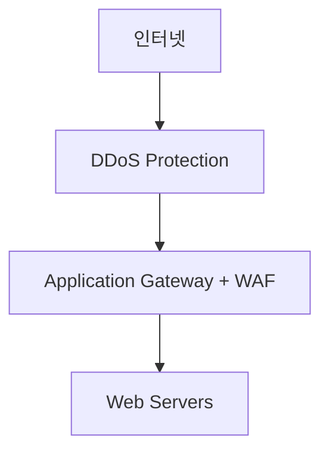

## 1. 개념

**Azure DDoS Protection**은 네트워크(L3/L4) 및 애플리케이션(L7) 계층의 분산 서비스 거부 공격을 탐지하고 완화하는 서비스입니다.
실시간 트래픽 모니터링과 머신러닝 기반의 적응형 튜닝을 통해 정상 트래픽을 유지하며 공격을 차단합니다.

### DDoS 공격 유형
| 계층 | 공격 유형 | 예시 |
|------|-----------|------|
| L3/L4 | Volumetric | UDP Flood, ICMP Flood |
| L4 | Protocol | SYN Flood, Ping of Death |
| L7 | Application | HTTP Flood, Slowloris |

### Azure DDoS Protection 티어
| 티어 | 기능 | 비용 |
|------|------|------|
| Basic | 자동 활성화, 기본 보호 | 무료 |
| Standard | 고급 완화, 실시간 모니터링 | 유료 |

---

## 2. 주요 기능

### DDoS Protection Standard
- **적응형 튜닝**: 트래픽 패턴 학습
- **실시간 완화**: 감지 즉시 대응
- **공격 분석**: 상세 보고서 제공
- **비용 보호**: DDoS로 인한 스케일 아웃 비용 보상

### 보호 대상 리소스
- Public IP 주소 보유 리소스
- VM, Load Balancer, Application Gateway
- Azure Firewall, Bastion 등

---

## 3. 설정 방법

### DDoS Protection Plan 생성
```bash
# DDoS Protection Plan 생성
az network ddos-protection create \
  -g MyRG -n MyDDoSPlan

# VNet에 DDoS Plan 연결
az network vnet update \
  -g MyRG -n MyVNet \
  --ddos-protection-plan MyDDoSPlan \
  --ddos-protection true
```

### Azure Portal
1. DDoS protection → Create
2. Resource Group, Name, Region 설정
3. VNet → DDoS protection → Enable
4. DDoS Protection Plan 선택

---

## 4. 모니터링

### 메트릭
| 메트릭 | 설명 |
|--------|------|
| Under DDoS attack | 공격 여부 (0/1) |
| Inbound packets dropped | 차단된 패킷 수 |
| Inbound bytes dropped | 차단된 바이트 수 |
| DDoS mitigation trigger TCP/UDP | 완화 트리거 |

### 알림 설정
```bash
# DDoS 공격 알림 규칙
az monitor metrics alert create \
  -g MyRG -n DDoSAlert \
  --scopes /subscriptions/.../publicIPAddresses/MyPIP \
  --condition "avg Under DDoS attack > 0" \
  --action /subscriptions/.../actionGroups/MyActionGroup
```

### 로깅
```bash
# Diagnostic Settings로 로그 전송
az monitor diagnostic-settings create \
  -g MyRG -n DDoSLogs \
  --resource /subscriptions/.../publicIPAddresses/MyPIP \
  --logs '[{"category": "DDoSProtectionNotifications", "enabled": true}]' \
  --workspace /subscriptions/.../workspaces/MyWorkspace
```

---

## 5. 실습 예시

### DDoS + Application Gateway + WAF



```bash
# 1. DDoS Plan 생성
az network ddos-protection create -g MyRG -n MyDDoSPlan

# 2. VNet에 연결
az network vnet update -g MyRG -n MyVNet \
  --ddos-protection-plan MyDDoSPlan --ddos-protection true

# 3. Application Gateway는 자동으로 보호됨 (VNet 내)
```


---

## 6. 트러블슈팅

### DDoS 공격 감지 확인
```bash
# Public IP의 DDoS 메트릭 확인
az monitor metrics list \
  --resource /subscriptions/.../publicIPAddresses/MyPIP \
  --metric "IfUnderDDoSAttack" \
  --interval PT1M
```

### 비용 고려사항
- DDoS Standard: 월 약 $2,900 + 리소스당 추가
- 중요 프로덕션 환경에서만 권장
- 대안: Cloudflare, AWS Shield 검토

<hr class="short-rule">
