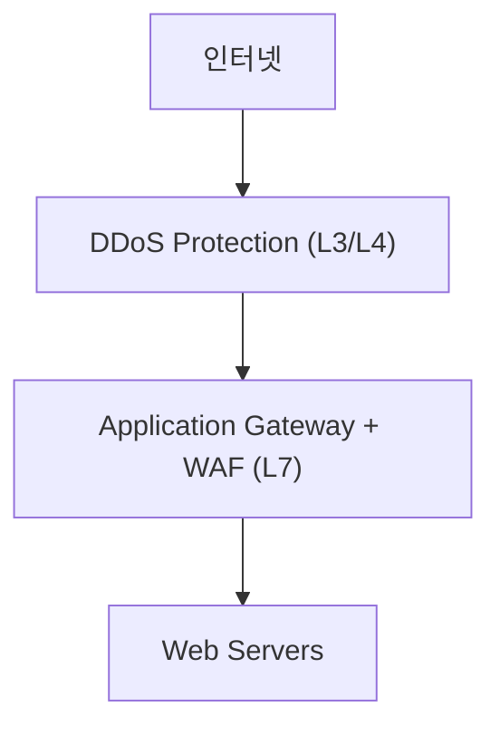

## 1. 개요

**Azure DDoS Protection**은 네트워크(L3/L4) 및 애플리케이션(L7) 계층의 **DDoS (분산 서비스 거부)** 공격을 탐지하고 완화하는 서비스이다.
Azure 글로벌 네트워크의 막대한 규모를 활용하여 공격 트래픽을 흡수하고, 머신러닝 기반의 트래픽 분석을 통해 정상 사용자의 서비스 이용을 보장한다.

### 핵심 기능
1.  **상시 감시 (Always-on)**: 연중무휴 24x7 트래픽 모니터링을 통해 공격 징후를 즉시 파악한다.
2.  **적응형 튜닝 (Adaptive Tuning)**: 애플리케이션의 정상적인 트래픽 패턴을 학습하여 임계값을 자동으로 조절한다.
3.  **다계층 보호**: 볼륨 공격부터 프로토콜 공격, 애플리케이션 공격까지 방어한다. (L7 보호는 Application Gateway WAF와 연동 시 강화됨)

### DDoS 공격 유형
| 계층 | 공격 유형 | 예시 |
|------|-----------|------|
| **L3/L4** | Volumetric (대용량) | UDP Flood, ICMP Flood |
| **L4** | Protocol (프로토콜) | SYN Flood, Ping of Death |
| **L7** | Application (애플리케이션) | HTTP Flood, Slowloris |

### Azure DDoS Protection 티어
| 티어 | 기능 | 비용 |
|------|------|------|
| **Basic** | Azure 플랫폼 자체 보호, 별도 설정 없음 | 무료 (기본 포함) |
| **Standard** | 전용 완화 정책, 로깅, 알림, 비용 보호 | 유료 (상당히 고가) |

---

## 2. 주요 기능 상세

### DDoS Protection Standard
*   **비용 보호 (Cost Guarantee)**: DDoS 공격으로 인해 리소스가 스케일 아웃되어 발생한 요금을 크레딧으로 보상해준다.
*   **DDoS Rapid Response (DRR)**: 공격 발생 시 전담 대응 팀의 지원을 받을 수 있다.
*   **실시간 지표 및 알림**: Azure Monitor를 통해 공격 진행 상황을 실시간으로 확인한다.

### 보호 대상 리소스
*   ARM(Azure Resource Manager) 기반의 Public IP를 가진 리소스
*   Virtual Machines
*   Load Balancers, Application Gateway
*   Azure Firewall

---

## 3. 설정 방법

DDoS Protection Plan을 생성하고 가상 네트워크(VNet)에 연결하면, 해당 VNet 내의 모든 리소스가 보호받는다.

### Azure CLI 설정

```bash
# 1. DDoS Protection Plan 생성
az network ddos-protection create \
  -g MyRG -n MyDDoSPlan

# 2. VNet에 DDoS Plan 연결 및 활성화
az network vnet update \
  -g MyRG -n MyVNet \
  --ddos-protection-plan MyDDoSPlan \
  --ddos-protection true
```

### Azure Portal 설정
1.  **DDoS protection plans** 검색 후 'Create' 클릭.
2.  리소스 그룹, 이름, 리전 설정 후 생성.
3.  보호하려는 VNet으로 이동하여 **DDoS protection** 메뉴 선택.
4.  'Enable' 체크 후 생성한 Plan 선택 및 저장.

---

## 4. 모니터링 및 알림

공격 발생 시 즉시 알림을 받을 수 있도록 설정해야 한다.

### 주요 메트릭
| 메트릭 | 설명 |
|--------|------|
| **Under DDoS attack** | 현재 공격을 받고 있는지 여부 (0 또는 1) |
| **Inbound packets dropped** | 방어 시스템에 의해 차단된 패킷 수 |
| **Inbound bytes dropped** | 차단된 트래픽 용량 |
| **DDoS mitigation trigger TCP/UDP** | 완화 조치가 시작되는 임계값 |

### 알림 설정 예시
```bash
# 공격 감지 시(Under DDoS attack > 0) 알림 발송
az monitor metrics alert create \
  -g MyRG -n DDoSAlert \
  --scopes /subscriptions/.../publicIPAddresses/MyPIP \
  --condition "avg Under DDoS attack > 0" \
  --action /subscriptions/.../actionGroups/MyActionGroup
```

### 로깅 설정
```bash
# 진단 로그 활성화
az monitor diagnostic-settings create \
  -g MyRG -n DDoSLogs \
  --resource /subscriptions/.../publicIPAddresses/MyPIP \
  --logs '[{"category": "DDoSProtectionNotifications", "enabled": true}]' \
  --workspace /subscriptions/.../workspaces/MyWorkspace
```

---

## 5. 실습: 방어 아키텍처 구성

웹 애플리케이션을 보호하기 위해 Application Gateway(WAF) 앞단에 DDoS Protection을 적용하는 구조이다.



```bash
# 1. DDoS Plan 생성
az network ddos-protection create -g MyRG -n MyDDoSPlan

# 2. VNet (AppGW가 위치한)에 연결
az network vnet update -g MyRG -n MyVNet \
  --ddos-protection-plan MyDDoSPlan --ddos-protection true
```


---

## 6. 트러블슈팅

### DDoS 공격 감지 확인
실제 공격이 들어오는지 메트릭을 통해 확인한다.
```bash
az monitor metrics list \
  --resource /subscriptions/.../publicIPAddresses/MyPIP \
  --metric "IfUnderDDoSAttack" \
  --interval PT1M
```

### 비용 및 SK 선택
*   **Standard Plan**은 월 고정 비용이 높으므로(약 $2,900/월), 소규모 서비스에는 적합하지 않을 수 있다.
*   비용 효율이 중요하다면 **Azure Front Door**나 **Cloudflare** 같은 CDN 기반 보안 서비스를 고려해야 한다.
*   중요한 엔터프라이즈 프로덕션 환경에서는 비용 보호(Cost Guarantee) 혜택 때문에 Standard Plan이 권장된다.

<hr class="short-rule">
