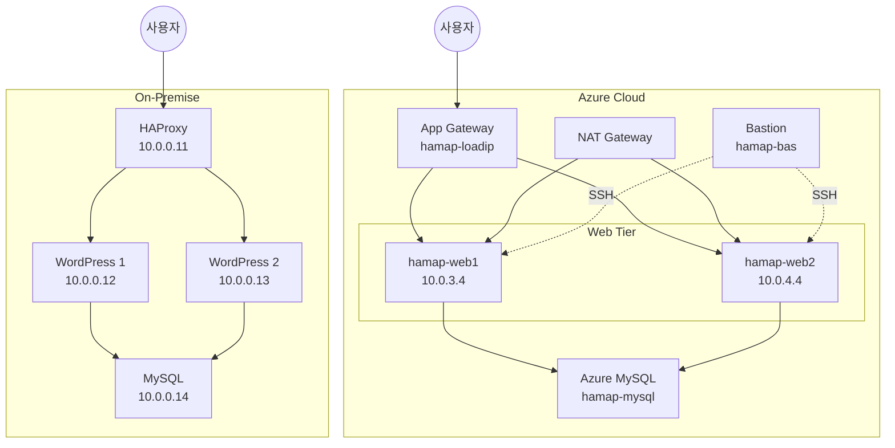
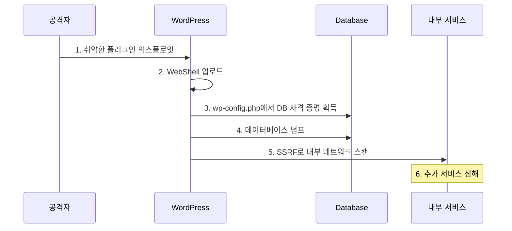

## 1. 개요

Azure 클라우드와 온프레미스 환경에서 **로드밸런서를 활용한 WordPress 고가용성(HA) 인프라**를 구축하는 실습입니다.

### 핵심 구성 요소
- **로드밸런싱**: Azure App Gateway / HAProxy를 통한 트래픽 분산
- **웹 서버 이중화**: 단일 장애점(SPOF) 제거
- **관리형 DB 연동**: Azure Database for MySQL

### 아키텍처 구성

| 계층 | Azure | On-Premise |
|------|-------|------------|
| **LB** (로드밸런서) | Application Gateway | HAProxy |
| **Tier 1** (Web+App) | VM (Apache + PHP) x2 | Rocky Linux x2 |
| **Tier 2** (DB) | Azure Database for MySQL | MySQL 8.0 |



---

## 2. Azure 인프라 구축

### 2.1. 리소스 그룹 및 네트워크

```bash
# 리소스 그룹
az group create -n 04-hamap -l koreacentral

# VNet 및 서브넷
VNet: hamap-vnet (10.0.0.0/16)
├── hamap-bas   (10.0.0.0/24)  - Bastion Host
├── hamap-nat   (10.0.1.0/24)  - NAT Gateway
├── hamap-load  (10.0.2.0/24)  - App Gateway
├── hamap-web1  (10.0.3.0/24)  - Web Server 1 (Private)
├── hamap-web2  (10.0.4.0/24)  - Web Server 2 (Private)
└── hamap-db    (10.0.5.0/24)  - Database (Private)
```

### 2.2. NAT Gateway 설정

Private 서브넷의 아웃바운드 인터넷 접근을 위해 NAT Gateway를 구성합니다.

```bash
# NAT Gateway 생성
az network nat gateway create \
  -g 04-hamap \
  -n hamap-natgw \
  --public-ip-addresses hamap-natip

# 서브넷에 NAT Gateway 연결
az network vnet subnet update \
  -g 04-hamap \
  --vnet-name hamap-vnet \
  -n hamap-web1 \
  --nat-gateway hamap-natgw
```

### 2.3. Bastion Host

```bash
# Bastion VM (cloud-init)
#! /bin/bash
setenforce 0
grubby --update-kernel ALL --args selinux=0
dnf install -y lynx mysql
```

SSH 키를 Bastion에 업로드하여 Private 서브넷 VM에 접근:

```bash
# Windows → Bastion
scp .ssh\id_rsa hamap@<bastion-ip>:/home/hamap/.ssh/
ssh hamap@<bastion-ip>

# Bastion → Web Server
chmod 600 .ssh/id_rsa
ssh hamap@10.0.3.4
```

### 2.4. Azure Database for MySQL

```bash
# Azure Portal에서 생성
# - 유연한 서버 (Flexible Server)
# - 스토리지 자동 증가: OFF
# - 백업 보존: 1일
# - Private Access: hamap-vnet / hamap-db

# 서버 매개 변수 수정
require_secure_transport = OFF

# 데이터베이스 생성
# - wordpress
```

### 2.5. Web Server (WordPress)

```bash
#! /bin/bash
setenforce 0
grubby --update-kernel ALL --args selinux=0

# 패키지 설치
dnf install -y wget httpd php php-gd php-opcache php-mysqlnd

# WordPress 다운로드 및 설치
wget https://ko.wordpress.org/wordpress-6.8.3-ko_KR.tar.gz
tar xvfz wordpress-6.8.3-ko_KR.tar.gz
cp -ar wordpress/* /var/www/html

# Apache 설정
sed -i 's/DirectoryIndex index.html/DirectoryIndex index.php/g' /etc/httpd/conf/httpd.conf

# WordPress 설정
cp /var/www/html/wp-config-sample.php /var/www/html/wp-config.php
sed -i 's/database_name_here/wordpress/g' /var/www/html/wp-config.php
sed -i 's/username_here/hamap/g' /var/www/html/wp-config.php
sed -i 's/password_here/It12345!/g' /var/www/html/wp-config.php
sed -i 's/localhost/hamap-mysql.mysql.database.azure.com/g' /var/www/html/wp-config.php

# Health Check 용
echo $HOSTNAME > /var/www/html/health.html

systemctl enable --now httpd
```

### 2.6. Application Gateway

Azure Portal에서 Application Gateway 생성:

| 항목 | 설정 |
|------|------|
| 자동 크기 조정 | 아니요 |
| VNet/서브넷 | hamap-vnet / hamap-load |
| 프런트엔드 IP | hamap-loadip (Public) |
| 백엔드 풀 | hamap-back (web1, web2) |
| 라우팅 규칙 | hamap-rule (Priority 10) |

### 2.7. DNS 설정 (Azure DNS)

```bash
# DNS Zone: hamap.shop
# 레코드 추가
@    A    <App Gateway Public IP>
www  A    <App Gateway Public IP>

# 가비아 네임서버 설정
ns1-06.azure-dns.com
ns2-06.azure-dns.net
```

---

## 3. On-Premise 인프라 구축

### 3.1. 네트워크 구성

| 호스트 | IP | 역할 |
|--------|-----|------|
| rocky9-1 | 10.0.0.11 | HAProxy (LB) |
| rocky9-2 | 10.0.0.12 | WordPress 1 |
| rocky9-3 | 10.0.0.13 | WordPress 2 |
| rocky9-4 | 10.0.0.14 | MySQL |

### 3.2. MySQL 서버 (rocky9-4)

```bash
#!/bin/bash
dnf install -y mysql-server
firewall-cmd --permanent --add-port=3306/tcp
firewall-cmd --reload
systemctl enable --now mysqld

mysql -uroot -e "
CREATE USER 'root'@'%' IDENTIFIED BY 'It12345!';
GRANT ALL PRIVILEGES ON *.* TO 'root'@'%';
CREATE DATABASE wordpress;
"
```

### 3.3. WordPress 서버 (rocky9-2, rocky9-3)

```bash
#!/bin/bash
dnf install -y wget tar httpd php php-gd php-opcache php-mysqlnd

wget https://ko.wordpress.org/wordpress-6.8.3-ko_KR.tar.gz
tar xvfz wordpress-6.8.3-ko_KR.tar.gz
cp -ar wordpress/* /var/www/html

sed -i 's/DirectoryIndex index.html/DirectoryIndex index.php/g' /etc/httpd/conf/httpd.conf

cp /var/www/html/wp-config-sample.php /var/www/html/wp-config.php
sed -i 's/database_name_here/wordpress/g' /var/www/html/wp-config.php
sed -i 's/username_here/root/g' /var/www/html/wp-config.php
sed -i 's/password_here/It12345!/g' /var/www/html/wp-config.php
sed -i 's/localhost/10.0.0.14/g' /var/www/html/wp-config.php

echo $HOSTNAME > /var/www/html/health.html

systemctl enable --now httpd
firewall-cmd --permanent --add-port=80/tcp
firewall-cmd --reload
```

### 3.4. HAProxy 로드밸런서 (rocky9-1)

```bash
#!/bin/bash
dnf install -y haproxy

# 설정 수정
sed -i 's/5000/80/g' /etc/haproxy/haproxy.cfg
sed -i 's/use_backend static/use_backend app/g' /etc/haproxy/haproxy.cfg
sed -i 's/server  app3/#server  app3/g' /etc/haproxy/haproxy.cfg
sed -i 's/server  app4/#server  app4/g' /etc/haproxy/haproxy.cfg
sed -i 's/127.0.0.1:5001/10.0.0.12:80/g' /etc/haproxy/haproxy.cfg
sed -i 's/127.0.0.1:5002/10.0.0.13:80/g' /etc/haproxy/haproxy.cfg

systemctl enable --now haproxy
firewall-cmd --permanent --add-port=80/tcp
firewall-cmd --reload
```

---

## 4. 검증

### Azure

```bash
# Bastion에서 Web 서버 확인
curl 10.0.3.4/health.html   # hamap-web1
curl 10.0.4.4/health.html   # hamap-web2

# DNS 확인
nslookup hamap.shop

# 브라우저 접속
http://hamap.shop
```

### On-Premise

```bash
# HAProxy 로드밸런싱 확인
curl 10.0.0.11/health.html
# 새로고침 시 rocky9-2, rocky9-3 번갈아 응답
```

---

## 5. 요약

### 구성 비교

| 구성 요소 | Azure | On-Premise |
|----------|-------|------------|
| **로드밸런서** | Application Gateway | HAProxy |
| **웹 서버** | VM x2 (Apache + PHP) | Rocky Linux x2 |
| **데이터베이스** | Azure MySQL (Managed) | MySQL 8.0 |

### 고가용성(HA) 포인트
- **웹 서버 이중화**: 한 서버 장애 시 다른 서버가 트래픽 처리
- **로드밸런서**: 트래픽 분산 및 Health Check
- **관리형 DB**: Azure MySQL의 자동 백업 및 복구

### 장점
- **고가용성**: 단일 장애점(SPOF) 제거
- **확장성**: 웹 서버 수평 확장 가능
- **보안**: Private 서브넷으로 DB 보호

---

## 6. 보안 고려사항

### 주요 보안 위협

| 위협 | 영향 범위 | Azure | On-Premise |
|------|----------|-------|------------|
| **DB 직접 접근** | 데이터 유출 | Private Endpoint 미설정 시 | 방화벽 미설정 시 |
| **WordPress 취약점** | RCE, 데이터 유출 | 플러그인/테마 취약점 | 동일 |
| **SSH 무차별 대입** | 서버 장악 | Public IP 노출 시 | 동일 |
| **SSRF 공격** | 내부 네트워크 정찰 | IMDS 토큰 탈취 가능 | 내부 서비스 접근 |
| **설정 파일 노출** | 자격 증명 유출 | `wp-config.php` 접근 | 동일 |

### 공격 시나리오: WordPress를 통한 침투



### 방어 대책 체크리스트

#### Azure 환경

**🔴 필수**
- [ ] **Private Endpoint**: Azure MySQL에 Private Link만 허용
- [ ] **Bastion 사용**: SSH 접근은 Bastion을 통해서만
- [ ] **NSG 강화**: Web 서버 80/443만 허용

**🟠 권장**
- [ ] **WAF 활성화**: App Gateway에 OWASP 규칙셋 적용
- [ ] **NAT Gateway**: 아웃바운드 IP 고정 및 제한
- [ ] **Key Vault 연동**: 비밀번호/연결 문자열 안전 저장

#### On-Premise 환경

**🔴 필수**
- [ ] **MySQL 접근 제어**: WordPress IP만 3306 허용
- [ ] **방화벽 규칙**: 필요한 포트만 개방

**🟠 권장**
- [ ] **HAProxy 보안**: Stats 페이지 비활성화 또는 인증
- [ ] **SSH 키 인증**: 비밀번호 로그인 비활성화

### 보안 강화 명령어

**Azure: WAF 활성화 (App Gateway)**
```bash
# WAF 정책 생성
az network application-gateway waf-policy create \
    -g 04-hamap -n hamap-waf-policy

# OWASP 3.2 규칙셋 적용
az network application-gateway waf-policy managed-rule rule-set add \
    -g 04-hamap --policy-name hamap-waf-policy \
    --type OWASP --version 3.2
```

**Azure: Key Vault로 비밀번호 관리**
```bash
# Key Vault 생성
az keyvault create -g 04-hamap -n hamap-kv --location koreacentral

# DB 비밀번호 저장
az keyvault secret set --vault-name hamap-kv \
    -n mysql-password --value "SecurePassword123!"

# VM에서 비밀번호 조회 (Managed Identity 필요)
az keyvault secret show --vault-name hamap-kv -n mysql-password --query value -o tsv
```

**On-Premise: MySQL 접근 제어 강화**
```bash
# WordPress 서버 IP만 허용
firewall-cmd --permanent --add-rich-rule='rule family="ipv4" source address="10.0.0.12" port port="3306" protocol="tcp" accept'
firewall-cmd --permanent --add-rich-rule='rule family="ipv4" source address="10.0.0.13" port port="3306" protocol="tcp" accept'
firewall-cmd --permanent --remove-port=3306/tcp  # 기존 any 허용 제거
firewall-cmd --reload
```

**WordPress 보안 설정**
```bash
# wp-config.php 권한 강화
chmod 600 /var/www/html/wp-config.php

# 디렉토리 리스팅 비활성화
echo "Options -Indexes" >> /var/www/html/.htaccess

# XML-RPC 비활성화 (DDoS 방지)
echo "<Files xmlrpc.php>
Require all denied
</Files>" >> /var/www/html/.htaccess
```

### 모니터링 체크리스트

| 항목 | Azure | On-Premise |
|------|-------|------------|
| **접근 로그** | App Gateway 진단 로그 | HAProxy 접근 로그 |
| **DB 감사** | Azure MySQL 감사 로그 | MySQL slow/general 로그 |
| **보안 이벤트** | Azure Defender for Cloud | Fail2ban, auditd |
| **가용성 모니터링** | Azure Monitor | Prometheus + Grafana |

<hr class="short-rule">
