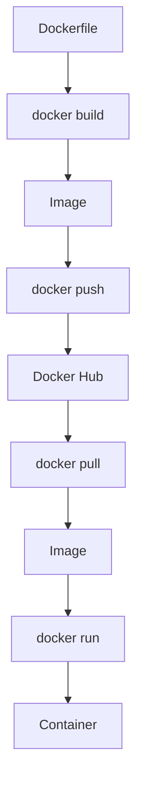

## 1. 개념

**Docker**는 애플리케이션을 컨테이너로 패키징하고 배포하는 플랫폼.

### VM vs Container

| 구분 | VM | Container |
|------|-----|-----------|
| 가상화 | 하드웨어 레벨 | OS 레벨 |
| 부팅 | 분 단위 | 초 단위 |
| 크기 | GB 단위 | MB 단위 |
| 격리 | 완전 격리 | 프로세스 격리 |

### 왜 Docker를 쓰는가?
- **환경 일치**: 개발 = 운영 환경 동일
- **빠른 배포**: 이미지만 pull하면 끝
- **자원 효율**: VM보다 가벼움
- **마이크로서비스**: 서비스별 독립 배포

### 핵심 개념

| 용어 | 설명 |
|------|------|
| Image | 컨테이너 실행에 필요한 읽기 전용 템플릿 |
| Container | Image의 실행 인스턴스 |
| Dockerfile | Image 생성 스크립트 |
| Registry | Image 저장소 (Docker Hub 등) |
| Volume | 데이터 영구 저장 |
| Network | 컨테이너 간 통신 |

### 동작 흐름


---

## 2. 설치 방법

### CentOS / Rocky Linux
```bash
# 저장소 추가
dnf config-manager --add-repo https://download.docker.com/linux/centos/docker-ce.repo

# Docker 설치
dnf install -y docker-ce docker-ce-cli containerd.io

# 서비스 시작
systemctl enable --now docker

# 권한 설정 (sudo 없이 사용)
usermod -aG docker $USER
```

---

## 3. 사용법

### 기본 명령어
```bash
docker pull nginx              # 이미지 다운로드
docker images                  # 이미지 목록
docker run -d -p 8080:80 nginx # 컨테이너 실행
docker ps                      # 실행 중 컨테이너
docker ps -a                   # 전체 컨테이너
docker stop [ID]               # 중지
docker rm [ID]                 # 삭제
```

### 유용한 명령어
```bash
docker exec -it [ID] bash      # 컨테이너 접속
docker logs [ID]               # 로그 확인
docker inspect [ID]            # 상세 정보
docker system prune -a         # 미사용 리소스 정리
```

### IP 확인
```bash
docker inspect -f '{{range .NetworkSettings.Networks}}{{.IPAddress}}{{end}}' [ID]
```

### 컨테이너 라이프사이클
```bash
docker create [image]    # 생성만
docker start [ID]        # 시작
docker restart [ID]      # 재시작
docker pause [ID]        # 일시정지
docker unpause [ID]      # 재개
docker stop [ID]         # 종료 (graceful)
docker kill [ID]         # 강제 종료
```

---

### 이미지 검색 (Search 옵션)
```bash
docker search nginx
docker search nginx --limit 10          # 결과 10개만 출력
docker search --limit 10 --no-trunc nginx # 설명 전체 보기
docker search -f stars=100 nginx        # 별 100개 이상만 검색
docker search -f is-official=true nginx # 공식 이미지만 검색
```

### 로그인 및 배포
```bash
docker login
# Username/Password 입력

docker tag httpd:latest myrepo/httpd:latest
docker push myrepo/httpd:latest
```

### 파일 복사 (CP)
호스트와 컨테이너 간, 또는 컨테이너와 컨테이너(직접은 불가, 호스트 경유) 간 파일을 복사합니다.
```bash
# 호스트 -> 컨테이너
docker cp index.html web1:/usr/local/apache2/htdocs/index.html

# 컨테이너 -> 호스트
docker cp web1:/usr/local/apache2/htdocs/index.html ./index.html
```

---

## 4. 실습: 멀티 포트 웹 서버 배포

하나의 이미지를 사용하여 각기 다른 포트로 여러 웹 서버 컨테이너를 구동하는 실습입니다.

### 다중 컨테이너 실행
```bash
# httpd 이미지 다운로드
docker pull httpd

# 5개의 웹 서버 실행 (포트 60080 ~ 60480)
docker run -itd -p 60080:80 --name h1 httpd
docker run -itd -p 60180:80 --name h2 httpd
docker run -itd -p 60280:80 --name h3 httpd
docker run -itd -p 60380:80 --name h4 httpd
docker run -itd -p 60480:80 --name h5 httpd
```

### 확인 및 접속
```bash
# 실행 상태 확인
docker ps

# 브라우저 접속 테스트
# http://10.0.0.11:60080
# http://10.0.0.11:60180
```

### 일괄 삭제
```bash
# 실행 중인 모든 컨테이너 중지 및 삭제
docker rm -f $(docker ps -aq)
```

---

## 5. 상태 확인 및 라이프사이클 상세

### 라이프사이클 차이점
- **Create vs Run**: `Run` = `Create` + `Start`
- **Stop vs Kill**: `Stop`은 정상 종료(SIGTERM), `Kill`은 강제 종료(SIGKILL)
- **Pause**: CPU 사용을 멈추지만 메모리 상주 (IP 유지)

```bash
docker pause h1     # 일시정지 (IP ping 가능)
docker unpause h1   # 재개
docker inspect h1   # IP 등 상세 정보 확인
```

### 모니터링
```bash
docker stats        # 리소스(CPU/MEM) 실시간 확인
docker top h1       # 컨테이너 내부 프로세스 보기
docker diff h1      # 변경된 파일 목록 보기
```

<hr class="short-rule">
