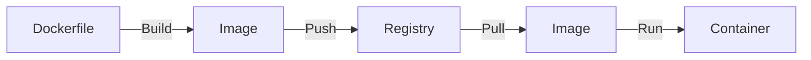

---
layout: post
title: "Docker"
date: 2025-11-24 17:00:00 +0900
categories: [container]
---

## 1. 개요

**Docker**는 애플리케이션을 컨테이너라는 격리된 환경으로 패키징하고 배포하는 플랫폼이다.
운영체제 수준의 가상화를 통해 기존의 가상 머신(VM)보다 훨씬 가볍고 빠르며, "Build Once, Run Anywhere"를 실현하여 개발 환경과 운영 환경의 불일치 문제를 해결해 준다.

### VM vs Container

| 구분 | 가상 머신 (VM) | 도커 컨테이너 (Container) |
|------|----------------|---------------------------|
| **가상화 방식** | 하드웨어 가상화 (Hypervisor) | 운영체제 가상화 (Container Engine) |
| **Guest OS** | 설치 필요 (무거움) | Host OS 공유 (가벼움) |
| **부팅 속도** | 분 단위 | 초 단위 |
| **격리 수준** | 완전한 격리 (높음) | 프로세스 수준 격리 |

### 동작 흐름
Dockerfile을 작성하여 이미지를 빌드하고, 이를 레지스트리에 저장한 뒤 어디서든 내려받아 실행할 수 있다.



---

## 2. 설치 및 기본 사용법

Rocky Linux / CentOS 환경에서 도커를 설치하고 기본적인 라이프사이클을 관리한다.

### 설치 (CentOS/Rocky)
```bash
# 저장소 추가
dnf config-manager --add-repo https://download.docker.com/linux/centos/docker-ce.repo

# 설치 및 실행
dnf install -y docker-ce docker-ce-cli containerd.io
systemctl enable --now docker
```

### 필수 명령어
```bash
# 이미지 검색 및 다운로드
docker search nginx
docker pull nginx

# 컨테이너 실행 (백그라운드, 포트포워딩)
docker run -d -p 8080:80 --name my-web nginx

# 상태 확인
docker ps       # 실행 중인 컨테이너
docker ps -a    # 모든 컨테이너
```

---

## 3. 실습: 멀티 포트 웹 서버 배포

하나의 `httpd` 이미지를 사용하여 서로 다른 포트(60080~60480)를 사용하는 5개의 웹 서버 컨테이너를 구동한다.

### 다중 컨테이너 실행
```bash
# 이미지 준비
docker pull httpd

# 포트를 달리하여 5개 실행
docker run -itd -p 60080:80 --name h1 httpd
docker run -itd -p 60180:80 --name h2 httpd
docker run -itd -p 60280:80 --name h3 httpd
docker run -itd -p 60380:80 --name h4 httpd
docker run -itd -p 60480:80 --name h5 httpd
```

### 접속 테스트
Host IP가 `10.0.0.11`이라면 브라우저에서 `http://10.0.0.11:60080` 등으로 접속하여 확인한다.

### IP 확인
```bash
docker inspect -f '{{range .NetworkSettings.Networks}}{{.IPAddress}}{{end}}' h1
```

---

## 4. 심화: 라이프사이클 및 모니터링

컨테이너의 상태를 정교하게 제어하고 리소스 사용량을 모니터링한다.

### 상태 제어 명령어
*   `docker stop`: 컨테이너에게 종료 신호(SIGTERM)를 보낸다. (정상 종료)
*   `docker kill`: 컨테이너를 강제 종료(SIGKILL)한다.
*   `docker pause`: CPU 사용을 중지시키지만 메모리 상주 상태를 유지한다. (IP 유지)

```bash
docker pause h1
docker unpause h1
```

### 리소스 모니터링
```bash
# 실시간 리소스(CPU, 메모리) 사용량 확인
docker stats

# 컨테이너 내부 프로세스 목록 확인
docker top h1

# 컨테이너 파일시스템 변경 사항 확인
docker diff h1
```

---

## 5. 보안: 컨테이너 Escape와 방어

도커는 VM보다 약한 프로세스 수준의 격리를 사용하므로, 잘못된 설정은 공격자에게 **컨테이너 탈출(Container Escape)**을 통해 호스트 시스템 전체를 장악할 수 있는 기회를 제공한다.

### 위험 1: Privileged 모드

`--privileged` 플래그는 컨테이너에게 호스트의 모든 커널 기능(Capabilities)과 장치 접근을 허용한다. 이는 사실상 **격리가 없는 상태**와 같다.

```bash
# 취약한 실행 예시 (절대 사용 금지)
docker run --privileged -it alpine sh

# 컨테이너 내부에서 호스트 디스크 마운트 (탈출)
fdisk -l
mount /dev/sda1 /mnt
cat /mnt/etc/shadow
```

### 위험 2: Docker Socket 마운트

개발 편의를 위해 `/var/run/docker.sock`을 컨테이너에 마운트하는 경우가 있는데, 이는 공격자가 **새로운 Privileged 컨테이너를 생성**하여 호스트를 완전히 장악할 수 있게 한다.

```bash
# 취약한 실행 예시
docker run -v /var/run/docker.sock:/var/run/docker.sock -it docker:dind sh

# 내부에서 호스트 루트 획득
docker run --privileged -v /:/hostfs -it alpine chroot /hostfs
```

### 위험 3: Capabilities 과다 부여

특정 기능(예: `NET_ADMIN`, `SYS_PTRACE`)을 추가하면 네트워크 조작이나 다른 프로세스 디버깅이 가능해진다.

### 방어 대책

1.  **Privileged 모드 금지**: `--privileged` 사용을 금지하고, 필요한 경우 최소한의 `--cap-add`만 사용한다.
2.  **Docker Socket 비노출**: 컨테이너에 소켓을 마운트하지 않는다. CI/CD에서 필요하다면 별도의 Docker-in-Docker(DinD) 보안 설정을 적용한다.
3.  **Read-Only 파일시스템**: `--read-only` 플래그로 컨테이너 파일시스템 쓰기를 금지한다.
4.  **보안 스캔**: Trivy, Snyk 등의 도구로 이미지 취약점을 빌드 파이프라인에서 스캔한다.

```bash
# 안전한 실행 예시
docker run --read-only --cap-drop=ALL --security-opt=no-new-privileges -it alpine sh
```

<hr class="short-rule">
