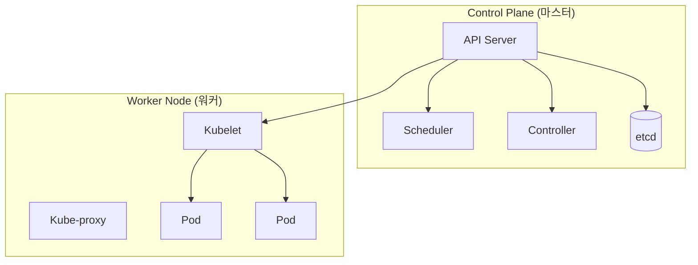

---
layout: post
title: "Kubernetes"
date: 2025-12-05 17:00:00 +0900
categories: [container]
---

## 1. 개요

**Kubernetes (K8s)**는 컨테이너화된 애플리케이션의 배포, 확장, 관리를 자동화하는 오픈소스 시스템이다.
구글이 15년 이상 운영한 Borg 시스템의 노하우를 바탕으로 설계되었으며, CNCF(Cloud Native Computing Foundation)의 대표적인 프로젝트이다. 단순한 컨테이너 런타임이 아닌, 대규모 클러스터 환경에서의 운영 자동화(Orchestration)에 초점을 맞춘다.

### 왜 K8s를 사용하는가?
*   **자동 복구 (Self-healing)**: 컨테이너가 죽거나 노드가 장애를 일으키면 자동으로 재시작하거나 다른 노드로 교체한다.
*   **로드 밸런싱 (Load Balancing)**: 트래픽이 많을 경우 네트워크 트래픽을 분산하여 배포가 안정적으로 이루어지도록 한다.
*   **자동화된 롤아웃과 롤백**: 애플리케이션의 변경 사항을 점진적으로 배포하고, 문제 발생 시 즉시 이전 버전으로 되돌린다.
*   **오토스케일링 (Auto-scaling)**: CPU/메모리 사용량에 따라 Pod의 개수를 자동으로 늘리거나 줄인다.

### 아키텍처
마스터 노드(Control Plane)가 전체 클러스터를 제어하고, 워커 노드(Worker Node)가 실제 애플리케이션(Pod)을 실행하는 구조이다.



---

## 2. 클러스터 설치

실제 프로덕션 환경과 유사하게 `kubeadm`을 사용하여 Rocky Linux 환경에서 클러스터를 구축하는 과정이다.

### 사전 준비 (Master/Node 공통)
Kubernetes는 스왑(Swap) 메모리를 사용하지 않으므로 비활성화해야 하며, 네트워크 브리지 설정을 활성화해야 한다.

```bash
# 1. 스왑 비활성화 (필수)
swapoff -a
sed -i '/swap/d' /etc/fstab

# 2. 커널 모듈 로드
modprobe overlay
modprobe br_netfilter

# 3. 네트워크 설정
cat <<EOF | tee /etc/sysctl.d/k8s.conf
net.bridge.bridge-nf-call-iptables  = 1
net.bridge.bridge-nf-call-ip6tables = 1
net.ipv4.ip_forward                 = 1
EOF
sysctl --system
```

### 컨테이너 런타임 (Containerd) 설치
Docker 대신 Kubernetes 표준 런타임인 containerd를 설치 및 설정한다.

```bash
dnf install -y containerd.io
containerd config default | tee /etc/containerd/config.toml
# SystemdCgroup 활성화 (중요)
sed -i 's/SystemdCgroup = false/SystemdCgroup = true/' /etc/containerd/config.toml
systemctl enable --now containerd
```

### Kubeadm 설치 및 초기화
```bash
# 레포지토리 추가 및 패키지 설치
dnf install -y kubelet kubeadm kubectl --disableexcludes=kubernetes
systemctl enable --now kubelet

# Master 노드 초기화 (Master에서만 실행)
kubeadm init --pod-network-cidr=192.168.0.0/16 --apiserver-advertise-address=10.0.0.11

# kubectl 설정 복사
mkdir -p $HOME/.kube
cp -i /etc/kubernetes/admin.conf $HOME/.kube/config
chown $(id -u):$(id -g) $HOME/.kube/config

# CNI (Calico) 네트워크 플러그인 설치
kubectl apply -f https://docs.projectcalico.org/manifests/calico.yaml
```

### Worker Node 조인
Master 초기화 시 출력된 토큰 명령어를 Worker 노드에서 실행한다.
```bash
kubeadm join 10.0.0.11:6443 --token <token> --discovery-token-ca-cert-hash sha256:<hash>
```

---

## 3. 핵심 사용법 및 오브젝트

### 기본 명령어 (kubectl)
```bash
kubectl get nodes              # 노드 상태 확인
kubectl get pods -A            # 모든 네임스페이스의 Pod 확인
kubectl get services           # 서비스 목록
kubectl get deployments        # 디플로이먼트 목록
kubectl describe pod <name>    # Pod 상세 정보 및 이벤트(트러블슈팅 시 필수)
kubectl logs <name>            # Pod 로그 확인
kubectl exec -it <name> -- /bin/bash  # 컨테이너 내부 접속
```

### 1. Deployment (상태 관리 배포)
Pod의 복제본(Replicas)을 유지하고 배포 이력을 관리한다.

```yaml
# nginx-deployment.yaml
apiVersion: apps/v1
kind: Deployment
metadata:
  name: nginx-deploy
spec:
  replicas: 3               # Pod 3개 유지
  selector:
    matchLabels:
      app: nginx
  template:                 # Pod 템플릿
    metadata:
      labels:
        app: nginx
    spec:
      containers:
      - name: nginx
        image: nginx:latest
        ports:
        - containerPort: 80
```
```bash
kubectl apply -f nginx-deployment.yaml
```

### 2. Service (네트워크 노출)
동적으로 변하는 Pod IP 대신 고정된 진입점(VIP)을 제공한다.

```yaml
# nginx-service.yaml
apiVersion: v1
kind: Service
metadata:
  name: nginx-service
spec:
  selector:
    app: nginx
  ports:
  - port: 80         # 서비스 포트
    targetPort: 80   # 컨테이너 포트
  type: LoadBalancer # 외부 로드밸런서 사용
```

### 3. Ingress (HTTP 라우팅)
외부 HTTP/HTTPS 트래픽을 도메인 기반으로 내부 서비스에 라우팅한다.

```yaml
apiVersion: networking.k8s.io/v1
kind: Ingress
metadata:
  name: example-ingress
spec:
  rules:
  - host: example.com
    http:
      paths:
      - path: /
        pathType: Prefix
        backend:
          service:
            name: nginx-service
            port:
              number: 80
```

---

## 4. Namespace 관리

하나의 물리 클러스터를 논리적으로 나누어 여러 팀이나 환경(Dev, Prod)이 공유할 수 있게 한다.

```bash
# 네임스페이스 생성
kubectl create namespace dev-team

# 특정 네임스페이스에 Pod 실행
kubectl run nginx --image=nginx -n dev-team

# 네임스페이스 내 리소스 조회
kubectl get pods -n dev-team

# 모든 네임스페이스 리소스 조회
kubectl get pods --all-namespaces
```

---

## 5. 실습: 운영 및 트러블슈팅

### 스케일링 (Scaling)
트래픽 증가에 대응하여 Pod 개수를 즉시 늘린다.
```bash
kubectl scale deployment nginx-deploy --replicas=5
kubectl get pods
# 5개의 Pod가 생성되는 것을 확인
```

### 롤링 업데이트 (Rolling Update)
서비스 중단 없이 이미지를 업데이트한다.
```bash
kubectl set image deployment/nginx-deploy nginx=nginx:1.21
# 업데이트 진행 상황 실시간 확인
kubectl rollout status deployment/nginx-deploy
```

### 롤백 (Undo)
문제가 발생했을 때 즉시 이전 버전으로 복구한다.
```bash
kubectl rollout undo deployment/nginx-deploy
```

### 리소스 상태 확인 명령
```bash
kubectl top nodes    # 노드별 CPU/Memory 사용량 (Metrics Server 필요)
kubectl top pods     # Pod별 리소스 사용량
kubectl get events   # 클러스터 내 주요 이벤트 로그 확인
```

---

## 6. 보안: 클러스터 보호

Kubernetes는 잘못 설정된 경우 공격자에게 전체 클러스터를 장악할 수 있는 강력한 권한을 제공할 수 있다.

### 주요 위협

*   **API Server 노출**: 인증 없이 외부에서 API 서버에 접근 가능한 경우 즉시 클러스터 장악
*   **ServiceAccount 토큰 탈취**: Pod 내부에 마운트된 토큰(`/var/run/secrets/kubernetes.io/serviceaccount/token`)을 이용해 API 호출
*   **etcd 평문 저장**: Secret 데이터가 암호화 없이 etcd에 저장되면 백업 유출 시 비밀번호 노출

### 보안 대책

1.  **Pod Security Standards (PSS)**: Privileged Pod 생성을 제한하여 컨테이너 탈출 방지
    ```yaml
    # Namespace에 Restricted 정책 적용
    kubectl label namespace default pod-security.kubernetes.io/enforce=restricted
    ```

2.  **RBAC 최소 권한**: `cluster-admin`은 최소한의 사용자에게만 부여하고, 네임스페이스별로 권한 분리
    ```yaml
    # 특정 네임스페이스에서만 Pod 읽기 권한
    apiVersion: rbac.authorization.k8s.io/v1
    kind: Role
    metadata:
      namespace: dev-team
      name: pod-reader
    rules:
    - apiGroups: [""]
      resources: ["pods"]
      verbs: ["get", "list"]
    ```

3.  **ServiceAccount 토큰 비활성화**: Pod에 불필요한 경우 자동 마운트 비활성화
    ```yaml
    spec:
      automountServiceAccountToken: false
    ```

4.  **etcd 암호화**: Secret 데이터를 암호화하여 저장
    ```yaml
    # /etc/kubernetes/encryption-config.yaml
    apiVersion: apiserver.config.k8s.io/v1
    kind: EncryptionConfiguration
    resources:
      - resources: ["secrets"]
        providers:
          - aescbc:
              keys:
                - name: key1
                  secret: <BASE64_ENCODED_KEY>
    ```

5.  **NetworkPolicy**: Pod 간 통신을 기본 차단하고 필요한 경로만 허용
    ```yaml
    # 기본적으로 모든 Ingress 차단
    apiVersion: networking.k8s.io/v1
    kind: NetworkPolicy
    metadata:
      name: default-deny
    spec:
      podSelector: {}
      policyTypes: ["Ingress"]
    ```

<hr class="short-rule">
