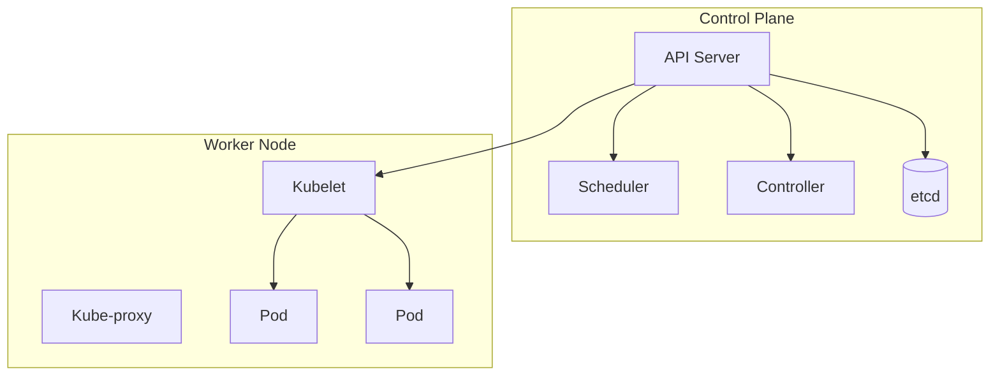

## 1. 개념

**Kubernetes (K8s)**는 컨테이너 오케스트레이션 플랫폼.
- Google이 개발, CNCF가 관리
- Docker 컨테이너를 **배포, 확장, 관리 자동화**
- Docker Compose/Swarm과 비슷하지만 훨씬 강력

### 왜 K8s를 쓰는가?
- **자동 복구**: Pod 장애 시 자동 재생성
- **로드 밸런싱**: 트래픽 자동 분산
- **롤링 업데이트**: 무중단 배포
- **오토스케일링**: 수평 확장 자동화

### 아키텍처


### 핵심 오브젝트

| 오브젝트 | 설명 |
|----------|------|
| Pod | 컨테이너 그룹 (최소 배포 단위) |
| Deployment | Pod 배포 관리 (ReplicaSet 관리) |
| Service | Pod 접근 제공 (로드밸런싱) |
| Ingress | 외부 HTTP 라우팅 |
| ConfigMap | 설정 데이터 저장 |
| Secret | 민감 데이터 저장 |

---

## 2. 클러스터 설치

### Minikube (로컬 테스트용)
```bash
curl -LO https://storage.googleapis.com/minikube/releases/latest/minikube-linux-amd64
sudo install minikube-linux-amd64 /usr/local/bin/minikube
minikube start
```

### kubeadm (프로덕션 환경)
Rocky Linux에서 kubeadm을 이용한 실제 클러스터 구축 방법입니다.

```bash
# 사전 준비 (Master/Node 공통)
swapoff -a
modprobe overlay && modprobe br_netfilter

# Containerd 설치
dnf install -y containerd.io
containerd config default | tee /etc/containerd/config.toml
sed -i 's/SystemdCgroup = false/SystemdCgroup = true/' /etc/containerd/config.toml
systemctl enable --now containerd

# K8s 패키지 설치
dnf install -y kubelet kubeadm kubectl --disableexcludes=kubernetes
systemctl enable kubelet
```

```bash
# Master 초기화
kubeadm init --apiserver-advertise-address=10.0.0.11

mkdir -p $HOME/.kube
cp /etc/kubernetes/admin.conf $HOME/.kube/config

# CNI (Calico) 설치
kubectl apply -f https://docs.projectcalico.org/manifests/calico.yaml
```

```bash
# Node 조인 (Master에서 출력된 토큰 사용)
kubeadm join 10.0.0.11:6443 --token <token> --discovery-token-ca-cert-hash sha256:<hash>
```

---

## 3. 사용법

### kubectl 기본 명령어
```bash
kubectl get nodes              # 노드 목록
kubectl get pods               # Pod 목록
kubectl get services           # Service 목록
kubectl get deployments        # Deployment 목록
kubectl describe pod [name]    # 상세 정보
kubectl logs [pod]             # 로그
kubectl exec -it [pod] -- bash # 접속
```

### Deployment 생성
```yaml
# nginx-deployment.yaml
apiVersion: apps/v1
kind: Deployment
metadata:
  name: nginx-deploy
spec:
  replicas: 3
  selector:
    matchLabels:
      app: nginx
  template:
    metadata:
      labels:
        app: nginx
    spec:
      containers:
      - name: nginx
        image: nginx:latest
        ports:
        - containerPort: 80
```

```bash
kubectl apply -f nginx-deployment.yaml
kubectl get deployments
kubectl get pods
```

### Service 생성
```yaml
# nginx-service.yaml
apiVersion: v1
kind: Service
metadata:
  name: nginx-service
spec:
  selector:
    app: nginx
  ports:
  - port: 80
    targetPort: 80
  type: LoadBalancer
```

```bash
kubectl apply -f nginx-service.yaml
kubectl get services
```

### Ingress
```yaml
# ingress.yaml
apiVersion: networking.k8s.io/v1
kind: Ingress
metadata:
  name: nginx-ingress
spec:
  rules:
  - host: example.com
    http:
      paths:
      - path: /
        pathType: Prefix
        backend:
          service:
            name: nginx-service
            port:
              number: 80
```

---

## 4. Namespace 관리

Namespace는 클러스터 내에서 리소스를 논리적으로 분리하는 단위입니다.

```bash
# Namespace 조회
kubectl get namespaces
kubectl get ns

# Namespace 생성/삭제
kubectl create namespace dev-team
kubectl delete namespace dev-team
```

```yaml
# namespace.yaml
apiVersion: v1
kind: Namespace
metadata:
  name: prod-team
```

```bash
# 특정 Namespace에 Pod 생성
kubectl run nginx --image=nginx -n dev-team
kubectl get pods -n dev-team

# 모든 Namespace의 Pod 조회
kubectl get pods -A
```

---

## 5. 상태 확인

```bash
kubectl cluster-info          # 클러스터 정보
kubectl get all               # 모든 오브젝트
kubectl top nodes             # 노드 리소스
kubectl get events            # 이벤트 로그
```

---

## 5. 실습 예시

### 스케일링
```bash
kubectl scale deployment nginx-deploy --replicas=5
kubectl get pods
```

### 롤링 업데이트
```bash
kubectl set image deployment/nginx-deploy nginx=nginx:1.21
kubectl rollout status deployment/nginx-deploy
kubectl rollout undo deployment/nginx-deploy  # 롤백
```

### 삭제
```bash
kubectl delete -f nginx-deployment.yaml
kubectl delete -f nginx-service.yaml
```

<hr class="short-rule">
