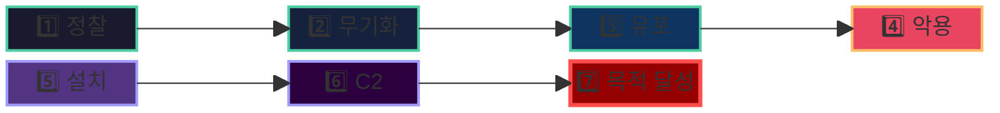

## 목차

- [1. 프로젝트 배경 및 목표](#1-프로젝트-배경-및-목표)
- [2. 분석 프레임워크](#2-분석-프레임워크)
- [3. 공격자 인프라 아키텍처](#3-공격자-인프라-아키텍처)
- [4. 피해자 인프라 아키텍처](#4-피해자-인프라-아키텍처)
- [5. 사용 도구](#5-사용-도구)
- [6. 시나리오 인덱스](#6-시나리오-인덱스)


---

## 1. 프로젝트 배경 및 목표

### 1.1 프로젝트 배경

보안 업계에서 방어를 잘하려면 공격을 이해해야 한다는 말이 있다. 하지만 대부분의 보안 실습은 단편적인 취약점 하나를 익스플로잇하는 수준에 그친다. 실제 APT 공격은 정찰부터 목적 달성까지 연쇄적인 단계를 거치며 진행된다.

본 프로젝트는 이러한 격차를 해소하기 위해 시작되었다. Lockheed Martin의 Cyber Kill Chain 프레임워크를 기반으로 7단계 공격 시나리오를 Azure 클라우드 환경에서 재현한다. 단순히 취약점을 찾는 것이 아닌 공격자의 사고방식으로 전체 침투 과정을 설계하고 실행한다.

### 1.2 프로젝트 목표

본 프로젝트의 핵심 목표는 다음과 같다.

**기술적 목표**
- Cyber Kill Chain 7단계 전 과정을 직접 수행
- 실제 CVE 기반 취약점 익스플로잇 수행
- C2 인프라 구축 및 운영
- 내부 피보팅과 권한 상승 기법 습득

**학습 목표**
- 공격자 관점에서의 보안 이해
- MITRE ATT&CK 프레임워크와의 매핑
- IaC 기반 취약 환경 자동 배포

### 1.3 시나리오 구성

3부작 시나리오를 통해 다양한 공격 경로를 다룬다.

| 시나리오 | 공격 유형 | 핵심 기법 |
|---------|---------|---------|
| 외부 RCE 연쇄 공격 | 외부 RCE | Struts2 / Log4Shell exploitation |
| 자격증명 탈취 및 컨테이너 탈출 | 자격 증명 기반 | 유출된 SSH 키 + Docker 권한 상승 |
| 레거시 서비스 피봇 공격 | 내부 피보팅 | JBoss → Redis CONFIG 악용 |

---

## 2. 분석 프레임워크

### 2.1 사이버 킬 체인

Lockheed Martin이 발표한 Cyber Kill Chain은 APT 공격을 7단계로 분해한다. 각 단계에서 방어가 실패하면 공격자는 다음 단계로 진입한다.



| 단계 | 설명 | 본 프로젝트 적용 |
|-----|-----|----------------|
| **1. 정찰** | 타겟 정보 수집 | 분산 스캐닝 Fleet으로 포트/서비스 식별 |
| **2. 무기화** | 공격 도구 준비 | C2 임플란트 생성 및 익스플로잇 스크립트 작성 |
| **3. 유포** | 페이로드 전달 | HTTP 요청을 통한 악성 페이로드 주입 |
| **4. 악용** | 코드 실행 | RCE 성공 후 리버스 셸 획득 |
| **5. 설치** | 지속성 확보 | Systemd 서비스 등록 및 SSH 키 주입 |
| **6. C2** | 원격 제어 | mTLS 기반 암호화 채널 수립 |
| **7. 목적 달성** | 최종 목표 | 데이터 유출 및 권한 탈취 |

### 2.2 MITRE ATT&CK 매핑

각 시나리오는 MITRE ATT&CK 프레임워크의 Tactic/Technique과 매핑된다.

| Kill Chain | ATT&CK Tactic | 주요 Technique | 적용 시나리오 |
|-----------|---------------|---------------|-------------|
| 정찰 | Reconnaissance | T1595 Active Scanning | 전체 |
| 무기화 | Resource Development | T1587 Develop Capabilities | External RCE Chain |
| 유포 | Initial Access | T1190 Exploit Public-Facing App | External RCE / Legacy Pivot |
| 악용 | Execution | T1059 Command and Scripting | 전체 |
| 설치 | Persistence | T1543 Create System Process | External RCE Chain |
| C2 | Command and Control | T1071 Application Layer Protocol | External RCE Chain |
| 목적 달성 | Exfiltration | T1041 Exfiltration Over C2 | External RCE / Legacy Pivot |

---

## 3. 공격자 인프라 아키텍처

### 3.1 전체 구성

공격자 인프라는 OPSEC을 고려하여 설계되었다. 직접 노출을 최소화하고 탐지 회피를 위한 리다이렉터를 배치했다.

```mermaid
flowchart LR
    subgraph LOCAL [" "]
        K(("🖥️ Kali"))
    end

    subgraph CLOUD ["☁️ Azure"]
        C2["📡 C2 서버"]
        RD["🔀 Redirector"]
        FL["🔍 Scanner Fleet"]
    end

    K -->|SSH| C2
    K -->|SSH| FL
    RD -->|Proxy| C2
    FL -->|Upload| C2

    style K fill:#E34F26,stroke:#fff,color:#fff
    style C2 fill:#5C2D91,stroke:#fff,color:#fff
    style RD fill:#5C2D91,stroke:#fff,color:#fff
    style FL fill:#005BA1,stroke:#fff,color:#fff
    style LOCAL fill:transparent,stroke:#E34F26,stroke-dasharray:5 5
    style CLOUD fill:#1e1e1e,stroke:#0078D4
```



> 🟠 공격자 · 🟣 C2 인프라 · 🔵 정찰 도구

### 3.2 C2 서버

C2 서버는 공격 작전의 중심이다. 페이로드 호스팅부터 세션 관리까지 모든 작업이 이곳에서 이루어진다.

**설치된 도구**

| 도구 | 용도 | 포트 |
|-----|-----|-----|
| Sliver C2 | mTLS 기반 비콘 관리 | - |
| Nginx | 페이로드 호스팅 | 80 |
| Netcat | 리버스 셸 리스너 | 4444/1337 |
| Marshalsec | Log4Shell LDAP 리다이렉터 | 8888 |

**디렉토리 구조**

```
/var/www/html/payloads/  # 페이로드 파일
~/exploits/              # 익스플로잇 스크립트
~/loot/                  # 탈취 데이터
~/loot/scans/            # 분산 스캔 결과
```

### 3.3 Redirector

Redirector는 C2 트래픽을 숨기기 위한 중간 서버다. User-Agent 기반 필터링으로 정상 비콘만 C2로 전달하고 나머지는 정상 사이트로 리다이렉트한다.

```
피해자 → redirect.hamap.shop → [Nginx 필터] → C2 서버
                                    ↓
                        [비정상 요청] → microsoft.com
```

**필터링 정책**
- Sliver 비콘 패턴만 허용
- 잘못된 User-Agent는 Decoy 사이트로 전달
- Let's Encrypt 인증서 적용


### 3.4 Scanner Fleet

단일 IP로 스캔하면 WAF나 IPS에 의해 차단될 가능성이 높다. 이를 회피하기 위해 분산 스캐닝이 필수적이다.

**설계 배경**

본 프로젝트에서는 당초 업계 표준인 **Axiom 분산 프레임워크**를 사용하려 했다. Axiom은 클라우드에 일회용 공격 인스턴스를 자동 배포하고, 스캔/공격을 분산 실행한 뒤 자동 삭제하는 도구로, 레드팀 오퍼레이션에서 널리 활용된다.

```bash
# [Plan A] Axiom 사용 시나리오
axiom-fleet scanner -i 20                              # Fleet 20대 생성
axiom-scan target.txt -m nmap -oA scan --top-ports 100 # 분산 스캔
axiom-rm "scanner*" -f                                 # Fleet 삭제
```

그러나 실습 환경인 **Azure Student Subscription**의 권한 정책으로 인해 Axiom이 요구하는 리소스 생성이 제한되었다. 이에 대안으로 **Terraform + 커스텀 스크립트** 기반의 Custom Distributed Scanner Fleet을 직접 구축했다.

| 항목 | 값 |
|-----|---|
| 유형 | Azure VMSS (Custom Linux Fleet) |
| 권장 VM 수 | 20개 |
| VM 크기 | Standard_B1ls |
| 설치 도구 | nmap (분산 스캐닝) |

**사용법**

```bash
# 1. Fleet 상태 확인
fleet list

# 2. 분산 포트 스캔
# 20대의 스캐너가 포트 범위를 자동으로 N등분하여 스캔
fleet scan_port <TARGET_IP> <PORTS>

# 3. 결과 수집
fleet collect
```

---

## 4. 피해자 인프라 아키텍처

### 4.1 설계 철학

피해자 인프라는 의도적으로 취약하게 설계되었다. 실제 기업 환경에서 흔히 발견되는 구성 오류와 레거시 서비스를 재현했다.

**의도적 취약점**
- 패치되지 않은 웹 애플리케이션
- 인증 없는 내부 서비스
- 과도한 권한 설정
- 유출 가능한 자격 증명

### 4.2 네트워크 구성

3-Subnet 네트워크 구조(2-Tier 애플리케이션)로 구성했지만 NSG 규칙만으로 격리하여 피보팅 가능성을 열어두었다.

```mermaid
flowchart TB
    I(("🌐")) --> LB
    I -.->|SSH| B

    subgraph VNET ["Azure VNet"]
        B["🛂 Bastion"]
        LB["⚖️ LB"]
        W["🖥️ Web"]
        D[("🗄️ DB")]
    end

    LB --> W
    W --> D
    B --> W & D

    style I fill:#333,stroke:#fff,color:#fff
    style B fill:#D99362,stroke:#fff,color:#fff
    style LB fill:#333,stroke:#fff,color:#fff
    style W fill:#005BA1,stroke:#fff,color:#fff
    style D fill:#5C2D91,stroke:#fff,color:#fff
    style VNET fill:#1e1e1e,stroke:#0078D4
```



> 🟠 관리망 (Public) · 🔵 서비스망 (DMZ) · 🟣 내부망 (Private)

**서브넷 용도**

| 서브넷 | CIDR | 용도 | 배치 서비스 |
|-------|------|-----|-----------|
| Public | 10.42.1.0/24 | 관리 접근 | Bastion VM |
| DMZ | 10.42.2.0/24 | 웹 서비스 | Web VMSS + 취약 컨테이너 |
| Private | 10.42.3.0/24 | 데이터 저장 | DB 서버 + Redis |

### 4.3 취약 서비스 매핑

배포된 취약 서비스와 적용된 표준의 매핑이다.

| 포트/경로 | 취약점 | OWASP | 주통기 | 시나리오 |
|---------|-------|-------|-------|--------|
| 8081 | CVE-2017-5638 Struts2 RCE | A05 | 웹-01 | External RCE Chain |
| 8082 | CVE-2017-12149 JBoss RCE | A08 | 웹-01 | Legacy Service Pivot |
| 8083 | CVE-2021-44228 Log4Shell | A05 | 웹-01 | External RCE Chain |
| 5000 | Command Injection | A05 | 웹-04 | External RCE Chain |
| 6379 | Redis No Auth | A02 | D-19 | Legacy Service Pivot |
| 3306 | MySQL 약한 자격 증명 | A07 | D-01 | External RCE / Legacy Pivot |
| 22 | SSH 키 유출 + Docker PrivEsc | A02 | U-01 | Credential Abuse |
| /login/ | SQL Injection | A05 | 웹-05 | External RCE Chain |
| /search.php | 반사형 XSS | A05 | 웹-11 | External RCE Chain |
| /guestbook.php | 저장형 XSS | A05 | 웹-11 | External RCE Chain |
| /xss_dom.html | DOM XSS | A05 | 웹-11 | External RCE Chain |
| /admin/settings.php | CSRF | A01 | 웹-15 | External RCE Chain |
| /api/fetch.php | SSRF | A01 | 웹-21 | External RCE Chain |
| /backup/*.sql | 정보 노출 | A02 | 웹-09 | External RCE Chain |

---

## 5. 사용 도구

각 Kill Chain 단계에서 사용하는 도구와 선정 이유다.

### 5.1 정찰 도구

| 도구 | 용도 | 선정 이유 |
|-----|-----|---------|
| nmap | 포트 스캔 및 서비스 핑거프린팅 | 업계 표준 |
| gobuster | 웹 디렉터리 열거 | 숨겨진 경로 발견 |

### 5.2 무기화 및 유포 도구

| 도구 | 용도 | 선정 이유 |
|-----|-----|---------|
| msfvenom | 리버스 셸 페이로드 생성 | 다양한 형식 지원 |
| ysoserial | Java 역직렬화 페이로드 | JBoss/WebLogic 공격 |
| Sliver C2 | mTLS 임플란트 생성 | 탐지 회피 능력 |
| curl | HTTP 익스플로잇 전송 | 단순하고 직관적 |

### 5.3 C2 및 후속 공격 도구

| 도구 | 용도 | 선정 이유 |
|-----|-----|---------|
| Sliver | 비콘 관리 및 세션 제어 | 오픈소스 C2 프레임워크 |
| Netcat | 단순 리버스 셸 | 빠른 연결 확인 |
| redis-cli | Redis CONFIG SET 악용 | 피보팅용 |
| mysql | 데이터 덤프 | 최종 목표 달성 |

---

## 6. 시나리오 인덱스

| 시나리오 | 제목 | 공격 벡터 | 최종 목표 |
|--------|-----|---------|---------|
| [CKC-External-RCE-Chain](./2025-12-28-CKC-External-RCE-Chain.html) | 외부 RCE 연쇄 공격 | Struts2 / Log4Shell | DB 데이터 유출 |
| [CKC-Credential-Abuse](./2025-12-29-CKC-Credential-Abuse.html) | 자격증명 탈취 및 컨테이너 탈출 | 유출 키 + Docker PrivEsc | 내부망 전체 장악 |
| [CKC-Legacy-Service-Pivot](./2025-12-30-CKC-Legacy-Service-Pivot.html) | 레거시 서비스 피봇 공격 | JBoss RCE → Redis 악용 | DB 서버 Root 탈취 |
