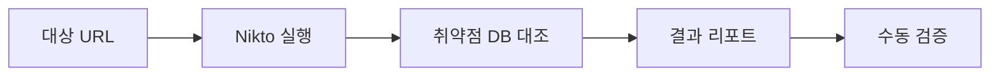

## 1. 개요

**Nikto**는 웹 서버의 다양한 보안 취약점을 자동으로 점검해 주는 오픈소스 스캐너이다.
오래된 서버 소프트웨어 버전, 잠재적인 위험 파일(CGI), 잘못된 설정(Misconfiguration) 등 6,700개 이상의 항목을 검사하여 관리자가 놓치기 쉬운 보안 구멍을 찾아낸다.
본 글에서는 Nikto의 기본 사용법과 SSL 스캔, 그리고 보안 장비(IDS/WAF)를 우회하기 위한 Evasion 옵션 활용법을 다룬다.

---

## 2. 스캔 워크플로우



---

## 3. 실습 환경

### DVWA (Docker)
```bash
docker run -d -p 80:80 vulnerables/web-dvwa
# http://localhost 웹 서버 스캔 실습
```

### Metasploitable 2
```bash
# 구버전 Apache/PHP 취약점 스캔 (OSINT)
# http://192.168.56.101
```

### OWASP WebGoat
```bash
docker run -d -p 8080:8080 webgoat/webgoat
# HTTPS 스캔 테스트 (-ssl 옵션)
```

---

## 4. 사용법

기본적인 구문은 다음과 같다.

```bash
nikto -h [Target IP or Domain] [옵션]
```

### 주요 옵션
*   **-h (host)**: 대상 호스트 지정
*   **-p (port)**: 포트 지정 (기본값: 80)
*   **-ssl**: HTTPS 프로토콜 강제 사용
*   **-T (Tuning)**: 스캔 유형 선택 (예: `2`=설정오류, `9`=SQL Injection 등)
*   **-o (output)**: 결과 저장 파일 지정 (예: `-o scan_result.html`)

---

## 5. 실습: 기본 스캔

대상 서버(`192.9.200.11`)의 80번 포트를 스캔한다.

```bash
nikto -h 192.9.200.11 -p 80
```


### 결과 분석
*   **Server**: 웹 서버의 종류와 버전을 알려준다. 구버전(`Apache/2.4.XX`)일 경우 CVE 취약점을 검색해 볼 수 있다.
*   **Missing Headers**: `X-Frame-Options` 등 보안 헤더 부재를 알려준다.
*   **Allowed HTTP Methods**: `PUT`이나 `DELETE` 메소드가 허용되어 있다면 파일 업로드 공격 가능성이 있다.
*   **/icons/README**: 불필요한 기본 파일이 남아있어 서버 정보를 유추할 수 있다.

---

## 6. 심화 실습: SSL 및 우회

### SSL/TLS 스캔
HTTPS 사이트는 `-ssl` 옵션을 추가하여 인증서 정보와 암호화 설정 취약점(Heartbleed, POODLE 등)을 점검할 수 있다.

```bash
nikto -h 192.9.200.11 -p 443 -ssl
```


### IDS/WAF 우회
침입 탐지 시스템(IDS)이 Nikto의 스캔 패턴을 차단할 경우, `-evasion` 옵션으로 패킷을 변조하여 우회를 시도할 수 있다.

```bash
nikto -h 192.9.200.11 -evasion 1
```

*   **1 (Random URI encoding)**: URI를 랜덤하게 인코딩 (예: `/admin` -> `/%61dmin`)
*   **2 (Self-reference /./)**: 경로에 의미 없는 `/./` 삽입
*   **B (Fake headers)**: 무작위 헤더 추가

---

## 7. 방어 대책

*   **불필요한 파일 제거**: 설치 시 생성된 매뉴얼, 예제 파일, 기본 스크립트 등을 모두 삭제한다.
*   **HTTP 메소드 제한**: `GET`, `POST` 외에 불필요한 메소드(`PUT`, `DELETE`, `TRACE`)를 비활성화한다.
*   **보안 헤더 적용**: `X-Frame-Options`, `X-XSS-Protection`, `Content-Security-Policy` 등을 웹 서버 설정에 추가한다.
*   **배너 정보 숨기기**: `ServerTokens Prod` (Apache) 등의 설정으로 서버 버전 정보 노출을 최소화한다.

<hr class="short-rule">