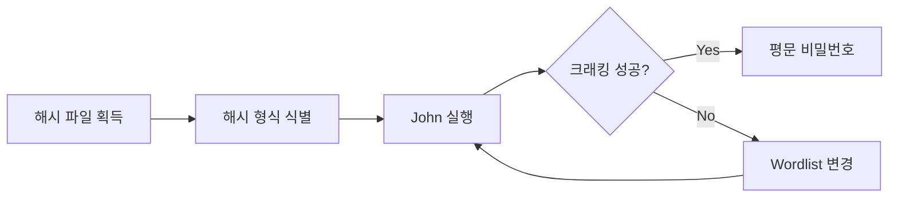

## 1. 개요

**John the Ripper (JtR)**은 탈취한 패스워드 해시 파일을 오프라인 상태에서 크래킹하는 가장 강력한 오픈소스 도구이다.
리눅스 Shadow 파일부터 Windows NTLM, Kerberos, 그리고 암호화된 ZIP/PDF 문서까지 수백 가지 포맷을 지원하며, 사전 공격(Dictionary Attack)과 무차별 대입(Brute-Force)을 결합하여 원본 비밀번호를 복원해 낸다.
본 글에서는 리눅스 계정 정보를 담고 있는 Shadow 파일을 크래킹하는 과정과 암호화된 압축 파일을 복호화하는 실습을 다룬다.

---

## 2. 크래킹 흐름



---

## 3. 기본 사용법

기본적인 실행 구문은 다음과 같다.

```bash
john [옵션] [해시 파일]
```

### 주요 옵션
*   **--wordlist=[file]**: 공격에 사용할 사전(Wordlist) 파일을 지정한다. (가장 많이 사용됨)
*   **--format=[format]**: 해시 알고리즘을 수동으로 지정한다. (자동 탐지 실패 시 사용)
*   **--show**: 이미 크랙에 성공하여 `john.pot` 파일에 저장된 비밀번호를 출력한다.
*   **--rules**: 사전 파일의 단어를 변형(대소문자, 숫자 추가 등)하여 대입하는 규칙을 적용한다.

*   **--rules**: 사전 파일의 단어를 변형(대소문자, 숫자 추가 등)하여 대입하는 규칙을 적용한다.

---

## 4. 실습 환경

### 로컬 해시 생성 실습
```bash
# 테스트용 MD5 해시 생성 (password123)
echo -n 'password123' | openssl md5
# hello:5d41402abc4b2a76b9719d911017c592 > hash.txt
```

### 암호화된 Zip 파일 생성
```bash
# 실습용 잠긴 zip 파일 만들기
touch secret.txt
zip --password "secret123" protected.zip secret.txt
```

---

## 5. 공격 실습: Linux Shadow 파일

리눅스 시스템은 계정 정보를 `/etc/passwd`에, 암호화된 비밀번호 해시를 `/etc/shadow`에 분리하여 저장한다. 크래킹을 위해서는 이 두 파일을 하나로 합쳐야 한다.

### 1단계: Unshadow (파일 병합)
`unshadow` 유틸리티를 사용하여 `passwd`와 `shadow` 파일을 결합한다.

```bash
unshadow /etc/passwd /etc/shadow > passwords.txt
```

### 2단계: 크래킹 실행
합쳐진 파일을 대상으로 `rockyou.txt` 사전을 이용하여 공격을 수행한다.

```bash
john --wordlist=/usr/share/wordlists/rockyou.txt passwords.txt
```


공격이 성공하면 터미널에 평문 비밀번호가 출력된다.

---

## 6. 공격 실습: 압축 파일

암호가 걸린 Zip 파일도 해시로 변환하여 JtR로 크랙할 수 있다.

### 1단계: 해시 추출
Zip 파일을 JtR이 이해할 수 있는 해시 포맷으로 변환한다.

```bash
zip2john protected.zip > zip.hash
```

이 외에도 `pdf2john`, `ssh2john` 등 다양한 변환 도구(`*2john`)가 제공된다.

### 2단계: 크래킹 실행
```bash
john --wordlist=/usr/share/wordlists/rockyou.txt zip.hash
```

---

## 7. 공격 실습: 단일 해시

`sqlmap` 등을 통해 획득한 단일 MD5 해시값을 크래킹하는 방법이다.

```bash
# 해시값을 파일로 저장
echo "5f4dcc3b5aa765d61d8327deb882cf99" > hash.txt

# 크래킹 실행
john --wordlist=/usr/share/wordlists/rockyou.txt hash.txt
```


---

## 8. 보안 대책

*   **강력한 비밀번호 정책**: 단순한 사전 공격에 뚫리지 않도록 충분한 길이와 특수문자, 대소문자를 포함한 복잡한 비밀번호를 강제한다.
*   **솔트(Salt) 적용**: 비밀번호 해시 생성 시 랜덤한 솔트 값을 추가하여 레인보우 테이블 공격을 무력화한다. (현대 리눅스는 SHA-512 with Salt를 기본으로 사용한다.)
*   **고비용 해시 알고리즘**: bcrypt, Argon2와 같이 연산 속도가 느린 알고리즘을 사용하여 크래킹에 소요되는 시간을 기하급수적으로 늘린다.
*   **Shadow 파일 접근 제어**: `/etc/shadow` 파일은 `root` 권한으로만 읽을 수 있도록(`600` 또는 `640`) 엄격하게 관리한다.

<hr class="short-rule">