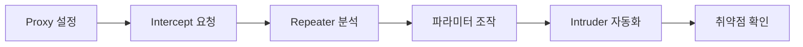

## 1. 개요

**Burp Suite**는 웹 브라우저와 서버 사이의 모든 통신을 가로채고 조작할 수 있는 가장 강력한 웹 프록시 도구이다.
웹 애플리케이션 취약점 진단 시 **중간자(Man-in-the-Middle) 공격** 원리를 이용하여 HTTP 패킷을 변조하거나 분석하는 데 필수적으로 사용된다.
본 글에서는 Burp Suite의 기본 프록시 설정 방법과 핵심 도구인 Proxy, Repeater, Intruder를 활용한 실무적인 공격 기법을 다룬다.

---

## 2. 테스트 워크플로우



---

## 3. 실습 환경

### DVWA (Docker)
```bash
docker run -d -p 80:80 vulnerables/web-dvwa
# http://localhost 접속 후 Burp Proxy 설정
```

### OWASP WebGoat
```bash
docker run -d -p 8080:8080 webgoat/webgoat
# SQL Injection, XSS 등 다양한 취약점 실습
```

### PortSwigger Web Security Academy
온라인 무료 랩 환경으로 Burp Suite와 직접 연동하여 실습할 수 있다.
- https://portswigger.net/web-security

---

## 4. 설치 및 설정

Burp Suite를 사용하려면 브라우저의 트래픽이 프록시 서버(`127.0.0.1:8080`)를 통과하도록 설정해야 한다.

1.  **Burp Suite 실행**: `Proxy` 탭의 `Intercept` 화면에서 `Intercept is on` 상태를 확인한다.
2.  **브라우저 설정**: 웹 브라우저(Firefox, Chrome 등) 설정에서 프록시 서버를 `127.0.0.1`, 포트를 `8080`으로 설정한다. (FoxyProxy와 같은 확장 기능을 사용하면 편리하다.)
3.  **CA 인증서 설치 (HTTPS)**: 암호화된 HTTPS 트래픽을 분석하려면 Burp Suite의 CA 인증서를 브라우저에 신뢰할 수 있는 기관으로 등록해야 한다. 브라우저 주소창에 `http://burpsuite`를 입력하여 인증서를 다운로드 및 설치한다.

---

## 5. 실습: Proxy (패킷 변조)

**Proxy** 기능은 모든 트래픽을 확인하고 제어하는 관문이다.

1.  `Intercept is on` 상태에서 웹 페이지에 접속한다.
2.  브라우저의 요청이 서버로 전송되기 전에 Burp Suite에 멈춰 있는 것을 확인한다.
3.  **Forward**: 요청을 서버로 전송한다.
4.  **Drop**: 요청을 전송하지 않고 버린다.


이 단계에서 파라미터 값을 직접 수정한 뒤 `Forward`를 누르면 변조된 데이터가 서버로 전송된다.

---

## 6. 실습: Repeater (반복 전송)

**Repeater**는 가로챈 요청을 수동으로 수정하고 반복적으로 재전송할 수 있는 도구이다. SQL Injection이나 권한 우회 취약점을 테스트할 때 유용하다.

1.  Proxy 탭에서 가로챈 요청을 우클릭하여 `Send to Repeater`(`Ctrl+R`)를 선택한다.
2.  Repeater 탭으로 이동하여 파라미터 값(예: `id=1`)을 변경한다.
3.  `Send` 버튼을 눌러 서버의 응답을 확인한다.


---

## 7. 실습: Intruder (자동화 공격)

**Intruder**는 요청의 특정 위치에 페이로드를 자동으로 주입하여 무차별 대입(Brute-Force) 공격을 수행하는 도구이다.

1.  공격할 요청을 `Send to Intruder`(`Ctrl+I`)로 보낸다.
2.  **Positions**: 공격할 파라미터 값 양쪽에 `§` 기호를 추가하여 위치를 지정한다. (예: `password=§1234§`)
3.  **Payloads**: 사용할 사전 파일이나 규칙을 설정한다.
4.  **Start Attack**: 공격을 시작하고 응답 길이(Length)나 상태 코드의 변화를 분석하여 성공적인 페이로드를 식별한다.


---

## 8. 추가 도구

Burp Suite Pro에는 자동 취약점 스캔, 인코딩 처리, 응답 비교 등 추가 도구가 포함되어 있다. Community Edition에서도 일부 기능을 사용할 수 있다.

### Scanner (Pro)
웹 애플리케이션을 자동으로 크롤링하고 SQL Injection, XSS 등 일반적인 취약점을 탐지한다.
*   **Passive Scan**: Proxy를 통과하는 트래픽을 실시간으로 분석하여 잠재적 취약점을 식별한다. (기본 활성화)
*   **Active Scan**: 선택한 요청에 페이로드를 주입하여 적극적으로 취약점을 탐색한다. (명시적 실행 필요)

### Decoder
다양한 인코딩/디코딩 작업을 수행한다. CTF나 실전에서 Base64, URL 인코딩, HTML 엔티티 등을 빠르게 변환할 때 유용하다.
*   **지원 형식**: Base64, URL, HTML, Hex, Gzip, ASCII Hex 등
*   **해시 생성**: MD5, SHA-1, SHA-256 등의 해시값 계산 가능

### Comparer
두 요청 또는 응답의 차이점을 시각적으로 비교한다. 권한 우회 테스트 시 관리자 응답과 일반 사용자 응답의 차이를 분석하는 데 활용한다.

### Collaborator (Pro)
Out-of-Band (OOB) 취약점 탐지 도구이다. 서버가 외부로 요청을 보내는지 확인하여 Blind SSRF, XXE 등을 탐지한다.

---

## 9. 방어 대책

### 탐지 방법
*   **WAF 로그**: 비정상적인 파라미터 조작 패턴 탐지
*   **Rate Limiting**: 동일 세션에서 과도한 요청 차단
*   **입력 검증 로그**: 서버 측에서 변조된 요청 기록

### 방어 방법
*   **입력 값 검증**: 서버 측에서 모든 파라미터 화이트리스트 검증
*   **CSRF 토큰**: 요청 위조 방지
*   **Rate Limiting**: 무차별 대입 공격 차단
*   **WAF 적용**: ModSecurity, Cloudflare WAF

<hr class="short-rule">