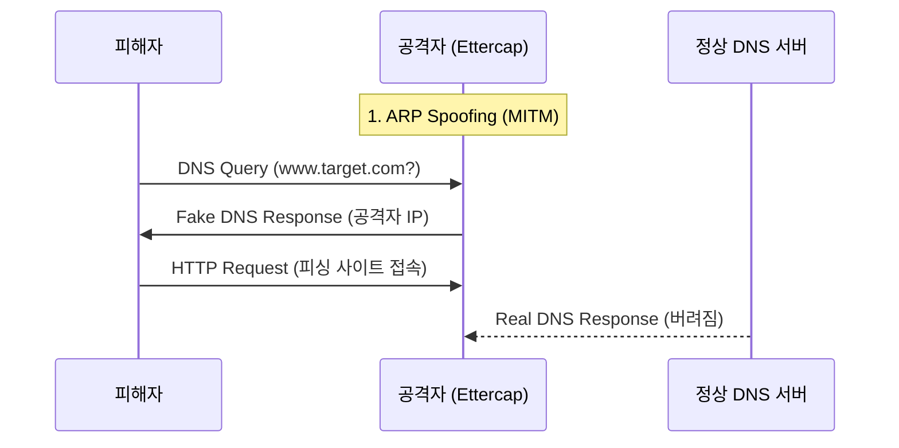

---
layout: post
title: "Ettercap"
date: 2025-11-07 18:00:00 +0900
categories: [hacking-tools]
---

## 1. 개요

**Ettercap**은 LAN 환경에서 **중간자 공격(Man-In-The-Middle, MITM)**을 수행하는 대표적인 도구이다.
ARP Spoofing 공격을 통해 피해자와 게이트웨이 사이의 통신을 가로채고, 이를 바탕으로 패킷 도감청(Sniffing), DNS 변조(Spoofing), SSL Strip 등 다양한 공격을 수행할 수 있다.
본 글에서는 Ettercap을 사용하여 피해자를 가짜 웹사이트로 유도하는 DNS Spoofing 공격을 실습한다.

---

## 2. DNS Spoofing 원리

공격자는 ARP Spoofing을 통해 피해자의 트래픽이 자신을 거쳐가도록 만든다. 그 후 피해자가 특정 도메인(예: `hamap.local`)에 대한 DNS 쿼리를 보낼 때, 실제 DNS 서버보다 먼저 조작된 IP 주소를 담은 응답 패킷을 보낸다.



---

## 3. 실습 환경

### VirtualBox/VMware 내부 네트워크
ARP Spoofing은 동일 로컬 네트워크(L2) 내에서만 작동하므로, VM을 Host-Only나 Internal Network로 구성해야 한다.
*   **공격자 (Kali)**: `10.0.0.32`
*   **피해자 (Windows)**: `10.0.0.101`
*   **DNS 서버 / 게이트웨이**: `10.0.0.11`

### 가짜 웹 서버 (Apache)
공격자 PC에서 Apache를 실행하여 피해자를 유도할 가짜 페이지를 구성한다.
```bash
sudo systemctl start apache2
# /var/www/html/index.html 수정
```

---

## 4. 사전 준비

### 환경 구성
*   **공격자 (Kali)**: `10.0.0.32` (Apache 웹 서버 실행 중)
*   **피해자 (Windows)**: `10.0.0.101`
*   **DNS 서버**: `10.0.0.11` (정상적인 도메인 질의 처리)

### Ettercap 설정
DNS Spoofing을 위해 설정 파일(`etter.dns`)에 변조할 도메인 규칙을 추가한다.

```bash
vi /etc/ettercap/etter.dns

# 파일 끝에 추가 (모든 hamap.local 요청을 공격자 IP로 연결)
*.hamap.local   A   10.0.0.32
```

---

## 5. 공격 실습: DNS Spoofing

Ettercap의 GUI 모드를 사용하여 공격을 수행한다.

1.  **실행**: `ettercap -G` 명령으로 그래픽 인터페이스를 실행한다.
2.  **Target 설정**:
    *   Host List를 스캔하고 피해자 IP(`10.0.0.101`)를 **Target 1**에, 게이트웨이 또는 DNS 서버 IP(`10.0.0.11`)를 **Target 2**에 등록한다.
3.  **ARP Poisoning**: `MITM Menu` -> `ARP poisoning`을 선택하여 패킷 가로채기를 시작한다.
4.  **플러그인 활성화**: `Plugins` -> `Manage plugins`에서 `dns_spoof`를 찾아 더블클릭하여 활성화한다.

### 결과 확인
피해자 PC에서 `nslookup` 명령을 실행하거나 브라우저로 접속해 본다.
```cmd
nslookup hamap.local
```
응답 IP가 공격자 IP(`10.0.0.32`)로 나타난다면 공격에 성공한 것이다. 피해자는 정상적인 주소를 입력했지만 실제로는 가짜 가짜 웹사이트로 연결된다.

---

## 6. 방어 방법

*   **정적 ARP 테이블 (Static ARP)**: 주요 서버나 게이트웨이의 MAC 주소를 수동으로 고정하여 ARP Spoofing을 차단한다.
    ```cmd
    arp -s [IP주소] [MAC주소]
    ```
*   **ARP 보안 기능**: 네트워크 스위치에서 **DAI (Dynamic ARP Inspection)** 기능을 활성화하여 위조된 ARP 패킷을 차단한다.
*   **DNSSEC**: DNS 응답에 전자서명을 추가하여 위변조 여부를 검증한다.

<hr class="short-rule">
