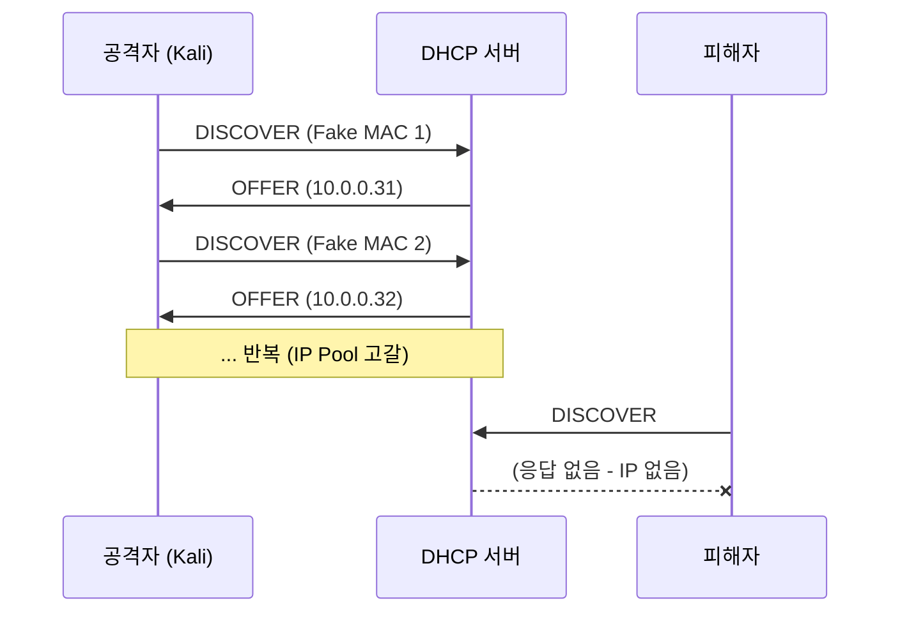

## 1. 개요

**Yersinia**는 L2(데이터링크 계층) 프로토콜 취약점을 공격하는 도구입니다. DHCP, STP, CDP, DTP 등 다양한 프로토콜 공격을 지원합니다.

| 공격 유형 | 대상 프로토콜 | 영향 |
|----------|--------------|------|
| **DHCP Starvation** | DHCP | IP Pool 고갈 → 서비스 거부 |
| STP Root Attack | STP | 네트워크 토폴로지 조작 |
| CDP Flooding | CDP | 스위치 리소스 고갈 |

---

## 2. DHCP Starvation 공격 원리

공격자가 가짜 MAC 주소로 대량의 DHCP Discover 패킷을 전송하여 DHCP 서버의 IP Pool을 고갈시킵니다.



---

## 3. 설치 (Kali Linux)

### 소스 컴파일

```bash
# 소스 클론
git clone https://github.com/tomac/yersinia /opt/yersinia

# 의존성 설치
apt install autoconf libgtk-3-dev libnet1-dev libgtk2.0-dev libpcap-dev -y

cd /opt/yersinia
./autogen.sh
./configure --with-gtk
```

### 컴파일 오류 해결

기본 소스에 오류가 있어 수정이 필요합니다.

```bash
cd /opt/yersinia/src

# 헤더 파일 수정 (ncurses-gui.h, gtk-gui.h, ncurses-interface.h, ncurses-callbacks.h)
# 수정 전:
extern int8_t term_add_node(struct term_node **, int8_t, int32_t, pthread_t);
# 수정 후:
extern int8_t term_add_node(struct term_node **, int8_t, void *, pthread_t);

# yersinia.c 수정
# 수정 전:
posix_signal( int signo, void (*handler)() )
# 수정 후:
posix_signal( int signo, void (*handler)(int) )
```

```bash
# 컴파일 및 설치
make
make install
```

---

## 4. 공격 수행

### GUI 모드

```bash
yersinia -G &
```

### 공격 설정

1. **Protocols** → DHCP만 체크 (나머지 해제)
2. **Launch attack** → DHCP → **sending DISCOVER packet**

### Wireshark로 트래픽 확인

```bash
# 다른 터미널에서
wireshark &
```

대량의 DHCP Discover 패킷이 캡처됩니다.

---

## 5. 공격 검증

### Windows 클라이언트

```cmd
ipconfig /release
ipconfig /renew
```

**결과**: DHCP 서버가 IP를 할당하지 못함 (타임아웃)

### 공격 중지 후 복구

```bash
# Kali에서 Yersinia 종료

# Rocky9-1 (DHCP 서버)
systemctl restart dhcpd

# Windows
ipconfig /release
ipconfig /renew
```

**결과**: 정상적으로 IP 할당됨

---

## 6. 방어 방법

| 방어 기법 | 설명 |
|----------|------|
| **DHCP Snooping** | 스위치에서 신뢰된 포트만 DHCP 응답 허용 |
| **Port Security** | 포트당 MAC 주소 수 제한 |
| **Rate Limiting** | DHCP 패킷 속도 제한 |

### Cisco 스위치 DHCP Snooping 설정 예시

```
ip dhcp snooping
ip dhcp snooping vlan 10
interface GigabitEthernet0/1
  ip dhcp snooping trust
```

---

## 7. 삭제

```bash
apt-get remove --auto-remove yersinia
rm -rf /opt/yersinia
apt-get purge --auto-remove autoconf libgtk-3-dev libnet1-dev libgtk2.0-dev libpcap-dev -y
```

<hr class="short-rule">
