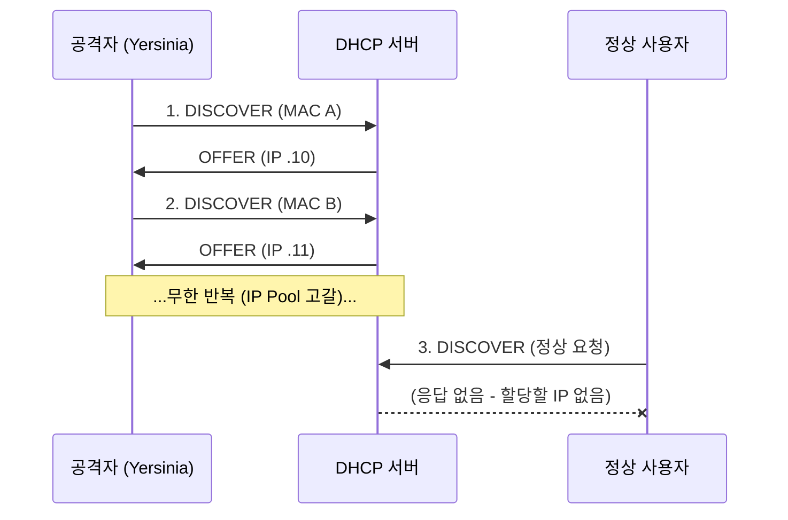

---
layout: post
title: "Yersinia"
date: 2025-11-07 17:00:00 +0900
categories: [hacking-tools]
---

## 1. 개요

**Yersinia**는 OSI 7계층 중 2계층(데이터링크 계층) 프로토콜의 취약점을 이용해 다양한 네트워크 공격을 수행하는 도구이다.
DHCP, STP, CDP, DTP, HSRP 등 네트워크 인프라 운영에 필수적인 프로토콜을 조작하여 서비스 거부(DoS)나 네트워크 경로 조작(MITM)을 유발할 수 있다.
본 글에서는 Yersinia를 설치하고, DHCP 서버의 IP 할당 자원을 고갈시키는 **DHCP Starvation 공격**을 실습한다.

---

## 2. DHCP Starvation 원리

공격자는 위조된 MAC 주소로 대량의 `DHCP DISCOVER` 패킷을 브로드캐스트한다. DHCP 서버는 이를 각각 다른 클라이언트의 요청으로 착각하여 IP 주소를 할당(`OFFER`)하게 되고, 결국 할당 가능한 모든 IP 주소(IP Pool)가 소진되어 정상적인 사용자가 IP를 할당받지 못하게 된다.



---

## 3. 실습 환경

### GNS3 / Packet Tracer
실제 물리적 스위치 없이도 L2 공격을 실습할 수 있는 네트워크 시뮬레이터이다.
*   DHCP 서버가 포함된 토폴로지 구성
*   Kali VM을 시뮬레이션 네트워크에 연결

### VirtualBox Internal Network
*   **공격자 (Kali)**: Yersinia 실행
*   **DHCP 서버**: Windows Server나 dnsmasq 설정된 Linux
*   **피해자**: Windows 클라이언트

---

## 4. 설치 및 컴파일

Kali Linux 최신 버전에는 Yersinia가 기본 설치되어 있지 않으며, 패키지 의존성 문제로 직접 소스를 컴파일해야 한다.

### 의존성 설치 및 빌드
```bash
# 필수 라이브러리 설치
apt install autoconf libgtk-3-dev libnet1-dev libgtk2.0-dev libpcap-dev -y

# 소스 다운로드
git clone https://github.com/tomac/yersinia /opt/yersinia
cd /opt/yersinia

# 설정 파일 생성
./autogen.sh
./configure --with-gtk
```

### 소스코드 수정 (오류 해결)
컴파일 에러를 방지하기 위해 C 소스코드 일부를 수정해야 한다.
(`src/ncurses-gui.h` 등 헤더 파일의 함수 선언부와 `yersinia.c`의 시그널 핸들러 타입을 수정한다.)

```bash
# 컴파일 및 설치
make
make install
```

---

## 5. 공격 실습: DHCP Starvation

### 도구 실행
```bash
yersinia -G
```

### 공격 설정 및 실행
1.  **Launch Attack**: 상단 메뉴의 'Launch attack' 버튼을 클릭한다.
2.  **Protocol 선택**: `DHCP` 탭을 선택한다.
3.  **Attack Type**: `sending DISCOVER packet` 라디오 버튼을 체크한다.
4.  **OK**: 공격을 시작한다.

### 결과 확인
Wireshark로 패킷을 캡처해보면 엄청난 속도로 DHCP Discover 패킷이 전송되는 것을 볼 수 있다.
공격이 진행되는 동안 윈도우 클라이언트에서 `ipconfig /renew`를 실행하면 IP를 할당받지 못하고 타임아웃 오류가 발생한다.

---

## 6. 방어 방법

L2 공격은 네트워크 스위치 장비에서 방어 기능을 설정해야 막을 수 있다.

*   **DHCP Snooping**: 스위치에서 신뢰할 수 있는 포트(Trusted Port, DHCP 서버 연결 포트)에서 온 DHCP 응답만 허용하고, 나머지 포트에서의 DHCP 서버 메시지를 차단한다.
*   **Port Security**: 스위치 포트당 허용 가능한 최대 MAC 주소 개수를 제한하여, 하나의 포트에서 수천 개의 MAC 주소가 발생하는 공격을 차단한다.
    ```
    switch(config-if)# switchport port-security maximum 10
    ```

<hr class="short-rule">
