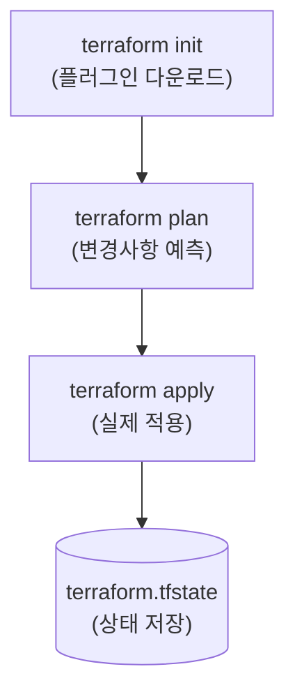

---
layout: post
title: "Terraform"
date: 2025-11-19 17:00:00 +0900
categories: [iac]
---

## 1. 개요

**Terraform**은 HashiCorp가 개발한 오픈소스 **IaC (Infrastructure as Code)** 도구이다.
HCL (HashiCorp Configuration Language)이라는 직관적인 언어를 사용하여 AWS, Azure, GCP 등 다양한 클라우드 리소스를 코드로 정의하고 생성, 변경, 삭제를 자동화한다.

### IaC (Infrastructure as Code)란?
*   인프라를 수동(GUI 클릭)이 아닌 **코드**로 정의하여 관리한다.
*   Git과 같은 버전 관리 시스템을 통해 인프라 변경 이력을 추적하고 협업할 수 있다.
*   **멱등성(Idempotency)**을 보장하여 코드를 여러 번 실행해도 항상 동일한 상태를 유지한다.

### Terraform vs Ansible

| 구분 | Terraform | Ansible |
|------|-----------|---------|
| **주 목적** | **인프라 프로비저닝** (VM, VPC, LB 생성) | **구성 관리** (패키지 설치, 애플리케이션 설정) |
| **방식** | **선언적 (Declarative)**: 최종 상태(Desired State) 정의 | **절차적/선언적 혼합**: 실행 순서 중요 |
| **상태 관리** | **State 파일 필수 (`.tfstate`)** | Stateless (현재 상태를 확인하며 실행) |
| **강점** | 클라우드 리소스 수명 주기 관리 | OS 내부 설정, 미들웨어 배포 |

### 동작 흐름
Terraform은 3단계 워크플로우를 따른다.


---

## 2. 설치 및 디렉터리 구성

### 설치 (Windows)
1.  Terraform 공식 사이트에서 바이너리(zip) 다운로드
2.  `C:\terraform` 등에 압축 해제
3.  시스템 환경 변수 `Path`에 해당 경로 추가
4.  설치 확인: `terraform -version`

### 디렉터리 구조
일반적으로 다음과 같이 파일을 분리하여 관리한다.
*   `main.tf`: 리소스 정의 (실제 인프라 코드)
*   `variables.tf`: 변수 정의 (입력값)
*   `outputs.tf`: 출력 정의 (생성된 리소스의 IP 등)
*   `provider.tf`: 클라우드 공급자 설정

---

## 3. 기본 사용법 및 명령어

### 핵심 패키지
```bash
# 1. 초기화 (필수)
# Provider 플러그인을 다운로드하고 .terraform 폴더를 생성한다.
terraform init

# 2. 계획 확인 (Dry Run)
# 실제로 변경될 리소스를 미리 확인한다. (+ 생성, - 삭제, ~ 변경)
terraform plan

# 3. 적용 (Apply)
# 확인된 계획을 실행하여 실제 리소스를 생성한다.
terraform apply --auto-approve

# 4. 삭제 (Destroy)
# 관리 중인 모든 리소스를 삭제한다. (주의!)
terraform destroy
```

---

## 4. 상태 관리 및 디버깅

Terraform에서 **State 파일(`terraform.tfstate`)**은 실제 클라우드 리소스와 코드 간의 매핑 정보를 담고 있는 매우 중요한 파일이다.

### 주요 관리 명령어
```bash
# 현재 관리 중인 리소스 목록 확인
terraform state list

# 특정 리소스의 상세 속성 확인
terraform state show azurerm_virtual_network.vnet

# 코드 스타일 자동 포맷팅 (협업 시 필수)
terraform fmt

# 문법 유효성 검사
terraform validate

# 기존 수동 생성 리소스를 Terraform 관리하으로 가져오기
terraform import <리소스타입>.<이름> <리소스ID>

# 특정 리소스를 손상된 것으로 표시하여 다음 apply 시 강제 재생성 유도
terraform taint <리소스>
```

---

## 5. 실습: Azure 리소스 배포

실제 기업 환경과 유사한 보안 아키텍처를 Azure에 배포하는 실습이다.

### 아키텍처 구성 (Bastion + Private Web)
*   **VNet**: `10.0.0.0/16`
*   **Subnets**:
    1.  **Public**: `10.0.0.0/24` (Bastion Host)
    2.  **Private Web**: `10.0.1.0/24` (Web Server 1)
    3.  **DB**: `10.0.2.0/24` (Database)

### 배포 리소스 체크리스트
1.  **Resource Group**: 리소스 컨테이너
2.  **Virtual Network**: 가상 네트워크망
3.  **Subnet (x3)**: 용도별 망 분리
4.  **NSG**: 보안 규칙 (SSH, HTTP 허용)
5.  **Public IP**: 외부 접속용 IP (Bastion용)
6.  **NIC**: VM의 랜카드
7.  **Availability Set**: 가용성 집합 (이중화)
8.  **Virtual Machine**: 서버 인스턴스 (Linux)
9.  **Load Balancer**: 트래픽 부하 분산
10. **Storage Account**: VM 진단 로그 저장소
11. **Key Vault**: 비밀번호 및 인증서 관리
12. **Application Gateway**: L7 로드밸런서 (WAF)

### main.tf 코드 작성
```hcl
# 리소스 그룹
resource "azurerm_resource_group" "rg" {
  name     = "hamap-resources"
  location = "Korea Central"
}

# 가상 네트워크
resource "azurerm_virtual_network" "vnet" {
  name                = "hamap-vnet"
  address_space       = ["10.0.0.0/16"]
  location            = azurerm_resource_group.rg.location
  resource_group_name = azurerm_resource_group.rg.name
}

# 공인 IP (Bastion용)
resource "azurerm_public_ip" "pip" {
  name                = "bastion-ip"
  location            = azurerm_resource_group.rg.location
  resource_group_name = azurerm_resource_group.rg.name
  allocation_method   = "Static"
}
```

### SSH 접속 테스트
Bastion Host를 경유하여 Private Web Server에 접속한다.
```bash
# 1. Bastion Host 접속
ssh -i id_rsa azureuser@<Bastion-Public-IP>

# 2. Bastion 내부에서 Private VM 접속
ssh azureuser@10.0.1.4
```
> **Tip**: Bastion 호스트에서 내부 서버로 접속하려면 개인키(`id_rsa`)를 Bastion 서버에 업로드하거나 SSH Agent Forwarding을 사용해야 한다.

---

## 6. 보안: State 파일 관리

Terraform의 `terraform.tfstate` 파일에는 **민감한 정보가 평문으로 저장**된다. 데이터베이스 비밀번호, 서비스 주체(App ID/Secret), SSH 키 등이 노출될 위험이 있다.

### 위험성
*   **로컬 저장 시**: Git에 실수로 커밋하면 비밀번호가 공개 저장소에 영구히 남는다.
*   **팀 협업 시**: 여러 명이 각자 다른 State를 가지면 리소스 충돌이 발생한다.

### 권장 사항: Remote Backend 사용
State 파일을 로컬이 아닌 클라우드 저장소에 저장하여 암호화하고 협업 시 동기화한다.

```hcl
# backend.tf (Azure Storage 예시)
terraform {
  backend "azurerm" {
    resource_group_name  = "tfstate-rg"
    storage_account_name = "tfstatestorage"
    container_name       = "tfstate"
    key                  = "prod.terraform.tfstate"
  }
}
```

### 추가 보안 조치
1.  **`.gitignore`에 추가**: `*.tfstate`, `*.tfstate.*` 파일을 Git 추적에서 제외한다.
2.  **Storage 암호화**: Azure Storage는 기본적으로 서버 측 암호화(SSE)가 적용되지만, Customer-Managed Key를 사용하면 더 강력하다.
3.  **State Locking**: 동시 실행 방지를 위해 Backend에서 Lock 기능을 활성화한다.

<hr class="short-rule">
