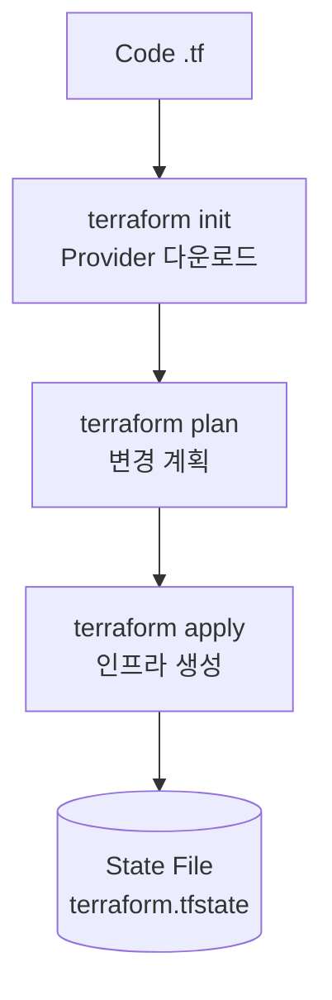

## 1. 개념

**Terraform**은 HashiCorp의 IaC (Infrastructure as Code) 도구.

### IaC란?
- 인프라를 **코드로 정의**하고 관리
- 수동 클릭 대신 **선언적 코드** 작성
- Git으로 **버전 관리** 가능

### Terraform vs Ansible

| 구분 | Terraform | Ansible |
|------|-----------|---------|
| 목적 | 인프라 **생성/삭제** | 서버 **구성 관리** |
| 방식 | 선언적(Declarative) | 절차적(Procedural) |
| 상태 | State 파일로 관리 | 상태 없음 |
| 예시 | VM, VNet, LB 생성 | 패키지 설치, 설정 변경 |

### 특징

| 항목 | 설명 |
|------|------|
| 자동화 | 수동 작업 제거 |
| Human Error 방지 | 코드 리뷰/검증 가능 |
| 멱등성 | 같은 코드 = 같은 결과 |
| 플랫폼 독립 | AWS, Azure, GCP 모두 지원 |

### 핵심 용어

| 용어 | 설명 |
|------|------|
| Provider | 클라우드 연결 플러그인 (azurerm, aws, google) |
| Resource | 생성할 인프라 (VM, VNet, Subnet 등) |
| State | 현재 상태 저장 파일 (terraform.tfstate) |
| Module | 재사용 가능한 코드 블록 |
| Plan | 변경 사항 미리보기 |
| Apply | 실제 인프라 생성/변경 |

### 동작 흐름


---

## 2. 설치

```bash
# Windows: terraform.exe를 C:\01_IaC\에 복사
# 환경 변수 Path에 추가
terraform -v
```

---

## 3. 기본 흐름

```bash
cd c:\01_IaC\01_basic
terraform init          # 초기화(provider 다운로드)
terraform plan          # 계획 미리보기
terraform apply --auto-approve   # 생성
terraform destroy --auto-approve # 삭제
```

---

## 4. 상태 확인/디버깅

```bash
terraform show           # 현재 상태 확인
terraform state list     # 리소스 목록
terraform state show [리소스]  # 특정 리소스 상세
terraform refresh        # 실제와 동기화
terraform fmt            # 코드 포맷팅
terraform validate       # 문법 검사
terraform init -upgrade  # Provider 업그레이드
terraform import [리소스] [ID]  # 기존 리소스 가져오기
terraform taint [리소스]  # 재생성 대상으로 표시
```

---

## 5. 실습 예시

### Azure 리소스 생성 15단계

1. 리소스 그룹 (Resource Group)
2. 가상 네트워크 (Virtual Network)
3. 서브넷 (Subnet) × 3개 (Public, Private, DB)
4. 네트워크 보안 그룹 (NSG)
5. 공용 IP (Public IP)
6. 가용성 집합 (Availability Set)
7. 네트워크 인터페이스 (NIC)
8. Linux 가상 머신 (VM)
9. 스토리지 계정 (Storage Account)
10. 진단 설정 (Diagnostic Settings)
11. 부하 분산 장치 (Load Balancer)
12. SQL Database
13. Key Vault
14. Application Gateway
15. Azure Monitor (Log Analytics)

### 실습: Bastion + Private Web 아키텍처

Azure에서 Bastion 호스트를 통해 Private 서브넷의 웹 서버에 접근하는 구성입니다.

#### 네트워크 구성
```text
VNet: hamap-vnet (10.0.0.0/16)
├── hamap-bastion   (10.0.0.0/24)  - Bastion Host (공용 IP)
├── hamap-web1      (10.0.1.0/24)  - Web Server 1 (프라이빗)
├── hamap-web2      (10.0.2.0/24)  - Web Server 2 (프라이빗)
└── hamap-nat       (10.0.3.0/24)  - NAT Gateway
```

#### SSH 키 생성 및 배포
```bash
# Windows에서 SSH 키 생성
ssh-keygen -t rsa -b 3072 -m PEM

# Bastion 호스트에 접속
ssh hamap@<Bastion-Public-IP>

# Bastion -> Private Web 서버 접속 (개인키 필요)
ssh hamap@10.0.1.4
```
> **Tip**: Bastion 호스트에서 Private 서버로 SSH 접속하려면 Bastion에 개인키(`id_rsa`)를 업로드하고 `chmod 600`으로 권한을 설정해야 합니다.

### Terraform Registry
[https://registry.terraform.io](https://registry.terraform.io)에서 공식 Provider 및 Module 검색 가능

<hr class="short-rule">
