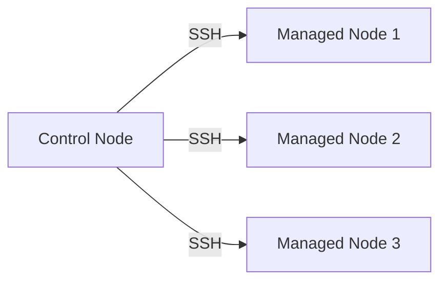

## 1. 개념

**Ansible**은 서버 구성 자동화 도구 (IaC - 구성 관리).

### Ansible vs Terraform
| 구분 | Ansible | Terraform |
|------|---------|-----------|
| 목적 | 서버 **구성 관리** (패키지, 설정) | 인프라 **생성/삭제** |
| 방식 | Push (Controller → Node) | 선언적 |
| Agent | 없음 (SSH 사용) | 없음 |
| 상태 | 없음 | State 파일 |

### 특징
| 항목 | 설명 |
|------|------|
| Push 방식 | Controller에서 Node로 명령 전달 |
| Agentless | Node에 별도 에이전트 불필요 (SSH만 있으면 됨) |
| 멱등성 | 같은 Playbook 여러 번 실행해도 결과 동일 |
| YAML | 가독성 좋은 Playbook 작성 |

### 아키텍처


### 핵심 용어
| 용어 | 설명 |
|------|------|
| Control Node | Ansible 실행 서버 |
| Managed Node | 관리 대상 서버 |
| Inventory | 대상 서버 목록 (/etc/ansible/hosts) |
| Playbook | 실행할 작업 목록 (YAML) |
| Module | 실제 작업 수행 단위 (yum, copy, service 등) |
| Role | 재사용 가능한 Playbook 묶음 |

---

## 2. 초기 환경 설정

실습을 위해 다음과 같이 각 노드의 호스트네임과 네트워크를 설정했습니다.

### Hostname 설정
```bash
# Control Node
hostnamectl set-hostname cont

# Managed Nodes
hostnamectl set-hostname node1
hostnamectl set-hostname node2
hostnamectl set-hostname node3
```

### Hosts 파일 설정 (/etc/hosts)
DNS 대신 `/etc/hosts` 파일을 사용하여 노드 이름으로 통신합니다.
```text
10.0.0.11   cont    ma
10.0.0.12   node1   no1
10.0.0.13   node2   no2
10.0.0.14   node3   no3
```

---

## 3. 설치 및 인벤토리 설정

### 설치
```bash
# CentOS / Rocky Linux
dnf install -y epel-release
dnf install -y ansible

# 버전 확인
ansible --version
```

### 인벤토리 설정 (/etc/ansible/hosts)
```ini
[all]
10.0.0.11
10.0.0.12
10.0.0.13
10.0.0.14

[web]
10.0.0.12

[was]
10.0.0.13

[db]
10.0.0.14

[webservers:children]
web
was
```

---

## 4. Ad-Hoc 명령어 활용

### 기본 명령어
```bash
# 연결 테스트
ansible all -m ping

# 쉘 명령 실행
ansible web -m shell -a "uptime"
```

### File 모듈 (파일/디렉토리 관리)
```bash
# 디렉토리 생성
ansible node -m file -a "path=/test state=directory"

# 파일 생성 (touch)
ansible node -m file -a "path=/test/test.txt state=touch"

# 삭제
ansible node -m file -a "path=/test state=absent"
```

### User 모듈 (사용자 관리)
보안을 위해 비밀번호는 해시 처리하여 입력해야 합니다.
```bash
# 사용자 생성 (비밀번호: It1)
ansible node -m user -a "name=user1 password={{ 'It1' | password_hash('sha512') }}"

# 사용자 삭제
ansible node -m user -a "name=user1 state=absent remove=yes"
```

### 텍스트 처리 (lineinfile/blockinfile)
설정 파일 수정 시 매우 유용합니다.

```bash
# 특정 라인 추가/수정
ansible node -m lineinfile -a "path=/etc/host.conf line='multi on'"

# 블록 단위 추가
ansible node -m blockinfile -a "path=/var/www/html/index.html block='<html>\n<body>\n<h1>Hello</h1>\n</body>\n</html>' create=yes"
```

---

## 4. Playbook 기본

### 구조
```yaml
# site.yml
---
- name: 웹서버 설정
  hosts: webservers
  become: yes
  
  tasks:
    - name: Apache 설치
      yum:
        name: httpd
        state: present
    
    - name: Apache 시작
      service:
        name: httpd
        state: started
        enabled: yes
```

### 실행 및 디버깅
```bash
# 기본 실행
ansible-playbook site.yml

# Dry Run (변경 사항 미리보기)
ansible-playbook site.yml --check

# 상세 로그 확인 (Verbosity)
ansible-playbook site.yml -v    # 결과만 상세하게
ansible-playbook site.yml -vv   # 작업별 설정 포함
ansible-playbook site.yml -vvv  # SSH 연결 정보 포함
```

---

## 5. 변수 활용

Ansible을 유연하게 사용하기 위해 다양한 변수 타입을 지원합니다.

### 1. 기본 변수 (Vars)
```yaml
vars:
  app_port: 8080
```

### 2. 리스트(List) 변수
```yaml
vars:
  users:
    - user1
    - user2
    - user3

tasks:
  - debug:
      msg: "{{ users[0] }}"
```

### 3. 딕셔너리(Dictionary) 변수
```yaml
vars:
  config:
    port: 80
    path: /var/www/html

tasks:
  - debug:
      msg: "Port is {{ config.port }}"
  # 실행 결과: "msg": "Port is 80"
```

### 4. 변수 우선순위 (Extra Vars)
Playbook 실행 시 `-e` 옵션으로 변수를 덮어쓸 수 있습니다.
```bash
ansible-playbook site.yml -e "app_port=9090"
```

---

## 6. 실습: WordPress 자동 배포

### Playbook
```yaml
# wordpress.yml
---
- name: WordPress 설치
  hosts: webservers
  become: yes
  
  tasks:
    - name: LAMP 스택 설치
      yum:
        name:
          - httpd
          - php
          - php-mysqlnd
          - mariadb-server
        state: present
    
    - name: 서비스 시작
      service:
        name: "{{ item }}"
        state: started
        enabled: yes
      loop:
        - httpd
        - mariadb
    
    - name: WordPress 다운로드
      get_url:
        url: https://wordpress.org/latest.tar.gz
        dest: /tmp/wordpress.tar.gz
    
    - name: WordPress 압축 해제
      unarchive:
        src: /tmp/wordpress.tar.gz
        dest: /var/www/html/
        remote_src: yes
```

---

## 7. 3-Tier 아키텍처 구축

### 구조
```
[Web Tier] → [App Tier] → [DB Tier]
  Nginx      Apache/PHP    MariaDB
```

### 인벤토리
```ini
[web]
nginx1 ansible_host=10.0.0.11

[app]
app1 ansible_host=10.0.0.21
app2 ansible_host=10.0.0.22

[db]
mysql1 ansible_host=10.0.0.31
```

### Role 구조
```
roles/
├── web/
│   └── tasks/main.yml
├── app/
│   └── tasks/main.yml
└── db/
    └── tasks/main.yml
```

---

## 8. 상태 확인 및 디버깅

```bash
ansible all -m ping               # 연결 확인
ansible-playbook site.yml -v      # 상세 로그
ansible-playbook site.yml --list-tasks  # 작업 목록
ansible-playbook site.yml --syntax-check  # 문법 검사
```

<hr class="short-rule">
