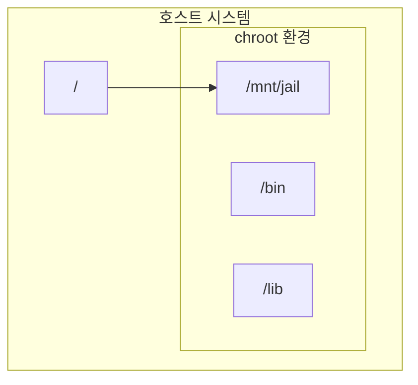

## 1. 개념

**chroot (Change Root)**는 특정 프로세스와 그 자식 프로세스가 인식하는 루트 디렉터리(`/`)를 변경하여 파일 시스템 접근을 격리하는 기술입니다.
시스템 복구, 소프트웨어 테스트, 또는 제한된 샌드박스 환경을 구성할 때 사용됩니다.

### 기본 정보

| 항목 | 설명 |
|------|------|
| 목적 | 시스템 격리, 복구, 테스트 환경 구성 |
| 원리 | 지정 디렉터리를 `/`로 인식하게 함 |
| 별칭 | "chroot jail" |

### chroot 활용 사례
- **시스템 복구**: 부팅 불가 시 Live CD로 chroot 후 복구
- **보안 격리**: FTP/웹 서비스를 제한된 환경에서 실행
- **빌드 환경**: 격리된 환경에서 패키지 빌드
- **테스트**: 다른 배포판/버전 테스트

### 격리 구조



---

## 2. 설치 방법

chroot는 리눅스 기본 명령어로 별도 설치가 필요 없음.

### 필수 도구
```bash
# 라이브러리 의존성 확인 도구
which ldd
# ldd: 바이너리가 필요로 하는 공유 라이브러리 확인
```

### chroot 환경 디렉터리 준비
```bash
# 격리 환경 디렉터리 생성
mkdir -p /mnt/jail/{bin,lib,lib64,etc,dev,proc}
```

---

## 3. 사용법

### 기본 chroot 환경 구축

```bash
# 1. jail 디렉터리 생성
mkdir -p /mnt/jail/{bin,lib,lib64}

# 2. 필요한 바이너리 복사 (bash 예시)
cp /bin/bash /mnt/jail/bin/

# 3. 의존 라이브러리 확인
ldd /bin/bash

# 4. 라이브러리 복사
cp /lib64/libtinfo.so.6 /mnt/jail/lib64/
cp /lib64/libc.so.6 /mnt/jail/lib64/
cp /lib64/ld-linux-x86-64.so.2 /mnt/jail/lib64/
# (ldd 출력 결과의 모든 라이브러리 복사)

# 5. chroot 진입
chroot /mnt/jail /bin/bash
```

### ldd 출력 예시
```bash
$ ldd /bin/bash
    linux-vdso.so.1 (0x00007fff...)
    libtinfo.so.6 => /lib64/libtinfo.so.6
    libc.so.6 => /lib64/libc.so.6
    /lib64/ld-linux-x86-64.so.2
```

### 자동 복사 스크립트
```bash
#!/bin/bash
# chroot 환경에 바이너리와 라이브러리 자동 복사

JAIL="/mnt/jail"
BINARY=$1

# 바이너리 복사
cp $BINARY $JAIL/bin/

# 라이브러리 복사
for lib in $(ldd $BINARY | awk '{print $3}' | grep -v "^$"); do
    if [ -f "$lib" ]; then
        cp --parents $lib $JAIL/
    fi
done

# ld-linux 복사
cp /lib64/ld-linux-x86-64.so.2 $JAIL/lib64/
```

---

## 4. 실습 예시

### 시스템 복구용 chroot

부팅 불가 시 Live CD/USB로 부팅 후:

```bash
# 1. 루트 파티션 마운트
mount /dev/sda2 /mnt/sysroot

# 2. 필수 가상 파일시스템 마운트
mount --bind /dev /mnt/sysroot/dev
mount --bind /proc /mnt/sysroot/proc
mount --bind /sys /mnt/sysroot/sys

# 3. chroot 진입
chroot /mnt/sysroot /bin/bash

# 4. 복구 작업 (예: GRUB 재설치)
grub2-install /dev/sda
grub2-mkconfig -o /boot/grub2/grub.cfg

# 5. chroot 종료
exit

# 6. 마운트 해제
umount /mnt/sysroot/{dev,proc,sys}
umount /mnt/sysroot
```

### 격리된 bash 환경 만들기
```bash
# 기본 명령어들 추가 (ls, cat, echo 등)
for cmd in ls cat echo pwd; do
    cp /bin/$cmd /mnt/jail/bin/
    # 각 명령어의 라이브러리도 복사 필요
done
```


---

## 5. 트러블슈팅

### "no such file or directory" 오류
```bash
# 라이브러리 누락 확인
ldd /mnt/jail/bin/bash
# => not found 항목 확인 후 복사
```

### DNS 해결 안됨
```bash
# /etc/resolv.conf 복사
cp /etc/resolv.conf /mnt/jail/etc/
```

### chroot vs 컨테이너

| 항목 | chroot | Docker/Podman |
|------|--------|---------------|
| 격리 수준 | 파일시스템만 | 네트워크/프로세스 포함 |
| 보안 | 루트 탈출 가능 | 더 강력한 격리 |
| 용도 | 시스템 복구 | 애플리케이션 배포 |

<hr class="short-rule">
