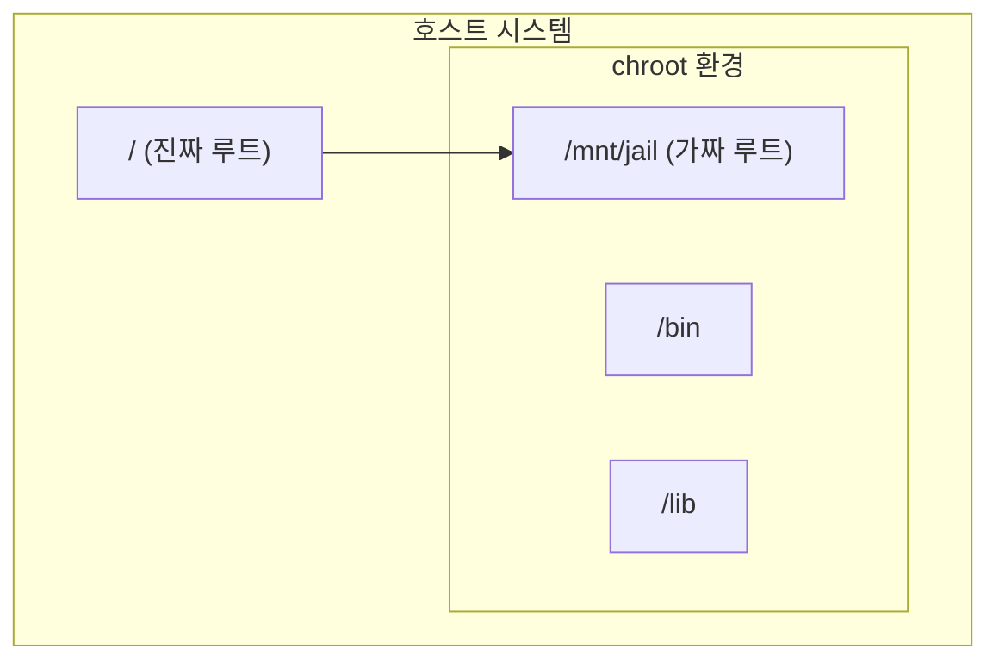

---
layout: post
title: "Chroot"
date: 2025-06-25 17:00:00 +0900
categories: [linux]
---

## 1. 개요

**chroot (Change Root)**는 프로세스가 인식하는 루트 디렉터리(`/`)를 특정 위치로 변경하여, 해당 프로세스가 상위 디렉터리에 접근하지 못하도록 격리하는 기술이다.
'Chroot Jail'이라고도 불리며, 시스템 복구 시 라이브 CD 환경에서 원본 시스템을 마운트해 작업하거나, 보안을 위해 서비스(FTP, SSH 등)를 격리할 때 사용된다.

### 격리 구조



---

## 2. 기본 사용법

chroot 환경을 구성하려면 단순한 디렉터리 생성뿐만 아니라, 쉘을 실행하기 위한 바이너리와 의존성 라이브러리까지 모두 복사해야 한다.

### 1. 격리 공간 생성
```bash
# Jail 디렉터리 구조 생성
mkdir -p /mnt/jail/{bin,lib,lib64}
```

### 2. 바이너리 복사
`bash` 쉘을 격리된 환경에서 실행하기 위해 복사한다.
```bash
cp /bin/bash /mnt/jail/bin/
```

### 3. 의존성 확인 및 복사 (핵심)
`ldd` 명령어로 바이너리가 필요로 하는 공유 라이브러리를 확인하고 모두 복사해야 한다. 하나라도 누락되면 `command not found` 또는 실행 오류가 발생한다.

```bash
ldd /bin/bash
# linux-vdso.so.1
# libtinfo.so.6 => /lib64/libtinfo.so.6
# libc.so.6 => /lib64/libc.so.6
# /lib64/ld-linux-x86-64.so.2

# 라이브러리 복사
cp /lib64/libtinfo.so.6 /mnt/jail/lib64/
cp /lib64/libc.so.6 /mnt/jail/lib64/
cp /lib64/ld-linux-x86-64.so.2 /mnt/jail/lib64/
```

### 4. Chroot 진입
```bash
chroot /mnt/jail /bin/bash
```

---

## 3. 실습: 시스템 복구

리눅스 시스템이 부팅되지 않을 때(예: GRUB 손상, 루트 비밀번호 분실), 라이브 CD로 부팅하여 원본 시스템을 chroot로 마운트하고 복구하는 과정이다.

1.  **파티션 마운트**: 원본 리눅스의 루트 파티션(`/dev/sda2`)을 마운트한다.
    ```bash
    mount /dev/sda2 /mnt/sysroot
    ```
2.  **가상 파일시스템 연결**: 커널 정보가 담긴 `/proc`, `/sys`, `/dev`를 바인딩 마운트한다. (중요)
    ```bash
    mount --bind /proc /mnt/sysroot/proc
    mount --bind /sys /mnt/sysroot/sys
    mount --bind /dev /mnt/sysroot/dev
    ```
3.  **격리 환경 진입**:
    ```bash
    chroot /mnt/sysroot
    ```
4.  **복구 작업 수행**: 이제 원본 시스템의 환경이 되었으므로 패키지 재설치나 비밀번호 변경이 가능하다.
    ```bash
    # 예: 루트 비밀번호 변경
    passwd root
    
    # 예: GRUB 부트로더 재설치
    grub2-install /dev/sda
    ```
5.  **종료**: `exit` 입력 후 시스템을 재부팅한다.

---

## 4. 실습: SFTP 격리 (Chroot SFTP)

SSH 설정을 통해 사용자가 자신의 홈 디렉터리 상위로 이동하지 못하도록 묶어둔다.

`/etc/ssh/sshd_config`:
```ssh
# 특정 그룹(sftponly)에 대해 설정 적용
Match Group sftponly
    ChrootDirectory /home/%u  # 사용자의 홈을 루트로 지정
    ForceCommand internal-sftp # 쉘 실행 금지, SFTP만 허용
    X11Forwarding no
    AllowTcpForwarding no
```

**주의사항**: `ChrootDirectory`로 지정된 경로는 반드시 **root 소유**여야 하며, 쓰기 권한이 그룹이나 타인에게 있으면 안 된다. (`chmod 755`, `chown root:root`)

<hr class="short-rule">
