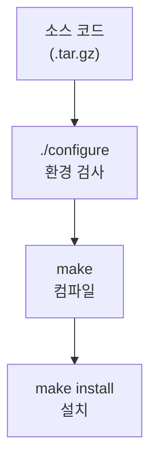

## 1. 개념

**Makefile**은 소스 코드의 컴파일과 링크 과정을 정의하여, `make` 명령어 하나로 빌드를 자동화하는 도구입니다.
프로젝트의 의존성을 관리하여 변경된 파일만 재컴파일함으로써 빌드 효율을 높입니다.

### 기본 정보

| 항목 | 설명 |
|------|------|
| 용도 | 소스 코드 빌드 자동화 |
| 명령어 | `make` |
| 파일명 | `Makefile` 또는 `makefile` |

### 왜 Makefile을 사용하는가?
- **효율성**: 변경된 파일만 다시 컴파일
- **일관성**: 빌드 과정 표준화
- **자동화**: 복잡한 빌드 과정을 단순 명령으로 실행

### 소스 코드 설치 과정



---

## 2. 설치 방법

### Rocky Linux / CentOS
```bash
# make 및 개발 도구 설치
dnf groupinstall -y "Development Tools"
# 또는
dnf install -y make gcc
```

---

## 3. 사용법

### Makefile 기본 구조
```makefile
# Target: Dependency
#     Rule (반드시 탭으로 들여쓰기)

target: dependency1 dependency2
	command
```

### 간단한 예제
```makefile
# hello.c를 컴파일하여 hello 실행 파일 생성
hello: hello.c
	gcc -o hello hello.c

clean:
	rm -f hello
```

### 실행 방법
```bash
# 기본 타겟 빌드
make

# 특정 타겟 빌드
make hello

# clean 타겟 실행
make clean
```

### 변수 사용
```makefile
CC = gcc
CFLAGS = -Wall -O2
TARGET = myprogram
SRCS = main.c utils.c
OBJS = $(SRCS:.c=.o)

$(TARGET): $(OBJS)
	$(CC) $(CFLAGS) -o $(TARGET) $(OBJS)

%.o: %.c
	$(CC) $(CFLAGS) -c $< -o $@

clean:
	rm -f $(TARGET) $(OBJS)
```

### 주요 자동 변수

| 변수 | 설명 |
|------|------|
| `$@` | 현재 타겟 이름 |
| `$<` | 첫 번째 의존성 파일 |
| `$^` | 모든 의존성 파일 |
| `$*` | 확장자 제외한 타겟 이름 |

---

## 4. 실습 예시

### TCP 서버 프로젝트 Makefile

```makefile
# TCP 채팅 서버 빌드
CC = gcc
CFLAGS = -Wall -lpthread

all: server client

server: server.c
	$(CC) $(CFLAGS) -o server server.c

client: client.c
	$(CC) $(CFLAGS) -o client client.c

clean:
	rm -f server client

.PHONY: all clean
```

### 소스 코드 컴파일 설치 예제

Apache httpd를 소스에서 설치:
```bash
# 1. 소스 코드 다운로드 및 압축 해제
wget https://archive.apache.org/dist/httpd/httpd-2.4.54.tar.gz
tar xzf httpd-2.4.54.tar.gz
cd httpd-2.4.54

# 2. 환경 설정 (Makefile 생성)
./configure --prefix=/usr/local/apache2

# 3. 컴파일 (Makefile 실행)
make

# 4. 설치
make install
```


---

## 5. 트러블슈팅

### "recipe must begin with a tab" 오류
```bash
# 들여쓰기가 스페이스가 아닌 탭이어야 함
# 에디터 설정 확인 또는 cat -A로 확인
cat -A Makefile
# ^I가 탭, 공백은 그대로 표시
```

### 의존성 패키지 오류
```bash
# configure 단계에서 오류 발생 시
# 필요한 개발 패키지 설치
dnf install -y openssl-devel pcre-devel expat-devel
```

### 병렬 빌드
```bash
# CPU 코어 수만큼 병렬 컴파일
make -j$(nproc)
```

<hr class="short-rule">
