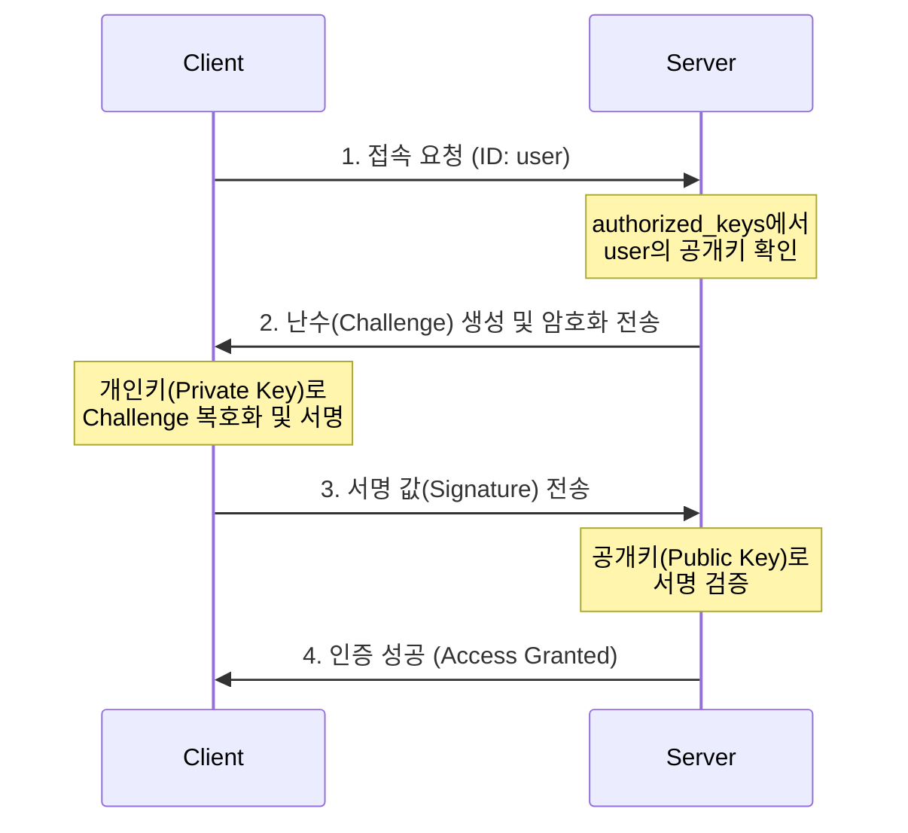

---
layout: post
title: "SSH"
date: 2025-10-16 17:00:00 +0900
categories: [linux]
---

## 1. 개요

**SSH (Secure Shell)**는 네트워크를 통해 원격 컴퓨터에 안전하게 접속하기 위한 암호화 프로토콜이다.
과거의 Telnet과 달리 모든 통신 내용(비밀번호 포함)을 암호화하여 전송하므로 도청(Sniffing)으로부터 안전하다.
단순한 터미널 접속뿐만 아니라 파일 전송(SCP/SFTP), 포트 포워딩(Tunneling) 등 다양한 기능을 제공한다.

### 기본 정보
*   **포트**: 22 (TCP)
*   **패키지**: `openssh-server` (서버), `openssh-clients` (클라이언트)
*   **설정 파일**: `/etc/ssh/sshd_config` (서버 설정)

### 인증 방식
1.  **비밀번호 인증**: 계정 비밀번호를 입력하여 접속 (기본)
2.  **공개키 인증 (Key Pair)**: 클라이언트의 공개키를 서버에 등록하여 비밀번호 없이 안전하게 접속

---

## 2. 서버 설정 (sshd_config)

SSH 서버의 보안을 강화하기 위해 설정 파일을 수정한다.

```bash
vi /etc/ssh/sshd_config
```

### 주요 보안 설정
```ini
# 포트 변경 (보안상 권장)
Port 2222

# 루트 로그인 차단 (필수 권장)
PermitRootLogin no

# 비밀번호 인증 차단 (키 인증만 허용 시)
PasswordAuthentication no

# 빈 암호 허용 금지
PermitEmptyPasswords no
```

설정 변경 후 반드시 서비스를 재시작해야 적용된다.
```bash
systemctl restart sshd
```

### 실습 환경 설정 (VMware NAT)
호스트의 2222번 포트를 VM의 22번 포트로 포워딩하여 외부에서 SSH 접속이 가능하도록 설정한다.


---

## 3. 공개키 인증 방식 (Key Pair)

비밀번호 입력 없이 안전하게 접속하기 위해 SSH 키 쌍을 생성하고 등록한다.

### 인증 원리

서버가 보낸 난수(Challenge)를 클라이언트가 **개인키로 서명**하고, 서버가 **공개키로 검증**하는 방식이다.



### 1단계: 키 생성 (클라이언트)
```bash
ssh-keygen -t rsa -b 4096
# 엔터를 누르면 ~/.ssh/id_rsa (개인키)와 id_rsa.pub (공개키) 생성됨
```

### 2단계: 키 전송 (서버로 복사)
```bash
ssh-copy-id -p 22 user@10.0.0.11
# 또는 직접 복사하여 서버의 ~/.ssh/authorized_keys 파일에 추가
```

### 3단계: 접속 테스트
```bash
ssh -p 22 user@10.0.0.11
# 비밀번호를 묻지 않고 접속되면 성공
```


## 4. 실습: 포트 포워딩 (Tunneling)

SSH 터널링을 이용해 **방화벽 내부의 서비스에 접근**하거나 **통신을 암호화**한다.

### 로컬 포트 포워딩 (Local Port Forwarding)
내 PC의 포트(Local)를 통해 원격 서버 내부의 포트(Remote)로 접속한다.
*   **상황**: 외부에서 접속 불가능한 DB 서버(10.0.0.11:3306)에 SSH 서버(10.0.0.10)를 거쳐 접속하고 싶음.

```bash
# 내 PC의 9999 포트를 10.0.0.11의 3306 포트로 연결
ssh -L 9999:10.0.0.11:3306 user@10.0.0.10
```

이제 내 PC에서 `localhost:9999`로 접속하면 원격 DB에 연결된다.

### 데이터 흐름도

```mermaid
flowchart LR
    A[내 PC의 9999번 포트] -->암호화된 터널--> B[SSH 서버]
    B -->복호화--> C[DB 서버 3306번 포트]
```


---

## 5. 트러블슈팅

### Permission denied (publickey)
키 파일의 권한이 너무 열려 있으면 SSH가 보안상 거부한다.
*   `~/.ssh` 디렉터리: **700** (`drwx------`)
*   `~/.ssh/authorized_keys` 파일: **600** (`-rw-------`)

```bash
chmod 700 ~/.ssh
chmod 600 ~/.ssh/authorized_keys
```

### Host key verification failed
서버를 재설치하거나 IP가 바뀌어서 로컬의 `known_hosts` 정보와 다를 때 발생한다.
```bash
# 문제되는 호스트 키 삭제
ssh-keygen -R 10.0.0.11
```

### Connection refused
SSH 서비스가 중지되었거나 방화벽에서 차단된 경우다.
```bash
# 서비스 상태 확인
systemctl status sshd

# 방화벽 확인
firewall-cmd --list-services | grep ssh
```

---

## 6. 부록: Docker로 서버 띄우기

테스트용 SSH 서버가 필요할 때 유용하다.

```bash
docker run -d \
  --name my-ssh-server \
  -p 2222:2222 \
  -e PUID=1000 -e PGID=1000 \
  -e USER_NAME=linux \
  -e USER_PASSWORD=password \
  lscr.io/linuxserver/openssh-server
```
*   `2222:2222`: 컨테이너 내부 포트도 2222로 설정되어 있다.
*   접속: `ssh -p 2222 linux@localhost`

---

## 7. 보안 고려사항

*   **Root 로그인 차단**: `PermitRootLogin no`를 설정하여 root 계정 직접 로그인을 금지한다.
*   **비밀번호 인증 비활성화**: 공개키 인증을 설정한 후 `PasswordAuthentication no`로 무차별 대입 공격을 원천 차단한다.
*   **비표준 포트 사용**: 기본 포트 22 대신 다른 포트(예: 2222)를 사용하여 자동화 스캔 공격을 회피한다.
*   **Fail2Ban 연동**: 반복적인 로그인 실패 시 해당 IP를 자동 차단하는 Fail2Ban을 설정한다.
*   **키 파일 권한 관리**: `~/.ssh` 디렉터리는 `700`, 키 파일은 `600` 권한을 유지해야 한다.

<hr class="short-rule">
