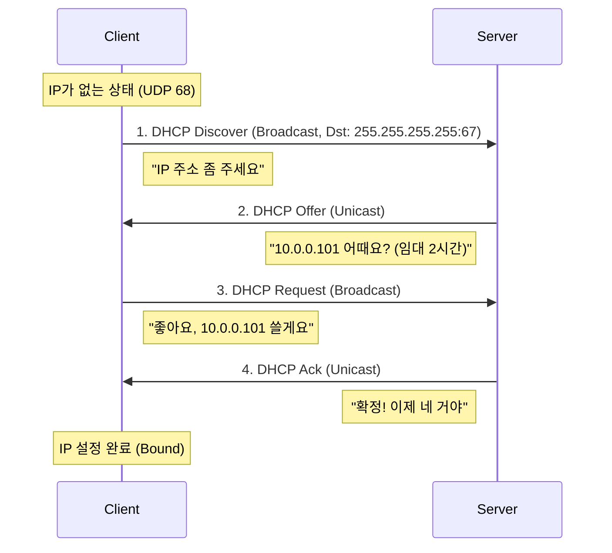

---
layout: post
title: "DHCP"
date: 2025-10-17 17:00:00 +0900
categories: [linux]
---

## 1. 개요

**DHCP (Dynamic Host Configuration Protocol)**는 네트워크 상의 클라이언트에게 IP 주소, 서브넷 마스크, 게이트웨이, DNS 서버 주소 등의 네트워크 정보를 자동으로 할당해 주는 프로토콜이다.
관리자가 수동으로 IP를 설정하는 번거로움을 줄이고, IP 충돌을 방지하며 주소 자원을 효율적으로 관리할 수 있게 해준다.

### 동작 과정 (DORA)
DHCP는 **Discover**, **Offer**, **Request**, **Acknowledge**의 4단계 과정을 통해 IP를 할당한다.



---

## 2. 서버 구축 (dhcpd.conf)

Rocky Linux에서 `dhcp-server` 패키지를 이용하여 DHCP 서버를 구축한다.

### 실습 환경 구성
| 항목 | 값 |
|------|-----|
| 네트워크 대역 | `10.0.0.0/24` |
| DHCP 서버 IP | `10.0.0.13` |
| 동적 IP 범위 | `10.0.0.51` ~ `10.0.0.250` |
| 게이트웨이 | `10.0.0.254` |
| DNS 서버 | `168.126.63.1`, `8.8.8.8` |
| 도메인 | `hamap.local` |

### 설치
```bash
dnf install -y dhcp-server
```

### 설정 파일 (/etc/dhcp/dhcpd.conf)
```conf
# 도메인 설정
option domain-name "hamap.local";
option domain-name-servers 168.126.63.1, 8.8.8.8;

# 임대 시간 (초 단위)
default-lease-time 7200;  # 기본 2시간
max-lease-time 7200;      # 최대 2시간

# 서브넷 정의
subnet 10.0.0.0 netmask 255.255.255.0 {
    range 10.0.0.51 10.0.0.250;
    option routers 10.0.0.254;
    option broadcast-address 10.0.0.255;
}

# 고정 IP 예약 (MAC Binding)
host w10 {
    hardware ethernet 00:00:00:00:00:01;
    fixed-address 10.0.0.101;
}
host w11 {
    hardware ethernet 00:00:00:00:00:02;
    fixed-address 10.0.0.201;
}
```

### 서비스 시작
```bash
systemctl enable --now dhcpd
firewall-cmd --permanent --add-service=dhcp
firewall-cmd --reload
```

---

## 3. 실습: 고정 IP 예약 (MAC Binding)

특정 장치가 항상 동일한 IP를 받도록 MAC 주소 기반으로 예약한다.

### 예약 설정 및 결과

아래 설정 파일에서 `host w10`과 `host w11` 블록이 각각의 클라이언트에 고정 IP를 할당한다.


### 클라이언트 검증

설정 후 각 Windows 클라이언트에서 `ipconfig /all` 명령으로 할당된 IP를 확인한다.

**Windows 10 (W10-1)**
- MAC: `00-00-00-00-00-01`
- 할당 IP: `10.0.0.101`
- DHCP Server: `10.0.0.13`


**Windows 11 (W11-1)**
- MAC: `00-00-00-00-00-02`
- 할당 IP: `10.0.0.201`
- DHCP Server: `10.0.0.13`


---

## 4. 트러블슈팅

DHCP 구축 시 자주 발생하는 문제와 해결 방법이다.

### IP 할당 실패 (Discover 무응답)
클라이언트가 `Discover` 패킷을 보냈지만 서버가 응답하지 않는 경우다.

1.  **방화벽 확인**: DHCP는 **UDP 67(Server), 68(Client)** 포트를 사용한다.
    ```bash
    firewall-cmd --list-services | grep dhcp
    ```
2.  **서비스 상태**: `systemctl status dhcpd`로 서비스가 살아있는지 확인한다.
    *   `failed` 상태라면 `/etc/dhcp/dhcpd.conf`의 문법 오류(세미콜론 누락 등)를 확인한다.
3.  **로그 확인**: 실시간 로그에서 에러 메시지를 찾는다.
    ```bash
    journalctl -u dhcpd -f
    ```

### IP 충돌 (Conflict)
클라이언트에서 "IP Address Conflict" 경고가 뜨는 경우다.
*   **원인**: DHCP가 할당하려는 IP를 이미 다른 기기가 **고정 IP(Static IP)**로 사용 중일 때 발생한다.
*   **해결**: `range` 범위를 수정하여 고정 IP 대역을 제외하거나, 해당 기기를 예약(MAC Binding)으로 등록한다.

### 임대 정보 확인
현재 누가 어떤 IP를 받아갔는지 확인하려면 임대 기록 파일을 조회한다.
```bash
cat /var/lib/dhcpd/dhcpd.leases
```

---

## 5. 부록: Docker로 서버 띄우기

복잡한 패키지 설치 없이 Docker로 즉시 DHCP 서버를 테스트할 수 있다.

```bash
docker run -d \
  --name my-dhcp-server \
  --net host \
  -v $(pwd)/dhcpd.conf:/data/dhcpd.conf \
  networkboot/dhcpd eth0
```
*   `--net host`: DHCP는 **브로드캐스트**를 사용하므로 호스트 네트워크 모드가 필수다.
*   `eth0`: DHCP 서비스를 제공할 호스트의 네트워크 인터페이스 이름이다.
*   `dhcpd.conf` 파일은 로컬에 미리 작성해두어야 한다.

---

## 6. 부록: Windows Server DHCP

리눅스뿐만 아니라 Windows Server에서도 DHCP 역할을 추가하여 동일한 기능을 GUI로 구현할 수 있다.

아래 스크린샷은 별도의 Windows Server 실습 환경(`200.200.200.0/24` 대역)에서 촬영되었다.


---

## 7. 보안 고려사항

*   **Rogue DHCP 서버 공격**: 공격자가 네트워크에 가짜 DHCP 서버를 설치하여 클라이언트에게 악성 게이트웨이/DNS를 할당할 수 있다. 관리형 스위치에서 **DHCP Snooping**을 활성화하여 인가된 DHCP 서버만 허용한다.
*   **DHCP Starvation 공격**: 공격자가 대량의 가짜 MAC 주소로 IP를 모두 점유하여 정상 사용자가 IP를 받지 못하게 한다. 스위치의 **Port Security**로 MAC 주소 개수를 제한한다.
*   **로그 모니터링**: `/var/lib/dhcpd/dhcpd.leases` 파일을 주기적으로 점검하여 비정상적인 MAC 주소나 대량 임대를 탐지한다.

<hr class="short-rule">
