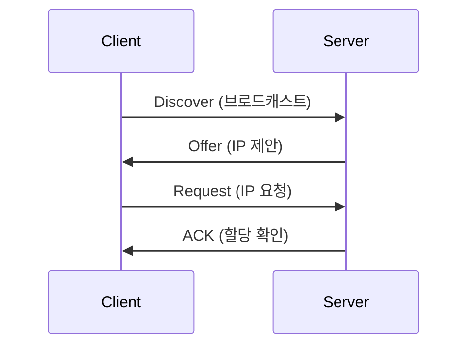

## 1. 개념

**DHCP (Dynamic Host Configuration Protocol)**는 네트워크 장치에 IP 주소를 자동으로 할당하는 프로토콜.

### 기본 정보
| 항목 | 내용 |
|------|------|
| 포트 | 67(서버), 68(클라이언트) - UDP |
| 할당 정보 | IP, 서브넷 마스크, 게이트웨이, DNS |

### 왜 DHCP를 사용하는가?
| 구분 | 수동 설정 | DHCP |
|------|----------|------|
| 관리 | 각 PC마다 직접 설정 | 서버에서 자동 할당 |
| 중복 IP | 직접 확인 필요 | 자동 방지 |
| 변경시 | PC마다 설정 | 서버만 설정 |

### DHCP 동작 과정 (DORA) - 중요!


1. **Discover**: 클라이언트가 DHCP 서버 찾기
2. **Offer**: 서버가 사용 가능한 IP 제안
3. **Request**: 클라이언트가 제안된 IP 요청
4. **ACK**: 서버가 할당 확정

---

## 2. 설치 방법

### Rocky Linux / CentOS
```bash
# DHCP 서버 설치
dnf install -y dhcp-server

# 설정 파일 편집
vi /etc/dhcp/dhcpd.conf
```

### 기본 설정 예시
```conf
# /etc/dhcp/dhcpd.conf
subnet 10.0.0.0 netmask 255.255.255.0 {
    range 10.0.0.100 10.0.0.200;       # 할당 범위
    option routers 10.0.0.1;           # 게이트웨이
    option domain-name-servers 8.8.8.8; # DNS
    default-lease-time 600;            # 임대 시간(초)
}
```

### 서비스 시작
```bash
systemctl enable --now dhcpd
firewall-cmd --permanent --add-service=dhcp
firewall-cmd --reload
```

---

## 3. 사용법

### 상태 확인
```bash
systemctl status dhcpd
cat /var/lib/dhcpd/dhcpd.leases  # 할당 현황
```

### 클라이언트 테스트
```bash
# 클라이언트에서
dhclient -r    # 기존 IP 해제
dhclient       # 새 IP 요청
ip addr show   # 확인
```

---

## 4. 실습


### IP 구성 계획

| 항목 | 설정값 |
|------|--------|
| 네트워크 | 10.0.0.0/24 (10.0.0.1 ~ 254) |
| 서버 고정 IP | 10.0.0.1 ~ 40 |
| DHCP 서버 | 10.0.0.11 (rocky9-1) |
| 동적 할당 범위 | 10.0.0.51 ~ 250 |
| 게이트웨이 | 10.0.0.254 |
| DNS | 168.126.63.1, 8.8.8.8 |
| 기본 임대 시간 | 2시간 (7200초) |
| 최대 임대 시간 | 4시간 (14400초) |

### 예약 IP 설정

| 클라이언트 | MAC 주소 기반 예약 IP |
|------------|----------------------|
| w10-1 | 10.0.0.101 |
| w11-1 | 10.0.0.201 |

### dhcpd.conf 설정


```conf
subnet 10.0.0.0 netmask 255.255.255.0 {
    range 10.0.0.51 10.0.0.250;
    option routers 10.0.0.254;
    option domain-name-servers 168.126.63.1, 8.8.8.8;
    default-lease-time 7200;
    max-lease-time 14400;
}

# MAC 주소 기반 예약
host w10 {
    hardware ethernet xx:xx:xx:xx:xx:xx;
    fixed-address 10.0.0.101;
}
host w11 {
    hardware ethernet yy:yy:yy:yy:yy:yy;
    fixed-address 10.0.0.201;
}
```

### 클라이언트 검증

**Windows 10 (w10-1)** - 10.0.0.101 할당 확인


**Windows 11 (w11-1)** - 10.0.0.201 할당 확인


### 삭제 방법
```bash
systemctl stop dhcpd
systemctl disable dhcpd
dnf autoremove dhcp-server
rm -rf /etc/dhcp/ /var/lib/dhcpd/
```

---

## Appendix: Windows Server DHCP 구성 및 예약

Windows Server 환경에서 DHCP를 구성하고, 특정 클라이언트(MAC 주소 기반)에 고정 IP를 예약하는 실습입니다.

### 실습 환경 및 요구사항
- **네트워크**: `200.200.200.0/24`
- **DHCP 서버 IP**: `200.200.200.3`
- **게이트웨이**: `200.200.200.254`
- **예약 설정**:
  - **W10-1**: `200.200.200.100` (MAC 주소 기반)
  - **W11-1**: `200.200.200.200` (MAC 주소 기반)


### 검증 결과

**Windows 10 (W10-1)**
예약된 IP `200.200.200.100`을 성공적으로 받아온 것을 확인할 수 있습니다.


**Windows 11 (W11-1)**
예약된 IP `200.200.200.200`을 성공적으로 받아왔으며, 인터넷 연결도 정상입니다.


<hr class="short-rule">
