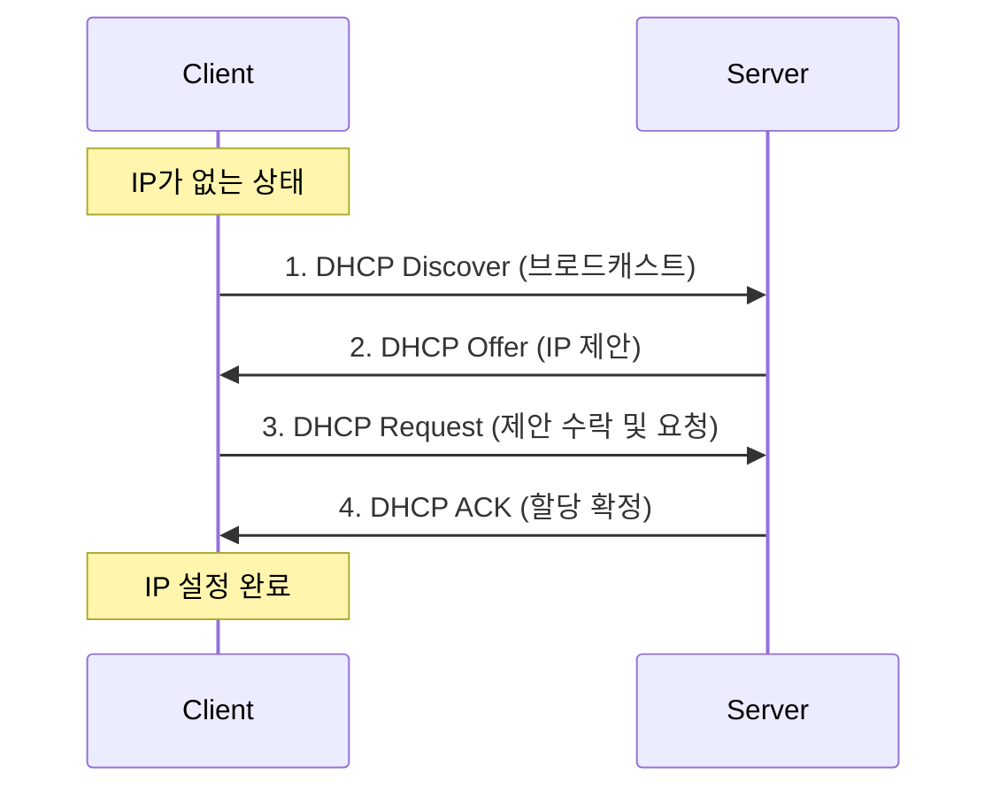

---
layout: post
title: "DHCP"
date: 2025-10-17 17:00:00 +0900
categories: [linux]
---

## 1. 개요

**DHCP (Dynamic Host Configuration Protocol)**는 네트워크 상의 클라이언트에게 IP 주소, 서브넷 마스크, 게이트웨이, DNS 서버 주소 등의 네트워크 정보를 자동으로 할당해 주는 프로토콜이다.
관리자가 수동으로 IP를 설정하는 번거로움을 줄이고, IP 충돌을 방지하며 주소 자원을 효율적으로 관리할 수 있게 해준다.

### 동작 과정 (DORA)
DHCP는 **Discover**, **Offer**, **Request**, **Acknowledge**의 4단계 과정을 통해 IP를 할당한다.



---

## 2. 서버 구축 (dhcpd.conf)

Rocky Linux에서 `dhcp-server` 패키지를 이용하여 DHCP 서버를 구축한다.

### 설치
```bash
dnf install -y dhcp-server
```

### 설정 파일 (/etc/dhcp/dhcpd.conf)
```bash
# 기본 네트워크 설정
subnet 10.0.0.0 netmask 255.255.255.0 {
    # 1. 할당할 IP 범위 (Pool)
    range 10.0.0.51 10.0.0.250;
    
    # 2. 클라이언트에게 줄 옵션
    option routers 10.0.0.254;                  # 게이트웨이
    option domain-name-servers 8.8.8.8, 1.1.1.1; # DNS 서버
    option broadcast-address 10.0.0.255;
    
    # 3. 임대 시간 (초 단위)
    default-lease-time 7200;  # 기본 2시간
    max-lease-time 14400;     # 최대 4시간
}
```

### 서비스 시작
```bash
systemctl enable --now dhcpd
firewall-cmd --permanent --add-service=dhcp
firewall-cmd --reload
```

---

## 3. 실습: 고정 IP 예약 (MAC Binding)

특정 장치(예: 프린터, 사내 서버, 임원 PC)가 항상 동일한 IP 주소를 받도록 설정한다. 장치의 **MAC 주소**를 DHCP 서버에 등록하여 특정 IP를 영구적으로 예약한다.

### 설정 방법
`dhcpd.conf` 파일 하단에 `host` 블록을 추가한다.

```conf
# Windows 10 클라이언트 예약
host w10-pc {
    hardware ethernet 00:0C:29:A1:B2:C3;  # 클라이언트 MAC 주소
    fixed-address 10.0.0.101;             # 할당할 고정 IP
}
```

서비스 재시작 후 해당 클라이언트에서 IP를 갱신하면 항상 10.0.0.101을 받게 된다.

### 클라이언트 검증 (Windows)
```cmd
ipconfig /release
ipconfig /renew
ipconfig /all
```


---

## Appendix: Windows Server DHCP

리눅스뿐만 아니라 Windows Server에서도 DHCP 역할을 추가하여 동일한 기능을 구현할 수 있다. GUI 기반이라 관리가 직관적이다.

### 고정 IP 예약 화면
MAC 주소를 입력하고 예약할 IP를 지정하는 방식은 리눅스와 원리상 동일하다.


<hr class="short-rule">
