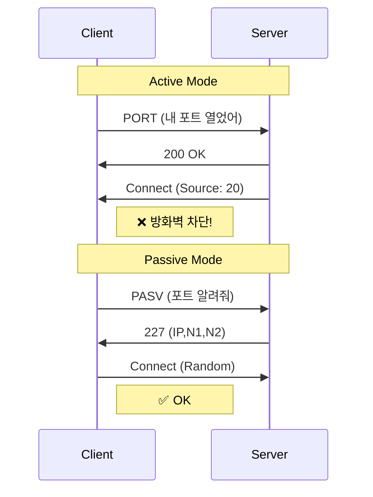

---
layout: post
title: "FTP Passive Mode"
date: 2025-10-20 17:00:00 +0900
categories: [linux]
---

## 1. 개요

**Passive Mode**는 FTP의 고질적인 방화벽 연결 문제를 해결하기 위해 고안된 데이터 전송 방식이다.
Active Mode와 달리, **클라이언트가 서버의 랜덤 포트로 데이터 연결을 요청**하는 구조이므로 클라이언트 쪽에 방화벽이나 공유기(NAT)가 있어도 원활하게 통신할 수 있다.

### Active vs Passive 비교



| 특징 | Active Mode | Passive Mode |
|------|-------------|--------------|
| **데이터 연결 주체** | 서버 → 클라이언트 | 클라이언트 → 서버 |
| **명령 포트** | 21 (TCP) | 21 (TCP) |
| **데이터 포트** | 20 (서버 고정) | 60000~60010 (서버 랜덤) |
| **방화벽 친화성** | 낮음 | **높음 (권장)** |

---

## 2. 서버 설정 (vsftpd.conf)

Passive Mode를 사용하려면 FTP 서버가 사용할 **데이터 포트 범위**를 명시적으로 지정하고 방화벽에서 열어주어야 한다.

### 실습 요구사항
| 항목 | 값 |
|------|-----|
| Passive 포트 범위 | `60000` ~ `60010` |
| 사용자 a (W10) | `a.txt` (300MB) |
| 사용자 b (W11) | `b.txt` (300MB) |
| 유휴 타임아웃 | 120초 |
| 전송 타임아웃 | 60초 |

### 필수 설정 항목
```ini
# Passive 모드 활성화
pasv_enable=YES

# 데이터 전송에 사용할 포트 범위 지정
pasv_min_port=60000
pasv_max_port=60010

# (중요) 서버가 NAT 뒤에 있는 경우 외부 공인 IP 지정
pasv_address=10.0.0.11

# 타임아웃 설정
idle_session_timeout=120
data_connection_timeout=60
```

### 방화벽 설정
```bash
firewall-cmd --permanent --add-port=60000-60010/tcp
firewall-cmd --reload
```

---

## 3. 실습: 패시브 모드 검증

### 서버 설정 확인
서버에서 `idle_session_timeout` 및 `data_connection_timeout` 설정이 요구사항대로 적용되었는지 확인한다.


### Wireshark 패킷 분석

서버가 클라이언트에게 어떤 포트로 접속하라고 알려주는지 패킷을 통해 직접 확인한다.

#### 사용자 a (Windows 10)
- **PASV 응답**: `227 Entering Passive Mode (10,0,0,11,234,97)`
- **포트 계산**: $234 \times 256 + 97 = \mathbf{60001}$
- **전송 파일**: `RETR a.txt` (314,572,800 bytes = 300MB)


#### 사용자 b (Windows 11)
- **PASV 응답**: `227 Entering Passive Mode (10,0,0,11,234,96)`
- **포트 계산**: $234 \times 256 + 96 = \mathbf{60000}$
- **전송 파일**: `RETR b.txt` (314,572,800 bytes = 300MB)


### 서버측 포트 확인 (ss -nat)

Wireshark에서 확인한 포트가 실제 서버에서 사용되었는지 `ss -nat` 명령으로 검증한다.
- `10.0.0.11:60000` ↔ `10.0.0.201` (W11-1) : `TIME-WAIT`
- `10.0.0.11:60001` ↔ `10.0.0.101` (W10-1) : `TIME-WAIT`


---

## 4. 트러블슈팅

### 접속은 되는데 파일 목록이 안 보임 (Listing Failed)
전형적인 Passive 포트 차단 증상이다. 21번 포트는 열려 있어서 로그인까지는 되지만, 데이터 채널인 60000번대 포트가 방화벽에 막혀 파일 목록을 받아오지 못하는 것이다.
*   **해결**: `firewall-cmd --list-ports`로 `60000-60010/tcp` 범위가 열려 있는지 확인한다.

### 외부(공인 IP)에서 접속 불가
서버가 사설 IP를 쓰고 있고 외부에서 접속하는 경우, 서버는 자신의 사설 IP를 알려주기 때문에 클라이언트가 접속할 수 없다.
*   **해결**: `pasv_address=공인IP` 설정을 통해 서버가 클라이언트에게 공인 IP를 알려주도록 해야 한다.

### 500 OOPS: vsftpd 에러
`500 OOPS: could not bind listening IPv4 socket` 등의 에러가 발생하면 다른 프로세스가 21번 포트를 점유 중이거나, SELinux 문제일 수 있다.
*   **해결**: `ss -tlnp | grep :21`로 포트 점유 확인, `setsebool -P ftpd_full_access 1`으로 SELinux 허용.

---

## 5. 부록: Docker로 서버 띄우기

```bash
docker run -d \
  --name my-ftp-server \
  -p 21:21 \
  -p 60000-60010:60000-60010 \
  -e FTP_USER=a \
  -e FTP_PASS=1234 \
  -e PASV_MIN_PORT=60000 \
  -e PASV_MAX_PORT=60010 \
  -e PASV_ADDRESS=127.0.0.1 \
  fauria/vsftpd
```

---

## 6. 보안 고려사항

*   **포트 범위 최소화**: `pasv_min_port`와 `pasv_max_port` 범위를 최소한으로 설정하여 방화벽에서 열어야 할 포트 수를 줄인다.
*   **FTPS 적용**: Passive 모드 자체는 평문 전송 문제를 해결하지 않는다. `ssl_enable=YES`를 설정하여 데이터 암호화를 적용하거나, SFTP 사용을 권장한다.
*   **`pasv_address` 설정 주의**: NAT 환경에서 내부 IP가 노출되지 않도록 반드시 공인 IP를 지정한다.

<hr class="short-rule">
