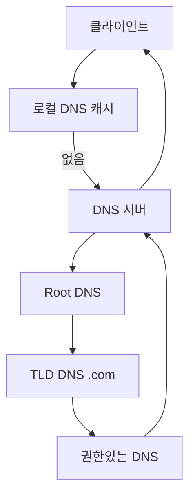
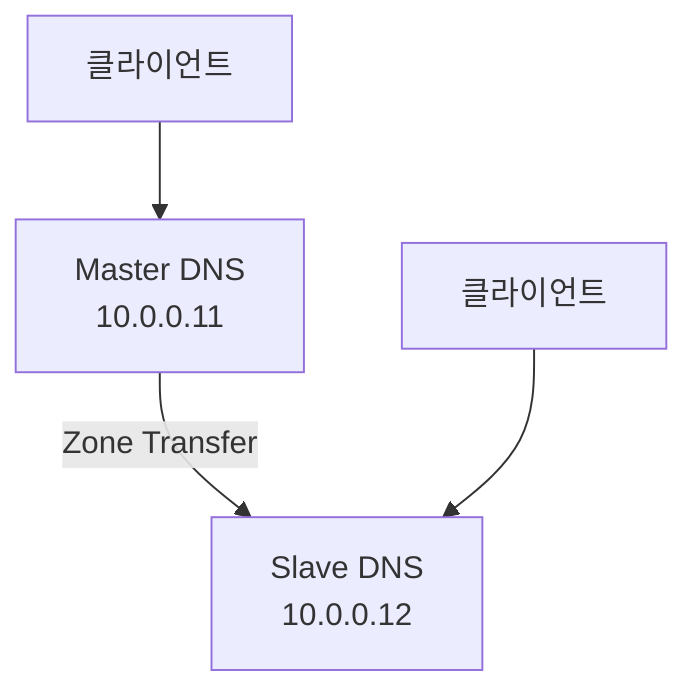

## 1. 개념

**DNS (Domain Name System)**는 도메인 이름을 IP 주소로 변환하는 시스템.
인터넷의 **전화번호부** 역할.

### 기본 정보
| 항목 | 내용 |
|------|------|
| 포트 | 53 (TCP/UDP) |
| 정방향 | 도메인 → IP (www.google.com → 142.250.x.x) |
| 역방향 | IP → 도메인 |

### DNS 조회 과정


### 레코드 타입
| 타입 | 설명 | 예시 |
|------|------|------|
| A | IPv4 주소 | www → 10.0.0.11 |
| AAAA | IPv6 주소 | www → 2001:db8::1 |
| CNAME | 별칭 | mail → www |
| MX | 메일 서버 | @ → mail.example.com |
| NS | 네임서버 | @ → ns1.example.com |
| PTR | 역방향 (IP→도메인) | 11 → www.example.com |

---

## 2. 설치 방법

### Rocky Linux / CentOS
```bash
# BIND 설치
dnf install -y bind bind-utils

# 서비스 시작
systemctl enable --now named

# 방화벽 허용
firewall-cmd --permanent --add-service=dns
firewall-cmd --reload
```

---

## 3. 사용법

### 기본 설정 (/etc/named.conf)
```conf
options {
    listen-on port 53 { any; };
    allow-query { any; };
    recursion yes;
    forwarders { 8.8.8.8; };
};

zone "example.com" IN {
    type master;
    file "/var/named/example.com.zone";
};
```

### Zone 파일 (/var/named/example.com.zone)
```conf
$TTL 86400
@   IN  SOA     ns1.example.com. admin.example.com. (
                2024010101  ; Serial
                3600        ; Refresh
                1800        ; Retry
                604800      ; Expire
                86400 )     ; Minimum TTL

    IN  NS      ns1.example.com.
    IN  MX  10  mail.example.com.

ns1     IN  A       10.0.0.11
www     IN  A       10.0.0.11
mail    IN  A       10.0.0.12
```

### 설정 적용
```bash
named-checkconf                    # 설정 검증
named-checkzone example.com /var/named/example.com.zone  # Zone 검증
systemctl restart named
```

### 4. 고급 설정: Zone Transfer (Master-Slave)

DNS 서버의 가용성을 높이기 위해 Master-Slave 구조를 구성하고 Zone Transfer를 설정합니다.

#### Master-Slave 아키텍처


#### Master 설정 (/etc/named.conf)
```conf
zone "example.com" IN {
    type master;
    file "/var/named/example.com.zone";
    allow-transfer { 10.0.0.12; };  # Slave IP만 허용 (보안 필수)
    also-notify { 10.0.0.12; };     # 변경 시 Slave에 알림
};
```

#### Slave 설정 (/etc/named.conf)
```conf
zone "example.com" IN {
    type slave;
    file "slaves/example.com.zone";  # /var/named/slaves/에 저장됨
    masters { 10.0.0.11; };          # Master IP 지정
};
```

#### 전송 테스트 및 보안
```bash
# Slave에서 전송 요청 테스트
dig @10.0.0.11 example.com AXFR
```


> **주의**: `allow-transfer` 설정을 통해 신뢰된 IP(Slave) 외에는 Zone Transfer를 차단해야 합니다. 정보 유출의 위험이 있습니다.

---

## 4. 실습

### 네트워크 구성

| 호스트 | IP | 역할 |
|--------|------|------|
| rocky9-1 | 10.0.0.11 | 주 DNS (Master) |
| rocky9-2 | 10.0.0.12 | 보조 DNS (Slave) |
| rocky9-3 | 10.0.0.13 | 보조 DNS, FTP, MAIL |
| w10-1 | 10.0.0.101 | 클라이언트 |
| w11-1 | 10.0.0.201 | 클라이언트 |

도메인: `hamap.local`

### DNS 조회 테스트 (cmd)

Windows 클라이언트에서 FTP 도메인 접속 테스트:

**Windows 10**


```cmd
ftp ftp.hamap.local
ftp ghlee.local
```

**Windows 11**


### 웹 브라우저 접속 테스트

도메인으로 웹 서버 접속 확인:

**Windows 10**


**Windows 11**


- `hamap.local` → rocky9-1 웹 서버
- `ghlee.local` → rocky9-2 웹 서버
- `hyb.local`, `jhj.local` → 각 팀원 도메인

---

### 캐시 비우기
```bash
# Windows
ipconfig /flushdns

# Mac
sudo dscacheutil -flushcache
```

---

## Appendix: Windows Server DNS 구성 및 검증

Windows Server 환경에서 정방향 조회 영역을 구성하고, 클라이언트에서 정상적으로 도메인이 해석(Resolving)되는지 검증합니다.

### 실습 환경
- **DNS 서버 IP**: `10.0.0.2` (Windows Server 2022/2025)
- **도메인**: `hamap.local`
- **레코드 등록**:
  - `www` (A) -> `10.0.0.12`
  - `ftp` (A) -> `10.0.0.13`

### 검증 결과 (Windows 10/11)

웹 브라우저를 통해 로컬 도메인(`hamap.local`, `hyb.local` 등) 접속 시, DNS 서버가 정확한 IP를 반환하여 페이지가 뜨는 것을 확인했습니다.

**Windows 10 클라이언트**


**Windows 11 클라이언트**


<hr class="short-rule">
