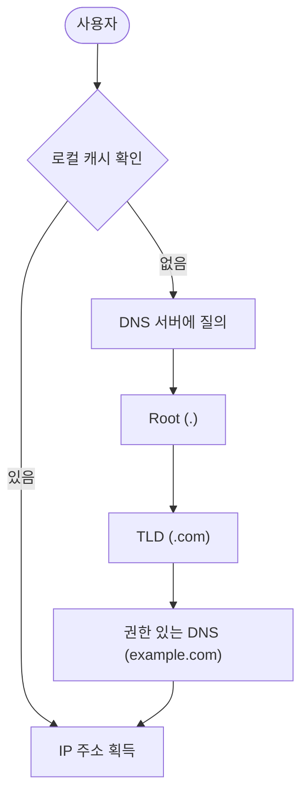
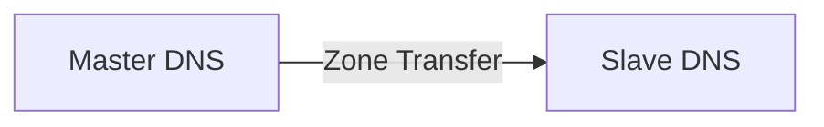

---
layout: post
title: "DNS Server"
date: 2025-10-22 17:00:00 +0900
categories: [linux]
---

## 1. 개요

**DNS (Domain Name System)**는 `www.google.com` 같은 도메인 이름을 사람이 기억하기 어려운 IP 주소(`142.250.207.68`)로 변환해 주는 인터넷의 전화번호부 시스템이다.
네트워크 통신은 IP 주소 기반으로 이루어지지만, 사용자는 도메인 주소를 입력하므로 그 사이에 DNS 서버가 반드시 필요하다.

### DNS 조회 과정
사용자가 브라우저 주소창에 도메인을 입력했을 때 일어나는 일이다.



---

## 2. 서버 구축 (BIND)

리눅스에서 가장 널리 쓰이는 DNS 서버 소프트웨어인 **BIND (Berkeley Internet Name Domain)**를 설치하고 설정한다.

### 설치
```bash
dnf install -y bind bind-utils
```

### 서버 설정 (/etc/named.conf)
기본적인 DNS 동작 방식과 접근 제어를 설정한다.
```conf
options {
    listen-on port 53 { any; };      # 모든 IP에서 53번 포트 수신
    allow-query     { any; };        # 모든 클라이언트의 질의 허용
    recursion yes;                   # 재귀적 질의 허용 (캐싱 서버 역할)
};

# 도메인 영역(Zone) 정의
zone "example.com" IN {
    type master;
    file "/var/named/example.com.zone";
};
```

### 영역 파일 작성 (/var/named/example.com.zone)
실제 도메인과 IP의 매핑 정보를 담고 있다.
```bash
$TTL 86400
@   IN  SOA     ns1.example.com. admin.example.com. (
                2025010101  ; Serial (YYYYMMDDNN)
                3600        ; Refresh
                1800        ; Retry
                604800      ; Expire
                86400 )     ; Minimum TTL

    IN  NS      ns1.example.com.
    IN  MX  10  mail.example.com.

ns1     IN  A       10.0.0.11
www     IN  A       10.0.0.11   ; www.example.com -> 10.0.0.11
mail    IN  A       10.0.0.12   ; mail 서버
```

---

## 3. 고급 설정: 이중화 (Master/Slave)

DNS 서버의 장애 대비와 부하 분산을 위해 Master-Slave 구조를 구성한다.

### Master-Slave 구조
Master 서버의 Zone 파일이 변경되면 자동으로 Slave 서버에 복제(**Zone Transfer**)된다.



### Master 설정
Slave 서버에게만 Zone 전송을 허용해야 보안상 안전하다.
```conf
zone "example.com" IN {
    type master;
    file "/var/named/example.com.zone";
    allow-transfer { 10.0.0.12; };  # Slave IP만 허용
};
```

### Slave 설정
Zone 파일을 직접 수정하지 않고 Master로부터 받아온다.
```conf
zone "example.com" IN {
    type slave;
    file "slaves/example.com.zone";
    masters { 10.0.0.11; };         # Master IP 지정
};
```

---

## 4. 실습: 클라이언트 검증

구축한 DNS 서버가 정상적으로 동작하는지 윈도우 클라이언트에서 테스트한다.

### nslookup / dig 테스트
```bash
# 리눅스 (dig)
dig @10.0.0.11 www.example.com

# 윈도우 (nslookup)
nslookup www.example.com 10.0.0.11
```

### 웹 접속 테스트
DNS 서버를 `10.0.0.11`로 설정한 후 브라우저에서 `http://www.example.com`으로 접속하여 페이지가 뜨는지 확인한다.


---

## Appendix: Windows Server DNS

윈도우 서버에서도 DNS 역할을 추가하여 동일한 기능을 GUI 환경에서 구성할 수 있다.

### 정방향 조회 영역 설정
새 영역 마법사를 통해 도메인을 생성하고 호스트(A) 레코드를 추가한다.


---

## 5. 보안 주의사항

DNS 서버는 공격 대상이 되기 쉬우므로 보안 설정을 철저히 해야 한다.

### Zone Transfer 제한 (필수)
Zone Transfer(AXFR)를 제한하지 않으면 공격자가 **전체 DNS 레코드 목록을 탈취**할 수 있다. 내부 서버 IP, 서브도메인 구조 등이 노출된다.
```bash
# 공격자가 Zone Transfer 시도 시
dig @10.0.0.11 example.com AXFR
```
**방어 방법**: `allow-transfer`를 Slave 서버 IP로 제한하거나 완전히 차단한다.
```conf
# named.conf
zone "example.com" IN {
    type master;
    file "/var/named/example.com.zone";
    allow-transfer { 10.0.0.12; };  # Slave만 허용
    # allow-transfer { none; };      # 완전 차단
};
```

### DNS Amplification Attack
공격자가 **소스 IP를 피해자로 위조**하여 DNS 서버에 대용량 응답을 요청(ANY 쿼리 등)하면, 피해자는 대량의 트래픽을 받게 된다(DDoS).
*   **방어**: 외부에서의 재귀 질의(Recursion) 비활성화, Rate Limiting 적용.

### 재귀 질의(Recursion) 제한
신뢰할 수 있는 내부 네트워크에서만 재귀 질의를 허용해야 한다.
```conf
# named.conf
options {
    recursion yes;
    allow-recursion { 10.0.0.0/24; localhost; };  # 내부망만 허용
};
```

### DNSSEC
DNS 응답에 전자서명을 추가하여 **DNS Spoofing(캐시 오염)** 공격을 방지한다. 구현이 복잡하지만 중요 도메인에는 권장된다.

<hr class="short-rule">
