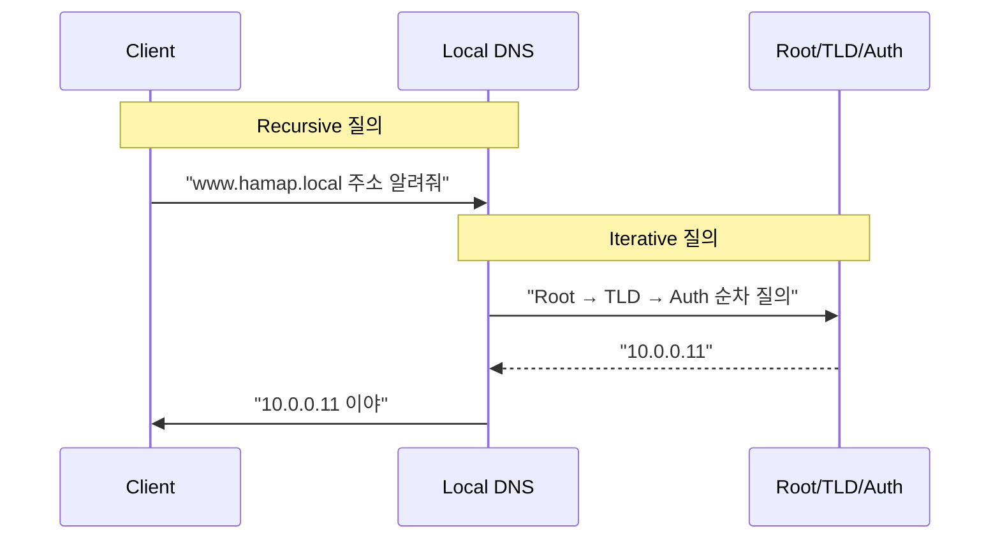
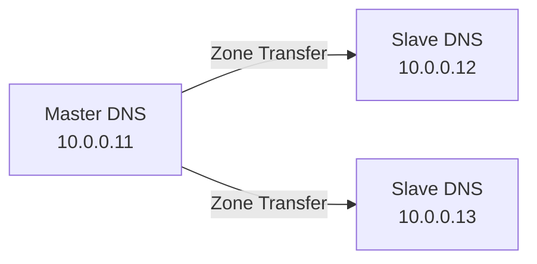

---
layout: post
title: "DNS Server"
date: 2025-10-22 17:00:00 +0900
categories: [linux]
---

## 1. 개요

**DNS (Domain Name System)**는 `www.google.com` 같은 도메인 이름을 사람이 기억하기 어려운 IP 주소(`142.250.207.68`)로 변환해 주는 인터넷의 전화번호부 시스템이다.
네트워크 통신은 IP 주소 기반으로 이루어지지만, 사용자는 도메인 주소를 입력하므로 그 사이에 DNS 서버가 반드시 필요하다.

### DNS 조회 과정 (Recursive vs Iterative)
클라이언트가 도메인을 질의하면, Local DNS 서버가 대신 여러 서버를 순회하며 답을 찾아온다.



---

## 2. 서버 구축 (BIND)

리눅스에서 가장 널리 쓰이는 DNS 서버 소프트웨어인 **BIND (Berkeley Internet Name Domain)**를 설치하고 설정한다.

### 실습 환경 구성
| 서버 | IP | 역할 |
|------|-----|------|
| rocky9-1 | `10.0.0.11` | **주 DNS**, DHCP, HTTP |
| rocky9-2 | `10.0.0.12` | 보조 DNS, FTP, HTTP |
| rocky9-3 | `10.0.0.13` | 보조 DNS, Mail |
| W10-1 | `10.0.0.101` | 클라이언트 |
| W11-1 | `10.0.0.201` | 클라이언트 |

### 설치
```bash
dnf install -y bind bind-utils
```

### 서버 설정 (/etc/named.conf)
```conf
options {
    listen-on port 53 { any; };
    allow-query     { any; };
    recursion yes;
    allow-recursion { 10.0.0.0/24; localhost; };
};

zone "hamap.local" IN {
    type master;
    file "/var/named/hamap.local.zone";
    allow-transfer { 10.0.0.12; 10.0.0.13; };
};
```

### 영역 파일 작성 (/var/named/hamap.local.zone)
```conf
$TTL 86400
@   IN  SOA     ns1.hamap.local. admin.hamap.local. (
                2025010101  ; Serial
                3600        ; Refresh
                1800        ; Retry
                604800      ; Expire
                86400 )     ; Minimum TTL

    IN  NS      ns1.hamap.local.
    IN  MX  10  mail.hamap.local.

ns1     IN  A       10.0.0.11
www     IN  A       10.0.0.11
ftp     IN  A       10.0.0.12
mail    IN  A       10.0.0.13
```

### 서비스 시작
```bash
systemctl enable --now named
firewall-cmd --permanent --add-service=dns
firewall-cmd --reload
```

---

## 3. 고급 설정: 이중화 (Master/Slave)

DNS 서버의 장애 대비와 부하 분산을 위해 Master-Slave 구조를 구성한다.



### Slave 설정
```conf
zone "hamap.local" IN {
    type slave;
    file "slaves/hamap.local.zone";
    masters { 10.0.0.11; };
};
```

---

## 4. 실습: 클라이언트 검증

구축한 DNS 서버가 정상적으로 동작하는지 윈도우 클라이언트에서 테스트한다.

### 명령줄 테스트 (FTP 접속)

**Windows 10 (W10-1)**

`ftp` 명령으로 도메인을 질의하여 DNS 해석이 정상 동작하는지 확인한다.


**Windows 11 (W11-1)**


### 웹 접속 테스트

브라우저에서 `http://hamap.local`, `http://ghlee.local` 등 여러 도메인에 접속하여 페이지가 뜨는지 확인한다.

**Windows 10 (W10-1)**


**Windows 11 (W11-1)**


---

## 5. 보안 고려사항

### Zone Transfer 제한 (필수)
Zone Transfer(AXFR)를 제한하지 않으면 공격자가 **전체 DNS 레코드 목록을 탈취**할 수 있다.
```bash
# 공격 시도 예시
dig @10.0.0.11 hamap.local AXFR
```
**방어**: `allow-transfer`를 Slave 서버 IP로 제한하거나 완전히 차단한다.

### DNS Amplification Attack
공격자가 **소스 IP를 피해자로 위조**하여 DNS 서버에 대용량 응답을 요청하면 DDoS가 발생한다.
*   **방어**: 외부에서의 재귀 질의(Recursion) 비활성화, Rate Limiting 적용.

### 재귀 질의(Recursion) 제한
```conf
options {
    recursion yes;
    allow-recursion { 10.0.0.0/24; localhost; };
};
```

---

## 6. 트러블슈팅

### SERVFAIL 에러
`dig` 결과에 `status: SERVFAIL`이 뜨는 경우다.
*   **원인**: 상위 DNS 서버 응답 없음, DNSSEC 검증 실패, Zone 파일 문법 오류 등.
*   **해결**: `named-checkzone hamap.local /var/named/hamap.local.zone`으로 문법 검사.

### NXDOMAIN 에러
`status: NXDOMAIN`은 해당 도메인이 존재하지 않는다는 의미다.
*   **원인**: Zone 파일에 레코드가 없거나, 오타.

### REFUSED 에러
*   **원인**: `allow-query` 또는 `allow-recursion` 설정에서 클라이언트 IP가 차단됨.

### 캐시 초기화
설정을 변경했는데 반영되지 않는다면 캐시 문제일 수 있다.
```bash
# 서버측 (BIND)
rndc flush

# 클라이언트측 (Windows)
ipconfig /flushdns
```

---

## 7. 부록: Docker로 서버 띄우기

```bash
docker run -d \
  --name my-dns-server \
  -p 53:53/udp \
  -p 53:53/tcp \
  -v $(pwd)/named.conf:/etc/bind/named.conf \
  -v $(pwd)/zones:/var/lib/bind \
  ubuntu/bind9
```

---

## 8. 부록: Windows Server DNS

윈도우 서버에서도 DNS 역할을 추가하여 동일한 기능을 GUI 환경에서 구성할 수 있다.


<hr class="short-rule">
