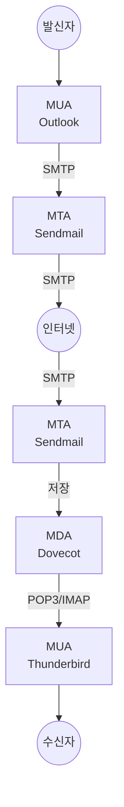

## 1. 개념

**메일 서버**는 이메일을 송수신하는 서버.

### 메일 전송 흐름


### 구성 요소
| 구성 | 역할 | 예시 |
|------|------|------|
| MUA | 메일 클라이언트 | Outlook, Thunderbird |
| MTA | 메일 전송 | Sendmail, Postfix |
| MDA | 메일 보관/수신 | Dovecot |

### 프로토콜
| 프로토콜 | 포트 | 역할 |
|----------|------|------|
| SMTP | 25, 587 | 메일 전송 |
| POP3 | 110 | 메일 수신 (다운로드) |
| IMAP | 143 | 메일 수신 (동기화) |

---

## 2. 설치 방법

### Rocky Linux / CentOS
```bash
# Sendmail + Dovecot 설치
dnf install -y sendmail sendmail-cf dovecot

# 서비스 시작
systemctl enable --now sendmail
systemctl enable --now dovecot

# 방화벽 허용
firewall-cmd --permanent --add-service=smtp
firewall-cmd --permanent --add-service=pop3
firewall-cmd --permanent --add-service=imap
firewall-cmd --reload
```

---

## 3. 사용법

### Sendmail 설정 (/etc/mail/sendmail.mc)
```conf
dnl DAEMON_OPTIONS(`Port=smtp,Addr=127.0.0.1, Name=MTA')dnl
DAEMON_OPTIONS(`Port=smtp, Name=MTA')dnl
```

```bash
# 설정 컴파일
cd /etc/mail
make -C /etc/mail
systemctl restart sendmail
```

### Dovecot 설정 (/etc/dovecot/dovecot.conf)
```conf
protocols = imap pop3
listen = *
```

### /etc/dovecot/conf.d/10-mail.conf
```conf
mail_location = mbox:~/mail:INBOX=/var/mail/%u
```

---

## 4. 실습

### 서버 환경

| 항목 | 설정값 |
|------|--------|
| 메일 서버 | rocky9-3 (10.0.0.13) |
| 도메인 | hamap.local |
| MX 호스트 | mx1.hamap.local |
| 사용자 | a, b |

### 메일 사용자 추가
```bash
useradd a
useradd b
echo 'It1' | passwd --stdin a
echo 'It1' | passwd --stdin b
```

### Sendmail 설정 (/etc/mail/sendmail.mc)

```bash
vi /etc/mail/sendmail.mc
# 21행: TRUST_AUTH_MECH 숫자 9 → 14 변경
# 56-57행: 주석 제거 (dnl 삭제)
# 121행: Addr= 부분 제거 (모든 IP에서 수신)

# 설정 컴파일
m4 /etc/mail/sendmail.mc > /etc/mail/sendmail.cf
```

### 호스트 및 릴레이 설정

```bash
# /etc/hosts
10.0.0.13    rocky9-3

# /etc/mail/local-host-names
rocky9-3
hamap.local
mx1.hamap.local

# /etc/mail/access
Connect:10.0.0                    RELAY
Connect:10.0.0.0/255.255.255.0    RELAY
Connect:hamap.local               RELAY
Connect:mx1.hamap.local           RELAY
Connect:rocky9-3                  RELAY
```

### Dovecot 설정

```bash
# /etc/dovecot/dovecot.conf
protocols = imap pop3    # 24행 주석 제거
listen = *               # 30행 주석 제거

# /etc/dovecot/conf.d/10-auth.conf
disable_plaintext_auth = no    # 평문 인증 허용

# /etc/dovecot/conf.d/10-mail.conf
mail_location = mbox:~/mail:INBOX=/var/mail/%u

# /etc/dovecot/conf.d/10-master.conf
# 19행: imap 포트 주석 제거
# 40행: pop3 포트 주석 제거

# /etc/dovecot/conf.d/10-ssl.conf
ssl = no    # SSL 비활성화 (테스트용)
```

### 방화벽 설정
```bash
firewall-cmd --permanent --add-port={25,110,143}/tcp
firewall-cmd --reload
```

### 서비스 시작
```bash
systemctl enable --now sendmail
systemctl enable --now dovecot
```

### Thunderbird 클라이언트 설정

| 설정 | 값 |
|------|-----|
| 수신 서버 (IMAP) | mx1.hamap.local:143 |
| 발신 서버 (SMTP) | mx1.hamap.local:25 |
| 보안 연결 | 없음 |
| 인증 방식 | 일반 비밀번호 |

---

## 5. 삭제 방법

```bash
systemctl stop sendmail dovecot
systemctl disable sendmail dovecot
dnf remove -y sendmail sendmail-cf dovecot
rm -rf /etc/mail /etc/dovecot
```

<hr class="short-rule">
