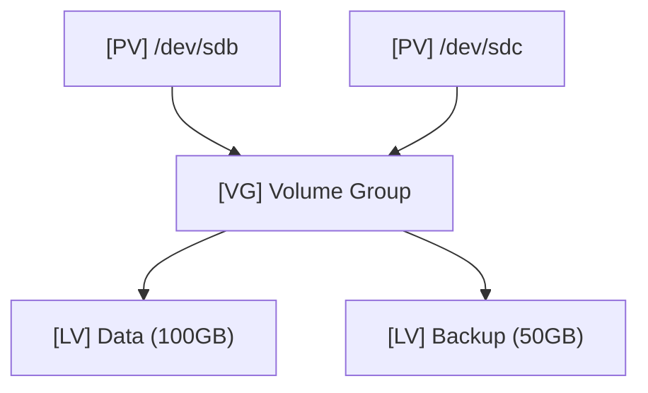

## 1. 개요

**LVM (Logical Volume Manager)**은 리눅스 환경에서 물리적인 저장 장치를 논리적인 그룹으로 묶어 유연하게 관리하는 스토리지 가상화 기술이다.
파티션 크기를 고정하지 않고 필요에 따라 실시간으로 확장하거나 축소할 수 있어, 스토리지 운영의 유연성과 효율성을 극대화한다.

### 핵심 개념
1.  **유연성**: 운영 중에도 서비스 중단 없이 볼륨의 크기를 늘리거나 줄일 수 있다.
2.  **확장성**: 여러 개의 물리 디스크를 하나의 거대한 볼륨 그룹(VG)으로 합쳐서 대용량 파일 시스템을 구성할 수 있다.
3.  **스냅샷**: 특정 시점의 데이터 상태를 저장하는 스냅샷 기능을 통해 백업 및 복구가 용이하다.

### LVM 구조 및 용어
LVM은 **PV → VG → LV**의 3계층 구조로 이루어져 있다.



| 용어 | 약어 | 설명 |
|------|------|------|
| **Physical Volume** | **PV** | LVM에서 사용하기 위해 초기화된 실제 물리 디스크나 파티션 |
| **Volume Group** | **VG** | 하나 이상의 PV를 묶어 만든 논리적인 스토리지 풀 (Pool) |
| **Logical Volume** | **LV** | 사용자가 실제로 파일 시스템을 포맷하고 사용하는 논리적 파티션 |
| **Physical Extent** | **PE** | 데이터를 저장하는 최소 단위 블록 (기본 4MB) |

---

## 2. LVM 구성 실습

디스크 2개(`/dev/sdb`, `/dev/sdc`)를 합쳐서 하나의 볼륨 그룹을 만들고, 10GB 짜리 논리 볼륨을 생성하는 과정이다.

### 1단계: PV (물리 볼륨) 생성
```bash
# 디스크를 PV로 초기화
pvcreate /dev/sdb /dev/sdc

# 상태 확인
pvs
```

### 2단계: VG (볼륨 그룹) 생성
`my_vg`라는 이름의 그룹을 생성하고 두 PV를 할당한다.
```bash
vgcreate my_vg /dev/sdb /dev/sdc

# 상태 확인 (전체 용량 확인)
vgs
```

### 3단계: LV (논리 볼륨) 생성
`my_vg`의 공간 중 10GB를 할당하여 `my_lv`를 만든다.
```bash
# -L: 용량 지정, -n: 이름 지정
lvcreate -L 10G -n my_lv my_vg

# 상태 확인
lvs
```

### 4단계: 파일시스템 포맷 및 마운트
생성된 LV는 `/dev/VG이름/LV이름` 경로로 접근할 수 있다.
```bash
# XFS 파일시스템으로 포맷
mkfs.xfs /dev/my_vg/my_lv

# 마운트 포인트 생성 및 마운트
mkdir /mnt/data
mount /dev/my_vg/my_lv /mnt/data
```

---

## 3. 볼륨 확장 및 축소

LVM의 가장 큰 장점은 운영 중에 용량을 조절할 수 있다는 것이다.

### 용량 확장 (Extend)
공간이 부족할 때 VG에 남은 공간을 LV에 추가한다.
1.  **논리 볼륨 확장**: `lvextend` 명령어로 LV 사이즈를 늘린다.
2.  **파일시스템 확장**: 파일시스템이 늘어난 공간을 인식하도록 `xfs_growfs` (XFS) 또는 `resize2fs` (EXT4)를 실행한다.

```bash
# 1. LV 용량을 5GB 추가 (+5G)
lvextend -L +5G /dev/my_vg/my_lv

# 2. 파일시스템에 변경 사항 반영 (XFS 예시)
xfs_growfs /mnt/data
```

### 디스크 추가를 통한 확장
VG 자체의 공간이 부족하면 새 물리 디스크(`/dev/sdd`)를 추가하여 확장한다.
```bash
# 1. 새 디스크 PV 초기화
pvcreate /dev/sdd
# 2. VG에 새 PV 추가
vgextend my_vg /dev/sdd
# 3. 이후 lvextend로 LV 확장 가능
```

---

## 4. 실습: 축소 및 삭제

용량을 줄이거나 LVM을 제거할 때는 데이터 손실 위험이 있으므로 주의해야 한다. 특히 **XFS 파일시스템은 축소를 지원하지 않는다**. (EXT4만 가능)

### 삭제 순서
생성의 역순(**마운트 해제 → LV → VG → PV**)으로 삭제한다.

```bash
# 1. 마운트 해제
umount /mnt/data

# 2. LV 삭제
lvremove /dev/my_vg/my_lv

# 3. VG 삭제
vgremove my_vg

# 4. PV 삭제 (디스크 초기화 해제)
pvremove /dev/sdb /dev/sdc
```

<hr class="short-rule">
